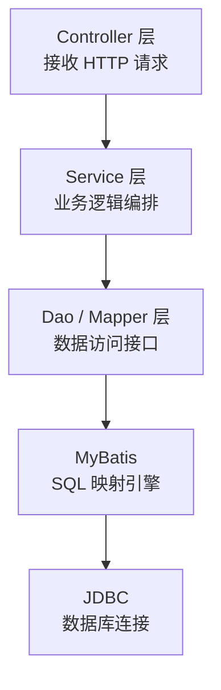

# 01 框架本质与三层架构

> 来源:整合自原 08.mybatis/README.md § 一

## 1. 框架本质

MyBatis 是基于 **ORM（对象关系映射）** 思想的**半自动**持久层框架，其核心价值在于：

- **SQL 定制化**：允许开发者直接编写原生 SQL，支持存储过程、动态 SQL 生成
- **JDBC 封装**：自动管理 Connection/Statement/ResultSet 生命周期，消除样板代码
- **映射引擎**：通过 XML/注解实现 Java 对象与数据库表的双向映射

### 与 Hibernate / JPA 对比

| 维度 | MyBatis | Hibernate / JPA |
|------|---------|-----------------|
| 自动化程度 | 半自动（SQL 手写） | 全自动（HQL/JPQL 生成） |
| SQL 控制力 | 极强（原生 SQL） | 较弱（依赖框架生成） |
| 复杂查询 | 灵活 | 受限，需 NativeQuery |
| 缓存 | 一级 + 二级缓存 | 一级 + 二级缓存 |
| 适用场景 | 复杂 SQL、存量库改造 | CRUD 为主的新项目 |
| 学习曲线 | 低（SQL 基础即可） | 高（HQL/缓存策略） |

## 2. 三层架构

- **Controller**：接收 HTTP 请求，参数校验，调用 Service 层，返回响应
- **Service**：实现业务逻辑，事务管理（`@Transactional`），协调多个 Dao 操作
- **Dao / Mapper**：定义数据访问接口，由 MyBatis 通过动态代理生成实现类

## 3. 核心设计模式

| 模式 | 在 MyBatis 中的应用 |
|------|-------------------|
| **工厂模式** | `SqlSessionFactory` 创建 `SqlSession` |
| **建造者模式** | `SqlSessionFactoryBuilder` 构建工厂 |
| **代理模式** | `MapperProxy` 为 Mapper 接口生成动态代理 |
| **模板方法** | `Executor` 定义执行骨架，具体操作由子类实现 |
| **装饰器模式** | `Cache` 接口的多层装饰（L1 → L2 → 序列化） |

---

## 相关章节

- 深入：[`02 初始化流程`](02-initialization-flow.md) — SqlSessionFactory 创建全过程
- 扩展：[`03 数据库厂商扩展`](../02-extension/03-database-vendor.md) — 多数据库适配
- 对比：[`06.spring/03-data`](../../../README.md) — Spring 数据层全景