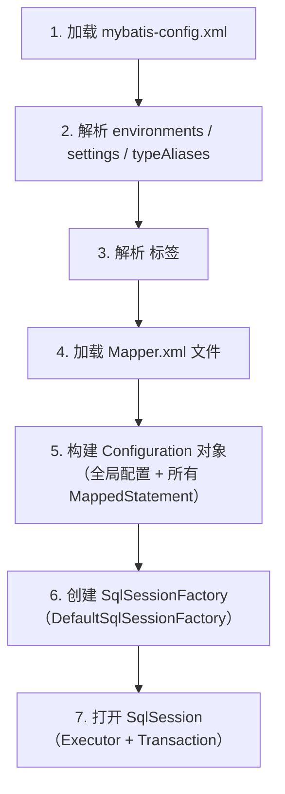

# 02 初始化流程

> 来源:整合自原 08.mybatis/README.md § 二.2.1

## 1. 初始化流程图

## 2. 各步骤详解

### 2.1 配置解析
- 通过 DOM4J / SAX 解析 XML 文件，构建全局配置对象 `Configuration`
- 解析内容：`<environments>`（数据源）、`<settings>`（全局开关）、`<typeAliases>`（别名）
- `<plugins>` 注册的插件按顺序加入拦截器链

### 2.2 映射注册
- 将每个 SQL 语句封装为 `MappedStatement` 对象，存储在 `Configuration` 中
- `MappedStatement` 包含：SQL 文本、参数类型、返回类型、缓存配置、结果映射
- 每个 `<select|insert|update|delete>` 标签 → 一个 `MappedStatement`
- Key = `namespace + "." + id`（如 `com.example.UserMapper.selectById`）

### 2.3 工厂创建
- 使用**建造者模式**生成 `SqlSessionFactory` 实例
- `SqlSessionFactoryBuilder.build(configuration)` → `DefaultSqlSessionFactory`
- 工厂是线程安全的，**全局单例**；`SqlSession` 是线程不安全的，**每次请求创建**

## 3. 与 Spring 整合后的变化

| 原生 MyBatis | Spring 整合后 |
|-------------|--------------|
| `SqlSessionFactoryBuilder` | `SqlSessionFactoryBean`（FactoryBean） |
| 手动解析 XML | Spring 自动注入 `DataSource` |
| 手动创建 `SqlSession` | `SqlSessionTemplate` 自动管理 |
| 手动注册 Mapper | `@MapperScan` 自动扫描 |

---

## 相关章节

- 前置：[`01 框架本质`](01-framework-essence.md)
- 深入：[`05 执行流程`](../02-extension/README.md) — SQL 执行全链路