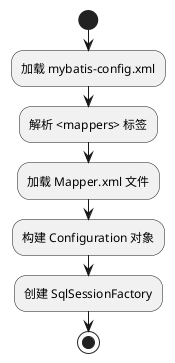

# 02 初始化流程

> 来源:整合自原 08.mybatis/README.md § 二.2.1

### 2.1 初始化流程

- **配置解析**：通过 DOM4J 解析 XML 文件，构建全局配置对象
- **映射注册**：将每个 SQL 语句封装为 `MappedStatement` 对象，存储在 `Configuration` 中
- **工厂创建**：使用建造者模式生成 `SqlSessionFactory` 实例