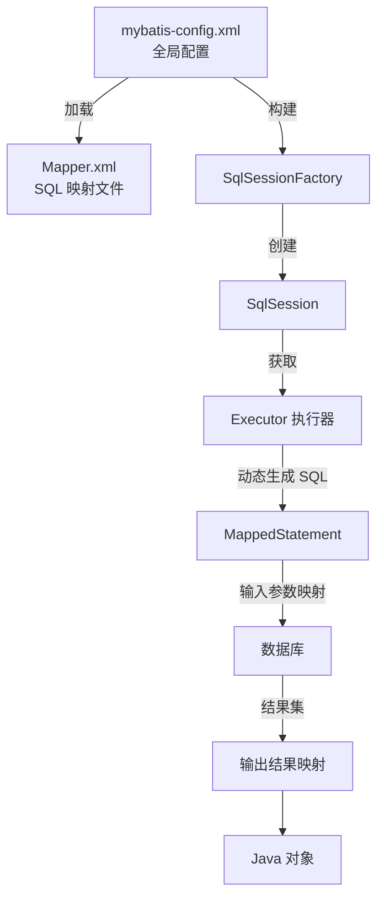

<!--
module:
  parent: spring/mybatis/01-architecture
  slug: spring/mybatis/01-architecture/03-execution-flow
  type: topic
  category: MyBatis 内部原理
  summary: MyBatis 01-architecture 章节深度 —— Execution Flow
-->

# 03 执行流程

> 来源:整合自原 08.mybatis/README.md § 二.2.2

### 2.2 执行流程（以查询为例）

1. 读取 MyBatis 配置文件: mybatis-config.xml为MyBatis 的全局配置文件，配置了MyBatis的运行环境等信息，例如数据库连接信息。
2. 加载映射文件。映射文件即SQL映射文件，该文件中配置了操作数据库的SQL语句，需要在MyBatis 配置文件mybatis-config.xml中加载。mybatis-config.xml文件可以加载多个映射文件，每个文件对应数据库中的一张表。
3. 构造会话工厂:通过MyBatis的环境等配置信息构建会话工厂SqlSessionFactory.
4. 创建会话对象:由会话工厂创建SqlSession对象，该对象中包含了执行SQL语句的所有方法。
5. Executor执行器: MyBatis 底层定义了一个Executor接口来操作数据库，它将根据SqlSession传递的参数动态地生成需要执行的SQL语句，同时负责查询缓存的维护。
6. MappedStatement对象:在Executor接口的执行方法中有一个MappedStatement类型的参数，该参数是对映射信息的封装，用于存储要映射的SQL语句的id、参数等信息。
7. 输入参数映射:输入参数类型可以是Map、List等集合类型，也可以是基本数据类型和POJO类型。输入参数映射过程类似于JDBC对 preparedStatement对象设置参数的过程。
8. 输出结果映射:输出结果类型可以是Map、List等集合类型，也可以是基本数据类型和POJO类型。输出结果映射过程类似于JDBC对结果集的解析过程。