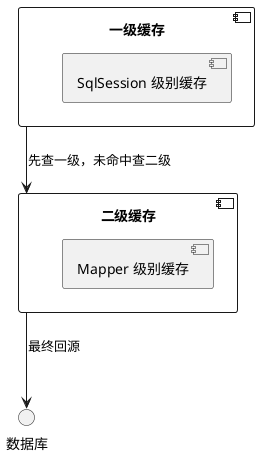

<!--
module:
  parent: spring/mybatis/01-architecture
  slug: spring/mybatis/01-architecture/07-cache-mechanism
  type: topic
  category: MyBatis 内部原理
  summary: MyBatis 01-architecture 章节深度 —— Cache Mechanism
-->

# 07 缓存机制

> 来源:整合自原 08.mybatis/README.md § 四.4.3 + § 六.6.2

## 7.1 一级/二级缓存

> 来源:原 § 四.4.3

### 4.3 缓存机制

- **一级缓存**：默认开启，基于 `SqlSession` 生命周期
- **二级缓存**：需手动配置，基于 `Mapper` 命名空间
- **缓存失效**：执行增删改操作后自动清空

## 7.2 缓存穿透解决方案

> 来源:原 § 六.6.2

### 6.2 缓存穿透问题
**解决方案**：
1. **布隆过滤器**：预过滤不存在的 ID 请求
2. **空值缓存**：将查询结果为 null 的记录缓存为特定标记
```xml
<cache eviction="LRU" flushInterval="60000" size="1024" readOnly="true">
    <!-- 自定义缓存实现 -->
</cache>
```