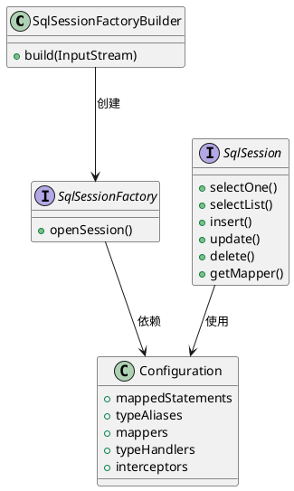

<!--
module:
  parent: spring/mybatis/01-architecture
  slug: spring/mybatis/01-architecture/08-class-diagram
  type: topic
  category: MyBatis 内部原理
  summary: MyBatis 01-architecture 章节深度 —— Class Diagram
-->

# 08 核心类关系图(附录)

> 来源:整合自原 08.mybatis/README.md 附录

## 附录：核心类关系图
