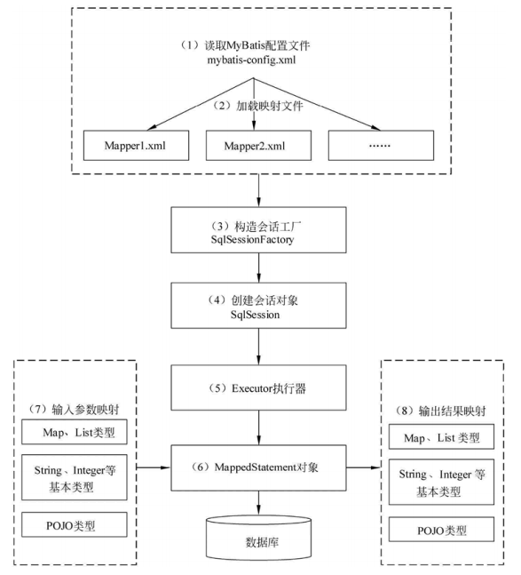
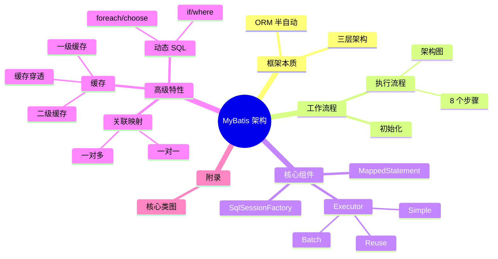

<!--
module:
  parent: spring
  slug: spring/mybatis-architecture
  type: article
  category: 主模块子文章
  summary: MyBatis 架构与原理
-->

# 01 MyBatis 架构与原理

## 🎯 一句话定位

**MyBatis 框架的架构与原理——框架本质、初始化流程、SQL 执行链路、核心组件、动态 SQL、关联映射、缓存机制、类关系图。这是阅读其他主题的预备知识。**

---
## 引言：架构困境

01 MyBatis 架构与原理 的关键不是'选型'——是**选完之后怎么在 5 个 trade-off 里活下来**。

本篇用'决策困境'切入，比较几种主流路径并讲清取舍。

---

## 章节导航

| 章节 | 标题 | 核心问题 | 阅读时长 |
|------|------|---------|---------|
| [01](./01-framework-essence.md) | 框架本质与三层架构 | MyBatis 是什么、为什么用、怎么分层? | 5 min |
| [02](./02-initialization-flow.md) | 初始化流程 | SqlSessionFactory 是怎么构建出来的? | 8 min |
| [03](./03-execution-flow.md) | 执行流程 | 一条 SQL 从接口调用到返回结果,经过了哪些步骤? | 10 min |
| [04](./04-core-components.md) | 核心组件 | SqlSession/Executor/MappedStatement 各司何职? | 15 min |
| [05](./05-dynamic-sql.md) | 动态 SQL | if/where/foreach/choose 如何拼接条件? | 8 min |
| [06](./06-result-mapping.md) | 关联映射 | 一对一、一对多怎么映射到对象? | 8 min |
| [07](./07-cache-mechanism.md) | 缓存机制 | 一级/二级缓存怎么配合,如何防穿透? | 10 min |
| [08](./08-class-diagram.md) | 核心类关系图(附录) | 关键类的依赖关系长什么样? | 3 min |

---

## 知识地图

---

## 核心概念速查表

| 概念 | 简述 | 详见 |
|------|------|------|
| SqlSessionFactory | 全局单例,线程安全,负责创建 SqlSession | [04](./04-core-components.md) |
| SqlSession | 非线程安全,封装一次数据库会话 | [04](./04-core-components.md) |
| Executor | 真正执行 SQL 的执行器,有三种子类型 | [04](./04-core-components.md) |
| MappedStatement | SQL 映射信息的封装对象 | [04](./04-core-components.md) |
| Configuration | 全局配置对象,持有所有映射元数据 | [08](./08-class-diagram.md) |
| TypeHandler | 自定义类型与 JDBC 类型互转 | [02-extension:TypeHandler 与拦截器](../02-extension/README.md) |
| 缓存穿透 | 查询不存在的数据绕过缓存直击 DB | [07](./07-cache-mechanism.md) |

---

## 跨主题引用

- 扩展能力(TypeHandler / 拦截器 / 数据库厂商):[02-extension](../02-extension/README.md)
- 与 Spring 整合(SqlSessionFactoryBean / MapperScannerConfigurer / 事务管理):[03-spring-integration](../03-spring-integration/README.md)
- MyBatis-Plus 增强:[04-mybatis-plus](../04-mybatis-plus/README.md)

---

## 来源标注

| 章节 | 来源 |
|------|------|
| 01 框架本质与三层架构 | 原 08.mybatis/README.md § 一 |
| 02 初始化流程 | 原 08.mybatis/README.md § 二.2.1 |
| 03 执行流程 | 原 08.mybatis/README.md § 二.2.2 |
| 04 核心组件 | 原 § 三 + § 五.5.3 + § 九(去重合并) |
| 05 动态 SQL | 原 § 四.4.1 |
| 06 关联映射 | 原 § 四.4.2 |
| 07 缓存机制 | 原 § 四.4.3 + § 六.6.2 |
| 08 核心类关系图 | 原 附录 |