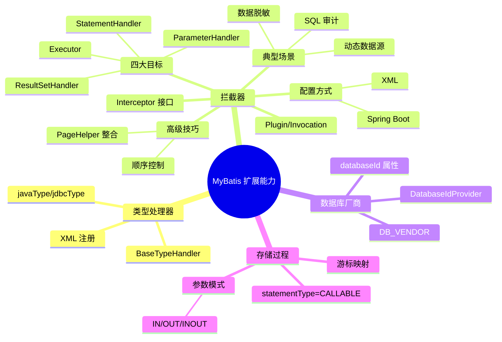

<!--
module:
  parent: spring
  slug: spring/mybatis-extension
  type: article
  category: 主模块子文章
  summary: MyBatis 扩展能力
-->

# 02 MyBatis 扩展能力

> ⬅️ [返回 MyBatis 主目录](../README.md)

---
---

## 🎯 一句话定位

MyBatis 的扩展能力——类型处理器、拦截器、数据库厂商识别、存储过程调用。这些是框架的"插件点"。Spring 整合中配置拦截器请看 [03-spring-integration/05](../03-spring-integration/05-secondary-cache-integration.md) 等章节。

---

## 📚 章节导航

| 章节 | 标题 | 核心问题 | 阅读时长 |
|:----:|:----|:---------|:--------:|
| [01](./01-type-handler.md) | 自定义类型处理器(TypeHandler) | Java 类型 ↔ JDBC 类型如何自定义转换？DateTypeHandler 怎么写？ | 5 min |
| [02](./02-interceptor.md) | 拦截器(Interceptor) | 四大拦截目标是什么？执行顺序怎么排？PageHelper/数据脱敏/SQL 审计怎么落地？ | 25 min |
| [03](./03-database-vendor.md) | 数据库厂商扩展(DatabaseIdProvider) | 同一 Mapper 怎么根据 MySQL/Oracle 切换 SQL？databaseId 怎么用？ | 5 min |
| [04](./04-stored-procedure.md) | 存储过程调用 | statementType=CALLABLE 怎么调用？IN/OUT/INOUT 参数怎么处理？游标怎么映射？ | 8 min |

---

## 🧭 知识地图



---

## ⚡ 核心概念速查

| 概念 | 一句话定义 | 章节 |
|------|----------|:----:|
| **TypeHandler** | Java 类型与 JDBC 类型之间的双向转换器,继承 BaseTypeHandler | [01](./01-type-handler.md) |
| **Interceptor** | 基于 JDK 动态代理的责任链组件,实现横切逻辑(分页/审计/脱敏) | [02](./02-interceptor.md) |
| **@Intercepts/@Signature** | 声明拦截目标(类+方法+参数列表)的注解 | [02](./02-interceptor.md) |
| **Invocation** | 拦截器调用上下文,封装 target/method/args,proceed() 触发下一节 | [02](./02-interceptor.md) |
| **Plugin.wrap()** | 生成代理对象的核心工具方法 | [02](./02-interceptor.md) |
| **DatabaseIdProvider** | 数据库厂商识别器,根据连接 URL 返回 databaseId | [03](./03-database-vendor.md) |
| **statementType=CALLABLE** | MyBatis 调用存储过程的语句类型 | [04](./04-stored-procedure.md) |
| **mode=IN/OUT/INOUT** | 存储过程参数的三种流向模式 | [04](./04-stored-procedure.md) |

---

## 🤔 思考

1. **为什么 MyBatis 要提供 TypeHandler 而不是直接用 Java 反射?** 数据库类型与 Java 类型并非一一映射(如 Date/Timestamp/Time 区分、Oracle 自定义类型),TypeHandler 让业务代码对类型差异"无知"。
2. **拦截器为什么基于 JDK 动态代理而不是 CGLIB?** MyBatis 的四大目标都是接口(Executor/StatementHandler 等),JDK 代理更轻量;且拦截方法签名需精确匹配 `@Signature`,JDK 代理足够。
3. **数据库厂商识别为什么不直接用方言 SQL?** 方言 SQL 难以覆盖所有场景(分页关键字、序列、伪列等),`databaseId` 允许针对厂商写不同 `<select>` 节点,更直观。
4. **存储过程 OUT 参数为什么必须先初始化?** MyBatis 通过 Map 反射写回 OUT 值,未初始化的 key 会导致 `NullPointerException`,所以 `params.put("result", null)` 是必要步骤。

---

## ⚠️ 踩坑与调试

### 参数绑定失败(§六.6.1)

**错误现象**:`There is no getter for property named 'xxx' in 'class java.lang.String'`

**解决方案**:

1. 检查参数命名是否与实体类属性一致
2. 使用 `@Param` 注解显式指定参数名

```java
// 错误写法
User getUser(@Param("userName") String name);

// 正确写法
User getUser(@Param("name") String userName);
```

> 注:参数名绑定失败是 MyBatis 单参数场景的高频踩坑,务必保证 `@Param` 注解的值与 XML 中 `#{xxx}` 引用名一致。

---

## 跨主题引用

- 框架原理(SqlSession/Executor/缓存):[01-architecture](../01-architecture/README.md)
- Spring 整合中配置拦截器:[03-spring-integration/05](../03-spring-integration/05-secondary-cache-integration.md)
- Spring 整合主目录:[03-spring-integration](../03-spring-integration/README.md)
- MyBatis-Plus 增强:[04-mybatis-plus](../04-mybatis-plus/README.md)

---

## 来源标注

| 章节 | 来源 |
|------|------|
| 01 自定义类型处理器 | 原 08.mybatis/README.md § 七.7.1 |
| 02 拦截器 | 原 08.mybatis/README.md § 七.7.2 + 原 08.mybatis/interceptor/README.md 全文(合并去重) |
| 03 数据库厂商扩展 | 原 08.mybatis/README.md § 七.7.3 |
| 04 存储过程调用 | 原 08.mybatis/README.md § 八 |

---

> 🚀 从 [01 类型处理器](./01-type-handler.md) 开始,理解 MyBatis 的"插件点"思路

---

← [返回 MyBatis 总览](../README.md)

---

## 🔗 兄弟主题

- **[01-architecture](../01-architecture/README.md)** — 架构与原理
- **[03-spring-integration](../03-spring-integration/README.md)** — Spring 整合
- **[04-mybatis-plus](../04-mybatis-plus/README.md)** — MyBatis-Plus

← [返回 MyBatis 全栈](../README.md)
