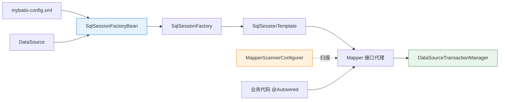
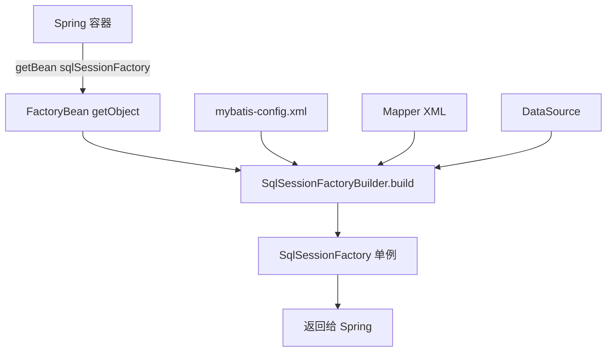
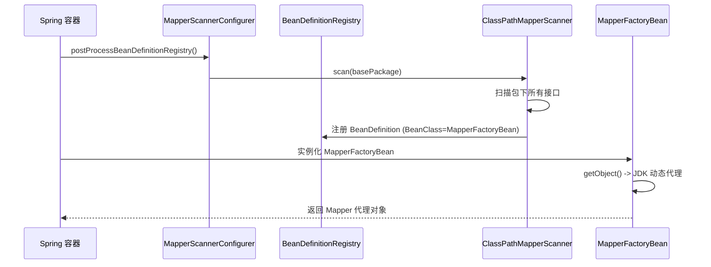

# 01 装配与启动

> ⬅️ [返回 MyBatis 整合总览](README.md)

Spring 整合 MyBatis 的"原教旨主义"配置——基于 `SqlSessionFactoryBean` + `MapperScannerConfigurer` + `DataSourceTransactionManager` 三大件，分别承担"创建工厂"、"注册 Mapper"、"管理事务"。理解这套配置能让你看清自动装配的"骨架"。

---

## 🎯 一句话定位

**经典整合 = SqlSessionFactoryBean 创建 SqlSessionFactory + MapperScannerConfigurer 扫描注册 Mapper 接口 + DataSourceTransactionManager 接管事务**——三者缺一不可，Spring Boot 时代虽被自动配置隐藏，但底层依然是这套。

---

## 一、整合的三大核心组件

| 组件 | 类型 | 职责 |
|------|------|------|
| **SqlSessionFactoryBean** | `FactoryBean<SqlSessionFactory>` | 读取 `mybatis-config.xml` + 数据源，构建 SqlSessionFactory 单例 |
| **MapperScannerConfigurer** | `BeanDefinitionRegistryPostProcessor` | 扫描指定包下的 Mapper 接口，注册为 Spring Bean |
| **DataSourceTransactionManager** | `PlatformTransactionManager` | 管理 `DataSource` 的 Connection 事务 |

### 整合链路全景图



---

## 二、XML 配置方式（Spring 传统写法）

> 适用于 Spring 3.x 及之前的老项目维护，新项目已不再推荐。

### 1. 完整 `applicationContext.xml`

```xml
<?xml version="1.0" encoding="UTF-8"?>
<beans xmlns="http://www.springframework.org/schema/beans"
       xmlns:tx="http://www.springframework.org/schema/tx"
       xmlns:xsi="http://www.w3.org/2001/XMLSchema-instance"
       xsi:schemaLocation="
           http://www.springframework.org/schema/beans
           http://www.springframework.org/schema/beans/spring-beans.xsd
           http://www.springframework.org/schema/tx
           http://www.springframework.org/schema/tx/spring-tx.xsd">

    <!-- 1. 数据源 -->
    <bean id="dataSource" class="com.alibaba.druid.pool.DruidDataSource">
        <property name="driverClassName" value="com.mysql.cj.jdbc.Driver"/>
        <property name="url" value="jdbc:mysql://localhost:3306/test"/>
        <property name="username" value="root"/>
        <property name="password" value="root"/>
    </bean>

    <!-- 2. SqlSessionFactoryBean（核心） -->
    <bean id="sqlSessionFactory" class="org.mybatis.spring.SqlSessionFactoryBean">
        <!-- 注入数据源 -->
        <property name="dataSource" ref="dataSource"/>
        <!-- 指定 MyBatis 全局配置文件 -->
        <property name="configLocation" value="classpath:mybatis-config.xml"/>
        <!-- 指定 Mapper XML 路径（可选，也可在 mybatis-config.xml 中配置） -->
        <property name="mapperLocations" value="classpath:mapper/**/*.xml"/>
        <!-- 指定类型别名扫描包（可选） -->
        <property name="typeAliasesPackage" value="com.example.entity"/>
        <!-- 指定插件（如分页插件，可选） -->
        <property name="plugins">
            <array>
                <bean class="com.github.pagehelper.PageInterceptor"/>
            </array>
        </property>
    </bean>

    <!-- 3. SqlSessionTemplate（可选，一般由 MapperScannerConfigurer 间接使用） -->
    <bean id="sqlSessionTemplate" class="org.mybatis.spring.SqlSessionTemplate">
        <constructor-arg index="0" ref="sqlSessionFactory"/>
    </bean>

    <!-- 4. MapperScannerConfigurer（核心） -->
    <bean class="org.mybatis.spring.mapper.MapperScannerConfigurer">
        <!-- 指定 Mapper 接口所在包 -->
        <property name="basePackage" value="com.example.mapper"/>
        <!-- 可选：指定 SqlSessionFactory Bean 名（默认 sqlSessionFactory） -->
        <property name="sqlSessionFactoryBeanName" value="sqlSessionFactory"/>
    </bean>

    <!-- 5. 事务管理器 -->
    <bean id="transactionManager"
          class="org.springframework.jdbc.datasource.DataSourceTransactionManager">
        <property name="dataSource" ref="dataSource"/>
    </bean>

    <!-- 6. 开启注解事务 -->
    <tx:annotation-driven transaction-manager="transactionManager"/>
</beans>
```

### 2. `mybatis-config.xml`（MyBatis 自身的全局配置）

```xml
<?xml version="1.0" encoding="UTF-8"?>
<!DOCTYPE configuration PUBLIC "-//mybatis.org//DTD Config 3.0//EN"
        "http://mybatis.org/dtd/mybatis-3-config.dtd">
<configuration>
    <settings>
        <!-- 开启驼峰命名映射 -->
        <setting name="mapUnderscoreToCamelCase" value="true"/>
        <!-- 开启延迟加载 -->
        <setting name="lazyLoadingEnabled" value="true"/>
        <!-- 打印 SQL -->
        <setting name="logImpl" value="STDOUT_LOGGING"/>
    </settings>

    <!-- 类型别名（也可在 SqlSessionFactoryBean.typeAliasesPackage 配置） -->
    <typeAliases>
        <package name="com.example.entity"/>
    </typeAliases>
</configuration>
```

---

## 三、Java Config 配置方式（Spring 3.0+）

> 现代写法，所有配置以 Java 类形式存在，便于类型安全和 IDE 提示。

```java
@Configuration
@MapperScan("com.example.mapper")  // 等价于 XML 中的 MapperScannerConfigurer
public class MyBatisConfig {

    /**
     * 1. 数据源（生产推荐 HikariCP 或 Druid）
     */
    @Bean
    public DataSource dataSource() {
        HikariDataSource ds = new HikariDataSource();
        ds.setJdbcUrl("jdbc:mysql://localhost:3306/test");
        ds.setUsername("root");
        ds.setPassword("root");
        ds.setDriverClassName("com.mysql.cj.jdbc.Driver");
        return ds;
    }

    /**
     * 2. SqlSessionFactoryBean（核心）
     */
    @Bean
    public SqlSessionFactoryBean sqlSessionFactory(DataSource dataSource) throws IOException {
        SqlSessionFactoryBean factory = new SqlSessionFactoryBean();
        factory.setDataSource(dataSource);
        factory.setConfigLocation(new ClassPathResource("mybatis-config.xml"));
        factory.setMapperLocations(
            new PathMatchingResourcePatternResolver()
                .getResources("classpath:mapper/**/*.xml"));
        factory.setTypeAliasesPackage("com.example.entity");

        // 配置插件
        factory.setPlugins(new Interceptor[]{new PageInterceptor()});

        // 配置类型处理器
        factory.setTypeHandlers(new TypeHandler[]{
            new DateTypeHandler()
        });

        return factory;
    }

    /**
     * 3. SqlSessionTemplate（可选，多数场景由 @MapperScan 自动注入）
     */
    @Bean
    public SqlSessionTemplate sqlSessionTemplate(SqlSessionFactory sqlSessionFactory) {
        return new SqlSessionTemplate(sqlSessionFactory);
    }

    /**
     * 4. 事务管理器
     */
    @Bean
    public PlatformTransactionManager transactionManager(DataSource dataSource) {
        return new DataSourceTransactionManager(dataSource);
    }
}

/**
 * 5. 启用注解事务（可放在主类或配置类上）
 */
@Configuration
@EnableTransactionManagement
class TxConfig {
}
```

---

## 四、Mapper 接口与 XML 映射

```java
package com.example.mapper;

public interface UserMapper {
    User selectById(@Param("id") Long id);
    List<User> selectAll();
    int insert(User user);
    int updateById(User user);
    int deleteById(@Param("id") Long id);
}
```

```xml
<!-- src/main/resources/mapper/UserMapper.xml -->
<?xml version="1.0" encoding="UTF-8"?>
<!DOCTYPE mapper PUBLIC "-//mybatis.org//DTD Mapper 3.0//EN"
        "http://mybatis.org/dtd/mybatis-3-mapper.dtd">
<mapper namespace="com.example.mapper.UserMapper">

    <resultMap id="userResultMap" type="User">
        <id property="id" column="id"/>
        <result property="userName" column="user_name"/>
        <result property="createTime" column="create_time"/>
    </resultMap>

    <select id="selectById" resultMap="userResultMap">
        SELECT id, user_name, create_time FROM user WHERE id = #{id}
    </select>

    <select id="selectAll" resultType="User">
        SELECT id, user_name, create_time FROM user
    </select>

    <insert id="insert" parameterType="User" useGeneratedKeys="true" keyProperty="id">
        INSERT INTO user (user_name, create_time) VALUES (#{userName}, #{createTime})
    </insert>

    <update id="updateById">
        UPDATE user SET user_name = #{userName} WHERE id = #{id}
    </update>

    <delete id="deleteById">
        DELETE FROM user WHERE id = #{id}
    </delete>
</mapper>
```

---

## 五、关键原理剖析

### 1. SqlSessionFactoryBean 为什么是 FactoryBean？



**为什么不能直接 new SqlSessionFactory？**
- `SqlSessionFactory` 接口没有公开的构造器，只能通过 `SqlSessionFactoryBuilder.build()` 创建
- `FactoryBean` 是 Spring 的"工厂 Bean 规范"，把复杂对象的构造过程封装起来，对外暴露一个普通 Bean 的接口

### 2. MapperScannerConfigurer 如何注册 Mapper？



**关键点**：扫描出的每个 Mapper 接口并不是直接注册为 Bean，而是注册为 **`MapperFactoryBean`**——通过它内部的 `SqlSession.getMapper()` 创建 JDK 动态代理对象。

### 3. 为什么需要 SqlSessionTemplate？

```java
// 原始 MyBatis 用法（非线程安全）
SqlSession session = sqlSessionFactory.openSession();
try {
    User user = session.selectOne("com.example.UserMapper.selectById", 1L);
} finally {
    session.close();
}
```

**问题**：
- 每次都要手动 `openSession()` / `close()`
- 不支持 Spring 事务同步
- 不是线程安全的（不能作为 Spring Bean 注入）

**SqlSessionTemplate 的解决方案**：
- 通过 `TransactionSynchronizationManager` 绑定 SqlSession 到当前线程
- Spring 事务开始时获取 SqlSession，事务结束时自动关闭
- 内部通过 `SqlSessionInterceptor` 拦截器实现线程安全复用

---

## 六、最佳实践

### 1. 配置优先级

```java
// 推荐：Java Config + @MapperScan
// 1. 不再需要 mybatis-config.xml（除非有特殊配置）
// 2. typeAliasesPackage / mapperLocations 通过 SqlSessionFactoryBean 设置
// 3. 复杂场景可保留 mybatis-config.xml 用 setConfigLocation 引入

@Configuration
@MapperScan("com.example.mapper")
public class MyBatisConfig {

    @Bean
    public SqlSessionFactoryBean sqlSessionFactory(DataSource dataSource) {
        SqlSessionFactoryBean factory = new SqlSessionFactoryBean();
        factory.setDataSource(dataSource);
        // 直接通过 Configuration 设置，等价于 mybatis-config.xml
        org.apache.ibatis.session.Configuration config = 
            new org.apache.ibatis.session.Configuration();
        config.setMapUnderscoreToCamelCase(true);
        config.setCacheEnabled(true);
        config.setLazyLoadingEnabled(true);
        factory.setConfiguration(config);
        return factory;
    }
}
```

### 2. Mapper XML 与接口同包（推荐）

```
src/main/java/com/example/mapper/
├── UserMapper.java          ← 接口
src/main/resources/com/example/mapper/
├── UserMapper.xml           ← 同包同名
```

这样 `MapperScannerConfigurer` 扫描包时可通过 `MapperHelper` 自动加载同包 XML，无需配置 `mapperLocations`。

### 3. 常见错误排查

| 现象 | 原因 | 解决 |
|------|------|------|
| `NoSuchBeanDefinitionException: UserMapper` | `basePackage` 路径错或接口未加 `@Mapper` | 检查包路径，确认接口在扫描范围内 |
| `Invalid bound statement (not found)` | Mapper 接口与 XML 的 `namespace` 不一致 | 检查 XML 顶部的 `namespace` 与接口全限定名一致 |
| `ResultMap not found` | XML 中 `resultMap` 引用写错 | 检查 `resultMap` 的 `id` 和命名空间 |
| `Field 'id' doesn't have a default value` | 未配置 `useGeneratedKeys` 或主键策略 | 在 insert 标签加 `useGeneratedKeys="true" keyProperty="id"` |

---

## 相关章节

- ⬅️ [返回 MyBatis 整合总览](README.md)
- ➡️ [02 Mapper 与 Boot](02-mapper-and-boot.md)
- [transaction/README.md](../transaction/README.md) — Spring 事务基础
- [08.mybatis/README.md](../../08.mybatis/README.md) — MyBatis 核心原理