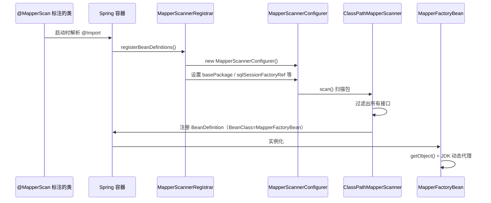
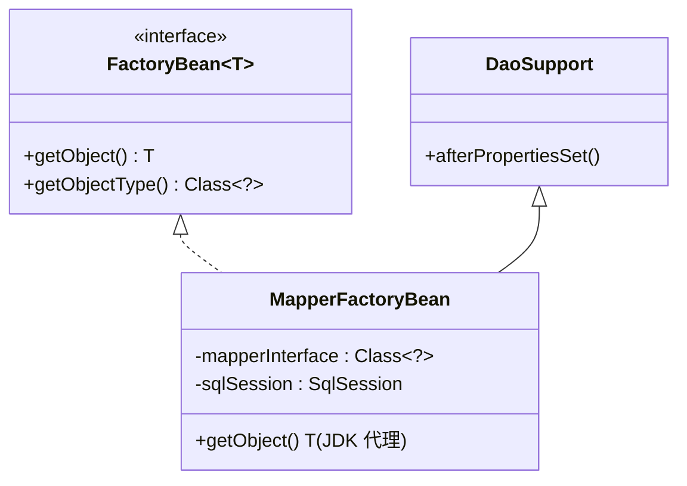
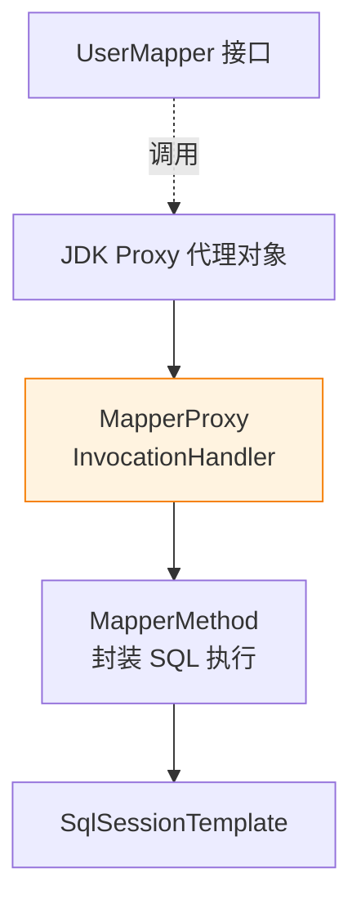
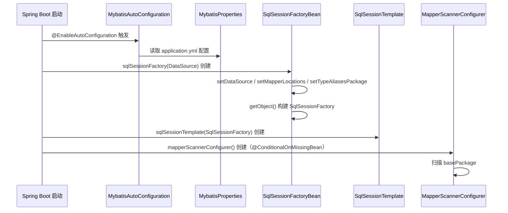

# 02 Mapper 与 Boot

> ⬅️ [返回 MyBatis 整合总览](README.md) | [⬅️ 01 装配与启动](01-assembly-and-startup.md)

`@MapperScan` 简化了 Mapper 注册流程，`mybatis-spring-boot-starter` 进一步把 SqlSessionFactory 也自动化了。本章拆解这两层的实现原理。

---

## 🎯 一句话定位

**`@MapperScan` = `@Import(MapperScannerRegistrar.class)` 触发批量 Mapper 扫描；`mybatis-spring-boot-starter` = `spring.factories` + `@AutoConfiguration` 自动装配 SqlSessionFactory + SqlSessionTemplate**——理解这两层就理解了 Spring Boot 时代的 MyBatis 整合。

---

## 一、从 @Mapper 到 @MapperScan

### 1. `@Mapper` 注解（逐个标注）

```java
import org.apache.ibatis.annotations.Mapper;

@Mapper
public interface UserMapper {
    User selectById(@Param("id") Long id);
}
```

**原理**：MyBatis 提供了 `MapperScannerRegistrar` 通过 `@Import` 触发，但 `@Mapper` 本身需要在某个 `@Configuration` 类上手动启用扫描：

```java
@SpringBootApplication
@MapperScan("com.example.mapper")  // 必须显式扫描 @Mapper
public class App { }
```

或者用 Boot 的自动扫描机制（默认扫描启动类所在包的所有 `@Mapper`）。

### 2. `@MapperScan` 注解（批量扫描，推荐）

```java
@SpringBootApplication
@MapperScan(
    value = "com.example.mapper",           // 扫描包
    sqlSessionFactoryRef = "sqlSessionFactory",  // SqlSessionFactory Bean 名（多数据源时区分）
    sqlSessionTemplateRef = "sqlSessionTemplate", // SqlSessionTemplate Bean 名
    annotationClass = Mapper.class,         // 只扫描带 @Mapper 的接口
    markerInterface = OldMapper.class,      // 或实现该接口的接口
    nameGenerator = BeanNameGenerator.class, // Bean 命名策略
    basePackageClasses = UserMapper.class   // 或指定类所在的包
)
public class App { }
```

| 属性 | 说明 |
|------|------|
| `value` / `basePackages` | 扫描的包路径（数组） |
| `basePackageClasses` | 通过类反推包路径（编译期安全） |
| `sqlSessionFactoryRef` | 多数据源时指定用哪个 SqlSessionFactory |
| `sqlSessionTemplateRef` | 多数据源时指定用哪个 SqlSessionTemplate |
| `annotationClass` | 只扫描带特定注解的接口 |
| `markerInterface` | 只扫描实现特定接口的接口 |
| `nameGenerator` | Bean 名称生成器 |
| `lazyInitialization` | 是否启用延迟初始化 |

---

## 二、@MapperScan 源码深度解析

### 1. 注解定义

```java
@Retention(RetentionPolicy.RUNTIME)
@Target(ElementType.TYPE)
@Documented
@Import(MapperScannerRegistrar.class)  // 关键：触发 Registrar
@Repeatable(MapperScans.class)          // 可重复注解
public @interface MapperScan { ... }
```

### 2. `MapperScannerRegistrar` 工作流程



### 3. 核心源码

```java
// 简化版 MapperScannerRegistrar
public class MapperScannerRegistrar implements ImportBeanDefinitionRegistrar, ResourceLoaderAware {

    @Override
    public void registerBeanDefinitions(AnnotationMetadata importingClassMetadata,
                                        BeanDefinitionRegistry registry) {
        // 1. 解析 @MapperScan 注解属性
        AnnotationAttributes annoAttrs = AnnotationAttributes.fromMap(
            importingClassMetadata.getAnnotationAttributes(MapperScan.class.getName()));

        // 2. 创建并配置 MapperScannerConfigurer
        ClassPathMapperScanner scanner = new ClassPathMapperScanner(registry);
        scanner.setAnnotationClass(annoAttrs.getClass("annotationClass"));
        scanner.setMarkerInterface(annoAttrs.getClass("markerInterface"));
        scanner.setSqlSessionFactoryBeanName(annoAttrs.getString("sqlSessionFactoryRef"));
        scanner.setSqlSessionTemplateBeanName(annoAttrs.getString("sqlSessionTemplateRef"));

        // 3. 解析 basePackage
        List<String> basePackages = new ArrayList<>();
        for (String pkg : annoAttrs.getStringArray("value")) {
            if (StringUtils.hasText(pkg)) basePackages.add(pkg);
        }
        for (Class<?> clazz : annoAttrs.getClassArray("basePackageClasses")) {
            basePackages.add(ClassUtils.getPackageName(clazz));
        }

        // 4. 注册过滤器并扫描
        scanner.registerFilters();
        scanner.doScan(StringUtils.toStringArray(basePackages));
    }
}
```

### 4. `ClassPathMapperScanner` 扫描逻辑

```java
public Set<BeanDefinition> doScan(String... basePackages) {
    // 1. 调用父类 ClassPathBeanDefinitionScanner.doScan()
    Set<BeanDefinition> beanDefinitions = super.doScan(basePackages);

    // 2. 对每个 BeanDefinition 特殊处理：把 BeanClass 改为 MapperFactoryBean
    for (BeanDefinition definition : beanDefinitions) {
        definition.setBeanClass(MapperFactoryBean.class);
        // 注入 sqlSessionFactory / sqlSessionTemplate
        definition.getPropertyValues().add("mapperInterface", definition.getBeanClassName());
    }

    return beanDefinitions;
}
```

**关键点**：扫描出的 `BeanDefinition` 的 `BeanClass` 被改为 `MapperFactoryBean`，所以 Spring 实例化时会调用 `MapperFactoryBean.getObject()` 而不是 `UserMapper` 的构造器（接口本来也没构造器）。

---

## 三、MapperFactoryBean 的角色

### 1. 类继承关系



### 2. `getObject()` 核心逻辑

```java
public class MapperFactoryBean<T> extends DaoSupport implements FactoryBean<T> {

    private Class<T> mapperInterface;

    @Override
    public T getObject() throws Exception {
        // 核心：通过 SqlSession.getMapper() 获取 JDK 动态代理
        return getSqlSession().getMapper(this.mapperInterface);
    }

    @Override
    public Class<T> getObjectType() {
        return mapperInterface;
    }

    @Override
    public boolean isSingleton() {
        return true;
    }
}
```

### 3. 代理对象内部结构



---

## 四、Spring Boot 自动装配链路

### 1. 引入依赖

```xml
<dependency>
    <groupId>org.mybatis.spring.boot</groupId>
    <artifactId>mybatis-spring-boot-starter</artifactId>
    <version>3.0.3</version>
</dependency>
```

### 2. `spring.factories` 自动配置注册

```properties
# META-INF/spring.factories (旧版)
org.springframework.boot.autoconfigure.EnableAutoConfiguration=\
  org.mybatis.spring.boot.autoconfigure.MybatisAutoConfiguration
```

```java
// 3.0+ 版本：META-INF/spring/org.springframework.boot.autoconfigure.AutoConfiguration.imports
// 直接列在 import 文件中
```

### 3. `MybatisAutoConfiguration` 核心流程



### 4. 关键源码

```java
@org.springframework.context.annotation.Configuration
@ConditionalOnClass({SqlSessionFactory.class, SqlSessionFactoryBean.class})
@ConditionalOnSingleCandidate(DataSource.class)
@EnableConfigurationProperties(MybatisProperties.class)
@AutoConfigurationAfter(DataSourceAutoConfiguration.class)
public class MybatisAutoConfiguration implements InitializingBean {

    @Bean
    @ConditionalOnMissingBean
    public SqlSessionFactory sqlSessionFactory(DataSource dataSource) throws Exception {
        SqlSessionFactoryBean factory = new SqlSessionFactoryBean();
        factory.setDataSource(dataSource);
        factory.setVfs(SpringBootVFS.class);  // Spring Boot 专用 VFS，用于从 Jar 加载 XML

        // 应用 application.yml 中的 mybatis 配置
        if (StringUtils.hasText(properties.getConfigLocation())) {
            factory.setConfigLocation(resourceLoader.getResource(properties.getConfigLocation()));
        }
        applyConfiguration(factory);
        applyMapperLocations(factory);  // 关键：扫描 mapper-locations 配置
        applyTypeAliasesPackage(factory);
        applyPlugins(factory);
        applyTypeHandlers(factory);

        return factory.getObject();
    }

    @Bean
    @ConditionalOnMissingBean
    public SqlSessionTemplate sqlSessionTemplate(SqlSessionFactory sqlSessionFactory) {
        ExecutorType executorType = properties.getExecutorType();
        if (executorType != null) {
            return new SqlSessionTemplate(sqlSessionFactory, executorType);
        }
        return new SqlSessionTemplate(sqlSessionFactory);
    }

    @Bean
    @ConditionalOnMissingBean
    public MapperScannerConfigurer mapperScannerConfigurer() {
        MapperScannerConfigurer scanner = new MapperScannerConfigurer();
        scanner.setBasePackage(properties.getMapperLocations() != null
            ? properties.getBasePackage() : null);
        return scanner;
    }
}
```

### 5. `MybatisProperties` 配置映射

```java
@ConfigurationProperties(prefix = "mybatis")
public class MybatisProperties {
    private String configLocation;                // mybatis.config-location
    private String[] mapperLocations;             // mybatis.mapper-locations
    private String typeAliasesPackage;            // mybatis.type-aliases-package
    private String typeHandlersPackage;           // mybatis.type-handlers-package
    private ExecutorType executorType;            // mybatis.executor-type
    private Properties configurationProperties;   // mybatis.configuration.*
    // ...
}
```

### 6. 典型 `application.yml` 配置

```yaml
spring:
  datasource:
    url: jdbc:mysql://localhost:3306/test
    username: root
    password: root

mybatis:
  # MyBatis 配置文件路径（可选）
  config-location: classpath:mybatis-config.xml
  # Mapper XML 扫描路径
  mapper-locations: classpath:mapper/**/*.xml
  # 类型别名包
  type-aliases-package: com.example.entity
  # 类型处理器包
  type-handlers-package: com.example.handler
  # 执行器类型：SIMPLE / REUSE / BATCH
  executor-type: REUSE
  # 下划线转驼峰
  configuration:
    map-underscore-to-camel-case: true
    cache-enabled: true
    lazy-loading-enabled: true
    log-impl: org.apache.ibatis.logging.stdout.StdOutImpl
  # 配置插件（Boot 3.x 推荐方式）
  # 注意：复杂插件仍需在 Java Config 中配置
```

---

## 五、mybatis-plus-boot-starter 与原生 starter 区别

引入 `mybatis-plus-boot-starter` 后，自动装配类变为：

```java
@AutoConfiguration
public class MybatisPlusAutoConfiguration implements InitializingBean {

    @Bean
    @ConditionalOnMissingBean
    public SqlSessionFactory sqlSessionFactory(DataSource dataSource) throws Exception {
        // 与 MybatisAutoConfiguration 类似，但注入了 MybatisPlusInterceptor
        MybatisSqlSessionFactoryBean factory = new MybatisSqlSessionFactoryBean();
        factory.setDataSource(dataSource);
        factory.setPlugins(this.interceptors);  // 分页、乐观锁、多租户等插件
        // ...
    }
}
```

**关键差异**：
- `SqlSessionFactory` 类型变为 `MybatisSqlSessionFactoryBean`（MyBatis-Plus 自定义）
- 默认注册 `MybatisPlusInterceptor`（包含分页、乐观锁、防全表更新等）
- `BaseMapper<T>` 提供的 CRUD 方法被自动注册为 MappedStatement

---

## 六、常见问题

### 1. `@Mapper` 与 `@MapperScan` 冲突

```java
@MapperScan("com.example.mapper")  // 批量扫描
public interface UserMapper { ... }  // 又有 @Mapper
```

**解决**：二选一，不要混用。推荐只用 `@MapperScan`，避免接口上的注解冗余。

### 2. `Invalid bound statement`（最常见）

```text
org.apache.ibatis.binding.BindingException: 
  Invalid bound statement (not found): com.example.mapper.UserMapper.selectById
```

**排查清单**：
1. `mybatis.mapper-locations` 是否包含对应 XML 路径？
2. XML 文件的 `namespace` 是否等于接口全限定名？
3. XML 中 SQL 的 `id` 是否等于方法名？
4. Maven 多模块下 XML 是否被打包进 Jar？

### 3. 启动慢（Mapper 扫描耗时）

```yaml
mybatis-plus:
  mapper-locations: classpath*:mapper/**/*.xml  # classpath* 会扫描所有 Jar，慢
```

**优化**：用 `classpath:mapper/**/*.xml`（单 classpath 根），或在 Java Config 显式指定路径。

### 4. 多模块项目 Mapper 找不到

```java
// 公共模块 com-common 中的 Mapper 接口
// 业务模块需要扫描 com.example.com.mapper 包
@MapperScan({
    "com.example.mapper",          // 本模块
    "com.example.com.mapper"       // 公共模块
})
```

---

## 相关章节

- ⬅️ [返回 MyBatis 整合总览](README.md)
- ⬅️ [01 装配与启动](01-assembly-and-startup.md)
- ➡️ [03 事务边界](03-transaction-boundary.md)
- [08.mybatis/mybatis-plus/README.md](../../08.mybatis/mybatis-plus/README.md) — MyBatis-Plus 增强
- [01-core/README.md](../../01-core/README.md) — FactoryBean / Bean 生命周期