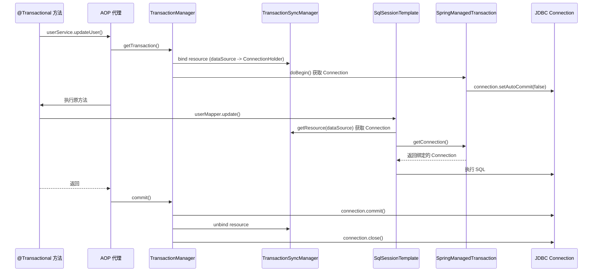
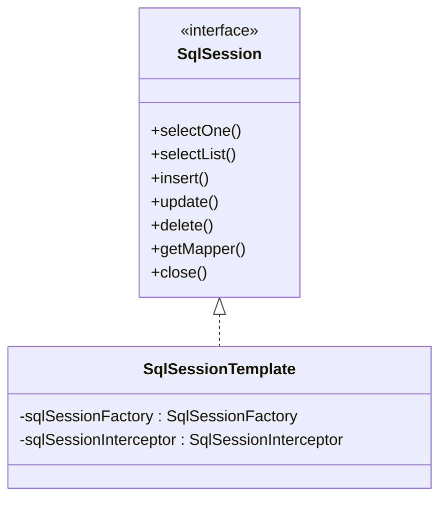
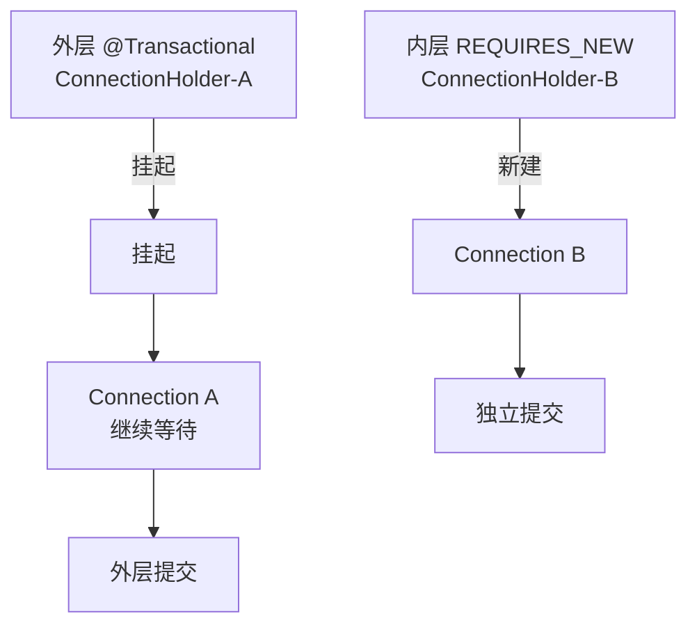

# 03 事务边界

> ⬅️ [返回 MyBatis 整合总览](README.md) | [⬅️ 02 Mapper 与 Boot](02-mapper-and-boot.md)

`@Transactional` 能管住 MyBatis 的事务吗？答案是**有条件地可以**——条件是 SqlSession 必须由 Spring 管理，且操作必须在同一线程。本章拆解 Spring 接管 MyBatis 事务的链路，并列举高频失效场景。

---

## 🎯 一句话定位

**Spring 事务管理 MyBatis 的核心 = `SqlSessionTemplate` 通过 `SpringManagedTransaction` 把 SqlSession 绑定到 `TransactionSynchronizationManager` 的资源池**——一旦绕开这个绑定（如手动 openSession / 多线程 / 异步），事务就会失效。

---

## 一、Spring 事务如何接管 MyBatis

### 1. 完整调用链路



### 2. 关键组件职责

| 组件 | 职责 |
|------|------|
| `PlatformTransactionManager` | Spring 事务管理器接口（`DataSourceTransactionManager` 是其实现） |
| `TransactionSynchronizationManager` | 基于 ThreadLocal 的事务资源管理器，绑定 Connection 到当前线程 |
| `SqlSessionTemplate` | MyBatis 的 SqlSession 包装，**线程安全**，自动从 ThreadLocal 获取 Connection |
| `SpringManagedTransaction` | MyBatis 的 `Transaction` 接口适配器，将 SqlSession 关联到 ConnectionHolder |

---

## 二、SqlSessionTemplate 是怎么工作的？

### 1. 类结构



### 2. 核心源码

```java
public class SqlSessionTemplate implements SqlSession, DisposableBean {

    private final SqlSessionFactory sqlSessionFactory;
    private final SqlSessionInterceptor sqlSessionInterceptor;

    @Override
    public <T> T selectOne(String statement, Object parameter) {
        // 通过代理转发，所有方法都走 SqlSessionInterceptor
        return this.sqlSessionInterceptor.invoke(
            new SqlSessionMethodInvocation() {
                @Override
                public Object execute(SqlSession session) {
                    return session.selectOne(statement, parameter);
                }
            });
    }

    // 内部拦截器
    private class SqlSessionInterceptor implements InvocationHandler {
        @Override
        public Object invoke(Object proxy, Method method, Object[] args) throws Throwable {
            // 1. 从 TransactionSynchronizationManager 获取绑定的 SqlSession
            SqlSession session = SqlSessionUtils.getSqlSession(
                sqlSessionFactory, executorType, exceptionTranslator);

            try {
                // 2. 在 SqlSession 上调用实际方法
                Object result = method.invoke(session, args);

                // 3. 如果事务由 Spring 管理，提交事务由 Spring 处理，不在此提交
                if (!isSqlSessionTransactional(session, sqlSessionFactory)) {
                    session.commit();  // 非事务场景下手动提交
                }
                return result;
            } catch (Exception e) {
                // 4. 异常时强制回滚
                if (!isSqlSessionTransactional(session, sqlSessionFactory)) {
                    session.rollback();
                }
                throw exceptionTranslator.translateExceptionIfPossible(...);
            } finally {
                // 5. 关闭 SqlSession（实际是归还到连接池）
                SqlSessionUtils.closeSqlSession(session, sqlSessionFactory);
            }
        }
    }
}
```

### 3. SqlSessionUtils 的资源管理

```java
public final class SqlSessionUtils {

    private static final String NO_EXECUTOR_TYPE_PREFIX = "_ExecutorType_";

    // 核心：从 ThreadLocal 中获取或创建 SqlSession
    public static SqlSession getSqlSession(SqlSessionFactory factory,
                                            ExecutorType executorType,
                                            PersistenceExceptionTranslator translator) {
        // 1. 优先从 TransactionSynchronizationManager 获取已绑定的 SqlSession
        SqlSessionHolder holder = (SqlSessionHolder)
            TransactionSynchronizationManager.getResource(factory);
        if (holder != null && holder.isSynchronizedWithTransaction()) {
            // 命中：复用当前事务的 SqlSession
            holder.requested();
            return holder.getSqlSession();
        }

        // 2. 未命中：创建新 SqlSession（通过 factory.openSession）
        SqlSession session = (executorType != null
            ? factory.openSession(executorType)
            : factory.openSession());

        // 3. 如果当前在 Spring 事务中，注册 SqlSession 到 ThreadLocal
        if (TransactionSynchronizationManager.isSynchronizationActive()) {
            Environment environment = factory.getConfiguration().getEnvironment();
            if (environment.getTransactionFactory() instanceof SpringManagedTransactionFactory) {
                holder = new SqlSessionHolder(session, executorType,
                    exceptionTranslator);
                holder.setSynchronizedWithTransaction(true);
                // 关键：绑定到 ThreadLocal
                TransactionSynchronizationManager.bindResource(factory, holder);
                // 注册事务同步器，事务提交/回滚时自动清理
                TransactionSynchronizationManager.registerSynchronization(
                    new SqlSessionSynchronization(holder, factory));
            }
        }
        return session;
    }
}
```

---

## 三、事务失效场景（MyBatis 专项）

### 1. 手动 openSession（最常见）

```java
@Service
public class BadUserService {

    @Autowired private SqlSessionFactory sqlSessionFactory;
    @Autowired private UserMapper userMapper;

    @Transactional  // ❌ 这个注解对下面的手动 openSession 无效
    public void updateUserBad(Long id) {
        // 1. userMapper 的 SqlSession 由 Spring 管理（事务有效）
        userMapper.updateName(id, "newName");

        // 2. 手动 openSession 拿到非托管的 SqlSession（事务失效！）
        try (SqlSession session = sqlSessionFactory.openSession()) {
            session.update("com.example.UserMapper.updateAge", id, 30);
            session.commit();  // 必须手动提交
        }
        // 如果上面抛异常，userMapper 的更新会回滚，但 openSession 的不会
    }
}
```

**解决**：所有 SQL 都通过 Mapper 接口执行，避免手动 `openSession`。

### 2. 同类内部调用（绕过 AOP）

```java
@Service
public class UserService {

    @Autowired private UserMapper userMapper;

    public void outer() {
        // ❌ this 调用，不会走 AOP 代理，@Transactional 不生效
        inner();
    }

    @Transactional
    public void inner() {
        userMapper.update(...);  // 没有事务！
    }
}
```

**解决**：注入自己的代理 `@Autowired private UserService self;`，或拆分到两个 Bean。

### 3. 多线程 / 异步调用

```java
@Service
public class OrderService {

    @Autowired private OrderMapper orderMapper;

    @Transactional
    public void createOrder(Order order) {
        // 事务绑定在主线程
        orderMapper.insert(order);

        // ❌ 异步线程无法访问主线程的 ThreadLocal
        CompletableFuture.runAsync(() -> {
            orderMapper.updateStatus(order.getId(), "PAID");  // 无事务！
        });
    }
}
```

**解决**：
- 异步任务在 Spring 上下文外创建事务（`TransactionTemplate.execute`）
- 用 `@Async` + 自定义 `TaskExecutor` 配合事务传播

### 4. 异常被吞

```java
@Transactional
public void updateUser(Long id) {
    try {
        userMapper.update(id);
        otherService.mayThrow();
    } catch (Exception e) {
        // ❌ 异常被吞，事务无法回滚
        log.error("失败", e);
    }
}
```

**解决**：
- 异常必须抛出（重新 `throw e;`）
- 或用 `TransactionAspectSupport.currentTransactionStatus().setRollbackOnly();` 手动标记回滚

### 5. 异常类型不匹配

```java
@Transactional  // 默认 rollbackFor = RuntimeException
public void updateUser(Long id) throws Exception {
    userMapper.update(id);
    throw new Exception("业务异常");  // ❌ 非 RuntimeException，不会回滚
}
```

**解决**：明确指定 `@Transactional(rollbackFor = Exception.class)`。

### 6. 非 public 方法

```java
@Transactional  // ❌ 非 public 方法，AOP 无法拦截
private void innerUpdate(Long id) {
    userMapper.update(id);
}
```

**解决**：改为 public，或用 AspectJ 模式启动（`@EnableTransactionManagement(mode = ASPECTJ)`）。

### 7. 多数据源下事务管理器错配

```java
// 主数据源用 masterTransactionManager
@Bean
@Primary
public DataSourceTransactionManager masterTransactionManager(@Qualifier("masterDataSource") DataSource ds) {
    return new DataSourceTransactionManager(ds);
}

// 从数据源用 slaveTransactionManager
@Bean
public DataSourceTransactionManager slaveTransactionManager(@Qualifier("slaveDataSource") DataSource ds) {
    return new DataSourceTransactionManager(ds);
}

@Service
public class ReportService {

    @Autowired
    @Qualifier("slaveDataSource")
    private DataSource slaveDataSource;  // ❌ 用了从数据源

    @Transactional  // 默认用 @Primary 的 masterTransactionManager
    public void generateReport() {
        // 写入从库，但事务管理器是主库的——事务失效
    }
}
```

**解决**：`@Transactional("slaveTransactionManager")` 显式指定事务管理器。

### 8. SqlSession 与 Connection 生命周期错位

```java
@Transactional
public void process(List<Long> ids) {
    for (Long id : ids) {
        // ❌ 每次 openSession 都创建独立连接，事务不连续
        try (SqlSession session = sqlSessionFactory.openSession()) {
            session.update("UserMapper.deleteById", id);
        }
    }
}
```

**解决**：用 `SqlSessionTemplate` + Mapper 接口，依赖 Spring 的 SqlSessionHolder 复用机制。

---

## 四、事务传播行为与 MyBatis 的交互

### 1. 传播行为生效条件

```java
@Service
public class OrderService {

    @Autowired private OrderMapper orderMapper;
    @Autowired private StockService stockService;

    @Transactional(propagation = Propagation.REQUIRED)  // 默认
    public void createOrder(Order order) {
        orderMapper.insert(order);
        stockService.deduct(order);  // 走另一个 @Transactional
    }
}

@Service
public class StockService {

    @Transactional(propagation = Propagation.REQUIRED)
    public void deduct(Order order) {
        // 加入外层事务，复用 SqlSession
        stockMapper.deduct(order.getSkuId(), order.getCount());
    }
}
```

**关键**：两个方法都在 Spring 事务中执行时，SqlSession 是复用的（同一个 ConnectionHolder）。

### 2. REQUIRES_NEW 的特殊性

```java
@Service
public class AuditService {

    @Transactional(propagation = Propagation.REQUIRES_NEW)  // 总是新建事务
    public void log(String action) {
        // 即使外层回滚，审计日志也会保留
        auditMapper.insert(action);
    }
}
```

**实现**：挂起外层事务（`TransactionSynchronizationManager` 的 resources 栈），新建独立的 SqlSessionHolder。

### 3. 嵌套事务的 Connection 隔离



---

## 五、调试与排查

### 1. 开启 MyBatis SQL 日志

```yaml
mybatis:
  configuration:
    log-impl: org.apache.ibatis.logging.stdout.StdOutImpl
```

或集成 logback：

```xml
<logger name="com.example.mapper" level="DEBUG"/>
```

### 2. 打印当前事务状态

```java
@Override
public void update(Long id) {
    boolean isTxActive = TransactionSynchronizationManager.isActualTransactionActive();
    String txName = TransactionSynchronizationManager.getCurrentTransactionName();
    log.info("事务激活: {}, 事务名: {}", isTxActive, txName);
    // 预期事务场景：isTxActive=true
    userMapper.update(id);
}
```

### 3. 事务回滚时的日志

```java
@Transactional(rollbackFor = Exception.class)
public void update(Long id) {
    try {
        userMapper.update(id);
    } catch (Exception e) {
        // 打印是否已标记回滚
        boolean isRollbackOnly = TransactionAspectSupport.currentTransactionStatus().isRollbackOnly();
        log.warn("当前事务是否标记回滚: {}", isRollbackOnly);
        throw e;
    }
}
```

### 4. 监控工具

```xml
<dependency>
    <groupId>com.github.gavlyukovskiy</groupId>
    <artifactId>datasource-proxy-spring-boot-starter</artifactId>
</dependency>
```

可输出 SQL、Connection 获取时间、事务绑定情况等。

---

## 六、最佳实践

### 1. Service 层统一加 @Transactional

```java
@Service
public class UserServiceImpl implements UserService {

    @Autowired private UserMapper userMapper;

    @Override
    @Transactional(rollbackFor = Exception.class)
    public void createUser(UserDTO dto) {
        // 业务逻辑
        userMapper.insert(dto);
    }
}
```

### 2. 避免长事务

```java
// ❌ 长事务
@Transactional
public void batchImport(List<User> users) {
    for (User user : users) {
        userMapper.insert(user);  // 10000 条全部在同一个事务
    }
}

// ✅ 拆分为多个小事务
public void batchImport(List<User> users) {
    List<List<User>> chunks = Lists.partition(users, 100);
    for (List<User> chunk : chunks) {
        self.importChunk(chunk);  // self 调用，走代理
    }
}

@Transactional(propagation = Propagation.REQUIRES_NEW)
public void importChunk(List<User> users) {
    for (User user : users) {
        userMapper.insert(user);
    }
}
```

### 3. 只读事务优化

```java
@Transactional(readOnly = true)
public List<User> listAll() {
    return userMapper.selectAll();
    // Hibernate / JPA 会跳过脏检查；MyBatis 无明显效果，但语义清晰
}
```

### 4. 事务方法 vs SQL 优化

```java
// ✅ 在事务外做 SQL 优化准备工作
public List<User> search(UserQuery query) {
    // 1. 先做一些耗时的非数据库操作
    List<User> cached = cache.get(query.getKey());
    if (cached != null) return cached;

    // 2. 进入事务查询数据库
    return self.searchInTx(query);
}

@Transactional
public List<User> searchInTx(UserQuery query) {
    return userMapper.search(query);
}
```

---

## 相关章节

- ⬅️ [返回 MyBatis 整合总览](README.md)
- ⬅️ [02 Mapper 与 Boot](02-mapper-and-boot.md)
- ➡️ [04 多数据源路由](04-multi-datasource.md)
- [transaction/README.md](../transaction/README.md) — Spring 事务基础
- [transaction/failure-cases.md](../transaction/failure-cases.md) — 事务失效场景全集
- [13.split-hairs/06.spring/transactional-pitfalls/README.md](../../../13.split-hairs/06.spring/transactional-pitfalls/README.md) — @Transactional 失效 8 种场景