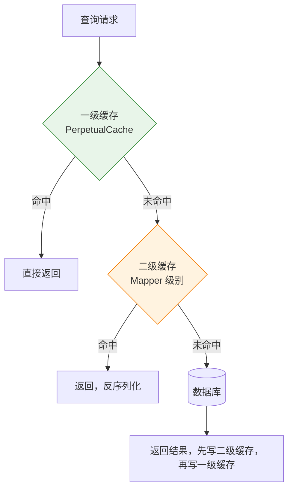
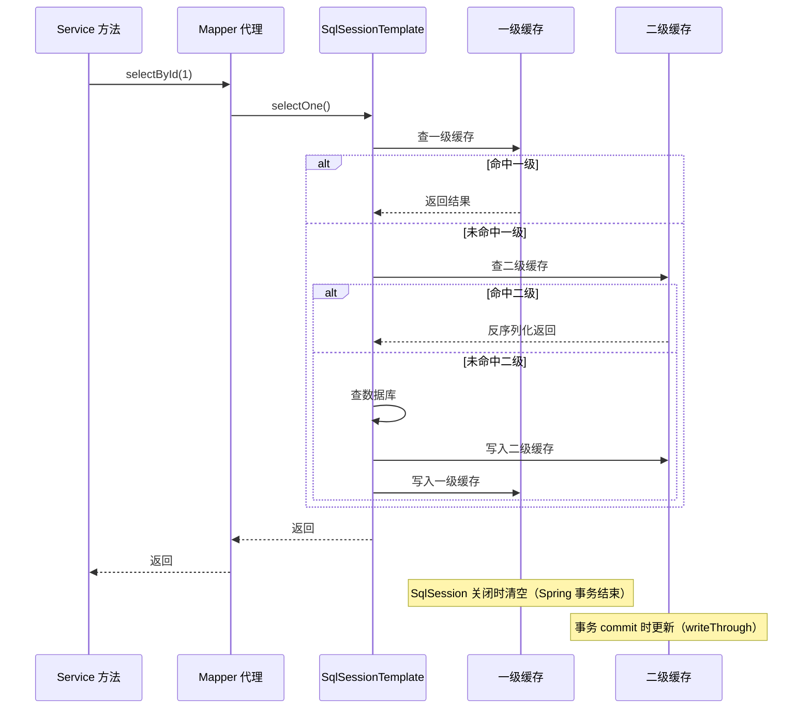
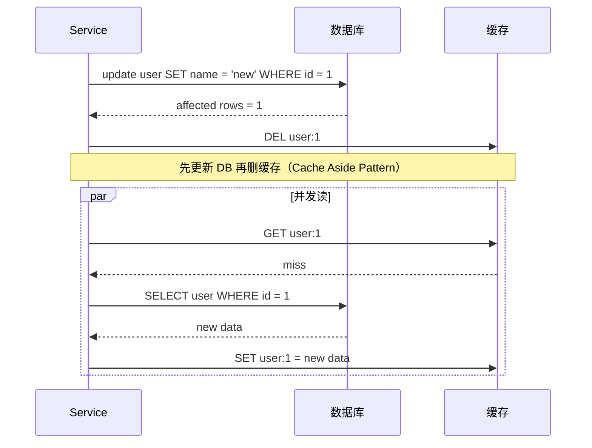

# 05 二级缓存与 Redis/Caffeine 整合

> ⬅️ [返回 MyBatis 整合总览](README.md) | [⬅️ 04 多数据源路由](04-multi-datasource.md)

MyBatis 一级缓存基于 SqlSession 生命周期（默认开启），二级缓存基于 Mapper 命名空间（需手动开启）。当 Spring + MyBatis 整合后，二级缓存的生命周期、序列化、TTL 等问题变得突出——本章拆解与 Redis/Caffeine 的整合方案。

---

## 🎯 一句话定位

**MyBatis 二级缓存 = Mapper 级别的跨 SqlSession 缓存**——本地场景用 Ehcache/Caffeine，分布式场景必须接 Redis（否则不同 JVM 之间缓存不共享），整合要点是序列化、TTL 与 Spring 事务的协同。

---

## 一、缓存层次回顾

### 1. MyBatis 自带的缓存分层



### 2. 一级缓存 vs 二级缓存

| 维度 | 一级缓存 | 二级缓存 |
|------|---------|---------|
| **作用域** | `SqlSession` 级别 | `Mapper`（namespace）级别 |
| **默认开启** | ✅ | ❌ 需 `<cache/>` 或 `@CacheNamespace` |
| **跨 SqlSession** | ❌ | ✅ |
| **跨 JVM** | ❌ | 默认 ❌，可接 Redis ✅ |
| **失效时机** | 增删改、commit/rollback、`clearCache()` | 同上，且 commit 后才更新二级缓存 |
| **序列化** | 不需要 | **必须**（对象进入二级缓存要序列化） |

### 3. Spring 整合后缓存生命周期的变化



---

## 二、二级缓存开启方式

### 1. XML 方式（在 Mapper.xml 中声明）

```xml
<mapper namespace="com.example.mapper.UserMapper">
    <!-- 开启二级缓存 -->
    <cache
        eviction="LRU"
        flushInterval="60000"
        size="1024"
        readOnly="true"
        blocking="false"/>
    
    <select id="selectById" resultType="User">
        SELECT * FROM user WHERE id = #{id}
    </select>
</mapper>
```

| 属性 | 说明 |
|------|------|
| `eviction` | 回收策略：LRU（默认）、FIFO、SOFT、WEAK |
| `flushInterval` | 自动刷新间隔（毫秒），默认不自动刷新 |
| `size` | 缓存最大数量，默认 1024 |
| `readOnly` | 是否只读（true 性能高，不可修改；false 可序列化） |
| `blocking` | 是否阻塞锁，防止缓存击穿 |

### 2. 注解方式（`@CacheNamespace`）

```java
@CacheNamespace(
    eviction = LruCache.class,
    flushInterval = 60000,
    size = 1024,
    readWrite = true  // 等价于 readOnly=false
)
public interface UserMapper {
    User selectById(@Param("id") Long id);
}
```

### 3. 二级缓存失效规则

```java
// 增删改操作会自动清空该 namespace 的二级缓存
@Update("UPDATE user SET name = #{name} WHERE id = #{id}")
int updateById(User user);  // 执行后，user 命名空间下的缓存全部清空
```

---

## 三、整合 Redis（二级缓存分布式方案）

### 1. 引入依赖

```xml
<!-- MyBatis 官方 Redis 集成 -->
<dependency>
    <groupId>org.mybatis.caches</groupId>
    <artifactId>mybatis-redis</artifactId>
    <version>1.0.0-beta2</version>
</dependency>
```

### 2. `redis.properties` 配置

```properties
# Redis 服务器地址
host=localhost
# 端口
port=6379
# 密码
password=
# 数据库
database=0
# 超时
timeout=2000
# 序列化方式
serialization=JDK
```

### 3. 在 Mapper.xml 中引用

```xml
<mapper namespace="com.example.mapper.UserMapper">
    <!-- 使用 Redis 作为二级缓存 -->
    <cache type="org.mybatis.caches.redis.RedisCache"/>
    
    <!-- 自定义 Redis 缓存配置 -->
    <cache type="org.mybatis.caches.redis.RedisCache">
        <property name="host" value="redis-cluster"/>
        <property name="port" value="6379"/>
        <property name="password" value="${redis.password}"/>
        <property name="database" value="1"/>
        <property name="timeout" value="3000"/>
        <property name="serialization" value="JSON"/>
    </cache>
    
    <select id="selectById" resultType="User" useCache="true">
        SELECT * FROM user WHERE id = #{id}
    </select>
</mapper>
```

### 4. Java 配置方式（更灵活）

```java
@Configuration
public class MyBatisCacheConfig {

    @Bean
    public org.apache.ibatis.session.Configuration mybatisConfiguration() {
        org.apache.ibatis.session.Configuration config =
            new org.apache.ibatis.session.Configuration();
        config.setCacheEnabled(true);
        // 配置全局缓存
        return config;
    }
}
```

### 5. Spring 整合 Redis 的统一管理（推荐）

> 上述 `mybatis-redis` 方案独立管理 Redis 连接，不推荐。**生产环境推荐用 Spring Cache + Redis 统一管理**。

```xml
<dependency>
    <groupId>org.springframework.boot</groupId>
    <artifactId>spring-boot-starter-data-redis</artifactId>
</dependency>
```

```yaml
spring:
  redis:
    host: localhost
    port: 6379
    password:
    lettuce:
      pool:
        max-active: 8
        max-idle: 8
        min-idle: 0
```

```java
@Configuration
public class RedisConfig {

    @Bean
    public RedisTemplate<String, Object> redisTemplate(RedisConnectionFactory factory) {
        RedisTemplate<String, Object> template = new RedisTemplate<>();
        template.setConnectionFactory(factory);

        // 使用 Jackson 序列化（比 JDK 序列化更轻量、跨语言）
        Jackson2JsonRedisSerializer<Object> serializer = 
            new Jackson2JsonRedisSerializer<>(Object.class);
        ObjectMapper mapper = new ObjectMapper();
        mapper.setVisibility(PropertyAccessor.ALL, JsonAutoDetect.Visibility.ANY);
        mapper.activateDefaultTyping(mapper.getPolymorphicTypeValidator(),
            ObjectMapper.DefaultTyping.NON_FINAL);
        serializer.setObjectMapper(mapper);

        template.setKeySerializer(new StringRedisSerializer());
        template.setValueSerializer(serializer);
        template.setHashKeySerializer(new StringRedisSerializer());
        template.setHashValueSerializer(serializer);
        template.afterPropertiesSet();
        return template;
    }
}
```

---

## 四、MyBatis-Plus 二级缓存与 Redis 整合

### 1. 引入 mybatis-plus-redis-cache 扩展

```xml
<dependency>
    <groupId>com.baomidou</groupId>
    <artifactId>mybatis-plus-jsqlparser</artifactId>
</dependency>

<dependency>
    <groupId>com.baomidou</groupId>
    <artifactId>mybatis-plus-extension</artifactId>
</dependency>
```

### 2. 自定义 MybatisRedisCache

```java
public class MybatisRedisCache implements Cache {

    private final String id;
    private final ReadWriteLock lock = new ReentrantReadWriteLock(true);
    private RedisTemplate<Object, Object> redisTemplate;
    private static final long EXPIRE_TIME = 30 * 60 * 1000;  // 30 分钟

    public MybatisRedisCache(String id) {
        this.id = id;
    }

    @Override
    public String getId() {
        return this.id;
    }

    @Override
    public void putObject(Object key, Object value) {
        // 序列化 key & value，存入 Redis
        redisTemplate.opsForValue().set(key, value, EXPIRE_TIME, TimeUnit.MILLISECONDS);
    }

    @Override
    public Object getObject(Object key) {
        return redisTemplate.opsForValue().get(key);
    }

    @Override
    public Object removeObject(Object key) {
        redisTemplate.delete(key);
        return null;
    }

    @Override
    public void clear() {
        // 清空该 namespace 下的所有缓存
        Set<Object> keys = redisTemplate.keys(this.id + ":*");
        if (keys != null && !keys.isEmpty()) {
            redisTemplate.delete(keys);
        }
    }

    @Override
    public int getSize() {
        Set<Object> keys = redisTemplate.keys(this.id + ":*");
        return keys == null ? 0 : keys.size();
    }

    // 关键：从 Spring 上下文获取 RedisTemplate
    private RedisTemplate<Object, Object> getRedisTemplate() {
        if (redisTemplate == null) {
            // 通过 SpringContextHolder 或 ApplicationContextAware 获取
            redisTemplate = (RedisTemplate<Object, Object>) SpringContextHolder.getBean("redisTemplate");
        }
        return redisTemplate;
    }
}
```

### 3. 在 Mapper 上使用

```java
@CacheNamespace(implementation = MybatisRedisCache.class, eviction = LruCache.class)
public interface UserMapper extends BaseMapper<User> {
    // MyBatis-Plus 的 selectById 等方法自动走二级缓存
}
```

---

## 五、整合 Caffeine（本地缓存）

### 1. 引入依赖

```xml
<dependency>
    <groupId>com.github.ben-manes.caffeine</groupId>
    <artifactId>caffeine</artifactId>
</dependency>

<dependency>
    <groupId>org.mybatis</groupId>
    <artifactId>mybatis-caffeine</artifactId>  <!-- MyBatis 官方 Caffeine 集成 -->
</dependency>
```

### 2. 在 Mapper.xml 配置

```xml
<mapper namespace="com.example.mapper.UserMapper">
    <cache type="org.mybatis.caffeine.Cache">
        <property name="size" value="1024"/>
        <property name="expireAfterWrite" value="60000"/>  <!-- 60 秒过期 -->
    </cache>
</mapper>
```

### 3. 二级缓存选型对比

| 维度 | Ehcache | Caffeine | Redis |
|------|---------|----------|-------|
| **类型** | 堆内 + 堆外 | 堆内 | 远程 |
| **性能** | 高 | **最高** | 中（网络开销） |
| **跨 JVM** | ❌ | ❌ | ✅ |
| **持久化** | 支持 | 不支持 | 支持 |
| **TTL** | 支持 | 支持 | 支持 |
| **适用场景** | 单体应用 | 单体高频读 | 分布式系统 |
| **序列化** | 可选 | 可选 | **必须** |

---

## 六、Spring Cache + MyBatis 协同（推荐方案）

> **最佳实践**：业务层用 `@Cacheable`（Spring Cache），MyBatis 二级缓存禁用或仅用于极热数据。避免两层缓存互相干扰。

### 1. 引入 Spring Cache

```xml
<dependency>
    <groupId>org.springframework.boot</groupId>
    <artifactId>spring-boot-starter-cache</artifactId>
</dependency>

<dependency>
    <groupId>org.springframework.boot</groupId>
    <artifactId>spring-boot-starter-data-redis</artifactId>
</dependency>
```

### 2. 启用缓存

```java
@SpringBootApplication
@EnableCaching  // 启用 Spring Cache
public class App { }
```

### 3. 业务层使用

```java
@Service
public class UserServiceImpl implements UserService {

    @Autowired private UserMapper userMapper;

    // Spring Cache：方法结果缓存
    @Cacheable(value = "user", key = "#id")
    public User getUser(Long id) {
        return userMapper.selectById(id);
    }

    // 更新时清除缓存
    @CachePut(value = "user", key = "#user.id")
    public User updateUser(User user) {
        userMapper.updateById(user);
        return user;
    }

    @CacheEvict(value = "user", key = "#id")
    public void deleteUser(Long id) {
        userMapper.deleteById(id);
    }
}
```

### 4. 配置 Spring Cache 用 Redis

```java
@Configuration
public class SpringCacheConfig {

    @Bean
    public CacheManager cacheManager(RedisConnectionFactory factory) {
        // 默认配置：所有 @Cacheable 默认走 Redis
        RedisCacheConfiguration config = RedisCacheConfiguration.defaultCacheConfig()
            .entryTtl(Duration.ofMinutes(30))         // 默认 TTL
            .serializeKeysWith(RedisSerializationContext.SerializationPair
                .fromSerializer(new StringRedisSerializer()))
            .serializeValuesWith(RedisSerializationContext.SerializationPair
                .fromSerializer(new GenericJackson2JsonRedisSerializer()));

        // 针对特定缓存设置不同 TTL
        Map<String, RedisCacheConfiguration> configMap = new HashMap<>();
        configMap.put("user", config.entryTtl(Duration.ofMinutes(10)));
        configMap.put("product", config.entryTtl(Duration.ofHours(1)));

        return RedisCacheManager.builder(factory)
            .cacheDefaults(config)
            .withInitialCacheConfigurations(configMap)
            .build();
    }
}
```

### 5. MyBatis 二级缓存关闭

```yaml
mybatis:
  configuration:
    cache-enabled: false  # 关闭 MyBatis 二级缓存，统一用 Spring Cache
```

---

## 七、缓存一致性保证

### 1. 三大经典问题

| 问题 | 场景 | 解决 |
|------|------|------|
| **缓存穿透** | 查询不存在的数据，每次都打到 DB | 布隆过滤器 / 空值缓存 |
| **缓存击穿** | 热点 key 过期瞬间，大量请求打 DB | 分布式锁 / `blocking="true"` |
| **缓存雪崩** | 大量 key 同时过期 | 随机 TTL / 后台异步刷新 |

### 2. 缓存与数据库一致性（双写一致性）



**Cache Aside 模式**：先更新数据库，再删除缓存（最常用方案）。

### 3. 延迟双删（强一致场景）

```java
@Transactional
@CacheEvict(value = "user", key = "#user.id")
public void updateUser(User user) {
    userMapper.updateById(user);
    // 第一次删除（事务提交前）
}

// 通过 Spring 事件 / 异步任务延迟删除
@TransactionalEventListener(phase = TransactionPhase.AFTER_COMMIT)
public void afterCommit(User user) {
    scheduledExecutor.schedule(() -> {
        redisTemplate.delete("user:" + user.getId());
    }, 500, TimeUnit.MILLISECONDS);  // 延迟 500ms 二次删除
}
```

**原因**：避免"读请求写入了旧缓存"的极端并发场景。

---

## 八、踩坑清单

| 现象 | 原因 | 解决 |
|------|------|------|
| `ClassCastException: X cannot be cast to X` | 二级缓存反序列化问题（同类加载器不同） | `readWrite=true` + JDK 序列化，或用 JSON 序列化 |
| `SerializationException` | 实体类未实现 `Serializable` | 加 `implements Serializable`，或配置 JSON 序列化 |
| 缓存命中率低 | 每次事务提交都会清空缓存（`flushCache=true`） | 查询语句加 `flushCache="false"` |
| 分布式部署缓存不一致 | 用了 Caffeine/Ehcache（本地缓存） | 改用 Redis |
| 二级缓存与 Spring 事务冲突 | `readOnly=false` 时，commit/rollback 会清空缓存 | 设为 `readOnly=true`（性能更高） |

---

## 相关章节

- ⬅️ [返回 MyBatis 整合总览](README.md)
- ⬅️ [04 多数据源路由](04-multi-datasource.md)
- [cache/README.md](../cache/README.md) — Spring Cache 详解
- [cache/implementations-and-best-practices.md](../cache/implementations-and-best-practices.md) — 缓存实现与最佳实践
- [cache/serialization.md](../cache/serialization.md) — 序列化方案
- [架构与原理](../01-architecture/README.md) — MyBatis 二级缓存机制
- [03.database/06-cache/](../../03.database/06-cache/) — 数据库缓存基础