<!--
module:
  parent: spring
  slug: spring/mybatis-integration
  type: article
  category: 主模块子文章
  summary: Spring 整合 MyBatis
-->

# Spring 整合 MyBatis

> ⬅️ [返回 03 数据层](../README.md)

---
---

## 🎯 一句话定位

Spring 整合 MyBatis 的 5 个核心工程场景:装配启动、Mapper 扫描与 Boot、事务边界、多数据源、二级缓存。框架本身的原理请看 [01-architecture](../01-architecture/README.md),扩展能力请看 [02-extension](../02-extension/README.md),MyBatis-Plus 请看 [04-mybatis-plus](../04-mybatis-plus/README.md)。

---

## 📚 章节导航

| 章节 | 文件 | 核心问题 | 阅读时长 |
|:----:|:----|:---------|:--------:|
| **装配与启动** | [01-assembly-and-startup.md](01-assembly-and-startup.md) | SqlSessionFactoryBean + MapperScannerConfigurer 怎么配？XML 和 Java Config 双写法？ | 15 min |
| **Mapper 与 Boot** | [02-mapper-and-boot.md](02-mapper-and-boot.md) | @MapperScan 原理？mybatis-spring-boot-starter 自动装配链路？ | 18 min |
| **事务边界** | [03-transaction-boundary.md](03-transaction-boundary.md) | Spring 事务怎么接管 SqlSession？同线程约束？混用 SqlSession 会怎样？ | 15 min |
| **多数据源路由** | [04-multi-datasource.md](04-multi-datasource.md) | AbstractRoutingDataSource + MyBatis SqlSessionTemplate 怎么联动？@DS 注解实现？ | 20 min |
| **二级缓存与 Redis/Caffeine 整合** | [05-secondary-cache-integration.md](05-secondary-cache-integration.md) | 二级缓存怎么接 Redis/Caffeine？序列化与 TTL 怎么配置？ | 15 min |

---

## 🧭 知识地图

```mermaid
graph TB
    Root["🔗 Spring × MyBatis 整合"]
    
    Root --> Classic["01 装配与启动"]
    Root --> Scan["02 Mapper 与 Boot"]
    Root --> Tx["03 事务边界"]
    Root --> Multi["04 多数据源"]
    Root --> Cache["05 二级缓存"]
    
    Classic --> C1["SqlSessionFactoryBean"]
    Classic --> C2["MapperScannerConfigurer"]
    Classic --> C3["DataSourceTransactionManager"]
    
    Scan --> S1["@MapperScan 原理"]
    Scan --> S2["MapperScannerRegistrar"]
    Scan --> S3["MapperFactoryBean"]
    Scan --> S4["Spring Boot 自动装配"]
    
    Tx --> T1["Spring 管理 SqlSession"]
    Tx --> T2["Connection 持有链路"]
    Tx --> T3["同线程约束"]
    Tx --> T4["事务失效坑点"]
    
    Multi --> M1["AbstractRoutingDataSource"]
    Multi --> M2["SqlSessionTemplate"]
    Multi --> M3["@DS 动态切换"]
    Multi --> M4["多数据源事务衔接"]
    
    Cache --> K1["Cache 接口与 Redis"]
    Cache --> K2["MyBatis-Plus 二级缓存"]
    Cache --> K3["Caffeine 本地缓存"]
    Cache --> K4["序列化与 TTL"]
    
    classDef root fill:#e3f2fd,stroke:#1976d2,stroke-width:2px
    classDef leaf fill:#fff3e0,stroke:#f57c00
    class Root root
    class Classic,Scan,Tx,Multi,Cache,C1,C2,C3,S1,S2,S3,S4,T1,T2,T3,T4,M1,M2,M3,M4,K1,K2,K3,K4 leaf
```

---

## ⚡ 核心概念速查

| 概念 | 一句话定义 | 章节 |
|------|----------|:----:|
| **SqlSessionFactoryBean** | Spring 的 FactoryBean，用于创建 MyBatis SqlSessionFactory 单例 | [01](01-assembly-and-startup.md) |
| **MapperScannerConfigurer** | 扫描 Mapper 接口并注册为 Spring Bean 的 BeanDefinitionRegistryPostProcessor | [01](01-assembly-and-startup.md) |
| **MapperFactoryBean** | 单个 Mapper 接口的 FactoryBean，通过 JDK 动态代理生成实现类 | [02](02-mapper-and-boot.md) |
| **@MapperScan** | 基于 `@Import(MapperScannerRegistrar.class)` 触发批量 Mapper 扫描 | [02](02-mapper-and-boot.md) |
| **SqlSessionTemplate** | Spring 管理的线程安全 SqlSession 包装，支持 Spring 事务同步 | [03](03-transaction-boundary.md) |
| **AbstractRoutingDataSource** | 数据源路由器，基于 ThreadLocal 中的 key 动态切换真实 DataSource | [04](04-multi-datasource.md) |
| **SpringManagedTransaction** | MyBatis 对 Spring 事务的适配器，将 SqlSession 绑定到 ConnectionHolder | [03](03-transaction-boundary.md) |

---

## 🤔 思考

1. **为什么 Spring 整合后 MyBatis 不用手动 close SqlSession？** SqlSessionTemplate 通过 TransactionSynchronizationManager 在事务结束时统一释放。
2. **@Transactional 失效在 MyBatis 场景的常见原因？** 同类内部调用绕过 AOP；手动 `openSession()` 拿到非托管连接；多线程下 ThreadLocal 失效。
3. **多数据源路由为什么必须配合 ThreadLocal？** MyBatis 的 Mapper 方法调用栈极短，没有 HTTP Request 这种天然作用域，必须用 ThreadLocal 显式传递。
4. **二级缓存为什么推荐接 Redis 而不是本地？** 二级缓存作用是跨 SqlSession 共享，本地缓存（如 Caffeine）跨 JVM 无效；分布式部署必须 Redis。
5. **@MapperScan 和 @Mapper 注解的关系？** `@Mapper` 是逐个标注接口为 Spring Bean；`@MapperScan` 是批量扫描，**两者不兼容**（会重复注册）。

---

## 相关章节

- ⬅️ [返回 03 数据层](../README.md)
- [01-architecture/README.md](../01-architecture/README.md) — MyBatis 核心原理与高级特性
- [02-extension/README.md](../02-extension/README.md) — 拦截器与扩展机制
- [04-mybatis-plus/README.md](../04-mybatis-plus/README.md) — MyBatis-Plus 增强
- [transaction/README.md](../../transaction/README.md) — Spring 事务管理基础
- [transaction/multi-datasource-and-jta.md](../../transaction/multi-datasource-and-jta.md) — 多数据源事务衔接

---

> 🚀 从 [装配与启动](01-assembly-and-startup.md) 开始，了解整合的"骨架"

← [返回: Spring 全家桶 · 03-spring-integration](../README.md)

---

## 🔗 兄弟主题

- **[01-architecture](../01-architecture/README.md)** — 架构与原理
- **[02-extension](../02-extension/README.md)** — 扩展能力
- **[04-mybatis-plus](../04-mybatis-plus/README.md)** — MyBatis-Plus

← [返回 MyBatis 全栈](../README.md)
