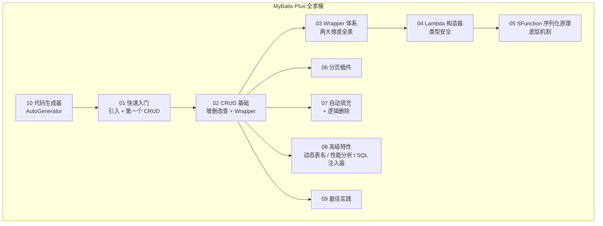

<!--
module:
  parent: spring
  slug: spring/mybatis-plus
  type: article
  category: 主模块子文章
  summary: MyBatis-Plus 全家桶
-->

# 04 MyBatis-Plus 全家桶

> **MyBatis-Plus 全家桶——CRUD、条件构造器、Lambda 链式调用、分页、自动填充、逻辑删除、动态表名、代码生成器。是 Spring Boot 项目的默认增强选择。**

---
## 引言：反直觉代码

04 MyBatis-Plus 全家桶 的关键不是语法——是**看起来对**的代码背后那些'踩坑点'。

本篇用 3 个反直觉片段切入，把面试/生产中常被问起、但一深入就漏馅的点摆出来。

---

## 章节导航

| # | 章节 | 核心问题 | 阅读时长 |
|---|------|---------|---------|
| 01 | [MyBatis-Plus 快速入门](./01-quickstart.md) | MP 是什么 / 如何引入 / 第一个 CRUD | 10 min |
| 02 | [CRUD 与条件构造器基础](./02-crud-basics.md) | 增删改查 + Wrapper 常用方法清单 | 15 min |
| 03 | [Wrapper 体系(两大维度)](./03-wrapper-system.md) | 用途维度 vs 使用方式维度;Query/Update/Lambda 的关系 | 10 min |
| 04 | [Lambda 条件构造器](./04-lambda-wrapper.md) | `User::getName` 替代硬编码字段名 | 5 min |
| 05 | [LambdaQueryWrapper 中的 SFunction 序列化原理](./05-lambda-sfunction-deep-dive.md) | 为什么 Lambda 表达式能被框架解析成字段名 | 15 min |
| 06 | [分页插件](./06-pagination.md) | PaginationInnerInterceptor 配置 + `Page<T>` 使用 | 10 min |
| 07 | [自动填充与逻辑删除](./07-auto-fill-and-logic-delete.md) | createTime/updateTime 自动维护 + 假删除 | 10 min |
| 08 | [高级特性(动态表名 / 性能分析 / SQL 注入器)](./08-advanced-interceptors.md) | 三类 InnerInterceptor 实战 | 15 min |
| 09 | [最佳实践与踩坑](./09-best-practices.md) | 主键策略 / 多租户 / 乐观锁 / Wrapper 使用建议 | 20 min |
| 10 | [代码生成器](./10-code-generator.md) | AutoGenerator 一键生成 Entity/Mapper/Service/Controller | 15 min |

## 知识地图

## 跨主题引用

MyBatis-Plus 是 MyBatis 的增强,与本目录下其他主题紧密相关:

- 需要 MyBatis 基础(Executor / StatementHandler / Plugin / Mapper 代理)?见 [01-architecture](../01-architecture/README.md)
- 需要 MyBatis 扩展机制(自定义拦截器 / 插件签名)再回头理解 MP 的 InnerInterceptor?见 [02-extension](../02-extension/README.md)
- 需要 MyBatis 与 Spring / Spring Boot 整合(MapperScannerRegistrar、SqlSessionFactoryBean 等)?见 [03-spring-integration](../03-spring-integration/README.md)

## 各章节来源标注

每个章节顶部都有 `> 来源:整合自原 08.mybatis/mybatis-plus/...` 行,记录该章节对应的原文件与行范围,便于回溯。

| 章节 | 原文件 | 行范围 |
|------|-------|-------|
| 01-quickstart | `08.mybatis/mybatis-plus/README.md` | L1-79 |
| 02-crud-basics | `08.mybatis/mybatis-plus/README.md` | L83-151 |
| 03-wrapper-system | `08.mybatis/mybatis-plus/Wrapper/README.md` | L1-37(全文) |
| 04-lambda-wrapper | `08.mybatis/mybatis-plus/README.md` | L153-162 |
| 05-lambda-sfunction-deep-dive | `08.mybatis/mybatis-plus/Wrapper/lambdaQueryWrapper-function/README.md` | 全文 |
| 06-pagination | `08.mybatis/mybatis-plus/README.md` | L164-194 |
| 07-auto-fill-and-logic-delete | `08.mybatis/mybatis-plus/README.md` | L196-241 |
| 08-advanced-interceptors | `08.mybatis/mybatis-plus/README.md` | L243-315 |
| 09-best-practices | `08.mybatis/mybatis-plus/README.md` | L317-419 |
| 10-code-generator | `08.mybatis/mybatis-plus/generator/README.md` | L1-152(去重后) |
