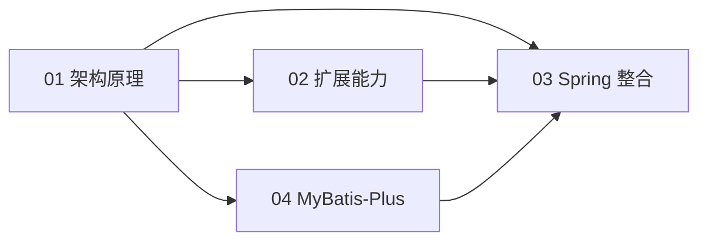

<!--
module:
  parent: spring
  slug: spring/mybatis
  type: article
  category: 主模块子文章
  summary: MyBatis 全栈
-->

# MyBatis 全栈

> 最后更新:2026-06-22
> ⬅️ [返回 03 数据层](../README.md)

> 📐 **结构说明**：本子模块采用 **"4 主题"** 结构（架构 / 扩展 / Spring 整合 / MyBatis-Plus），与同级 `cache/`、`transaction/` 的"扁平结构"不同 —— 这是设计意图，因 MyBatis 内容量大需分主题组织，30 篇文件若平铺不便导航。

---

## 🎯 一句话定位

**MyBatis 全栈 + Spring 整合**——从框架原理(架构/初始化/执行/组件)到扩展能力(类型处理器/拦截器/数据库厂商/存储过程)到 Spring 工程整合(装配/Mapper/事务/多数据源/二级缓存)再到 MyBatis-Plus 全家桶(CRUD/Wrapper/分页/生成器),一站到底。

---

## 📚 主题导航

| 主题 | 目录 | 一句话 | 建议时长 |
|:----:|:----|:-------|:--------:|
| **一、架构与原理** | [01-architecture/](01-architecture/) | MyBatis 框架的内部机制:初始化、执行、组件、SQL、缓存 | 90 min |
| **二、扩展能力** | [02-extension/](02-extension/) | TypeHandler、Interceptor、DatabaseIdProvider、存储过程 | 60 min |
| **三、Spring 整合** | [03-spring-integration/](03-spring-integration/) | Spring 如何接管 SqlSessionFactory、Mapper、事务、多数据源 | 90 min |
| **四、MyBatis-Plus** | [04-mybatis-plus/](04-mybatis-plus/) | MP 增强全家桶:CRUD、Wrapper、分页、代码生成器 | 90 min |

---

## 🧭 学习路线

- **理解 MyBatis 怎么工作的** → 从 [01-architecture/](01-architecture/) 开始
- **要解决 SQL 监控/分页/数据脱敏** → 看 [02-extension/02-interceptor.md](02-extension/02-interceptor.md)
- **Spring Boot 集成 MyBatis** → 直接看 [03-spring-integration/](03-spring-integration/)
- **想用 MyBatis-Plus 省 CRUD 代码** → 直接看 [04-mybatis-plus/](04-mybatis-plus/)

---

## ⚡ 核心概念速查

| 概念 | 一句话 | 主题 |
|:----|:-------|:----:|
| SqlSessionFactory | MyBatis 全局单例,创建 SqlSession | [01](01-architecture/04-core-components.md) |
| Executor | SQL 执行器,Simple/Reuse/Batch/Caching | [01](01-architecture/04-core-components.md) |
| MappedStatement | SQL 元数据封装,namespace.id 唯一 | [01](01-architecture/04-core-components.md) |
| @Intercepts | 拦截器注解,签名 type+method+args | [02](02-extension/02-interceptor.md) |
| SqlSessionFactoryBean | Spring 接管 SqlSessionFactory 的工厂 | [03](03-spring-integration/01-assembly-and-startup.md) |
| @MapperScan | 批量扫描 Mapper 接口的注解 | [03](03-spring-integration/02-mapper-and-boot.md) |
| SpringManagedTransaction | MyBatis 对 Spring 事务的适配器 | [03](03-spring-integration/03-transaction-boundary.md) |
| BaseMapper<T> | MP 的 CRUD 基类,继承即获 17 个方法 | [04](04-mybatis-plus/02-crud-basics.md) |
| LambdaQueryWrapper | 类型安全的链式查询构造器 | [04](04-mybatis-plus/04-lambda-wrapper.md) |

---

## 🤔 思考

1. **MyBatis 的一级缓存为什么默认基于 SqlSession?** 因为 SqlSession 是 JDBC Connection 的封装,一次业务调用内多次查询共享连接语义,缓存粒度天然适配。
2. **拦截器为什么必须是 JDK 动态代理?** MyBatis 不依赖 Spring 的 AOP,需要独立的轻量代理机制,Interceptor + Plugin 自行实现责任链。
3. **Spring 整合后 SqlSession 还需要手动关闭吗?** 不需要。SqlSessionTemplate 通过 TransactionSynchronizationManager 在事务结束时统一释放。
4. **MyBatis-Plus 是不是 Spring 集成的替代品?** 不是。MP 是 MyBatis 自身的增强,仍然通过 mybatis-plus-boot-starter 接入 Spring,事务和 Mapper 扫描都委托给 Spring。

---

## 相关章节

- ⬅️ [返回 03 数据层](../README.md)
- [01-architecture/](01-architecture/) — MyBatis 架构与原理
- [02-extension/](02-extension/) — 扩展能力
- [03-spring-integration/](03-spring-integration/) — Spring 整合
- [04-mybatis-plus/](04-mybatis-plus/) — MyBatis-Plus

---

> 🚀 从 [01-architecture/](01-architecture/) 开始,理解 MyBatis 怎么工作