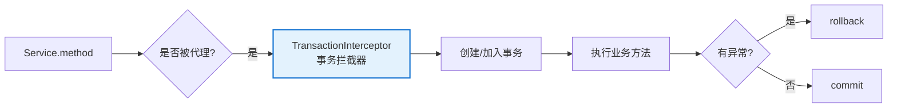
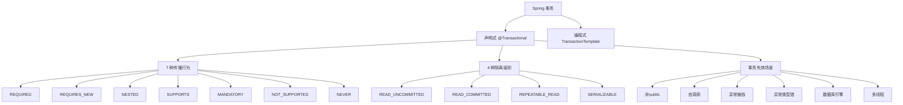

# Spring 事务管理

> 最后更新: 2026-06-14
> ⬅️ [返回 03 数据层](../README.md)

---

## 🎯 一句话定位

**Spring 事务 = 用 @Transactional 让方法在数据库事务中执行**——基于 AOP 实现，支持声明式（非侵入，99% 场景）和编程式（精细控制）两种方式，配合 7 种传播行为和 4 种隔离级别，覆盖所有业务场景。

---

## 📚 章节导航

| 章节 | 核心问题 | 阅读时长 |
|:-----|:---------|:--------:|
| [传播行为与隔离级别](propagation-and-isolation.md) | 7 种传播行为怎么选？4 种隔离级别分别解决什么问题？ | 12 min |
| [事务失效场景](failure-cases.md) | 为什么 @Transactional 不生效？7 大失效场景如何修复？ | 15 min |
| [编程式事务](programmatic-transaction.md) | TransactionTemplate 怎么用？动态回滚、批量处理？ | 12 min |
| [多数据源与 JTA](multi-datasource-and-jta.md) | 多数据源路由？JTA + Atomikos 跨库强一致？ | 15 min |
| [JPA 事务](jpa-transaction.md) | JpaTransactionManager / @Lock / @Version？ | 12 min |

---

## 一、声明式事务 vs 编程式事务

| 维度 | 声明式事务 | 编程式事务 |
|------|----------|----------|
| **实现方式** | 基于 AOP，通过 `@Transactional` 注解 | 通过 `TransactionTemplate` 或 `PlatformTransactionManager` 手动控制 |
| **侵入性** | **非侵入**（业务代码无感知） | 侵入性强 |
| **代码简洁度** | 简洁（一行注解） | 冗长（手动 begin/commit/rollback） |
| **事务传播** | 自动 | 手动 |
| **灵活性** | 一般 | 强（可精细控制） |
| **适用场景** | **90%+ 业务场景** | 复杂业务（批量操作、自定义回滚） |
| **推荐度** | ⭐⭐⭐⭐⭐ | ⭐⭐ |

### 1. 声明式事务（**推荐**）

> 基于 AOP 实现，通过 `@Transactional` 注解配置，**非侵入式**。

```java
@Service
public class UserService {

    @Transactional(propagation = Propagation.REQUIRED, rollbackFor = Exception.class)
    public void updateUser(User user) {
        userRepository.save(user);
    }
}
```

**优点**：
- 代码简洁，配置集中（XML 或注解）
- 支持事务传播行为和隔离级别设置
- 非侵入，业务代码无感知

**适用场景**：90% 以上业务场景，**推荐优先使用**。

### 2. 编程式事务

> 通过 `TransactionTemplate` 或 `PlatformTransactionManager` **手动控制**事务边界。

```java
@Service
public class OrderService {

    @Autowired
    private TransactionTemplate transactionTemplate;

    public void processOrder(Order order) {
        transactionTemplate.execute(status -> {
            try {
                orderRepository.save(order);
                // 业务逻辑
            } catch (Exception e) {
                status.setRollbackOnly();  // 手动回滚
                throw e;
            }
            return null;
        });
    }
}
```

**优点**：
- 灵活控制事务逻辑（嵌套事务、动态回滚）
- 可在事务外做额外操作

**适用场景**：
- 复杂业务逻辑（批量操作）
- 自定义回滚条件
- 需要在事务边界做精细控制

---

## 二、核心 API

### PlatformTransactionManager

> Spring 事务管理的**核心接口**，所有事务管理器都实现这个接口。

```java
public interface PlatformTransactionManager {
    TransactionStatus getTransaction(TransactionDefinition definition) throws TransactionException;
    void commit(TransactionStatus status) throws TransactionException;
    void rollback(TransactionStatus status) throws TransactionException;
}
```

### 常见实现

| 实现 | 适用场景 |
|------|---------|
| `DataSourceTransactionManager` | 单一数据源 JDBC |
| `JpaTransactionManager` | JPA |
| `JtaTransactionManager` | 分布式事务（JTA） |
| `MongoTransactionManager` | MongoDB |
| `RedisTransactionManager` | Redis |

### TransactionDefinition

> 定义事务的属性：**传播行为 + 隔离级别 + 超时 + 只读 + 回滚规则**。

```java
public interface TransactionDefinition {
    int getPropagationBehavior();  // 传播行为
    int getIsolationLevel();       // 隔离级别
    int getTimeout();              // 超时时间（默认 -1，永不超时）
    boolean isReadOnly();          // 是否只读
    String getName();              // 事务名称
}
```

---

## 三、@Transactional 核心参数

```java
@Transactional(
    propagation = Propagation.REQUIRED,        // 传播行为
    isolation = Isolation.READ_COMMITTED,      // 隔离级别
    timeout = 30,                              // 超时时间（秒）
    readOnly = false,                          // 是否只读
    rollbackFor = Exception.class,             // 触发回滚的异常
    noRollbackFor = BusinessException.class,   // 不回滚的异常
    value = "orderTx"                          // 事务管理器名称
)
public void createOrder(Order order) {
    // ...
}
```

| 参数 | 默认值 | 说明 |
|------|--------|------|
| `propagation` | `REQUIRED` | 传播行为（7 种） |
| `isolation` | 数据库默认 | 隔离级别（4 种） |
| `timeout` | `-1`（永不超时） | 事务超时时间（秒） |
| `readOnly` | `false` | 是否只读（true 时优化性能） |
| `rollbackFor` | `RuntimeException`/`Error` | 触发回滚的异常 |
| `noRollbackFor` | 空 | 不触发回滚的异常 |

---

## 四、声明式事务原理



**关键点**：
1. Spring 通过 **TransactionInterceptor**（AOP 切面）拦截 @Transactional 方法
2. 进入方法前：创建或加入事务
3. 方法正常返回：提交事务
4. 方法抛异常：回滚事务（按 rollbackFor 规则）

---

## 五、事务整体知识图谱



---

## 六、最佳实践

1. **优先声明式事务**：减少代码侵入，提升可维护性。
2. **合理选择传播行为和隔离级别**：根据业务需求（性能、一致性）权衡。
3. **避免自调用**：通过代理对象调用事务方法。
4. **异常处理**：明确回滚异常类型（统一 `rollbackFor = Exception.class`），避免捕获后不抛出。
5. **数据库兼容性**：确认数据库支持指定隔离级别和事务特性。
6. **事务粒度**：事务范围**尽量小**（避免大事务，锁资源时间过长）。
7. **只读事务**：查询方法加 `readOnly = true`，性能更好（数据库会做优化）。

```java
// ✅ 只读事务示例
@Transactional(readOnly = true)
public List<User> findAllUsers() {
    return userRepository.findAll();
}
```

---

## 🤔 思考

1. **声明式事务本质是什么？** AOP + ThreadLocal + PlatformTransactionManager。
2. **为什么默认 REQUIRED？** 99% 场景都是"加入现有事务"，符合直觉。
3. **Spring 事务和数据库事务什么关系？** Spring 事务**包装**了数据库事务（JDBC Connection.setAutoCommit(false)）。
4. **事务和锁是什么关系？** 事务的隔离级别通过**锁 + MVCC** 实现。

---

## 相关章节

- ⬅️ [返回 03 数据层](../README.md)
- [传播行为与隔离级别](propagation-and-isolation.md)
- [事务失效场景](failure-cases.md)
- [编程式事务](programmatic-transaction.md) — TransactionTemplate
- [多数据源与 JTA](multi-datasource-and-jta.md)
- [JPA 事务](jpa-transaction.md) — @Lock / @Version
- [分布式事务](distributed/theory-and-patterns.md) — 2PC、3PC、Saga、Seata
- [08 注解/配置注解](../../08-annotations/configuration.md) — @EnableTransactionManagement
