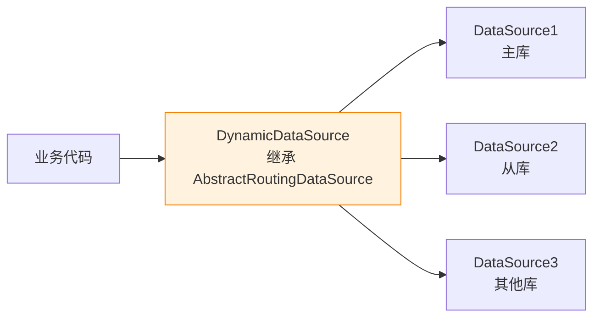

# 多数据源与 JTA 分布式事务

> 最后更新: 2026-06-14
> ⬅️ [返回事务总览](README.md) | [分布式事务](distributed/theory-and-patterns.md)

当一个应用需要访问**多个数据库**（多数据源）时，事务管理变得复杂——单一 `DataSourceTransactionManager` 只能管理一个数据源。本文覆盖**多数据源路由**与 **JTA/XA 分布式事务**两种核心方案。

---

## 🎯 一句话定位

**多数据源**用 `AbstractRoutingDataSource` + `@Primary` 隔离配置；**跨数据源强一致性**用 **JTA + Atomikos/Narayana**（XA 协议），适合金融、订单等强一致场景。多数业务用 Seata TCC/Saga 替代 JTA 更轻量。

---

## 一、多数据源场景与方案

### 1. 常见场景

| 场景 | 描述 |
|------|------|
| **读写分离** | 主库写、从库读（不同 `DataSource`） |
| **业务分库** | 订单库 + 库存库 + 用户库（独立 DB） |
| **多租户 SaaS** | 每租户独立数据库 |
| **数据迁移** | 旧库 → 新库过渡期 |

### 2. 方案对比

| 方案 | 一致性 | 复杂度 | 性能 | 适用 |
|------|:------:|:------:|:----:|------|
| **多 `DataSource` + `@Primary`** | 单数据源内一致 | 低 | 高 | 读写分离 |
| **`AbstractRoutingDataSource`** | 单数据源内一致 | 中 | 高 | 动态切换 |
| **JTA + Atomikos（XA）** | **跨数据源强一致** | 高 | 低 | 金融核心 |
| **Seata AT/TCC** | 最终一致 | 中 | 高 | 微服务跨库 |

---

## 二、多数据源配置（`AbstractRoutingDataSource`）

### 1. 核心思路



### 2. 配置示例

```java
// 1. 自定义路由键（ThreadLocal）
public class DataSourceContextHolder {
    private static final ThreadLocal<String> CONTEXT = new ThreadLocal<>();
    public static void set(String ds) { CONTEXT.set(ds); }
    public static String get() { return CONTEXT.get(); }
    public static void clear() { CONTEXT.remove(); }
}

// 2. 动态数据源
public class DynamicDataSource extends AbstractRoutingDataSource {
    @Override
    protected Object determineCurrentLookupKey() {
        return DataSourceContextHolder.get();  // 从 ThreadLocal 读
    }
}

// 3. 配置类
@Configuration
public class DataSourceConfig {

    @Bean("masterDataSource")
    @Primary  // 标记为主数据源（Bean 冲突时优先）
    public DataSource masterDataSource() {
        return DataSourceBuilder.create()
            .url("jdbc:mysql://localhost:3306/master")
            .username("root")
            .password("123")
            .build();
    }

    @Bean("slaveDataSource")
    public DataSource slaveDataSource() {
        return DataSourceBuilder.create()
            .url("jdbc:mysql://localhost:3306/slave")
            .username("root")
            .password("123")
            .build();
    }

    @Bean
    public DataSource dynamicDataSource(
            @Qualifier("masterDataSource") DataSource master,
            @Qualifier("slaveDataSource") DataSource slave) {
        Map<Object, Object> map = new HashMap<>();
        map.put("master", master);
        map.put("slave", slave);

        DynamicDataSource ds = new DynamicDataSource();
        ds.setTargetDataSources(map);
        ds.setDefaultTargetDataSource(master);
        return ds;
    }
}
```

### 3. 切换数据源（AOP）

```java
@Target(ElementType.METHOD)
@Retention(RetentionPolicy.RUNTIME)
public @interface DataSourceSwitch {
    String value();  // "master" / "slave"
}

@Aspect
@Component
public class DataSourceAspect {
    @Around("@annotation(ds)")
    public Object around(ProceedingJoinPoint pjp, DataSourceSwitch ds) throws Throwable {
        try {
            DataSourceContextHolder.set(ds.value());
            return pjp.proceed();
        } finally {
            DataSourceContextHolder.clear();
        }
    }
}

// 用法
@Service
public class UserService {
    @DataSourceSwitch("master")
    public void save(User user) { ... }

    @DataSourceSwitch("slave")
    public User findById(Long id) { ... }
}
```

---

## 三、多事务管理器

```java
@Configuration
public class TxConfig {

    @Bean("masterTxManager")
    public PlatformTransactionManager masterTxManager(
            @Qualifier("masterDataSource") DataSource ds) {
        return new DataSourceTransactionManager(ds);
    }

    @Bean("slaveTxManager")
    public PlatformTransactionManager slaveTxManager(
            @Qualifier("slaveDataSource") DataSource ds) {
        return new DataSourceTransactionManager(ds);
    }

    // 指定使用哪个事务管理器
    @Bean
    @Primary
    public PlatformTransactionManager txManager(
            @Qualifier("masterDataSource") DataSource ds) {
        return new DataSourceTransactionManager(ds);
    }
}

// 用法
@Transactional("masterTxManager")
public void saveMaster() { ... }

@Transactional("slaveTxManager")
public void updateSlave() { ... }
```

> 📌 单一事务管理器只能管一个数据源。跨数据源事务需用 **JTA**（下文）。

---

## 四、JTA 分布式事务（XA 协议）

### 1. 什么是 JTA / XA

| 概念 | 说明 |
|------|------|
| **JTA** | Java Transaction API，`JtaTransactionManager` 是 Spring 入口 |
| **XA 协议** | 分布式事务标准协议，由 X/Open 定义（基于 2PC） |
| **两阶段提交（2PC）** | 准备阶段（所有 RM 锁资源） + 提交阶段（统一 commit/rollback） |

### 2. 引入 Atomikos

```xml
<dependency>
    <groupId>org.springframework.boot</groupId>
    <artifactId>spring-boot-starter-jta-atomikos</artifactId>
</dependency>
```

### 3. 配置多 XA 数据源

```java
@Configuration
public class JTAMultiDataSourceConfig {

    @Bean(initMethod = "init", destroyMethod = "shutdown")
    public AtomikosDataSourceBean orderDataSource() {
        AtomikosDataSourceBean ds = new AtomikosDataSourceBean();
        ds.setUniqueResourceName("orderDs");
        ds.setXaDataSourceClassName("com.mysql.cj.jdbc.MysqlXADataSource");
        ds.setXaProperties(xaProps("jdbc:mysql://localhost:3306/order"));
        ds.setMaxPoolSize(20);
        return ds;
    }

    @Bean(initMethod = "init", destroyMethod = "shutdown")
    public AtomikosDataSourceBean stockDataSource() {
        AtomikosDataSourceBean ds = new AtomikosDataSourceBean();
        ds.setUniqueResourceName("stockDs");
        ds.setXaDataSourceClassName("com.mysql.cj.jdbc.MysqlXADataSource");
        ds.setXaProperties(xaProps("jdbc:mysql://localhost:3306/stock"));
        return ds;
    }

    @Bean
    public PlatformTransactionManager transactionManager() {
        return new JtaTransactionManager();  // 接管所有 XA 数据源
    }

    private Properties xaProps(String url) {
        Properties p = new Properties();
        p.setProperty("url", url);
        p.setProperty("user", "root");
        p.setProperty("password", "123");
        return p;
    }
}
```

### 4. 使用（与 `@Transactional` 一样）

```java
@Service
public class OrderService {

    @Transactional  // JTA 事务：跨 orderDs + stockDs 一致提交/回滚
    public void createOrder(Order order) {
        orderRepository.save(order);   // orderDs
        stockRepository.decrease(order.getSkuId(), order.getQty());  // stockDs
        // 任一失败 → 全局回滚（XA 协议保证）
    }
}
```

---

## 五、JTA 优缺点

| 优点 | 缺点 |
|------|------|
| ✅ 跨数据源**强一致性** | ❌ 性能低（2PC 多次网络往返） |
| ✅ 与 `@Transactional` 无缝集成 | ❌ 需数据库支持 XA 协议 |
| ✅ 成熟方案（银行核心系统常用） | ❌ 协调器单点风险 |
| ✅ Atomikos / Narayana 嵌入部署 | ❌ 长事务导致锁竞争 |

---

## 六、选型建议

| 场景 | 推荐方案 |
|------|---------|
| 单 DB + 读写分离 | 多 `DataSource` + `@Primary` |
| 业务分库 + 一致性要求**不高** | `AbstractRoutingDataSource` + 业务最终一致 |
| **跨库强一致**（金融、订单） | JTA + Atomikos（XA） |
| 微服务架构 + 跨服务 | **Seata AT/TCC/Saga**（推荐） |
| 异步解耦 | 本地消息表 + MQ |

> 📌 **现代微服务架构推荐 Seata 而不是 JTA**——JTA 性能瓶颈明显，Seata AT 模式对业务无侵入且性能接近本地事务。

---

## 🤔 思考

1. **为什么多数据源用 `AbstractRoutingDataSource`？** 它动态查表决定用哪个真实数据源，ThreadLocal 持有路由键。
2. **JTA 为什么慢？** 2PC 至少 2 次网络往返 + 数据库锁持有时间长。
3. **Seata 和 JTA 区别？** Seata 是应用层协议（AT 基于 SQL 解析），JTA 是数据库层（XA 协议）；Seata 性能更好，JTA 更"通用"。
4. **`@Primary` 冲突怎么办？** 多数据源必须有一个 `@Primary`，或在注入时用 `@Qualifier` 指定。

---

## 相关章节

- ⬅️ [返回事务总览](README.md)
- [分布式事务](distributed/theory-and-patterns.md) — 2PC/3PC/TCC/Saga 理论
- [Seata](distributed/seata.md) — 现代分布式事务方案