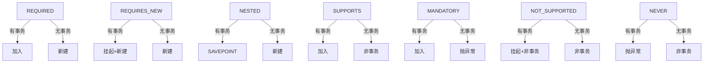
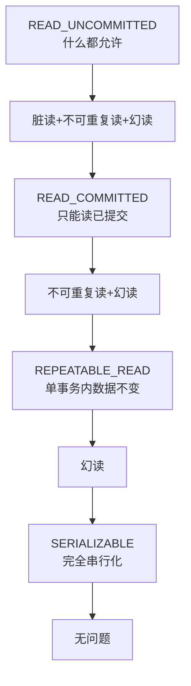

# 事务传播行为与隔离级别

> 最后更新: 2026-06-09
> ⬅️ [返回事务总览](README.md) | [事务失效场景](failure-cases.md)

事务的**传播行为（propagation）** 解决"事务嵌套"问题——方法 A 调用方法 B 时，B 应该加入 A 的事务还是新建事务？事务的**隔离级别（isolation）** 解决"并发数据一致性问题"——脏读、不可重复读、幻读。

---

## 🎯 一句话定位

**传播行为 = 事务嵌套规则**（7 种），**隔离级别 = 并发安全等级**（4 种）。90% 场景用 `REQUIRED`（默认）+ `READ_COMMITTED`（MySQL InnoDB 默认）即可。

---

## 一、7 种传播行为

> Spring 定义 7 种传播行为，核心解决"事务嵌套"问题：方法 A 调用方法 B 时，B 应该加入 A 的事务还是新建事务？

| 行为 | 描述 | 适用场景 |
|------|------|----------|
| `REQUIRED`（**默认**） | 加入现有事务或新建事务 | 大多数业务方法 |
| `REQUIRES_NEW` | 总是新建独立事务，**挂起**当前事务 | 日志记录、审计（独立提交） |
| `NESTED` | 嵌套事务（依赖保存点），支持部分回滚 | 复杂业务部分回滚（需数据库支持保存点） |
| `SUPPORTS` | 存在事务则加入，无则非事务执行 | 查询方法 |
| `MANDATORY` | 必须存在事务，否则抛异常 | 强制事务方法 |
| `NOT_SUPPORTED` | 非事务执行，挂起当前事务 | 长时间非事务操作 |
| `NEVER` | 非事务执行，存在事务则抛异常 | 禁止事务场景 |

### 1. REQUIRED（默认 — 最常用）

> **加入现有事务或新建事务**。99% 的场景用这个。

```java
@Service
public class OrderService {

    @Transactional(propagation = Propagation.REQUIRED)  // 默认
    public void createOrder() {
        orderRepository.save(order);   // 同一事务
        paymentService.process();       // 同一事务
    }
}
```

**行为**：
- 无事务 → 新建事务
- 有事务 → **加入**（不新建）
- 任一方法抛异常 → **全部回滚**

### 2. REQUIRES_NEW（独立事务）

> **总是新建独立事务，**挂起**当前事务**。最常见的用途是**日志记录**——不管主业务成功失败，日志都要入库。

```java
@Service
public class OrderService {

    @Autowired
    private LogService logService;

    @Transactional
    public void createOrder() {
        orderRepository.save(order);

        // 无论主事务成功失败，日志都要入库
        logService.logOperation("订单创建");

        // ...后续业务
    }
}

@Service
public class LogService {

    @Transactional(propagation = Propagation.REQUIRES_NEW)  // 独立事务
    public void logOperation(String message) {
        logRepository.save(new Log(message));  // 立即提交，不受主事务影响
    }
}
```

**行为**：
- **总是新建**独立事务
- 当前事务被**挂起**（不阻塞）
- 新事务**独立提交/回滚**
- 主事务回滚**不影响**新事务

### 3. NESTED（嵌套事务）

> **嵌套事务**（依赖保存点），支持**部分回滚**。需要数据库支持 savepoint。

```java
@Service
public class OrderService {

    @Transactional
    public void createOrder() {
        orderRepository.save(order);

        try {
            inventoryService.decrease();  // 嵌套事务
        } catch (InsufficientStockException e) {
            // 库存扣减失败，触发嵌套事务回滚
            // 但订单可以保留在 SAVEPOINT
        }
    }
}

@Service
public class InventoryService {

    @Transactional(propagation = Propagation.NESTED)
    public void decrease() {
        inventoryRepository.decrease();
    }
}
```

**行为**：
- 当前有事务 → 创建**嵌套事务**（SAVEPOINT）
- 嵌套事务回滚**不影响**主事务
- 主事务回滚**影响**嵌套事务

### 4. SUPPORTS / MANDATORY / NOT_SUPPORTED / NEVER

```java
// SUPPORTS: 有事务就加入，没有就非事务执行
@Transactional(propagation = Propagation.SUPPORTS)
public User findUser(Long id) {  // 查询方法
    return userRepository.findById(id);
}

// MANDATORY: 必须有事务，没有就抛异常
@Transactional(propagation = Propagation.MANDATORY)
public void mustInTx() {
    // 调用方必须先开事务
}

// NOT_SUPPORTED: 非事务执行（挂起当前事务）
@Transactional(propagation = Propagation.NOT_SUPPORTED)
public void longRunningNoTx() {
    // 长时间操作，不需要事务
}

// NEVER: 必须在非事务环境执行
@Transactional(propagation = Propagation.NEVER)
public void mustNotInTx() {
    // 强制不能有事务
}
```

### 5. 7 种传播行为速查



---

## 二、4 种隔离级别

> 隔离级别解决"并发数据一致性问题"：脏读、不可重复读、幻读。

| 隔离级别 | 脏读 | 不可重复读 | 幻读 | 性能 | 适用场景 |
|---------|:----:|:--------:|:---:|:----:|----------|
| `READ_UNCOMMITTED` | ✔️ | ✔️ | ✔️ | 最高 | 对一致性要求低 |
| `READ_COMMITTED`（**Oracle 默认**） | ❌ | ✔️ | ✔️ | 中 | 避免脏读 |
| `REPEATABLE_READ`（**MySQL InnoDB 默认**） | ❌ | ❌ | ✔️ | 中 | 避免脏读和不可重复读 |
| `SERIALIZABLE` | ❌ | ❌ | ❌ | 最低 | 强一致性（如金融） |

### 问题说明

| 问题 | 含义 | 示例 |
|------|------|------|
| **脏读** | 读取未提交数据 | 事务 A 修改数据未提交，事务 B 读到了（可能 A 回滚，B 读到无效数据） |
| **不可重复读** | 同一事务内多次读取同一数据结果不一致 | 事务 A 读 X=1，事务 B 改 X=2 并提交，事务 A 再读 X=2 |
| **幻读** | 范围查询结果因其他事务插入/删除而变化 | 事务 A 查 count=10，事务 B 插入新行，事务 A 再查 count=11 |

### 配置示例

```java
@Transactional(isolation = Isolation.READ_COMMITTED)
public void updateBalance(Account account) {
    // 业务逻辑
}
```

### 4 种隔离级别可视化



---

## 三、传播行为 vs 隔离级别

| 维度 | 传播行为 | 隔离级别 |
|------|---------|---------|
| **解决什么问题** | 事务嵌套规则 | 并发数据一致性 |
| **影响范围** | 方法调用链 | 事务内数据可见性 |
| **使用频率** | 5%-10% 的方法需要特殊传播 | 99% 用默认即可 |
| **复杂程度** | 复杂（7 种） | 简单（4 种） |

> 📌 **最佳实践**：传播行为用 `REQUIRED`（默认），隔离级别用数据库默认（MySQL InnoDB 用 `REPEATABLE_READ`）。

---

## 🤔 思考

1. **REQUIRES_NEW 为什么要挂起当前事务？** 因为数据库连接绑定在事务上，挂起 = 释放连接，新事务获取新连接。
2. **NESTED 和 REQUIRES_NEW 区别？** NESTED 是 SAVEPOINT（部分回滚），主事务回滚会连带回滚；REQUIRES_NEW 是完全独立。
3. **READ_COMMITTED 会有不可重复读吗？** 会，因为同事务内两次读之间，其他事务可能修改并提交。
4. **为什么默认 REPEATABLE_READ？** MySQL InnoDB 通过 MVCC + 间隙锁在 REPEATABLE_READ 下也基本避免了幻读。

---

## 相关章节

- ⬅️ [返回事务总览](README.md)
- [事务失效场景](failure-cases.md) — 7 大常见失效陷阱
- [03 数据层/分布式事务](distributed/theory-and-patterns.md) — Seata、2PC、3PC、Saga
- [08 注解/事务注解](../../08-annotations/configuration.md) — @Transactional
