# 04 Spring Boot

> 最后更新: 2026-06-09
> ⬅️ [返回 Spring 顶层](../README.md)

---

## 🎯 一句话定位

**Spring Boot = Spring + 约定优于配置 + 生产级特性（健康检查/外部化配置/指标）**——它不重新发明轮子，而是让 Spring 更易用、更适合云原生部署。

---

## 📚 章节导航

| 章节 | 文件 | 核心问题 | 建议时长 |
|:----:|:----|:---------|:--------:|
| **自动配置原理** | ⭐待补充 (P3) | `@SpringBootApplication` 背后做了什么？ | 25 min |
| **Starter 机制** | ⭐待补充 (P3) | 怎么理解 spring-boot-starter-* 的设计？ | 15 min |
| **自定义 Starter** | [custom-starter.md](custom-starter.md) | 如何封装自己的 Starter？ | 25 min |
| **spring.factories 迁移** | [spring-factories-migration.md](spring-factories-migration.md) | Spring Boot 2.x → 3.x 自动配置机制变化 | 20 min |
| **启动流程** | [application-bootstrap.md](application-bootstrap.md) | Spring Boot 启动时执行什么？5 种初始化方式 | 20 min |
| **外部化配置** | ⭐待补充 (P3) | application.yml 的加载顺序、Profile 多环境 | 20 min |

---

## 🧭 知识地图

```mermaid
graph TB
    B[Spring Boot]
    
    B --> A1[自动配置]
    B --> A2[Starter 机制]
    B --> A3[启动流程]
    B --> A4[外部化配置]
    B --> A5[生产级特性]
    
    A1 --> A1a["@SpringBootApplication"]
    A1 --> A1b["@EnableAutoConfiguration"]
    A1 --> A1c["AutoConfiguration.imports"]
    A1 --> A1d["spring.factories 2.x"]
    
    A2 --> A2a["依赖聚合"]
    A2 --> A2b["自动配置类"]
    A2 --> A2c["自定义 Starter"]
    
    A3 --> A3a["SpringApplication.run"]
    A3 --> A3b["ApplicationContext 刷新"]
    A3 --> A3c["CommandLineRunner"]
    A3 --> A3d["ApplicationReadyEvent"]
    
    A4 --> A4a["application.yml"]
    A4 --> A4b["@Value"]
    A4 --> A4c["@ConfigurationProperties"]
    A4 --> A4d["Profile 多环境"]
    
    A5 --> A5a["Actuator 健康检查"]
    A5 --> A5b["外部化配置"]
    A5 --> A5c["日志/指标"]
    
    classDef root fill:#e3f2fd,stroke:#1976d2,stroke-width:2px
    classDef leaf fill:#fff3e0,stroke:#f57c00
    class B root
    class A1,A2,A3,A4,A5,A1a,A1b,A1c,A1d,A2a,A2b,A2c,A3a,A3b,A3c,A3d,A4a,A4b,A4c,A4d,A5a,A5b,A5c leaf
```

---

## ⚡ 核心概念速查

| 概念 | 一句话定义 | 章节 |
|------|----------|:----:|
| **@SpringBootApplication** | `@Configuration + @EnableAutoConfiguration + @ComponentScan` 的合集 | [自动配置](custom-starter.md) |
| **@EnableAutoConfiguration** | 启用自动配置机制，根据 classpath 推断配置 | [迁移](spring-factories-migration.md) |
| **AutoConfiguration.imports** | Spring Boot 3.x 的自动配置声明文件（替代 spring.factories） | [迁移](spring-factories-migration.md) |
| **Starter** | 依赖 + 自动配置的聚合包（如 spring-boot-starter-web） | [自定义](custom-starter.md) |
| **spring.factories** | Spring Boot 2.x 的 SPI 机制（已被替代） | [迁移](spring-factories-migration.md) |
| **@PostConstruct** | Bean 初始化时执行的方法 | [启动](application-bootstrap.md) |
| **ApplicationRunner** | 启动完成后执行的回调（可访问命令行参数） | [启动](application-bootstrap.md) |
| **ApplicationReadyEvent** | 应用完全就绪事件（内嵌服务器已启动） | [启动](application-bootstrap.md) |

---

## 🤔 思考

1. **Spring Boot 怎么知道该配置什么？** 通过 `@ConditionalOnClass`、`@ConditionalOnMissingBean` 等条件注解按需装配。
2. **Starter 命名规范？** 官方 `spring-boot-starter-*`、第三方 `*-spring-boot-starter`。
3. **为什么我的 @Component 没被扫描？** 检查包路径是否在 `@SpringBootApplication` 子包下，或显式声明 `@ComponentScan`。
4. **Spring Boot 2.x 和 3.x 核心差异？** Java 17+、jakarta.* 命名空间、AutoConfiguration.imports 替代 spring.factories。

---

## 相关章节

- ⬅️ [返回 Spring 顶层](../README.md)
- ⬅️ [01 核心容器](../01-core/README.md) — Spring Boot 基于核心容器
- ⬅️ [02 Web 层](../02-web/README.md) — spring-boot-starter-web 集成 MVC
- ➡️ [05 Spring Cloud](../05-spring-cloud/README.md) — Spring Cloud 基于 Spring Boot
- ➡️ [07 可观测性](../07-observability/README.md) — Actuator 是 Boot 的核心生产特性

---

> 🚀 从 [自定义 Starter](custom-starter.md) 开始
