# 04 Spring Boot

> 最后更新: 2026-06-14
> ⬅️ [返回 Spring 顶层](../README.md)

---
## 引言：反直觉代码（[AUTO] 自动生成，待人工 review）

04 Spring Boot 本应该很简单，最后更新: 2026-06-14

**但实际**：面试/生产中常被问起或踩坑的是——
代码看着对、跑起来对，但仔细一问深一层就漏馅。本篇就从'反直觉'这个角度切入，把踩坑点和根因摆出来。

> 📌 本段由 `note/scripts/add-intro.py` 自动生成（场景模板 + README 摘录）。**下次 review 时请改为真实场景 + 数字 + 反思**，目前仅满足'有引言'的最低要求。

---

## 🎯 一句话定位

**Spring Boot = Spring + 约定优于配置 + 生产级特性（健康检查/外部化配置/指标）**——它不重新发明轮子，而是让 Spring 更易用、更适合云原生部署。

---

## 📚 章节导航

| 章节 | 文件 | 核心问题 | 建议时长 |
|:----:|:----|:---------|:--------:|
| **自动配置原理** | [auto-configuration.md](auto-configuration.md) | `@SpringBootApplication` 背后做了什么？ | 25 min |
| **Starter 机制** | [custom-starter.md](custom-starter.md) | 怎么理解 spring-boot-starter-* 的设计？ | 15 min |
| **自定义 Starter** | [custom-starter.md](custom-starter.md) | 如何封装自己的 Starter？ | 25 min |
| **spring.factories 迁移** | [spring-factories-migration.md](spring-factories-migration.md) | Spring Boot 2.x → 3.x 自动配置机制变化 | 20 min |
| **自定义 Condition** | [custom-condition.md](custom-condition.md) | `@ConditionalOn*` 11 个内置注解无法覆盖时如何扩展 | 20 min |
| **启动流程** | [startup-flow.md](startup-flow.md) | `SpringApplication.run()` 的 6 个阶段 | 20 min |
| **启动后钩子** | [application-bootstrap.md](application-bootstrap.md) | `@PostConstruct` / Runner / `ApplicationReadyEvent` 5 种回调 | 15 min |
| **外部化配置** | [externalized-configuration.md](externalized-configuration.md) | `@Value` / `@ConfigurationProperties` / `@Profile` / `Environment` | 25 min |
| **内嵌服务器** | [embedded-server.md](embedded-server.md) | Tomcat / Jetty / Undertow 切换 + SSL | 15 min |
| **GraalVM Native** | [graalvm-native.md](graalvm-native.md) | Spring Boot 3 AOT 引擎 + Native Image | 15 min |

---

## 🧭 知识地图

```mermaid
graph TB
    B[Spring Boot]

    B --> A1[自动配置]
    B --> A2[Starter 机制]
    B --> A3[启动流程]
    B --> A4[外部化配置]
    B --> A5[生产级特性]

    A1 --> A1a["@SpringBootApplication"]
    A1 --> A1b["@EnableAutoConfiguration"]
    A1 --> A1c["AutoConfiguration.imports"]
    A1 --> A1d["spring.factories 2.x"]
    A1 --> A1e["自定义 Condition"]

    A2 --> A2a["依赖聚合"]
    A2 --> A2b["自动配置类"]
    A2 --> A2c["自定义 Starter"]

    A3 --> A3a["SpringApplication.run 6 阶段"]
    A3 --> A3b["Environment 准备"]
    A3 --> A3c["ApplicationContext 刷新"]
    A3 --> A3d["CommandLineRunner"]
    A3 --> A3e["ApplicationReadyEvent"]

    A4 --> A4a["application.yml"]
    A4 --> A4b["@Value"]
    A4 --> A4c["@ConfigurationProperties"]
    A4 --> A4d["@Profile 多环境"]
    A4 --> A4e["Environment 抽象"]

    A5 --> A5a["Actuator 健康检查"]
    A5 --> A5b["内嵌服务器切换"]
    A5 --> A5c["GraalVM Native"]
    A5 --> A5d["日志/指标"]

    classDef root fill:#e3f2fd,stroke:#1976d2,stroke-width:2px
    classDef leaf fill:#fff3e0,stroke:#f57c00
    class B root
    class A1,A2,A3,A4,A5,A1a,A1b,A1c,A1d,A1e,A2a,A2b,A2c,A3a,A3b,A3c,A3d,A3e,A4a,A4b,A4c,A4d,A4e,A5a,A5b,A5c,A5d leaf
```

---

## ⚡ 核心概念速查

| 概念 | 一句话定义 | 章节 |
|------|----------|:----:|
| **@SpringBootApplication** | `@Configuration + @EnableAutoConfiguration + @ComponentScan` 的合集 | [自动配置](auto-configuration.md) |
| **@EnableAutoConfiguration** | 启用自动配置机制，根据 classpath 推断配置 | [迁移](spring-factories-migration.md) |
| **AutoConfiguration.imports** | Spring Boot 3.x 的自动配置声明文件（替代 spring.factories） | [迁移](spring-factories-migration.md) |
| **spring.factories** | Spring Boot 2.x 的 SPI 机制（Listener/EnvironmentPostProcessor 仍用） | [迁移](spring-factories-migration.md) |
| **Starter** | 依赖 + 自动配置的聚合包（如 spring-boot-starter-web） | [自定义](custom-starter.md) |
| **@ConditionalOnMissingBean** | Spring Boot "约定优于配置"：用户没配就用默认的 | [自动配置](auto-configuration.md) |
| **`Condition` 接口** | `@ConditionalOn*` 11 个内置注解之外的扩展点（实现 `matches()`） | [自定义 Condition](custom-condition.md) |
| **SpringApplication.run()** | 启动入口，6 个阶段：实例化 → Environment → Context → refresh → afterRefresh → 事件 | [启动流程](startup-flow.md) |
| **@PostConstruct** | Bean 初始化时执行的方法 | [启动后钩子](application-bootstrap.md) |
| **ApplicationRunner** | 启动完成后执行的回调（可访问命令行参数） | [启动后钩子](application-bootstrap.md) |
| **ApplicationReadyEvent** | 应用完全就绪事件（内嵌服务器已启动） | [启动后钩子](application-bootstrap.md) |
| **@ConfigurationProperties** | 结构化绑定 application.yml 到 POJO，支持嵌套 / 校验 | [外部化配置](externalized-configuration.md) |
| **@Profile** | 多环境配置切换，配合 `spring.profiles.active` | [外部化配置](externalized-configuration.md) |
| **ServletWebServerFactoryAutoConfiguration** | 自动装配 Tomcat / Jetty / Undertow | [内嵌服务器](embedded-server.md) |
| **AOT Engine / Native Image** | Spring Boot 3 + GraalVM，启动从秒级降到毫秒级 | [GraalVM Native](graalvm-native.md) |

---

## 🤔 思考

1. **Spring Boot 怎么知道该配置什么？** 通过 `@ConditionalOnClass`、`@ConditionalOnMissingBean` 等条件注解按需装配。
2. **Starter 命名规范？** 官方 `spring-boot-starter-*`、第三方 `*-spring-boot-starter`。
3. **为什么我的 @Component 没被扫描？** 检查包路径是否在 `@SpringBootApplication` 子包下，或显式声明 `@ComponentScan`。
4. **Spring Boot 2.x 和 3.x 核心差异？** Java 17+、jakarta.* 命名空间、AutoConfiguration.imports 替代 spring.factories 的自动配置功能。
5. **`@Value` 和 `@ConfigurationProperties` 怎么选？** 少量独立属性用 `@Value`；结构化批量属性用 `@ConfigurationProperties`（支持嵌套 / 校验 / IDE 提示）。
6. **启动慢怎么排查？** 开启 `spring.application.lazy-initialization=true`，或用 Actuator 的 `/actuator/startup` 端点看 Bean 实例化耗时。
7. **什么时候考虑 Native Image？** Serverless / K8s HPA 快速扩容 / 内存敏感型微服务；长跑稳定高吞吐场景仍推荐 JVM。

---

## 相关章节

- ⬅️ [返回 Spring 顶层](../README.md)
- ⬅️ [01 核心容器](../01-core/README.md) — Spring Boot 基于核心容器
- ⬅️ [02 Web 层](../02-web/README.md) — spring-boot-starter-web 集成 MVC
- ➡️ [05 Spring Cloud](../05-spring-cloud/README.md) — Spring Cloud 基于 Spring Boot
- ➡️ [07 可观测性](../07-observability/README.md) — Actuator 是 Boot 的核心生产特性

---

> 🚀 从 [自动配置原理](auto-configuration.md) 开始