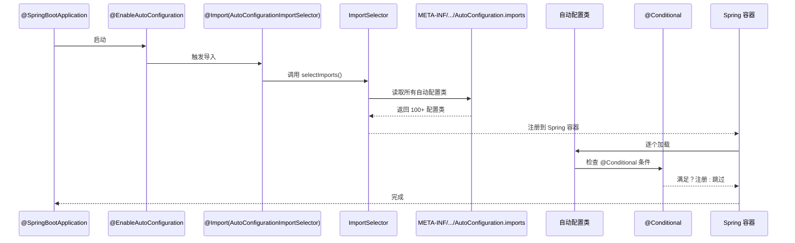
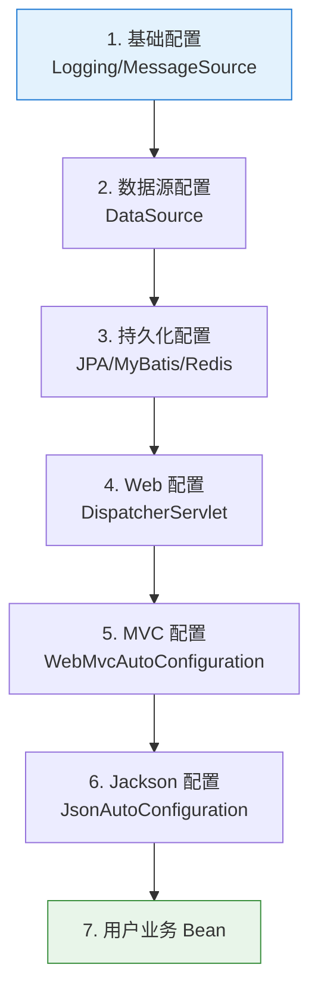

# Spring Boot 自动配置原理

> ⬅️ [返回 04 Spring Boot](README.md) | [自定义 Starter](custom-starter.md) | [自定义 Condition](custom-condition.md) | [spring.factories 迁移](spring-factories-migration.md)

Spring Boot 最核心的特性是**自动配置**（Auto-Configuration）："**约定优于配置**"——根据 classpath 下的依赖**自动装配** Bean，而不是手动写 @Configuration。本文深入剖析自动配置的工作机制。

---

## 🎯 一句话定位

**Spring Boot 自动配置 = "@SpringBootApplication + spring.factories/AutoConfiguration.imports + @Conditional" 三件套**——通过 `@EnableAutoConfiguration` 导入 `META-INF/spring/...AutoConfiguration.imports`（或 2.x 的 spring.factories）列出的所有自动配置类，每个自动配置类用 `@ConditionalOn*` 按需生效。

---

## 一、从一个例子开始

```java
@SpringBootApplication
public class MyApp {
    public static void main(String[] args) {
        SpringApplication.run(MyApp.class, args);
    }
}
```

仅仅这一行 `@SpringBootApplication`，Spring Boot 就自动配置了：
- 内嵌 Tomcat（因为 classpath 有 spring-boot-starter-web）
- Spring MVC（DispatcherServlet、HandlerMapping 等 9 大组件）
- JSON 序列化（Jackson，因为 classpath 有 jackson-databind）
- 字符编码 Filter（UTF-8）

> 📌 **没有一行 XML，没有一行 Java Config**——这就是"约定优于配置"的威力。

---

## 二、@SpringBootApplication 三件套

```java
@Target(ElementType.TYPE)
@Retention(RetentionPolicy.RUNTIME)
@Documented
@Inherited
@SpringBootConfiguration        // ① 声明这是 Spring Boot 配置类
@EnableAutoConfiguration        // ② 启用自动配置（核心）
@ComponentScan(                // ③ 组件扫描
    excludeFilters = {
        @Filter(type = FilterType.CUSTOM, classes = TypeExcludeFilter.class),
        @Filter(type = FilterType.CUSTOM, classes = AutoConfigurationExcludeFilter.class)
    }
)
public @interface SpringBootApplication { ... }
```

### 拆解后等价于

```java
@SpringBootConfiguration
@EnableAutoConfiguration
@ComponentScan("com.example.myapp")
public class MyApp {
    public static void main(String[] args) {
        SpringApplication.run(MyApp.class, args);
    }
}
```

---

## 三、自动配置工作流程



### 3 个关键阶段

| 阶段 | 触发 | 作用 |
|------|------|------|
| **1. 启用** | `@EnableAutoConfiguration` | 触发自动配置导入 |
| **2. 加载** | `AutoConfigurationImportSelector` | 读取 `AutoConfiguration.imports` / `spring.factories` |
| **3. 装配** | `@ConditionalOn*` | 按需注册 Bean |

---

## 四、AutoConfiguration.imports（Spring Boot 3.x）

> Spring Boot 3.x **弃用** `spring.factories`，改用专用文件 `AutoConfiguration.imports`（路径：`META-INF/spring/org.springframework.boot.autoconfigure.AutoConfiguration.imports`）。

### 文件内容（每行一个配置类全限定名）

```text
# META-INF/spring/org.springframework.boot.autoconfigure.AutoConfiguration.imports
org.springframework.boot.autoconfigure.web.servlet.WebMvcAutoConfiguration
org.springframework.boot.autoconfigure.jdbc.DataSourceAutoConfiguration
org.springframework.boot.autoconfigure.orm.jpa.HibernateJpaAutoConfiguration
org.springframework.boot.autoconfigure.data.redis.RedisAutoConfiguration
```

### 与 spring.factories 的区别

| 特性 | AutoConfiguration.imports（3.x） | spring.factories（2.x） |
|------|---------------------------------|-----------------------|
| **文件路径** | `META-INF/spring/...` | `META-INF/spring.factories` |
| **文件格式** | 纯列表（每行一个类） | `key=value` 格式 |
| **专用性** | **仅用于自动配置** | 多功能（Listener、EnvironmentPostProcessor 等） |
| **加载方式** | `AutoConfigurationImportSelector` | `SpringFactoriesLoader` |
| **推荐度** | ⭐⭐⭐⭐⭐（新项目） | ⚠️ 维护中，新项目用前者 |

详见 [spring.factories 迁移](spring-factories-migration.md)

---

## 五、@Conditional 按需装配

> 自动配置类的**核心思想**——"满足条件才生效"。Spring Boot 提供 10+ 个 `@ConditionalOn*` 注解。

### 常用条件注解

| 注解 | 触发条件 |
|------|---------|
| `@ConditionalOnBean` | 当某个特定的 Bean **存在**时，配置生效 |
| `@ConditionalOnMissingBean` | 当某个特定的 Bean **不存在**时，配置生效 |
| `@ConditionalOnClass` | 当 Classpath 里**存在**指定的类，配置生效 |
| `@ConditionalOnMissingClass` | 当 Classpath 里**不存在**指定的类，配置生效 |
| `@ConditionalOnExpression` | 当给定的 SpEL 表达式计算结果为 true |
| `@ConditionalOnProperty` | 当指定的配置属性匹配 |
| `@ConditionalOnResource` | 当指定的资源文件存在 |
| `@ConditionalOnWebApplication` | 当应用是 Web 应用 |
| `@ConditionalOnNotWebApplication` | 当应用不是 Web 应用 |
| `@ConditionalOnJava` | 当 JVM 版本匹配 |
| `@ConditionalOnSingleCandidate` | 当某个 Bean 是单一候选者 |

### 经典案例：JdbcTemplateAutoConfiguration

```java
@AutoConfiguration
@ConditionalOnClass({ DataSource.class, JdbcTemplate.class })
@ConditionalOnSingleCandidate(DataSource.class)
@ConditionalOnMissingBean(JdbcOperations.class)
@EnableConfigurationProperties(JdbcProperties.class)
@Import({ DatabaseInitializationDependencyConfigurer.class,
         JdbcTemplateConfiguration.class,
         NamedParameterJdbcTemplateConfiguration.class })
public class JdbcTemplateAutoConfiguration {

    @Bean
    @Primary
    JdbcTemplate jdbcTemplate(DataSource dataSource, JdbcProperties properties) {
        JdbcTemplate jdbcTemplate = new JdbcTemplate(dataSource);
        JdbcProperties.Template template = properties.getTemplate();
        jdbcTemplate.setFetchSize(template.getFetchSize());
        jdbcTemplate.setMaxRows(template.getMaxRows());
        // ...
        return jdbcTemplate;
    }
}
```

**解读**：
- `@ConditionalOnClass` — classpath 有 DataSource + JdbcTemplate
- `@ConditionalOnSingleCandidate(DataSource.class)` — 容器中有且只有一个 DataSource
- `@ConditionalOnMissingBean(JdbcOperations.class)` — 用户没有自定义 JdbcOperations
- ✅ **满足所有条件** → 自动配置 JdbcTemplate Bean

---

## 六、自动配置的执行顺序

Spring Boot 按**特定顺序**加载自动配置类（通过 `@AutoConfigureOrder` 或 `@AutoConfigureBefore/After`）。



> 📌 **顺序保证**：数据源必须在持久化前配置；Web 必须在 MVC 前配置。

---

## 七、排除自动配置

### 方式 1：注解参数

```java
@SpringBootApplication(exclude = {
    SecurityAutoConfiguration.class,
    RedisAutoConfiguration.class
})
public class MyApp { ... }
```

### 方式 2：配置文件

```yaml
spring:
  autoconfigure:
    exclude:
      - org.springframework.boot.autoconfigure.security.servlet.SecurityAutoConfiguration
      - org.springframework.boot.autoconfigure.data.redis.RedisAutoConfiguration
```

### 方式 3：按条件排除

```java
@SpringBootApplication(excludeAutoConfiguration = {
    SecurityAutoConfiguration.class
}, excludeName = "...")
```

---

## 八、自定义自动配置（高级）

> 完整自定义 Starter 见 [自定义 Starter](custom-starter.md)

```java
// 1. 自动配置类
@AutoConfiguration
@ConditionalOnClass(MyService.class)
@ConditionalOnProperty(prefix = "myservice", name = "enabled", havingValue = "true", matchIfMissing = true)
@EnableConfigurationProperties(MyServiceProperties.class)
public class MyServiceAutoConfiguration {

    @Bean
    @ConditionalOnMissingBean
    public MyService myService(MyServiceProperties properties) {
        return new MyService(properties.getName());
    }
}

// 2. 配置属性
@ConfigurationProperties(prefix = "myservice")
public class MyServiceProperties {
    private String name = "default";
    // getter/setter
}
```

```properties
# 3. META-INF/spring/org.springframework.boot.autoconfigure.AutoConfiguration.imports
com.example.myservice.MyServiceAutoConfiguration
```

---

## 九、调试自动配置

### 1. 开启 debug 模式

```properties
# application.properties
debug=true
```

启动时打印**生效的自动配置**：

```text
=========================
AUTO-CONFIGURATION REPORT
=========================

Positive matches:
-----------------
   DataSourceAutoConfiguration matched:
      - @ConditionalOnClass found required classes 'jakarta.sql.DataSource'

Negative matches:
-----------------
   SecurityAutoConfiguration:
      - @ConditionalOnClass did not find required class 'org.springframework.security.config.annotation.web.configuration.EnableWebSecurity'
```

### 2. 查看自动配置元数据

Spring Boot 生成 `target/classes/META-INF/spring-autoconfigure-metadata.properties`，列出所有配置类的条件。

### 3. 条件评估报告

```bash
# 启动参数
--debug
```

---

## 十、3 个常见陷阱

### 陷阱 1：Bean 冲突

> 多个自动配置类定义同类型 Bean。

**解决**：用 `@ConditionalOnMissingBean` 让用户的 @Bean 优先。

### 陷阱 2：配置顺序问题

> 某些配置类依赖其他配置类的 Bean。

**解决**：用 `@AutoConfigureBefore` / `@AutoConfigureAfter` 明确顺序。

### 陷阱 3：条件判断失败

> 自动配置类不生效，但找不到原因。

**解决**：开启 `debug=true`，查看 **Negative matches** 报告。

## 十一、自定义 `Condition` 类

> 内置 11 个 `@ConditionalOn*` 注解无法覆盖业务规则时（例如"配置文件存在 + 版本号 ≥ 1.5"），可**自定义 `Condition` 类**实现复杂组合判定。详见 [自定义 Condition 类](custom-condition.md)。

- 📄 核心接口 `matches(ConditionContext, AnnotatedTypeMetadata)`
- 📄 实战案例：FeatureFlag + classpath 类存在性 组合判定
- 📄 进阶模式：自定义注解 + `metadata.getAnnotationAttributes()` 提升复用性

---


1. **@SpringBootApplication 为什么是三件套？** 把"配置类 + 启用自动配置 + 扫描当前包"封装为一行，简化启动类。
2. **AutoConfiguration.imports 和 spring.factories 关系？** 3.x 弃用 spring.factories 的自动配置功能，但保留其他功能（Listener 等）。
3. **@ConditionalOnMissingBean 的妙用？** Spring Boot "约定优于配置"：用户没配就用默认的，用户配了就用用户的。
4. **怎么知道哪些自动配置生效了？** 开启 `debug=true`，启动时打印 AUTO-CONFIGURATION REPORT。
5. **什么时候需要自定义 Condition？** 当内置 11 个 `@ConditionalOn*` 无法表达你的业务规则（如属性 + classpath + Bean 三重判定）时。

---

## 相关章节

- ⬅️ [返回 04 Spring Boot](README.md)
- [自定义 Starter](custom-starter.md) — 自己写自动配置类
- [spring.factories 迁移](spring-factories-migration.md) — 2.x → 3.x 迁移指南
- [启动流程](application-bootstrap.md) — Spring Boot 启动时发生了什么
- [08 注解/配置注解](../08-annotations/configuration.md) — @Configuration、@ConditionalOn* 详解
