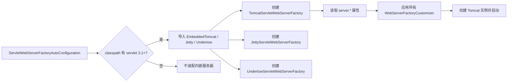

# Spring Boot 内嵌服务器切换（Tomcat / Jetty / Undertow）

> 最后更新: 2026-06-14
> ⬅️ [返回 04 Spring Boot](README.md) | [启动流程](startup-flow.md) | [GraalVM Native](graalvm-native.md)

Spring Boot 的"开箱即用" Web 体验来自**内嵌 Servlet 容器**——无需部署 WAR，默认打包为可执行 jar 直接 `java -jar` 启动。

---

## 🎯 一句话定位

**内嵌服务器 = "JAR 里塞一个 Tomcat"**——`spring-boot-starter-web` 默认带 Tomcat，通过切换 starter 在 Tomcat / Jetty / Undertow 之间自由替换，通过 `WebServerFactoryCustomizer` 自定义端口 / SSL / 连接器。

---

## 一、默认 Tomcat 配置

引入 `spring-boot-starter-web` 后，自动获得 Tomcat 10+（Spring Boot 3.x 对应 Jakarta EE 9+）：

```xml
<dependency>
    <groupId>org.springframework.boot</groupId>
    <artifactId>spring-boot-starter-web</artifactId>
</dependency>
```

**默认行为**：
- 监听 `0.0.0.0:8080`
- 工作线程数：`server.tomcat.threads.max = 200`
- 接受队列长度：`server.tomcat.accept-count = 100`
- 自动部署到根路径 `/`

**常用配置**：

```yaml
server:
  port: 9090
  compression:
    enabled: true
    mime-types: application/json,text/html
  tomcat:
    threads:
      max: 400
      min-spare: 50
    connection-timeout: 30s
    max-http-form-post-size: 2MB
```

---

## 二、切换 Jetty / Undertow

### 1. 切到 Jetty

```xml
<!-- 排除默认 Tomcat -->
<dependency>
    <groupId>org.springframework.boot</groupId>
    <artifactId>spring-boot-starter-web</artifactId>
    <exclusions>
        <exclusion>
            <groupId>org.springframework.boot</groupId>
            <artifactId>spring-boot-starter-tomcat</artifactId>
        </exclusion>
    </exclusions>
</dependency>

<!-- 引入 Jetty starter -->
<dependency>
    <groupId>org.springframework.boot</groupId>
    <artifactId>spring-boot-starter-jetty</artifactId>
</dependency>
```

Jetty 适合**长连接 / WebSocket** 场景（Jetty 的 NIO 实现更轻量）。

### 2. 切到 Undertow

```xml
<dependency>
    <groupId>org.springframework.boot</groupId>
    <artifactId>spring-boot-starter-web</artifactId>
    <exclusions>
        <exclusion>
            <groupId>org.springframework.boot</groupId>
            <artifactId>spring-boot-starter-tomcat</artifactId>
        </exclusion>
    </exclusions>
</dependency>

<dependency>
    <groupId>org.springframework.boot</groupId>
    <artifactId>spring-boot-starter-undertow</artifactId>
</dependency>
```

Undertow 适合**高并发 / 低延迟**场景（Red Hat 出品，WildFly 默认容器）。

### 3. 对比

| 特性 | Tomcat | Jetty | Undertow |
|------|:------:|:-----:|:--------:|
| 默认 starter | ✅ | 需排除 + 引入 | 需排除 + 引入 |
| Servlet 规范支持 | 全 | 全 | 全 |
| WebSocket | ✅ | ✅（更轻量） | ✅ |
| HTTP/2 | ✅ | ✅ | ✅ |
| 性能（高并发） | 中 | 中 | **高** |
| 内存占用 | 中 | 较低 | 最低 |
| 适用场景 | 通用 | 长连接 / 嵌入式 | 高并发网关 |

---

## 三、`WebServerFactoryCustomizer` 自定义端口 / SSL

需要**编程式**定制服务器时，实现 `WebServerFactoryCustomizer`：

```java
@Component
public class CustomTomcatConfig implements WebServerFactoryCustomizer<TomcatServletWebServerFactory> {

    @Override
    public void customize(TomcatServletWebServerFactory factory) {
        // 1. 添加额外端口（管理端口）
        factory.addAdditionalTomcatConnectors(httpConnector());

        // 2. 配置 Connector
        factory.addConnectorCustomizers(connector -> {
            connector.setProperty("maxKeepAliveRequests", "100");
            connector.setProperty("compression", "on");
        });

        // 3. 设置 context path
        factory.setContextPath("/api");
    }

    private Connector httpConnector() {
        Connector connector = new Connector("org.apache.coyote.http11.Http11NioProtocol");
        connector.setPort(9091);
        connector.setScheme("http");
        return connector;
    }
}
```

> 泛型参数根据服务器类型变化：`JettyServletWebServerFactory` / `UndertowServletWebServerFactory`。

---

## 四、启用 HTTPS

### 方式 1：配置文件

```yaml
server:
  port: 8443
  ssl:
    enabled: true
    key-store: classpath:keystore.p12
    key-store-password: changeit
    key-store-type: PKCS12
    key-alias: tomcat
    protocol: TLS
```

### 方式 2：编程式

```java
@Component
public class HttpsConfig implements WebServerFactoryCustomizer<TomcatServletWebServerFactory> {
    @Override
    public void customize(TomcatServletWebServerFactory factory) {
        factory.setSsl(...);
        factory.setSslStoreProvider(...);
    }
}
```

### 方式 3：HTTP → HTTPS 重定向

```java
@Component
public class HttpsRedirectConfig implements WebServerFactoryCustomizer<TomcatServletWebServerFactory> {
    @Override
    public void customize(TomcatServletWebServerFactory factory) {
        factory.addAdditionalTomcatConnectors(redirectConnector());
    }

    private Connector redirectConnector() {
        Connector connector = new Connector("org.apache.coyote.http11.Http11NioProtocol");
        connector.setPort(8080);
        connector.setScheme("http");
        connector.setSecure(false);
        connector.setRedirectPort(8443);  // 跳转到 HTTPS
        return connector;
    }
}
```

---

## 五、`ServletWebServerFactoryAutoConfiguration` 内部原理

Spring Boot 通过 3 个自动配置类按优先级装配服务器：



### 关键 Bean

- **`ServletWebServerFactoryAutoConfiguration`**（`@AutoConfiguration`）
  - `@Import({ ServletWebServerFactoryConfiguration.EmbeddedTomcat.class, ... })`
  - 嵌套类按 `@ConditionalOnClass` 选择具体工厂。
- **`WebServerFactoryCustomizerBeanPostProcessor`**
  - 在工厂 Bean 创建后注入所有 `WebServerFactoryCustomizer` 实现。
- **`ServletWebServerApplicationContext`**
  - 重写 `onRefresh()`，调用工厂的 `getWebServer()` 启动容器。

### 自定义服务器时发生了什么？

1. `SpringApplication.run()` 调用 `context.refresh()`
2. `refresh()` 内部触发 `onRefresh()`
3. `ServletWebServerApplicationContext.onRefresh()` 调用 `factory.getWebServer()`
4. `factory` 读取 `server.*` + `WebServerFactoryCustomizer` 后返回已启动的 Tomcat / Jetty / Undertow

详见 [startup-flow.md 阶段 4](startup-flow.md#四阶段-3applicationcontext-创建)。

---

## 🤔 思考

1. **为什么要支持切换内嵌服务器？** 不同场景对**长连接 / 高并发 / 内存占用**有不同偏好；切换比"自己重写"成本低。
2. **Spring Boot 怎么决定用哪个服务器？** `ServletWebServerFactoryAutoConfiguration` 用 `@ConditionalOnClass` 检测 classpath——谁的 starter 在就用谁。
3. **生产环境还用内嵌吗？** 主流是**内嵌 + 容器化**（jar 包 → Docker / K8s）。少数传统企业仍部署到外部 Tomcat WAR。
4. **HTTPS 证书怎么管理？** 容器化场景下推荐 cert-manager + K8s Secret 挂载，证书变更无需重新打包。

---

## 相关章节

- ⬅️ [返回 04 Spring Boot](README.md)
- [启动流程](startup-flow.md) — 内嵌服务器在 refresh 阶段被启动
- [GraalVM Native](graalvm-native.md) — Native Image 下需特殊处理反射，Tomcat 9+ 才完整支持

---

> 最后更新: 2026-06-14