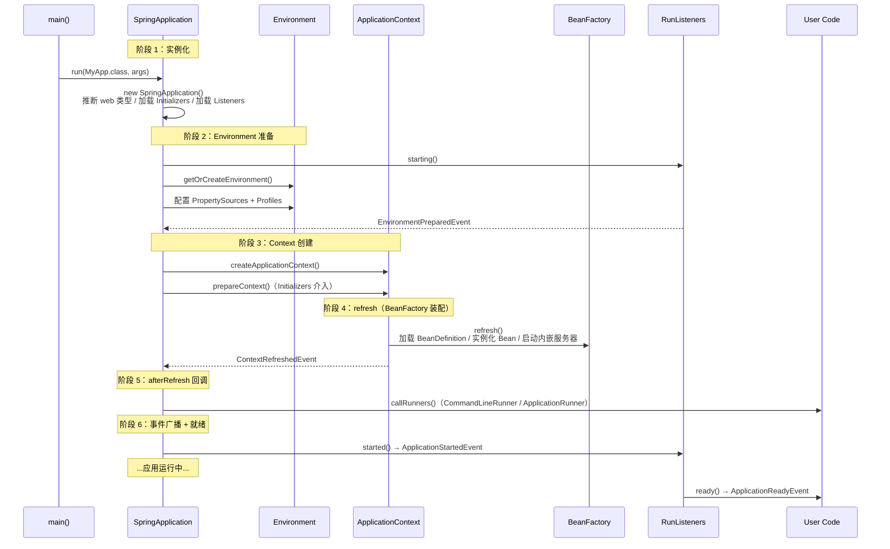

# Spring Boot 启动流程（`SpringApplication.run()` 6 阶段）

> ⬅️ [返回 04 Spring Boot](README.md) | [启动后钩子](application-bootstrap.md) | [外部化配置](boot-externalized-configuration.md)

`SpringApplication.run()` 是 Spring Boot 的"魔法入口"——一行代码背后隐藏了 6 个阶段、20+ 个扩展点。本文按时间顺序拆解完整启动流程。

---

## 🎯 一句话定位

**`SpringApplication.run()` = 6 阶段流水线**：`SpringApplication` 实例化 → `Environment` 准备 → `ApplicationContext` 创建 → `refresh` 阶段 → `afterRefresh` 回调 → `ApplicationStartedEvent` 广播——每个阶段都有官方扩展点。

---

## 一、6 阶段全景图



---

## 二、阶段 1：`SpringApplication` 实例化

```java
public class SpringApplication {
    public SpringApplication(ResourceLoader resourceLoader, Class<?>... primarySources) {
        // 1. 推断应用类型（Servlet / Reactive / None）
        this.webApplicationType = WebApplicationType.deduceFromClasspath();

        // 2. 从 spring.factories 加载 ApplicationContextInitializer
        setInitializers((Collection) getSpringFactoriesInstances(
            ApplicationContextInitializer.class));

        // 3. 从 spring.factories 加载 ApplicationListener
        setListeners((Collection) getSpringFactoriesInstances(ApplicationListener.class));

        // 4. 推断主类（用于日志 / 异常报告）
        this.mainApplicationClass = deduceMainApplicationClass();
    }
}
```

**关键判断**：
- classpath 有 `spring-webmvc` → `SERVLET`
- classpath 有 `spring-webflux` → `REACTIVE`
- 都没有 → `NONE`（普通 Java 应用）

---

## 三、阶段 2：`Environment` 准备

```java
private ConfigurableEnvironment prepareEnvironment(...) {
    // 1. 创建 Environment（Servlet → StandardServletEnvironment）
    ConfigurableEnvironment environment = getOrCreateEnvironment();

    // 2. 配置 PropertySources（application.yml / profile-specific）
    configureEnvironment(environment, applicationArguments.getSourceArgs());

    // 3. 附加 spring.main 注册的 PropertySource
    ConfigurationPropertySources.attach(environment);

    // 4. 触发 EnvironmentPostProcessor（K8s ConfigMap、Vault 等）
    //    通过 spring.factories 的 EnvironmentPostProcessor 列表加载
    EnvironmentPostProcessor... postProcessors = ...;
    for (EnvironmentPostProcessor p : postProcessors) {
        p.postProcessEnvironment(environment, application);
    }

    // 5. 广播 EnvironmentPreparedEvent
    listeners.environmentPrepared(environment);
    return environment;
}
```

**加载顺序**（详见 [externalized-configuration.md](boot-externalized-configuration.md)）：
1. 默认属性
2. `@PropertySource`
3. `application.yml` → `application-{profile}.yml`
4. 操作系统环境变量
5. 命令行参数

---

## 四、阶段 3：`ApplicationContext` 创建

```java
protected ConfigurableApplicationContext createApplicationContext() {
    // 根据 webApplicationType 选择实现类
    return this.webApplicationType == WebApplicationType.SERVLET
        ? new AnnotationConfigServletWebServerApplicationContext()
        : this.webApplicationType == WebApplicationType.REACTIVE
            ? new AnnotationConfigReactiveWebServerApplicationContext()
            : new AnnotationConfigApplicationContext();
}

private void prepareContext(ConfigurableApplicationContext context, ConfigurableEnvironment environment) {
    // 1. 绑定 Environment
    context.setEnvironment(environment);

    // 2. postProcessApplicationContext（自定义 BeanNameGenerator / ResourceLoader）

    // 3. 调用所有 ApplicationContextInitializer.initialize()
    for (ApplicationContextInitializer initializer : getInitializers()) {
        initializer.initialize(context);
    }

    // 4. 广播 ApplicationPreparedEvent
    listeners.contextPrepared(context);
}
```

**ApplicationContextInitializer 扩展点**：在 BeanFactory 刷新前对 Context 做定制。例如 Spring Cloud 的 `BootstrapApplicationListener` 会创建"父 Context"加载远程配置。

---

## 五、阶段 4：`refresh()` 阶段（BeanFactory 装配）

这是 Spring Framework 标准的 `AbstractApplicationContext.refresh()` 流程：

```
1. prepareRefresh()                  // 准备：设置启动时间、激活状态
2. obtainFreshBeanFactory()          // 创建/获取 BeanFactory
3. prepareBeanFactory(beanFactory)   // 配置 ClassLoader、SPEL 解析器、BeanPostProcessor
4. postProcessBeanFactory(beanFactory) // 子类扩展点（Web 上下文注册 Scope）
5. invokeBeanFactoryPostProcessors()  // 执行 ConfigurationClassPostProcessor（解析 @Configuration）
6. registerBeanPostProcessors()      // 注册 BeanPostProcessor（AOP、@Autowired）
7. initMessageSource()               // 国际化 MessageSource
8. initApplicationEventMulticaster() // 事件多播器
9. onRefresh()                       // Web 上下文启动内嵌 Tomcat / Netty
10. registerListeners()              // 注册 ApplicationListener 到多播器
11. finishBeanFactoryInitialization() // 实例化所有非 lazy 单例 Bean
12. finishRefresh()                  // 清理缓存、发布 ContextRefreshedEvent
```

**Spring Boot 特殊步骤 `onRefresh()`**：启动内嵌服务器（Tomcat / Jetty / Undertow / Netty）。详见 [embedded-server.md](embedded-server.md)。

---

## 六、阶段 5：`afterRefresh` 回调

```java
private void callRunners(ApplicationContext context, ApplicationArguments args) {
    List<Object> runners = new ArrayList<>();

    // 收集所有 Runner
    runners.addAll(context.getBeansOfType(ApplicationRunner.class).values());
    runners.addAll(context.getBeansOfType(CommandLineRunner.class).values());

    // 按 @Order 排序
    AnnotationAwareOrderComparator.sort(runners);

    // 依次执行
    for (Object runner : new LinkedHashSet<>(runners)) {
        if (runner instanceof ApplicationRunner ar) {
            ar.run(args);
        } else if (runner instanceof CommandLineRunner cr) {
            cr.run(args.getSourceArgs());
        }
    }
}
```

详见 [application-bootstrap.md](application-bootstrap.md)。

---

## 七、阶段 6：`ApplicationStartedEvent` 广播

```java
private void started(ConfigurableApplicationContext context, Duration timeTaken) {
    listeners.started(context, timeTaken);  // 广播 ApplicationStartedEvent
    // 注意：此时 context 已 refresh 完成，Runner 已执行，但 ApplicationReadyEvent 尚未触发
}
```

事件时序：

| 事件 | 触发时机 | 用途 |
|------|---------|------|
| `ApplicationStartingEvent` | 阶段 1 后 | 最早的事件，Environment 尚未创建 |
| `ApplicationEnvironmentPreparedEvent` | 阶段 2 后 | Environment 已就绪 |
| `ApplicationContextInitializedEvent` | 阶段 3 后 | Context 已创建但未 refresh |
| `ApplicationPreparedEvent` | 阶段 3 末 | BeanDefinition 已加载，未实例化 |
| `ContextRefreshedEvent` | 阶段 4 末（refresh 内部） | Bean 已全部实例化 |
| `ApplicationStartedEvent` | 阶段 5 后 | Runner 已执行 |
| `ApplicationReadyEvent` | 阶段 6 后（应用就绪） | **应用完全可用，可对外服务** |
| `ApplicationFailedEvent` | 任何阶段失败 | 启动失败 |

---

## 八、核心扩展点

### 1. `SpringApplicationRunListeners` vs `EventPublishingRunListener`

```java
// SpringApplication 内部
private SpringApplicationRunListeners listeners;

listeners = new SpringApplicationRunListeners(
    new LogFactoryLog(getClass()),
    getSpringFactoriesInstances(SpringApplicationRunListener.class).stream()
        .map(EventPublishingRunListener::new)  // 默认实现：把回调翻译成事件
        .toList()
);
```

- `SpringApplicationRunListener` 是"启动生命周期"接口（`started` / `environmentPrepared` / `contextPrepared` / `contextLoaded` / `started` / `ready`）。
- `EventPublishingRunListener` 把这些回调**翻译成 `ApplicationEvent`**，让所有 `ApplicationListener` 都能订阅。
- 自定义 `SpringApplicationRunListener` 很少见；99% 的场景直接监听 `ApplicationReadyEvent` 等事件。

### 2. `ApplicationContextInitializer`

```java
public interface ApplicationContextInitializer<C extends ConfigurableApplicationContext> {
    void initialize(C applicationContext);
}
```

**注册方式**（`META-INF/spring.factories`）：

```properties
# 旧式（2.x / 3.x 兼容）
org.springframework.context.ApplicationContextInitializer=\
com.example.MyInitializer

# 新式（3.x 推荐，但 ApplicationContextInitializer 仍走 spring.factories）
```

**典型用途**：
- Spring Cloud `PropertySourceBootstrapConfiguration` 启动"父 Context"加载远程配置。
- 向 Context 注册自定义 Scope。
- 提前注入必须存在的 Bean。

### 3. `ApplicationListener<ApplicationReadyEvent>`

```java
@Component
public class WarmupCache implements ApplicationListener<ApplicationReadyEvent> {

    @Override
    public void onApplicationEvent(ApplicationReadyEvent event) {
        // 应用完全就绪（含内嵌服务器已监听端口）
        cacheService.warmUp();
    }
}
```

---

## 九、`CommandLineRunner` / `ApplicationRunner` 与 `ApplicationReadyEvent` 的执行顺序

```java
@Component
@Order(1)
public class FirstRunner implements CommandLineRunner {
    @Override public void run(String... args) { /* 第 1 个执行 */ }
}

@Component
@Order(2)
public class SecondRunner implements ApplicationRunner {
    @Override public void run(ApplicationArguments args) { /* 第 2 个执行 */ }
}

@Component
public class ReadyListener implements ApplicationListener<ApplicationReadyEvent> {
    @Override public void onApplicationEvent(ApplicationReadyEvent e) {
        // 最后执行——所有 Runner 跑完后才触发
    }
}
```

**完整时序**：
1. `ContextRefreshedEvent`（refresh 末）
2. `ApplicationStartedEvent`（refresh 后立即广播）
3. `callRunners()` 按 `@Order` 升序执行所有 Runner
4. `ApplicationReadyEvent`（Runner 跑完后广播）

---

## 🤔 思考

1. **为什么把启动拆成 6 个阶段？** 让每个扩展点聚焦一个职责，避免"一个大 init 方法包打天下"。
2. **事件 vs Listener vs Runner 选哪个？** 简单任务用 Runner；跨 Bean / 跨模块监听用 Event；Context 级别的定制用 Initializer。
3. **启动慢怎么排查？** 开启 `spring.application.lazy-initialization=true` 懒加载，或用 `spring-boot-actuator` 的 `/actuator/startup` 端点看 Bean 实例化耗时。
4. **`ApplicationStartingEvent` 为什么"最早"？** 它在 Environment 创建前触发——只能用来做 logging early init 这种与配置无关的事。

---

## 相关章节

- ⬅️ [返回 04 Spring Boot](README.md)
- [启动后钩子](application-bootstrap.md) — `@PostConstruct` / Runner / `ApplicationReadyEvent` 详解
- [外部化配置](boot-externalized-configuration.md) — Environment 在阶段 2 被构建
- [内嵌服务器](embedded-server.md) — 阶段 4 的 `onRefresh()` 启动 Tomcat
- [自动配置原理](auto-configuration.md) — 阶段 4 解析 `@SpringBootApplication`

---

