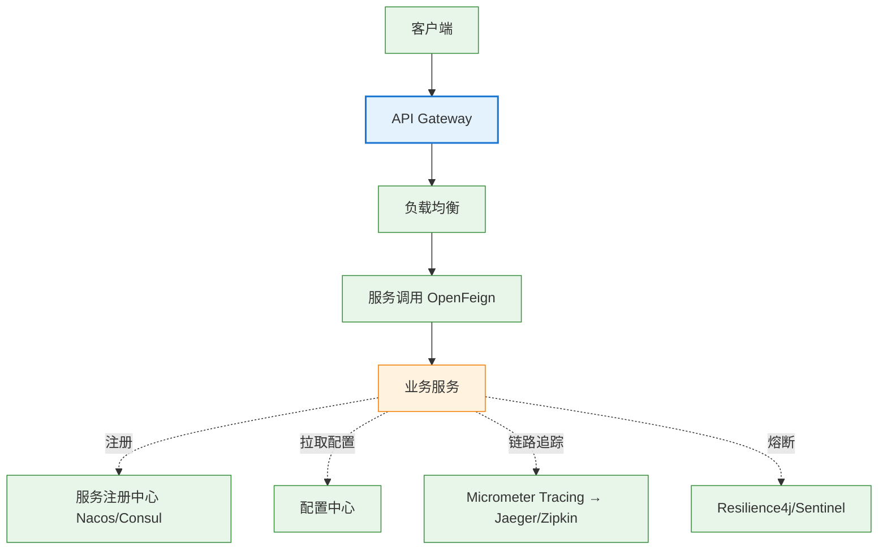

# 05 Spring Cloud

> 最后更新: 2026-06-14
> ⬅️ [返回 Spring 顶层](../README.md)

---
## 引言：反直觉代码

05 Spring Cloud 的关键不是语法——是**看起来对**的代码背后那些'踩坑点'。

本篇用 3 个反直觉片段切入，把面试/生产中常被问起、但一深入就漏馅的点摆出来。

---

## 🎯 一句话定位

**Spring Cloud = 微服务治理工具集**——基于 Spring Boot，把 Netflix/Alibaba 等公司的微服务最佳实践封装为开箱即用的组件。本章讲清"7 大组件各管什么、为什么、怎么选"。

---

## 📚 章节导航

| 章节 | 文件 | 核心问题 | 建议时长 |
|:----:|:----|:---------|:--------:|
| **Spring Cloud 总览** | [README.md](README.md) | 7 大组件全景图 + 组件淘汰与替代 | 20 min |
| **服务注册与发现** | [service-registry/](service-registry/) | 服务实例怎么注册和发现？ | 20 min |
| **配置中心** | [config-center.md](config-center.md) | 微服务配置如何集中管理？ | 20 min |
| **负载均衡** | [load-balancer.md](load-balancer.md) | 客户端负载均衡 vs 服务端？ | 15 min |
| **服务调用** | [rpc-and-feign.md](rpc-and-feign.md) | OpenFeign 怎么用？ | 15 min |
| **熔断与容错** | [circuit-breaker.md](circuit-breaker.md) | Resilience4j / Sentinel 怎么用？ | 20 min |
| **API 网关** | [gateway.md](gateway.md) | Spring Cloud Gateway vs Zuul？ | 20 min |
| **链路追踪** | [distributed-tracing.md](distributed-tracing.md) | Micrometer Tracing 怎么用？ | 15 min |

---

## 🧭 7 大组件全景



---

## ⚡ 核心概念速查

| 组件 | 替代的淘汰组件 | 推荐 | 章节 |
|------|--------------|------|:----:|
| **服务注册/发现** | Eureka | Nacos / Consul | [注册中心](service-registry/eureka-vs-consul-vs-nacos-vs-zookeeper.md) |
| **配置中心** | Archaius | Nacos / Spring Cloud Config | [配置中心](config-center.md) |
| **负载均衡** | Ribbon | Spring Cloud LoadBalancer | [负载均衡](load-balancer.md) |
| **服务调用** | Feign (Netflix) | OpenFeign | [RPC 与 Feign](rpc-and-feign.md) |
| **熔断/容错** | Hystrix | Resilience4j / Sentinel | [熔断与容错](circuit-breaker.md) |
| **API 网关** | Zuul | Spring Cloud Gateway | [API 网关](gateway.md) |
| **链路追踪** | Sleuth+Zipkin (旧) | Micrometer Tracing | [链路追踪](distributed-tracing.md) |

---

## 🤔 思考

1. **为什么 Eureka 被淘汰？** 停止维护，仅 AP 模式、缺配置中心功能。
2. **Nacos vs Consul 怎么选？** Nacos 阿里系、易用、中文文档；Consul 多数据中心、支持服务网格。
3. **Spring Cloud Gateway vs Zuul？** Gateway 基于 WebFlux（非阻塞），Zuul 基于 Servlet（阻塞）。
4. **微服务什么时候该上？** 团队 ≥ 50 人 + 业务边界稳定 + 有 DevOps 能力。

---

## 相关章节

- ⬅️ [返回 Spring 顶层](../README.md)
- ⬅️ [04 Spring Boot](../04-spring-boot/README.md) — Spring Cloud 基于 Spring Boot
- ➡️ [03 数据层/分布式事务/理论](../03-data/transaction/distributed/theory-and-patterns.md) — 分布式事务是云端关键问题
- [04.system-design/01-foundation/microservices](../../04.system-design/01-foundation/system-design-basics/microservices/README.md) — 微服务架构理论基础

---

## Spring Cloud 与 Spring Cloud Alibaba 关系

Spring Cloud 本身是**一组规范**（接口 + 默认实现），Spring Cloud Alibaba 是**阿里系实现**（Nacos / Sentinel / Seata 等），二者通过 **BOM** 协同使用。

### 一、版本对应矩阵

| Spring Cloud | spring-cloud-alibaba | Spring Boot | 维护状态 |
|:------------:|:-------------------:|:-----------:|:--------:|
| 2023.0.x (Leyton) | 2023.0.1.x | 3.3.x | 活跃 |
| 2022.0.x (Kilburn) | 2022.0.0.x | 3.2.x | 活跃 |
| 2021.0.x (Jubilee) | 2021.0.5.x | 2.7.x / 3.x | 维护 |
| 2020.0.x (Ilford) | 2020.0.1.x | 2.4.x – 2.6.x | 维护 |
| Hoxton.SR12 | 2.2.9.RELEASE | 2.3.x | EOL |
| Greenwich.SR6 | 2.1.4.RELEASE | 2.1.x | EOL |
| Finchley.SR4 | 2.0.4.RELEASE | 2.0.x | EOL |

> Spring Cloud 与 Spring Boot **强绑定**，错配会导致 `@EnableDiscoveryClient` 等注解失效。

### 二、BOM 导入机制

```xml
<dependencyManagement>
    <dependencies>
        <!-- Spring Cloud 父 BOM（Netflix 体系默认实现） -->
        <dependency>
            <groupId>org.springframework.cloud</groupId>
            <artifactId>spring-cloud-dependencies</artifactId>
            <version>2023.0.1</version>
            <type>pom</type>
            <scope>import</scope>
        </dependency>
        <!-- Spring Cloud Alibaba BOM（阿里系组件版本统一） -->
        <dependency>
            <groupId>com.alibaba.cloud</groupId>
            <artifactId>spring-cloud-alibaba-dependencies</artifactId>
            <version>2023.0.1.0</version>
            <type>pom</type>
            <scope>import</scope>
        </dependency>
    </dependencies>
</dependencyManagement>
```

子模块引入 `spring-cloud-starter-alibaba-nacos-discovery` 等 starter 时**无需指定版本**，由 BOM 仲裁。

### 三、阿里系核心组件

| 组件 | 对应 Spring Cloud Netflix | 定位 |
|------|--------------------------|------|
| **Nacos Discovery** | Eureka | 注册中心 + 配置中心二合一 |
| **Nacos Config** | Spring Cloud Config | 长轮询实时推送 |
| **Sentinel** | Hystrix / Resilience4j | 熔断 + 限流 + 热点 + 系统自适应 |
| **Seata** | （无） | 分布式事务（AT/TCC/Saga/XA） |
| **RocketMQ Binder** | Spring Cloud Stream | 阿里消息中间件绑定 |
| **Dubbo** | OpenFeign | 高性能 RPC（阿里生态首选） |

### 四、何时用 Netflix 体系 vs Alibaba 体系

**选 Netflix 体系（LoadBalancer / OpenFeign / Config）**：
- 跨云中立（避免被某家云绑定）
- 已有 Spring Cloud Config + Git 工具链
- 团队熟悉 Spring 原生生态

**选 Alibaba 体系（Nacos / Sentinel / Seata）**：
- 国内项目，中文文档完善
- 需要**一站式**（注册 + 配置 + 限流 + 事务）
- 高并发场景，Sentinel 规则更细（热点参数 / 系统自适应）
- 已在用 RocketMQ / Dubbo

**混合使用**：常见做法——Nacos Discovery + Spring Cloud LoadBalancer + OpenFeign + Sentinel + Seata。

### 五、补充章节

- [Spring Cloud 版本演进](version-train.md) — Angel 到 2025.0.x 完整代号史
- [Seata 集成](seata-integration.md) — Spring Cloud Alibaba 分布式事务
- [Config 加密](config-encryption.md) — Nacos / Spring Cloud Config / Jasypt
- [Spring Cloud Stream](stream.md) — 消息驱动微服务
- [Spring Cloud Bus](bus.md) — 配置实时推送与集群广播

---

> 🚀 从 [Spring Cloud 总览](README.md) 开始
