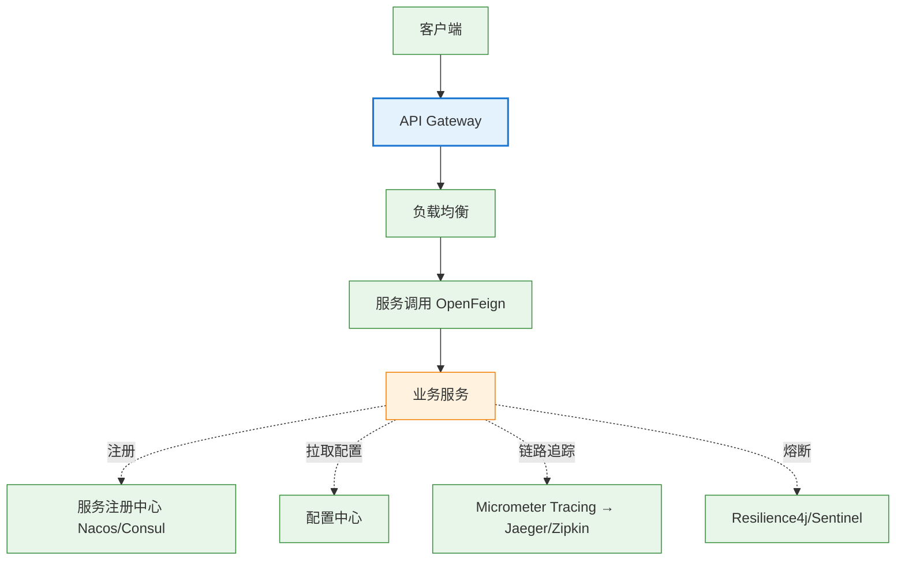

# 05 Spring Cloud

> 最后更新: 2026-06-09
> ⬅️ [返回 Spring 顶层](../README.md)

---

## 🎯 一句话定位

**Spring Cloud = 微服务治理工具集**——基于 Spring Boot，把 Netflix/Alibaba 等公司的微服务最佳实践封装为开箱即用的组件。本章讲清"7 大组件各管什么、为什么、怎么选"。

---

## 📚 章节导航

| 章节 | 文件 | 核心问题 | 建议时长 |
|:----:|:----|:---------|:--------:|
| **Spring Cloud 总览** | [README.md](README.md) | 7 大组件全景图 + 组件淘汰与替代 | 20 min |
| **服务注册与发现** | [service-registry/](service-registry/) | 服务实例怎么注册和发现？ | 20 min |
| **配置中心** | ⭐待补充 (P3) | 微服务配置如何集中管理？ | 20 min |
| **负载均衡** | ⭐待补充 (P3) | 客户端负载均衡 vs 服务端？ | 15 min |
| **服务调用** | ⭐待补充 (P3) | OpenFeign 怎么用？ | 15 min |
| **熔断与容错** | ⭐待补充 (P3) | Resilience4j / Sentinel 怎么用？ | 20 min |
| **API 网关** | ⭐待补充 (P3) | Spring Cloud Gateway vs Zuul？ | 20 min |
| **链路追踪** | ⭐待补充 (P3) | Micrometer Tracing 怎么用？ | 15 min |

---

## 🧭 7 大组件全景

---

## ⚡ 核心概念速查

| 组件 | 替代的淘汰组件 | 推荐 | 章节 |
|------|--------------|------|:----:|
| **服务注册/发现** | Eureka | Nacos / Consul | [注册中心](service-registry/eureka-vs-consul-vs-nacos-vs-zookeeper.md) |
| **配置中心** | Archaius | Nacos / Spring Cloud Config | P3 补充 |
| **负载均衡** | Ribbon | Spring Cloud LoadBalancer | P3 补充 |
| **服务调用** | Feign (Netflix) | OpenFeign | P3 补充 |
| **熔断/容错** | Hystrix | Resilience4j / Sentinel | P3 补充 |
| **API 网关** | Zuul | Spring Cloud Gateway | P3 补充 |
| **链路追踪** | Sleuth+Zipkin (旧) | Micrometer Tracing | P3 补充 |

---

## 🤔 思考

1. **为什么 Eureka 被淘汰？** 停止维护，仅 AP 模式、缺配置中心功能。
2. **Nacos vs Consul 怎么选？** Nacos 阿里系、易用、中文文档；Consul 多数据中心、支持服务网格。
3. **Spring Cloud Gateway vs Zuul？** Gateway 基于 WebFlux（非阻塞），Zuul 基于 Servlet（阻塞）。
4. **微服务什么时候该上？** 团队 ≥ 50 人 + 业务边界稳定 + 有 DevOps 能力。

---

## 相关章节

- ⬅️ [返回 Spring 顶层](../README.md)
- ⬅️ [04 Spring Boot](../04-spring-boot/README.md) — Spring Cloud 基于 Spring Boot
- ➡️ [03 数据层/分布式事务](../03-data/transaction/distributed/README.md) — 分布式事务是云端关键问题
- [04.system-design/01-foundation/microservices](../04.system-design/01-foundation/system-design-basics/microservices/README.md) — 微服务架构理论基础

---

> 🚀 从 [Spring Cloud 总览](README.md) 开始
