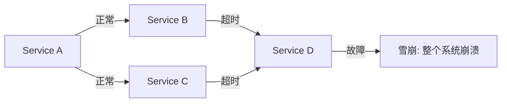
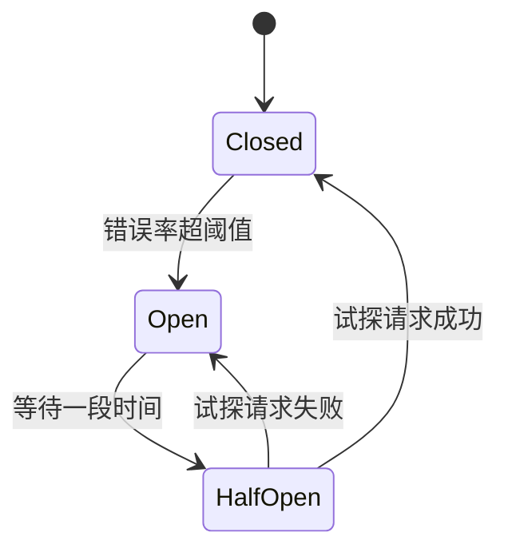

# 熔断降级与限流

> 最后更新: 2026-06-09
> ⬅️ [返回 05 Spring Cloud](README.md) | [RPC 与 Feign](rpc-and-feign.md) | [网关](gateway.md)

微服务架构中，**单个服务故障可能拖垮整个系统**（雪崩效应）。**熔断器**（Circuit Breaker）是抵御雪崩的关键武器——当下游服务故障时，**快速失败** + **降级返回**，保护系统稳定。

---

## 🎯 一句话定位

**熔断器 = "电路保险丝"**——当下游服务错误率超过阈值，**熔断器打开**，请求直接走 fallback（不再调用下游），过一段时间后**半开**试探下游是否恢复。**Sentinel**（阿里）和 **Resilience4j**（Java 生态）是 2 大主流实现。

---

## 一、什么是雪崩效应



**场景**：
- Service D 故障（响应慢或挂掉）
- Service B/C 调用 D 超时，**线程被占满**
- Service A 调用 B/C 也超时，**资源耗尽**
- **整个链路崩溃**

---

## 二、3 大容错机制

| 机制 | 作用 | 触发条件 | 实现 |
|------|------|---------|------|
| **熔断**（Circuit Breaker） | 故障服务**快速失败** | 错误率超阈值 | Sentinel / Resilience4j |
| **降级**（Fallback） | 返回**兜底数据** | 熔断/超时/异常 | @SentinelResource / Fallback |
| **限流**（Rate Limit） | 控制**进入流量** | QPS 超限 | Sentinel |

---

## 三、熔断器 3 种状态



| 状态 | 含义 | 行为 |
|------|------|------|
| **Closed（关闭）** | 正常 | 请求正常通过 |
| **Open（断开）** | 熔断中 | 请求直接失败（走 fallback） |
| **Half-Open（半开）** | 试探 | 放少量请求试探下游是否恢复 |

---

## 四、Resilience4j 实战（**推荐**）

> **轻量级、函数式、支持 Java 8+**，无依赖、模块化设计。

### 1. 添加依赖

```xml
<dependency>
    <groupId>io.github.resilience4j</groupId>
    <artifactId>resilience4j-spring-boot2</artifactId>
</dependency>
<dependency>
    <groupId>org.springframework.cloud</groupId>
    <artifactId>spring-cloud-starter-circuitbreaker-resilience4j</artifactId>
</dependency>
```

### 2. 配置

```yaml
resilience4j:
  circuitbreaker:
    instances:
      userService:
        failure-rate-threshold: 50       # 失败率 50% 触发熔断
        wait-duration-in-open-state: 30s  # 熔断后等待 30s
        sliding-window-size: 10          # 滑动窗口大小
        sliding-window-type: COUNT_BASED # 窗口类型
        permitted-number-of-calls-in-half-open-state: 3  # 半开状态允许 3 个试探请求
        slow-call-duration-threshold: 2s  # 慢调用阈值 2s
        slow-call-rate-threshold: 50     # 慢调用率 50% 触发熔断
```

### 3. 使用注解

```java
@Service
public class UserService {

    @CircuitBreaker(name = "userService", fallbackMethod = "fallback")
    public User getUser(Long id) {
        return userFeignClient.getUser(id);
    }

    // 降级方法（参数和返回值必须一致，可加 Throwable 参数）
    public User fallback(Long id, Throwable t) {
        log.warn("user-service 调用失败，降级返回: {}", t.getMessage());
        return new User();  // 兜底数据
    }
}
```

### 4. 编程式使用

```java
@Service
public class OrderService {

    private final CircuitBreaker circuitBreaker;

    public OrderService(CircuitBreakerRegistry registry) {
        this.circuitBreaker = registry.circuitBreaker("orderService");
    }

    public Order createOrder(Long userId) {
        return circuitBreaker.executeSupplier(() -> {
            // 业务逻辑
            return orderRepository.save(new Order(userId));
        });
    }
}
```

---

## 五、Sentinel 实战（**国内主流**）

> **阿里开源**，功能更丰富（限流、熔断、降级、热点、系统自适应），控制台完善。

### 1. 添加依赖

```xml
<dependency>
    <groupId>com.alibaba.cloud</groupId>
    <artifactId>spring-cloud-starter-alibaba-sentinel</artifactId>
</dependency>
```

### 2. 配置

```yaml
spring:
  cloud:
    sentinel:
      transport:
        dashboard: localhost:8080  # Sentinel 控制台
        port: 8719
```

### 3. 使用注解

```java
@Service
public class UserService {

    @SentinelResource(
        value = "getUser",
        blockHandler = "handleBlock",       // 限流/降级处理
        fallback = "handleFallback"         // 异常处理
    )
    public User getUser(Long id) {
        return userFeignClient.getUser(id);
    }

    // 限流处理
    public User handleBlock(Long id, BlockException ex) {
        return new User();
    }

    // 降级处理
    public User handleFallback(Long id, Throwable t) {
        return new User();
    }
}
```

### 4. 规则配置（Sentinel 控制台）

| 规则 | 作用 |
|------|------|
| **流控规则** | 限流（QPS 100、线程数 50） |
| **降级规则** | 熔断（异常数、异常比例、慢调用） |
| **热点规则** | 参数限流（同一用户限流） |
| **系统规则** | 全局系统保护（CPU、负载、QPS） |
| **授权规则** | 黑白名单 |

---

## 六、3 大容错策略对比

| 策略 | 解决问题 | 触发 | 实现 |
|------|---------|------|------|
| **熔断** | 下游故障 | 错误率超阈值 | CircuitBreaker |
| **限流** | 流量过载 | QPS 超限 | RateLimiter |
| **降级** | 服务不可用 | 熔断/异常 | Fallback |

### 完整使用

```java
@Service
public class UserService {

    @CircuitBreaker(name = "userService", fallbackMethod = "fallback")
    @Retry(name = "userService")                      // 重试
    @TimeLimiter(name = "userService")                 // 超时
    @Bulkhead(name = "userService")                   // 信号量隔离
    public CompletableFuture<User> getUser(Long id) {
        return CompletableFuture.supplyAsync(() -> userFeignClient.getUser(id));
    }

    public CompletableFuture<User> fallback(Long id, Throwable t) {
        return CompletableFuture.completedFuture(new User());
    }
}
```

---

## 七、Sentinel vs Resilience4j

| 维度 | Sentinel | Resilience4j |
|------|----------|--------------|
| **维护方** | 阿里 | Resilience4j 团队 |
| **语言** | Java | Java |
| **控制台** | ✅ 功能完善 | 需结合 Spring Boot Admin |
| **限流** | ✅ 丰富 | ⚠️ 基础 |
| **熔断** | ✅ | ✅ |
| **热点规则** | ✅ 独有 | ❌ |
| **系统自适应** | ✅ 独有 | ❌ |
| **轻量级** | ⭐⭐ | ⭐⭐⭐⭐⭐ |
| **函数式** | ⭐⭐⭐ | ⭐⭐⭐⭐⭐ |
| **国内使用** | ⭐⭐⭐⭐⭐ | ⭐⭐⭐ |
| **推荐度** | ⭐⭐⭐⭐⭐ | ⭐⭐⭐⭐ |

> 📌 **国内项目优先 Sentinel**（控制台 + 限流功能强大），**海外项目用 Resilience4j**（轻量、函数式）。

---

## 八、最佳实践

### 1. 熔断粒度

> 按**服务/方法**粒度熔断，不要按实例。

### 2. 合理设置阈值

```yaml
failure-rate-threshold: 50     # 50% 失败率
wait-duration-in-open-state: 30s  # 30s 后半开
```

**原则**：太敏感 → 容易误熔断；太迟钝 → 已经雪崩才熔断。

### 3. Fallback 设计

> Fallback 要返回**有意义的数据**（缓存值、默认值、空对象），而不是抛异常。

### 4. 监控告警

> 监控熔断事件 → 通过 Prometheus Alertmanager 告警。

### 5. 区分熔断和降级

| 场景 | 机制 |
|------|------|
| 下游故障（错误率 50%） | 熔断（自动） |
| 双 11 大促（主动减少非核心功能） | 降级（手动） |

---

## 九、4 大隔离策略

> 防止**一个慢调用拖垮整个服务**。

| 策略 | 机制 | 适用 |
|------|------|------|
| **线程池隔离** | 不同服务用不同线程池 | 高风险服务 |
| **信号量隔离** | 限制并发数 | 低延迟场景 |
| **熔断隔离** | 故障服务快速失败 | 所有场景 |
| **超时隔离** | 慢调用超时失败 | 慢服务 |

---

## 🤔 思考

1. **熔断和降级什么区别？** 熔断是**自动**的（错误率超阈值）；降级是**手动**的（业务主动放弃非核心功能）。
2. **为什么需要熔断？** 防止雪崩——下游故障时快速失败，避免资源耗尽。
3. **熔断器打开后请求直接失败吗？** 是的，请求**不会发到下游**，直接走 fallback。
4. **Sentinel 控制台怎么用？** 启动 Sentinel Dashboard 服务（Java -jar sentinel-dashboard.jar），浏览器访问 localhost:8080。

---

## 相关章节

- ⬅️ [返回 05 Spring Cloud](README.md)
- [RPC 与 Feign](rpc-and-feign.md) — Feign 集成熔断器
- [网关](gateway.md) — 网关层限流
- [分布式事务](transaction/distributed/theory-and-patterns.md) — 下游故障的业务补偿
