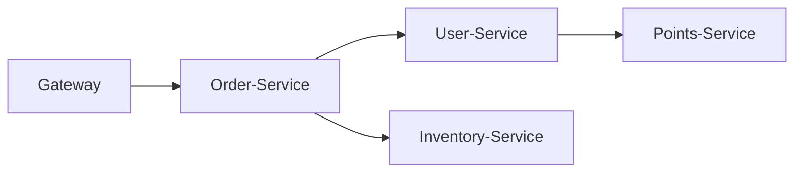
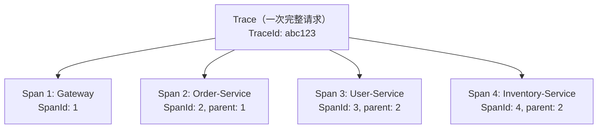
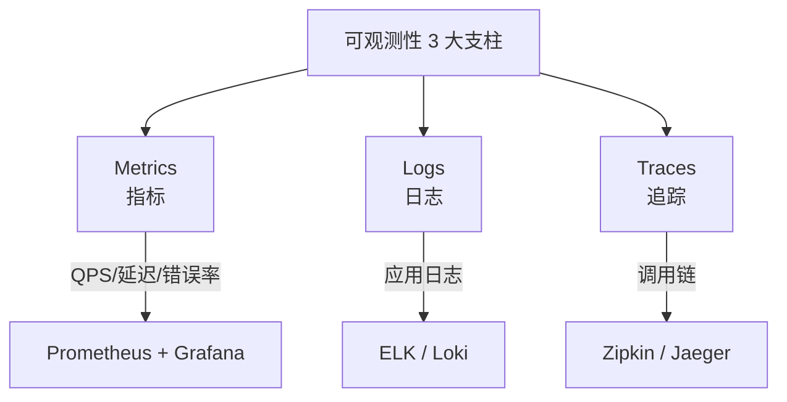

# 分布式链路追踪

> ⬅️ [返回 05 Spring Cloud](README.md) | [配置中心](config-center.md) | [网关](gateway.md)

在微服务架构中，**一个请求可能经过 5-10 个服务**——出了问题怎么定位？**分布式链路追踪**（Distributed Tracing）通过**唯一 TraceId 串联整个调用链**，让排查问题不再"大海捞针"。

---

## 🎯 一句话定位

**分布式追踪 = "请求的 GPS 定位"**——通过 **TraceId** 唯一标识一个请求，**SpanId** 标识调用链中的一个环节。所有服务把 Span 上报到 **Collector**（如 Zipkin/Jaeger），UI 可视化展示**完整调用链**。Spring Boot 3.x 推荐 **Micrometer Tracing**（官方）。

---

## 一、为什么需要分布式追踪

### 单体应用


✅ 日志在一台机器，grep 一下就能找到。

### 微服务



- 1 个请求经过 **5 个服务**
- 5 个服务在 **不同的机器**
- 1 个慢请求 = 跨 5 台机器查日志 = **噩梦**

**没有分布式追踪的痛点**：
- 日志散落多台机器
- 无法知道"哪个服务慢"
- 无法知道"调用链是什么"

---

## 二、3 大核心概念



| 概念 | 含义 |
|------|------|
| **Trace** | 一次完整请求的调用链（TraceId 唯一标识） |
| **Span** | 调用链中的一个环节（一次方法调用） |
| **TraceId** | 全局唯一，贯穿整个调用链 |
| **SpanId** | 当前 Span 的唯一标识 |
| **Parent SpanId** | 父 Span 的 ID（树形结构） |

---

## 三、4 大主流方案

| 方案 | 维护方 | 协议 | 存储 | 适用 |
|------|--------|------|------|------|
| **Zipkin** | Twitter（OpenZipkin） | HTTP / Kafka | ES / MySQL / 内存 | **传统首选** |
| **Jaeger** | CNCF（K8s 生态） | gRPC / HTTP | ES / Cassandra | **K8s 云原生** |
| **SkyWalking** | Apache | gRPC | ES / H2 / MySQL | **国内大厂首选** |
| **Micrometer Tracing** | Spring 官方 | OpenTelemetry | 任意 | **Spring Boot 3.x 推荐** |

> 📌 **Spring Boot 3.x 项目推荐 Micrometer Tracing**（官方、与 Spring 生态深度集成）。

---

## 四、Spring Boot 3.x + Micrometer Tracing 实战（**推荐**）

### 1. 添加依赖

```xml
<dependency>
    <groupId>io.micrometer</groupId>
    <artifactId>micrometer-tracing-bridge-brave</artifactId>
</dependency>
<dependency>
    <groupId>io.zipkin.reporter2</groupId>
    <artifactId>zipkin-reporter-brave</artifactId>
</dependency>
```

### 2. 配置

```yaml
management:
  tracing:
    sampling:
      probability: 1.0         # 采样率（1.0 = 100%）
  zipkin:
    tracing:
      endpoint: http://localhost:9411/api/v2/spans
```

### 3. 启动 Zipkin

```bash
# Docker
docker run -d -p 9411:9411 openzipkin/zipkin
```

### 4. 自动追踪

> **无需写任何代码**——Spring Boot 3.x 自动追踪：
> - Web 请求（HTTP）
> - RestTemplate / WebClient
> - OpenFeign
> - Spring Cloud Gateway
> - 异步任务（@Async、CompletableFuture）
> - 定时任务（@Scheduled）
> - Kafka / RabbitMQ

### 5. 代码使用

```java
@RestController
public class OrderController {

    private final Tracer tracer;

    public OrderController(Tracer tracer) {
        this.tracer = tracer;
    }

    @GetMapping("/orders/{id}")
    public Order get(@PathVariable Long id) {
        // 当前 Span
        Span currentSpan = tracer.currentSpan();
        log.info("TraceId: {}, SpanId: {}",
            currentSpan.context().traceId(),
            currentSpan.context().spanId());

        return orderService.getById(id);
    }

    @GetMapping("/orders/complex")
    public Order complex() {
        // 创建自定义 Span
        Span newSpan = tracer.nextSpan().name("complexLogic").start();
        try (Tracer.SpanInScope ws = tracer.withSpan(newSpan)) {
            // 业务逻辑
            return orderService.complex();
        } finally {
            newSpan.end();
        }
    }
}
```

### 6. 日志集成

```yaml
# logback-spring.xml
<pattern>
  %d{HH:mm:ss.SSS} [%thread] %-5level [${spring.application.name:},%X{traceId:-},%X{spanId:-}] %logger{36} - %msg%n
</pattern>
```

日志输出：
```
12:34:56.789 [http-nio-8080-exec-1] INFO [order-service,abc123,def456] c.e.o.controller.OrderController - TraceId: abc123, SpanId: def456
```

> 📌 **日志中带 TraceId** = 一次请求的所有日志都能通过 TraceId 关联起来。

---

## 五、与 Sleuth 的区别

| 维度 | Spring Cloud Sleuth | Micrometer Tracing |
|------|---------------------|-------------------|
| **状态** | ❌ 维护模式（Spring Boot 2.x） | ✅ Spring Boot 3.x 官方 |
| **API** | 专有 API | 通用 Micrometer Observation API |
| **可观测** | 仅链路追踪 | **Metrics + Tracing + Logging** 统一 |
| **集成** | Zipkin/Jaeger | **OpenTelemetry**（标准） |
| **推荐度** | ⭐⭐（老项目） | ⭐⭐⭐⭐⭐ |

> 📌 **新项目必须用 Micrometer Tracing**（Spring Boot 3.x 的未来）。

---

## 六、OpenTelemetry 标准化

> **OpenTelemetry（OTel）** 是 CNCF 的可观测性标准——统一 Metrics、Traces、Logs。

Spring Boot 3.x 默认支持 OpenTelemetry：

```xml
<!-- 替代 Brave，使用 OpenTelemetry -->
<dependency>
    <groupId>io.micrometer</groupId>
    <artifactId>micrometer-tracing-bridge-otel</artifactId>
</dependency>
<dependency>
    <groupId>io.opentelemetry</groupId>
    <artifactId>opentelemetry-exporter-otlp</artifactId>
</dependency>
```

```yaml
management:
  otlp:
    tracing:
      endpoint: http://otel-collector:4318/v1/traces
```

---

## 七、调用链可视化（Zipkin UI）

```
访问 http://localhost:9411
→ 点击"Find Traces"
→ 选择服务名、TraceId
→ 查看完整调用链
```

```
GET /orders/123  (Span: 100ms)
├── GET user-service/users/1  (Span: 50ms)
└── GET inventory-service/inventory/123  (Span: 30ms)
```

Zipkin UI 显示：
- 每个 Span 的**耗时**
- 整个 Trace 的**总耗时**
- 失败的 Span（红色高亮）

---

## 八、4 个生产实践

### 1. 采样率

> 不是所有请求都追踪（性能 + 存储）——按概率采样。

```yaml
management:
  tracing:
    sampling:
      probability: 0.1    # 10% 采样
```

> 📌 **生产环境建议 1%-10% 采样**，全量采样浪费资源。

### 2. 自定义 Span

> 在关键业务方法添加自定义 Span，更清晰看到业务耗时。

```java
Span span = tracer.nextSpan().name("validateUser").start();
try (Tracer.SpanInScope ws = tracer.withSpan(span)) {
    userValidator.validate(user);
} finally {
    span.end();
}
```

### 3. Baggage 透传数据

> 跨服务透传用户上下文（如 userId、tenantId）。

```java
BaggageInScope baggage = tracer.createBaggageInScope("userId", "12345");
// 下游服务通过 baggageManager.getBaggage("userId") 获取
```

### 4. 集成告警

> 通过 Zipkin/Jaeger API 检测：
> - 慢请求（P99 > 1s）
> - 错误率（5xx > 1%）
> - 自动告警

---

## 九、链路追踪 vs 日志 vs 指标



| 维度 | Metrics | Logs | Traces |
|------|---------|------|--------|
| **作用** | 监控 + 告警 | 排查具体问题 | 看清调用链 |
| **格式** | 数值（Counter/Gauge） | 文本 | 树形结构 |
| **存储** | TSDB（Prometheus） | ES / Loki | ES / Cassandra |
| **代表** | Micrometer + Prometheus | Logback + ELK | Zipkin / Jaeger |

> 📌 **生产环境需要 Metrics + Logs + Traces 配合**——光有追踪不够，还需要指标和日志。

---

## 十、完整项目结构

```
├── gateway-service              # 网关（生成 traceId）
├── order-service                # 业务服务 A
│   ├── OpenFeign 调 user-service
│   └── MQ 发消息给 inventory-service
├── user-service                 # 业务服务 B
└── inventory-service            # 业务服务 C

Zipkin / Jaeger                  # 收集所有 Span
                                 # UI 可视化完整调用链
```

---

## 🤔 思考

1. **TraceId 怎么生成？** 一般在**入口服务**（网关）生成，**通过 HTTP Header 透传**（如 `traceparent` / `X-B3-TraceId`）。
2. **MQ 怎么追踪？** Spring Cloud Sleuth / Micrometer Tracing 自动从消息 Header 中提取 TraceId。
3. **异步线程能追踪吗？** 能。Spring Boot 3.x 自动在 `CompletableFuture`、`@Async` 中传递 Span 上下文。
4. **为什么采样率不是 100%？** 全量追踪存储开销大，**采样足够覆盖问题**（P99 异常通常是大量重复）。

---

## 相关章节

- ⬅️ [返回 05 Spring Cloud](README.md)
- [配置中心](config-center.md) — 追踪采样率配置
- [网关](gateway.md) — 网关作为追踪入口
- [07 可观测性/Micrometer](../07-observability/micrometer.md) — 指标 + 追踪统一
