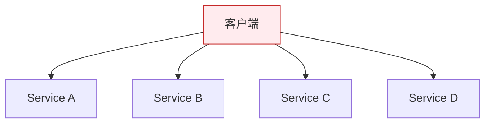
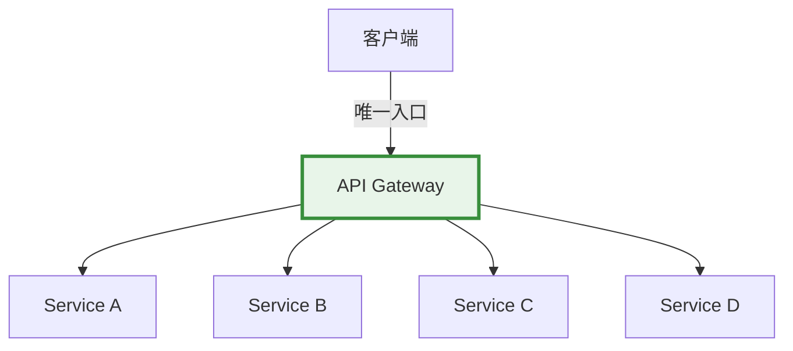
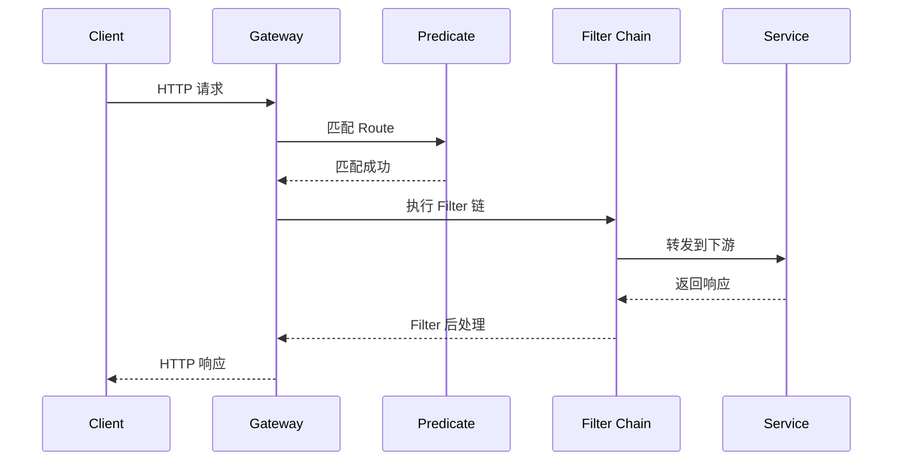

# Spring Cloud Gateway 网关

> ⬅️ [返回 05 Spring Cloud](README.md) | [熔断降级](circuit-breaker.md) | [分布式追踪](distributed-tracing.md)

API 网关是微服务的**统一入口**——所有外部请求都先经过网关，再路由到具体服务。**Spring Cloud Gateway** 是 Spring 官方推出的高性能网关。

---

## 🎯 一句话定位

**Spring Cloud Gateway = "微服务的 Nginx"**——基于 **WebFlux + Reactor**（响应式）实现的**高性能 API 网关**，提供**路由、过滤、限流、熔断、鉴权**等能力。**比 Zuul 更快**（基于 Netty + 响应式）。

---

## 一、为什么需要 API 网关

### 没有网关的微服务



**问题**：
- 客户端需要知道所有服务的地址
- 鉴权逻辑在每个服务写一遍
- 跨域、限流、监控在每个服务写一遍
- 服务升级/迁移要改客户端

### 有网关的微服务



**优点**：
- 客户端只对接网关
- 鉴权、限流、监控集中在网关
- 服务可独立升级（客户端无感）

---

## 二、Spring Cloud Gateway 核心概念

### 3 大组件

| 组件 | 作用 |
|------|------|
| **Route（路由）** | 一条转发规则：`path → uri` |
| **Predicate（断言）** | 匹配条件（path、method、header 等） |
| **Filter（过滤器）** | 请求/响应的处理逻辑（鉴权、限流、修改） |

### 工作流程



---

## 三、快速开始

### 1. 添加依赖

```xml
<dependency>
    <groupId>org.springframework.cloud</groupId>
    <artifactId>spring-cloud-starter-gateway</artifactId>
</dependency>
```

> ⚠️ **不要**同时引入 `spring-boot-starter-web`（Gateway 基于 WebFlux，与 Web 冲突）。

### 2. application.yml

```yaml
spring:
  cloud:
    gateway:
      routes:
        - id: user-service
          uri: lb://user-service                  # lb = LoadBalancer
          predicates:
            - Path=/api/users/**                   # 路径匹配
          filters:
            - StripPrefix=1                        # 去掉 /api 前缀
```

### 3. 启动类

```java
@SpringBootApplication
public class GatewayApplication {
    public static void main(String[] args) {
        SpringApplication.run(GatewayApplication.class, args);
    }
}
```

---

## 四、4 大 Predicate（断言）

### 1. Path 路径匹配

```yaml
predicates:
  - Path=/api/users/**,/api/orders/**
```

### 2. Method HTTP 方法

```yaml
predicates:
  - Method=GET,POST
```

### 3. Header 头部匹配

```yaml
predicates:
  - Header=X-Request-Id, \d+    # Header X-Request-Id 必须为数字
```

### 4. 时间范围

```yaml
predicates:
  - After=2026-01-01T00:00:00+08:00
  - Before=2026-12-31T23:59:59+08:00
```

### 5. 组合 Predicate

```yaml
predicates:
  - Path=/api/users/**
  - Method=GET
  - Header=Authorization, .+
```

---

## 五、6 大 Filter（过滤器）

### 1. StripPrefix 去除前缀

```yaml
filters:
  - StripPrefix=1   # 去掉第 1 段路径
```

`/api/users/1` → `/users/1`

### 2. AddRequestHeader 添加请求头

```yaml
filters:
  - AddRequestHeader=X-Request-Source, gateway
```

### 3. AddResponseHeader 添加响应头

```yaml
filters:
  - AddResponseHeader=X-Response-Time, 100
```

### 4. 自定义 Filter

```java
@Component
public class AuthFilter implements GlobalFilter, Ordered {

    @Override
    public Mono<Void> filter(ServerWebExchange exchange, GatewayFilterChain chain) {
        String token = exchange.getRequest().getHeaders().getFirst("Authorization");
        if (token == null) {
            exchange.getResponse().setStatusCode(HttpStatus.UNAUTHORIZED);
            return exchange.getResponse().setComplete();
        }
        // 校验 token...
        return chain.filter(exchange);
    }

    @Override
    public int getOrder() {
        return -100;  // 优先级（数字越小越先执行）
    }
}
```

### 5. 限流 Filter（集成 Sentinel）

```xml
<dependency>
    <groupId>com.alibaba.cloud</groupId>
    <artifactId>spring-cloud-alibaba-sentinel-gateway</artifactId>
</dependency>
```

```yaml
spring:
  cloud:
    sentinel:
      filter:
        enabled: true
```

### 6. 熔断 Filter

```yaml
filters:
  - name: CircuitBreaker
    args:
      name: userService
      fallbackUri: forward:/fallback
```

---

## 六、动态路由

> **Route 通过配置中心动态更新**——无需重启网关。

```yaml
spring:
  cloud:
    gateway:
      discovery:
        locator:
          enabled: true                  # 开启服务发现
          lower-case-service-id: true
```

自动从**服务注册中心**（Nacos/Eureka/Consul）拉取服务列表，**按服务名路由**：

```yaml
spring:
  cloud:
    gateway:
      routes:
        - id: user-service
          uri: lb://user-service      # lb = 从注册中心负载均衡
          predicates:
            - Path=/users/**
```

---

## 七、统一鉴权

> 📌 本节展示 Gateway 层的鉴权**接入点**与**上下文透传**。JWT 签发、密钥管理、OIDC 流程详见 [04.system-design/05-security/oauth2-oidc/](../../04.system-design/05-security/oauth2-oidc/README.md) 与 [04.system-design/05-security/jwt-security/](../../04.system-design/05-security/jwt-security/README.md)。

```java
@Component
public class JwtAuthFilter implements GlobalFilter, Ordered {

    @Override
    public Mono<Void> filter(ServerWebExchange exchange, GatewayFilterChain chain) {
        ServerHttpRequest request = exchange.getRequest();
        String path = request.getPath().value();

        // 白名单直接放行
        if (path.startsWith("/api/auth/")) {
            return chain.filter(exchange);
        }

        // 校验 Token
        String token = request.getHeaders().getFirst("Authorization");
        if (token == null || !validateToken(token)) {
            exchange.getResponse().setStatusCode(HttpStatus.UNAUTHORIZED);
            return exchange.getResponse().setComplete();
        }

        // 把用户信息透传到下游
        String userId = getUserIdFromToken(token);
        ServerHttpRequest newRequest = request.mutate()
            .header("X-User-Id", userId)
            .build();
        return chain.filter(exchange.mutate().request(newRequest).build());
    }

    @Override
    public int getOrder() {
        return -100;
    }
}
```

---

## 八、跨域配置（CORS）

```yaml
spring:
  cloud:
    gateway:
      globalcors:
        cors-configurations:
          '[/**]':
            allowedOriginPatterns: "*"
            allowedMethods: "*"
            allowedHeaders: "*"
            allowCredentials: true
            maxAge: 3600
```

---

## 九、统一异常处理

```java
@Component
public class JsonExceptionHandler implements ErrorWebExceptionHandler {

    @Override
    public Mono<Void> handle(ServerWebExchange exchange, Throwable ex) {
        ServerHttpResponse response = exchange.getResponse();
        response.setStatusCode(HttpStatus.INTERNAL_SERVER_ERROR);
        response.getHeaders().setContentType(MediaType.APPLICATION_JSON);

        String body = "{\"code\":500,\"message\":\"网关错误\"}";
        DataBuffer buffer = response.bufferFactory().wrap(body.getBytes());
        return response.writeWith(Mono.just(buffer));
    }
}
```

---

## 十、Gateway vs Zuul

| 维度 | Spring Cloud Gateway | Zuul |
|------|----------------------|------|
| **实现** | **WebFlux + Reactor**（响应式） | Servlet（阻塞） |
| **性能** | ⭐⭐⭐⭐⭐（Netty） | ⭐⭐⭐ |
| **长连接** | ✅ WebSocket | ⚠️ 有限 |
| **状态** | ✅ 维护中 | ❌ Zuul 1.x 停更，2.x 复杂 |
| **学习成本** | 中 | 低 |
| **推荐度** | ⭐⭐⭐⭐⭐ | ⭐⭐（老项目） |

> 📌 **新项目必须用 Spring Cloud Gateway**。

---

## 十一、最佳实践

### 1. 网关设计原则

- **单一入口**：所有外部请求经网关
- **轻量化**：网关只做转发、鉴权、限流，业务下沉到下游
- **可观测**：所有请求经过网关 = 统一的日志/监控点

### 2. 性能优化

```yaml
spring:
  cloud:
    gateway:
      httpclient:
        pool:
          type: elastic      # 连接池
          max-idle-time: 15s
        connect-timeout: 1000
        response-timeout: 5s
```

### 3. 灰度发布

```yaml
predicates:
  - Weight=user-service-v2, 10   # 10% 流量到 v2
```

### 4. 与 Sentinel 集成限流

> 详见 [熔断降级](circuit-breaker.md)

---

## 🤔 思考

1. **Gateway 和 Nginx 怎么选？** Nginx 在外网（入口），Gateway 在内网（微服务路由）。Nginx 转发到 Gateway。
2. **为什么 Gateway 不能和 Spring MVC 一起用？** Gateway 基于 WebFlux（响应式），与 Spring MVC 阻塞模型冲突。
3. **网关挂了怎么办？** 网关集群（多实例 + KeepAlive）+ 限流（网关自身被保护）。
4. **为什么默认 lb:// 服务名？** Gateway 集成了 LoadBalancer，自动从注册中心选实例。

---

## 相关章节

- ⬅️ [返回 05 Spring Cloud](README.md)
- [熔断降级](circuit-breaker.md) — 网关层熔断限流
- [分布式追踪](distributed-tracing.md) — 网关透传 TraceId
- [负载均衡](load-balancer.md) — Gateway 集成 LoadBalancer
