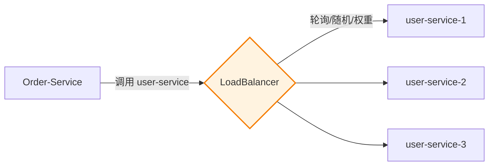

# 客户端负载均衡（LoadBalancer）

> ⬅️ [返回 05 Spring Cloud](README.md) | [服务注册](service-registry/) | [RPC 与 Feign](rpc-and-feign.md)

在微服务架构中，**一个服务有多个实例**（如 user-service 有 3 个实例），客户端需要**选择调用哪个实例**——这就是**负载均衡**。

---

## 🎯 一句话定位

**Spring Cloud LoadBalancer = "客户端选实例"**——客户端从服务注册中心拿到所有可用实例，**按规则（轮询/随机/权重）选一个**调用。**客户端负载均衡**比**服务端负载均衡（Nginx）**少一跳网络，性能更好。

---

## 一、什么是负载均衡



### 2 大模式

| 模式 | 位置 | 代表 | 性能 |
|------|------|------|------|
| **服务端负载均衡** | Nginx / F5 | Nginx | 多一跳网络 |
| **客户端负载均衡** | **客户端** | **Spring Cloud LoadBalancer** | 少一跳，更快 |

---

## 二、Spring Cloud LoadBalancer 是什么

> Spring Cloud **官方**的客户端负载均衡器，**替代了**已停更的 **Netflix Ribbon**。

| 特性 | 说明 |
|------|------|
| **作用** | 客户端从服务注册中心获取实例列表，按规则选一个 |
| **依赖** | spring-cloud-starter-loadbalancer |
| **集成** | 与 OpenFeign、RestTemplate、WebClient 集成 |
| **可扩展** | 自定义负载均衡策略 |

---

## 三、4 种内置负载均衡策略

| 策略 | 类 | 算法 | 适用场景 |
|------|------|------|---------|
| **轮询**（**默认**） | `RoundRobinLoadBalancer` | 按顺序依次选 | 性能相近的实例 |
| **随机** | `RandomLoadBalancer` | 随机选 | 简单场景 |
| **权重响应时间** | `WeightedResponseTimeLoadBalancer` | 响应越快权重越高 | 实例性能不均 |
| **Nacos 权重** | `NacosLoadBalancer` | 按 Nacos 配置的权重 | 与 Nacos 集成 |

---

## 四、集成 OpenFeign（**最常用**）

> OpenFeign **默认集成** LoadBalancer，无需额外配置。

### 1. 添加依赖

```xml
<dependency>
    <groupId>org.springframework.cloud</groupId>
    <artifactId>spring-cloud-starter-openfeign</artifactId>
</dependency>
```

### 2. 启用 Feign

```java
@SpringBootApplication
@EnableFeignClients
public class OrderServiceApplication { ... }
```

### 3. 定义 Feign Client

```java
@FeignClient(name = "user-service")  // name = 服务名
public interface UserFeignClient {

    @GetMapping("/users/{id}")
    User getUser(@PathVariable Long id);
}
```

### 4. 调用

```java
@Service
public class OrderService {

    @Autowired
    private UserFeignClient userFeignClient;

    public Order createOrder(Long userId) {
        // 自动负载均衡：调用 user-service 的某个实例
        User user = userFeignClient.getUser(userId);
        return new Order(user);
    }
}
```

---

## 五、自定义负载均衡策略

### 1. 实现 ReactorLoadBalancer

```java
public class CustomLoadBalancer implements ReactorServiceInstanceLoadBalancer {

    @Override
    public Mono<Response<ServiceInstance>> choose(Request request) {
        // 自定义选择逻辑（如按 IP Hash、按 Header）
        ServiceInstance instance = ...;  // 选一个实例
        return Mono.just(new DefaultResponse(instance));
    }
}
```

### 2. 注册为 Bean

```java
@Configuration
public class LoadBalancerConfig {

    @Bean
    public ReactorLoadBalancer<ServiceInstance> customLoadBalancer(
            Environment environment,
            LoadBalancerClientFactory loadBalancerClientFactory) {
        String name = environment.getProperty(LoadBalancerClientFactory.PROPERTY_NAME);
        return new CustomLoadBalancer(loadBalancerClientFactory.getLazyProvider(name, ServiceInstanceListSupplier.class), name);
    }
}
```

### 3. 在 application.yml 中指定

> 📌 Spring Cloud LoadBalancer（推荐，2020+ 替代 Ribbon）

```yaml
# 全局默认（Spring Cloud LoadBalancer）
spring:
  cloud:
    loadbalancer:
      configurations: random
      cache:
        capacity: 256
        enabled: true
      health-check:
        enabled: true
        interval: 5s
        path: /actuator/health

# 特定服务（LoadBalancer 配置）
user-service:
  ribbon:
    enabled: false  # 显式禁用 Ribbon（如果类路径中有 Ribbon）
```

---

## 六、与 RestTemplate 集成

```java
@Configuration
public class RestTemplateConfig {

    @Bean
    @LoadBalanced  // 关键：让 RestTemplate 自动负载均衡
    public RestTemplate restTemplate() {
        return new RestTemplate();
    }
}

@Service
public class OrderService {

    @Autowired
    private RestTemplate restTemplate;

    public User getUser(Long id) {
        // 用服务名代替 host:port
        return restTemplate.getForObject("http://user-service/users/" + id, User.class);
    }
}
```

---

## 七、3 种负载均衡算法对比

| 算法 | 优点 | 缺点 | 适用 |
|------|------|------|------|
| **轮询** | 简单、公平 | 不考虑实例性能 | 性能相近的实例 |
| **随机** | 简单 | 不考虑请求特征 | 简单场景 |
| **权重** | 性能好的实例分配更多请求 | 权重需要调优 | 实例性能不均 |
| **最小连接数** | 动态感知实例压力 | 维护连接数 | 长连接场景 |
| **IP Hash** | 同 IP 路由到同实例 | 负载不均 | 需要会话保持 |
| **响应时间加权** | 动态感知实例性能 | 需要历史数据 | 复杂生产环境 |

---

## 八、生产级实践

### 1. 故障转移

> LoadBalancer 自动过滤**不健康实例**（基于健康检查）。

```yaml
spring:
  cloud:
    loadbalancer:
      health-check:
        enabled: true
```

### 2. 重试机制

> 选中的实例失败时自动重试另一个实例。

```java
@Bean
@LoadBalanced
public RestTemplate restTemplate() {
    return new RestTemplate();
}

// 配置重试
spring.cloud.loadbalancer.retry.enabled=true
```

### 3. 自定义元数据路由

```java
public class MetadataLoadBalancer implements ReactorServiceInstanceLoadBalancer {

    @Override
    public Mono<Response<ServiceInstance>> choose(Request request) {
        // 根据请求 Header 选实例
        // 例如：version=2.0 → 选 metadata.version=2.0 的实例
    }
}
```

### 4. 与 Sentinel / Resilience4j 集成

> 负载均衡 + 熔断降级 + 限流 → 微服务完整流量治理。

---

## 九、LoadBalancer vs Ribbon

| 维度 | Spring Cloud LoadBalancer | Netflix Ribbon |
|------|--------------------------|----------------|
| **维护方** | Spring 官方 | Netflix（**已停更**） |
| **状态** | ✅ 活跃 | ❌ 维护模式 |
| **响应式支持** | ✅（基于 Reactor） | ❌ |
| **可扩展性** | 高（基于 Reactive） | 一般 |
| **性能** | 更好 | 良好 |
| **推荐度** | ⭐⭐⭐⭐⭐ | ⭐⭐（仅老项目） |

> 📌 **新项目必须用 Spring Cloud LoadBalancer**。

---

## 🤔 思考

1. **客户端负载均衡为什么比服务端快？** 少一跳（Nginx），客户端直接选实例调用。
2. **怎么保证同用户路由到同实例？** IP Hash 或 Session 粘性（`spring.session.store-type=redis`）。
3. **LoadBalancer 怎么知道实例不健康？** 通过健康检查（`/actuator/health`）+ 注册中心心跳。
4. **为什么默认轮询？** 简单公平，适合 99% 场景。

---

## 相关章节

- ⬅️ [返回 05 Spring Cloud](README.md)
- [服务注册](service-registry/) — LoadBalancer 依赖服务注册中心
- [RPC 与 Feign](rpc-and-feign.md) — LoadBalancer 与 Feign 集成
- [熔断降级](circuit-breaker.md) — 调用失败时的兜底
