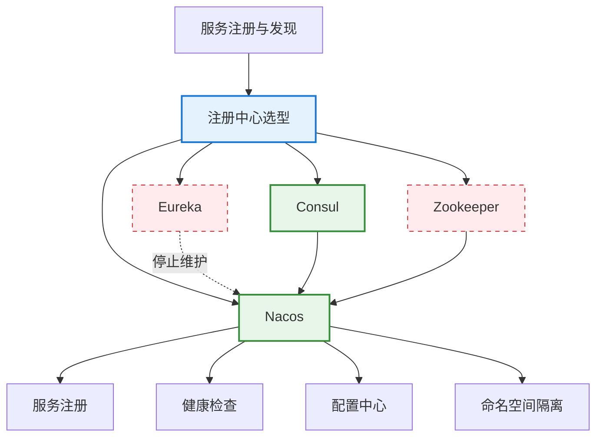

<!--
module:
  parent: spring
  slug: spring/service-registry
  type: article
  category: 主模块子文章
  summary: 服务注册与发现
-->

# 服务注册与发现

> 微服务实例如何注册、发现与心跳 — Eureka / Consul / Nacos / Zookeeper 对比

---
---

## 导航

| 序号 | 主题 | 核心内容 |
|------|------|---------|
| 1 | [eureka-vs-consul-vs-nacos-vs-zookeeper.md](eureka-vs-consul-vs-nacos-vs-zookeeper.md) | 4 大注册中心 9 维对比：AP/CP、健康检查、多数据中心 |

---

## 知识脉络

---

## 核心概念速查

| 概念 | 一句话定义 |
|------|----------|
| **服务注册** | 服务实例启动时向注册中心上报自身地址（IP + 端口）|
| **服务发现** | 消费者通过注册中心查询可用实例列表 |
| **心跳检测** | 服务定期发送心跳，注册中心据此判断实例健康状态 |
| **AP vs CP** | AP（高可用，允许短暂不一致）vs CP（强一致，可能不可用）|
| **命名空间/分组** | 逻辑隔离多环境（dev/test/prod）或多业务线 |

---

## 4 大注册中心对比

| 维度 | Eureka | Consul | Zookeeper | Nacos |
|------|--------|--------|-----------|-------|
| **CAP 模型** | AP | CP | CP | AP + CP 可切换 |
| **健康检查** | TCP/HTTP 客户端上报 | HTTP/TCP/gRPC/Script | 会话心跳 | HTTP/MySQL/TCP |
| **多数据中心** | 不支持（单集群）| 原生支持 | 需额外配置 | 原生支持 |
| **配置中心** | 不支持 | 支持 K/V | 支持 ZNode | 原生支持（二合一）|
| **维护状态** | 停止维护 | 活跃 | 活跃 | 活跃（国内首选）|
| **Spring Cloud 集成** | spring-cloud-starter-netflix-eureka | spring-cloud-starter-consul | 需自封装 | spring-cloud-starter-alibaba-nacos |

---

## 相关章节

- 上游：[`05 Spring Cloud`](../README.md) — 7 大组件各管什么
- 关联：[`负载均衡`](../load-balancer.md) — 服务发现是负载均衡的前置
- 关联：[`配置中心`](../config-center.md) — Nacos 同时提供注册 + 配置
- 关联：[`04 系统设计/微服务`](../../../04.system-design/01-foundation/system-design-basics/microservices/README.md) — 微服务架构理论基础

---

> 建议路径：先看对比表建立选型认知 → 新项目直接看 Nacos 集成 → 遗留项目按需阅读 Eureka/Consul

← [返回: Spring 全家桶 · service-registry](README.md)
