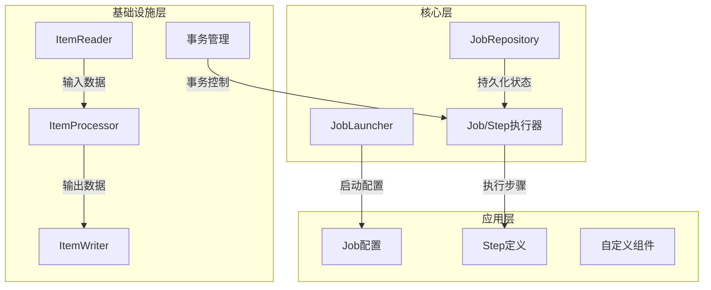
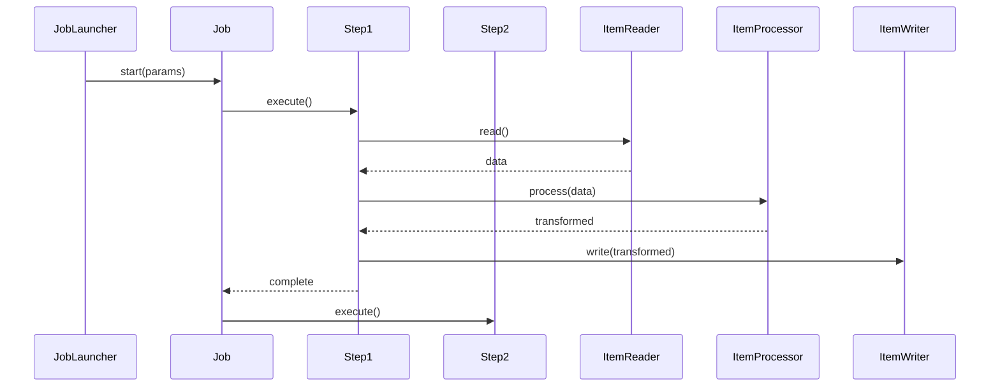
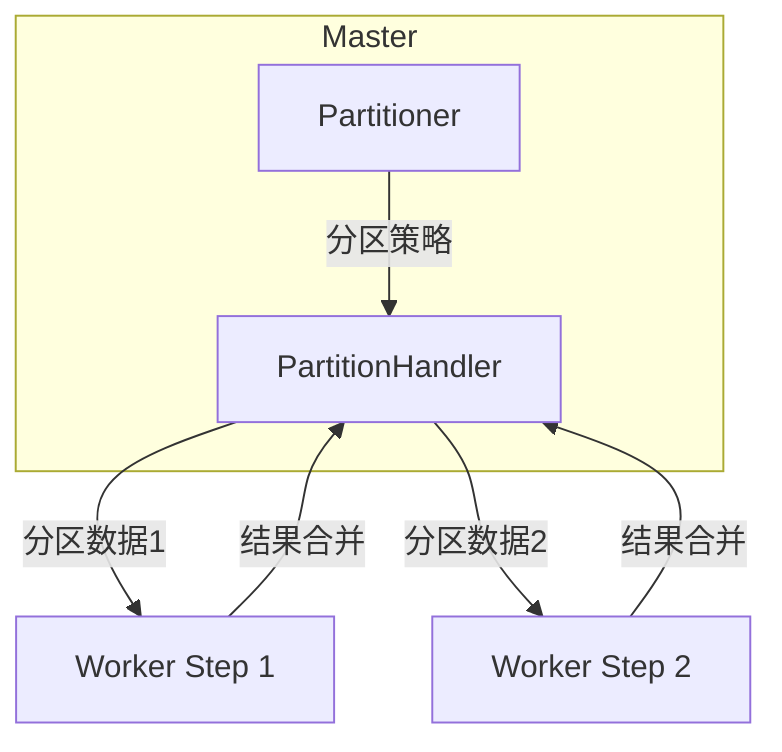
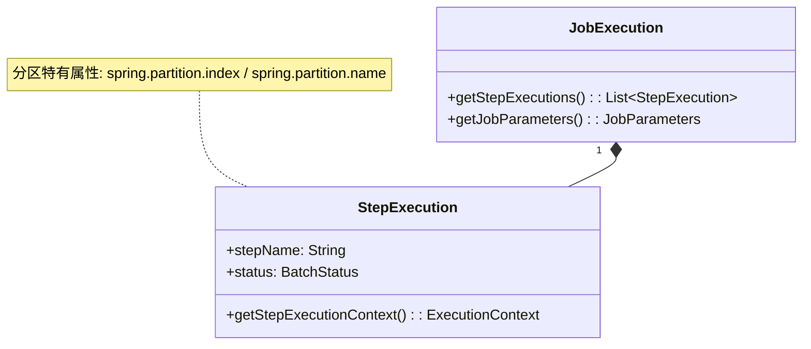

<!--
module:
  parent: spring
  slug: spring/batch
  type: article
  category: 主模块子文章
  summary: Spring Batch 批处理——分层架构、Job/Step 模型与大数据量实战。
-->

# Spring Batch 批处理

## 一、Spring Batch 概述
Spring Batch 是 Spring 生态系统中专门为批处理设计的轻量级框架，适用于数据迁移、ETL（Extract-Transform-Load）、定时报表生成等场景。其核心设计理念是通过分层架构实现高内聚低耦合，支持从单线程到分布式的大规模数据处理。

### 核心架构分层

**图解说明**：
1. **应用层**：开发者自定义批处理逻辑
2. **核心层**：框架控制流（JobLauncher启动任务，JobRepository持久化元数据）
3. **基础设施层**：数据读写组件和事务管理

## 二、核心组件详解

### 1. Job 生命周期管理
```java
@Bean
public Job importUserJob() {
    return jobBuilderFactory.get("importUserJob")
            .incrementer(new RunIdIncrementer())
            .start(step1())
            .next(step2())
            .build();
}
```
**关键特性**：
- 支持参数化执行（JobParameters）
- 可通过JobExplorer查询历史执行记录
- 失败自动重试（需配置RetryPolicy）

### 2. Step 执行模型

**执行模式**：
- **Chunk-oriented**：默认模式，每处理N条记录提交一次事务
- **Tasklet**：自定义任务单元（如文件移动）

### 3. 数据流组件
| 组件类型 | 典型实现 | 适用场景 |
|---------|---------|---------|
| ItemReader | JdbcCursorItemReader | 数据库游标读取 |
|           | FlatFileItemReader | CSV/TXT文件解析 |
|           | StaxEventItemReader | XML流式处理 |
| ItemProcessor | 自定义转换类 | 数据清洗/转换 |
| ItemWriter | JdbcBatchItemWriter | 批量数据库写入 |
|            | JmsItemWriter | JMS队列写入 |

## 三、高级特性实现

### 1. 并行处理架构（新增自定义分区内容）

#### 核心分区模型


#### 关键组件说明
1. **Partitioner（自定义分区器）**  
   实现`org.springframework.batch.core.partition.support.Partitioner`接口，核心方法：
   ```java
   public Map<String, ExecutionContext> partition(int gridSize) {
       // 返回分区ID到执行上下文的映射
       Map<String, ExecutionContext> partitions = new HashMap<>();
       for (int i = 0; i < gridSize; i++) {
           ExecutionContext context = new ExecutionContext();
           context.put("partition.id", i);
           context.put("min.value", i * 1000);
           context.put("max.value", (i + 1) * 1000 - 1);
           partitions.put("partition" + i, context);
       }
       return partitions;
   }
   ```

2. **PartitionHandler（分区处理器）**  
   默认使用`TaskExecutorPartitionHandler`，配置示例：
   ```java
   @Bean
   public Step masterStep() {
       return stepBuilderFactory.get("masterStep")
               .partitioner("workerStep", new RangePartitioner()) // 注入自定义Partitioner
               .step(workerStep())
               .gridSize(4) // 并行度
               .taskExecutor(taskExecutor()) // 线程池
               .build();
   }
   ```

### 2. 自定义分区实现案例

#### 数据库范围分区
```java
public class DatabaseRangePartitioner implements Partitioner {
    @Override
    public Map<String, ExecutionContext> partition(int gridSize) {
        Map<String, ExecutionContext> partitions = new HashMap<>();
        
        // 1. 查询数据总量
        JdbcTemplate jdbcTemplate = new JdbcTemplate(dataSource);
        int total = jdbcTemplate.queryForObject("SELECT COUNT(*) FROM orders", Integer.class);
        
        // 2. 计算每个分区范围
        int partitionSize = (int) Math.ceil(total / (double)gridSize);
        
        // 3. 生成分区上下文
        for (int i = 0; i < gridSize; i++) {
            int min = i * partitionSize;
            int max = Math.min((i + 1) * partitionSize, total - 1);
            
            ExecutionContext context = new ExecutionContext();
            context.put("min.id", min);
            context.put("max.id", max);
            partitions.put("partition" + i, context);
        }
        return partitions;
    }
}
```

#### 文件多线程处理
```java
public class FileSplitterPartitioner implements Partitioner {
    @Override
    public Map<String, ExecutionContext> partition(int gridSize) {
        Map<String, ExecutionContext> partitions = new HashMap<>();
        
        // 1. 列出所有文件
        File dir = new File("/data/input");
        File[] files = dir.listFiles((d, name) -> name.endsWith(".csv"));
        
        // 2. 分配文件给分区
        for (int i = 0; i < Math.min(gridSize, files.length); i++) {
            ExecutionContext context = new ExecutionContext();
            context.put("file.name", files[i].getAbsolutePath());
            partitions.put("partition" + i, context);
        }
        return partitions;
    }
}
```

### 3. 分区结果合并策略

#### 自定义结果收集器
```java
public class AggregateItemWriter implements ItemWriter<List<Order>> {
    private final ItemWriter<Order> delegate;
    
    public AggregateItemWriter(ItemWriter<Order> delegate) {
        this.delegate = delegate;
    }

    @Override
    public void write(List<? extends List<Order>> items) throws Exception {
        // 扁平化所有分区结果
        List<Order> aggregated = items.stream()
                .flatMap(List::stream)
                .collect(Collectors.toList());
        
        // 一次性写入
        delegate.write(aggregated);
    }
}
```

#### 配置示例
```java
@Bean
public Step workerStep() {
    return stepBuilderFactory.get("workerStep")
            .<Order, Order>chunk(100)
            .reader(jdbcReader()) // 使用分区上下文参数
            .processor(orderProcessor())
            .writer(orderWriter())
            .build();
}

@Bean
public Step masterStep() {
    return stepBuilderFactory.get("masterStep")
            .partitioner("workerStep", new DatabaseRangePartitioner())
            .step(workerStep())
            .aggregator(new AggregateItemWriter(finalWriter())) // 注入合并器
            .gridSize(4)
            .build();
}
```

## 四、监控体系（新增分区监控）

#### 分区执行状态跟踪


#### 自定义监控逻辑
```java
public class PartitionMonitorListener implements StepExecutionListener {
    @Override
    public void beforeStep(StepExecution stepExecution) {
        if (stepExecution.getExecutionContext().containsKey("spring.partition.index")) {
            log.info("Starting partition {} of {}",
                    stepExecution.getExecutionContext().getInt("spring.partition.index"),
                    stepExecution.getJobExecution().getExecutionContext().getInt("total.partitions"));
        }
    }
}
```

## 五、典型应用场景

### 大数据量并行导入
```java
@Bean
public Job parallelImportJob() {
    return jobBuilderFactory.get("parallelImportJob")
            .start(masterStep())
            .build();
}

@Bean
public Step masterStep() {
    return stepBuilderFactory.get("masterStep")
            .partitioner("workerStep", new DatabaseRangePartitioner())
            .step(workerStep())
            .gridSize(8) // 使用8个线程
            .taskExecutor(new SimpleAsyncTaskExecutor() {{
                setConcurrencyLimit(8);
            }})
            .build();
}
```

## 六、性能优化实践

### 1. 分区参数调优表
| 参数        | 推荐值            | 说明              |
|-----------|----------------|-----------------|
| gridSize  | CPU核心数*2       | 通常设置为线程池大小的1-2倍 |
| chunkSize | 500-2000       | 根据分区数据量调整       |
| 事务隔离级别    | READ_COMMITTED | 防止分区间数据竞争       |

### 2. 线程池配置最佳实践
```java
@Bean
public TaskExecutor taskExecutor() {
    ThreadPoolTaskExecutor executor = new ThreadPoolTaskExecutor();
    executor.setCorePoolSize(4);
    executor.setMaxPoolSize(8);
    executor.setQueueCapacity(100);
    executor.setThreadNamePrefix("BatchWorker-");
    executor.setRejectedExecutionHandler(new ThreadPoolExecutor.CallerRunsPolicy());
    return executor;
}
```

## 七、常见问题解决方案

### 1. 分区数据不均衡
**解决方案**：
```java
// 改进版分区器（动态调整范围）
public class BalancedRangePartitioner implements Partitioner {
    @Override
    public Map<String, ExecutionContext> partition(int gridSize) {
        // 实现基于数据分布的动态分区算法
        // 例如先采样统计，再分配范围
    }
}
```

### 2. 分区间重复处理
**解决方案**：
```java
// 在Worker Step中添加边界检查
public class SafeRangeItemReader implements ItemReader<Order> {
    private final JdbcCursorItemReader<Order> delegate;
    private final int minId;
    private final int maxId;

    @Override
    public Order read() {
        Order order = delegate.read();
        if (order != null && (order.getId() < minId || order.getId() > maxId)) {
            return null; // 跳过越界数据
        }
        return order;
    }
}
```

### 3. 分区结果合并顺序问题
**解决方案**：
```java
// 使用有序合并策略
public class OrderedAggregateWriter implements ItemWriter<List<Order>> {
    @Override
    public void write(List<? extends List<Order>> items) {
        // 按分区ID排序后合并
        items.stream()
            .sorted(Comparator.comparingInt(
                list -> Integer.parseInt(
                    list.get(0).getExecutionContext().get("spring.partition.index").toString()
                )))
            .flatMap(List::stream)
            .forEach(finalWriter::write);
    }
}
```

## 八、学习资源推荐（新增分区专题）

1. **官方文档**：[Partitioning a Step](https://docs.spring.io/spring-batch/docs/current/reference/html/scalability.html#partitioning)
2. **实战教程**：[Spring Batch Parallel Processing](https://spring.io/guides/gs/batch-processing/)
3. **性能测试**：[Partitioning Benchmark](https://github.com/spring-projects/spring-batch/tree/main/spring-batch-samples/src/main/java/org/springframework/batch/sample/partitioning)

## 九、失败重试与跳过

Spring Batch 在 chunk 处理中提供**容错**机制：通过 `faultTolerant()` 进入容错模式，配合 `skip` / `retry` / `noSkip` / `noRetry` 分类异常，决定"哪些异常可以跳过"、"哪些异常可以重试"、"哪些异常必须立刻失败"。

### 1. skip 跳过策略

```java
@Bean
public Step importStep() {
    return stepBuilderFactory.get("importStep")
            .<Order, Order>chunk(100)
            .reader(reader())
            .processor(processor())
            .writer(writer())
            .faultTolerant()                            // 开启容错
            .skip(Exception.class)                      // 匹配任意异常
            .skipLimit(10)                              // 整个 step 最多跳过 10 条
            .skip(DataIntegrityViolationException.class) // 多次 skip 可叠加
            .build();
}
```

**关键点**：
- `skipLimit` 是**累积**上限，超过后整 Step 失败。
- 跳过发生在 item 处理链任意环节（reader/processor/writer）。
- 跳过的对象会被 `StepExecution` 记录到 `skipCount`，便于监控告警。

### 2. retry 重试策略

```java
@Bean
public Step retryStep() {
    return stepBuilderFactory.get("retryStep")
            .<Order, Order>chunk(50)
            .reader(reader())
            .writer(writer())
            .faultTolerant()
            .retryLimit(3)                              // 最多重试 3 次
            .retry(TransientDataAccessException.class)  // 瞬时异常才重试
            .retry(DeadlockLoserDataAccessException.class)
            .build();
}
```

- 重试只在 **chunk 边界**生效：reader 抛异常 → 重新读整个 chunk；writer 抛异常 → 重写整个 chunk。
- 超过 `retryLimit` 后异常向上抛，触发 `skip` 决策或 Step 失败。

### 3. noSkip / noRetry 异常分类器

黑白名单混合使用，对"已知不可重试"的异常做精准排除：

```java
.faultTolerant()
.skipLimit(100)
.retryLimit(3)
.retry(SQLException.class)
.noRetry(FatalBatchException.class)               // 致命异常：禁止重试
.skip(ValidationException.class)                   // 业务校验失败：直接跳过
.noSkip(PessimisticLockingFailureException.class)  // 锁冲突：禁止跳过（必须让上游感知）
```

`noSkip` / `noRetry` 的优先级高于 `skip` / `retry`，常用于"非瞬时/不可恢复"异常的隔离。

### 4. SkipPolicy / RetryPolicy 编程式

`SimpleSkipPolicy` / `ExceptionClassifierSkipPolicy` 提供更细粒度控制：

```java
@Bean
public SkipPolicy skipPolicy() {
    return new ExceptionClassifierSkipPolicy()
        .classify(SQLException.class, true)        // 重试后仍失败也跳
        .classify(ValidationException.class, true)
        .classify(OutOfMemoryError.class, false);  // OOM 不可跳
}
```

### 5. 与 Spring Retry @Retryable 的关系

| 维度 | Spring Batch retry | Spring Retry @Retryable |
|------|-------------------|------------------------|
| 粒度 | chunk（批） | 单次方法调用 |
| 触发位置 | Reader/Processor/Writer 链 | AOP 拦截注解方法 |
| 重试范围 | 重读/重写整个 chunk | 同一方法 N 次 |
| 事务边界 | chunk 一致 | 默认无事务，需配合 `@Transactional` |
| 适用 | 大批量处理，瞬时 DB/网络抖动 | 单点外部调用（HTTP、RPC） |

**经验法则**：
- 数据库/消息中间件**批处理抖动** → Spring Batch retry（chunk 一致性更好）。
- 单次外部 API/HTTP 调用 → Spring Retry `@Retryable`（精细控制每个请求）。
- 二者可同时存在：chunk 内部 Processor 调用外部 API 时，外层 `@Retryable` + 内层 chunk retry 互不干扰。

## 十、Job 调度与重启

批处理 Job 通常由调度系统周期性触发。Spring Batch 通过 `JobLauncher` + `JobParameters` 控制启动行为，结合 `JobRepository` 持久化元数据，实现可重启、可恢复的执行模型。

### 1. JobLauncher.run 启动

```java
@Service
@RequiredArgsConstructor
public class BatchTrigger {

    private final JobLauncher jobLauncher;        // 注入 Spring Boot 自动配置实例
    private final Job importUserJob;

    public JobExecution run(String bizDate) throws Exception {
        JobParameters params = new JobParametersBuilder()
                .addString("bizDate", bizDate)    // 业务日期：相同值触发 restart
                .addLong("timestamp", System.currentTimeMillis()) // 唯一性
                .toJobParameters();
        return jobLauncher.run(importUserJob, params);
    }
}
```

### 2. JobParameters / JobInstance / JobExecution

三者关系是 Spring Batch 重启机制的核心：

| 类型 | 唯一性 | 持久化 | 含义 |
|------|--------|--------|------|
| **JobParameters** | 用于识别 Instance | 写入 BATCH_JOB_PARAMS 表 | 一次执行的入参（bizDate、chunkSize…） |
| **JobInstance** | `(jobName, parameters 标识字段)` 唯一 | 写入 BATCH_JOB_INSTANCE | 同一组参数对应**一个**逻辑实例 |
| **JobExecution** | 每次 run 一次 | 写入 BATCH_JOB_EXECUTION | 同一 Instance 可有多次执行（启动 + 多次重启） |

`JobParameters` 中标记为 `identifying=true` 的字段决定 Instance 唯一性；`RunIdIncrementer` 会自动追加一个递增的 `run.id` 字段，保证每次 run 都成为新的 Instance。

### 3. Restart 机制

当一个 JobExecution 状态为 `FAILED` 时，使用**完全相同**的 identifying JobParameters 再次 `run`，会触发 restart 而非新实例：

```java
public JobExecution restartFailed(String bizDate) {
    JobParameters params = new JobParametersBuilder()
            .addString("bizDate", bizDate)            // 相同 identifying
            .toJobParameters();
    return jobLauncher.run(importUserJob, params);   // 自动查找 FAILED 执行
}
```

**重启边界**：
- Step 内的 `chunk` 重新从上次提交位置读（依赖 `JobRepository` 的 `BATCH_STEP_EXECUTION_CONTEXT`）。
- Step 之间的"边界"由 `allowStartIfComplete` 控制，默认已完成 Step 不会重跑。
- 编程式判断：注入 `JobExplorer` 查 `findJobInstancesByJobName`、`getJobExecutions`。

### 4. 调度方式

#### 4.1 @Scheduled（最简单）

```java
@Component
@RequiredArgsConstructor
public class ScheduledJob {

    private final BatchTrigger trigger;

    @Scheduled(cron = "0 0 2 * * *")              // 每天凌晨 2 点
    public void dailyImport() {
        String bizDate = LocalDate.now().minusDays(1).toString();
        trigger.run(bizDate);
    }
}
```

#### 4.2 Quartz（企业级定时）

Quartz 支持集群、Calendar、错过执行补偿：

```xml
<dependency>
    <groupId>org.springframework.boot</groupId>
    <artifactId>spring-boot-starter-quartz</artifactId>
</dependency>
```

```java
@Bean
public JobDetail jobDetail() {
    return JobBuilder.newJob().ofType(BatchJobLauncher.class)
            .storeDurably().withIdentity("importJob").build();
}

@Bean
public Trigger trigger(JobDetail jobDetail) {
    return TriggerBuilder.newTrigger().forJob(jobDetail)
            .withSchedule(CronScheduleBuilder.cronSchedule("0 0 2 * * ?"))
            .build();
}
```

#### 4.3 Spring Cloud Task（短生命周期微服务批处理）

把每个 Job 跑在独立的微服务进程（适合 Kubernetes Job）：

```java
@SpringBootApplication
@EnableTask
@EnableBatchProcessing
public class BatchTaskApplication implements CommandLineRunner {
    public static void main(String[] args) {
        SpringApplication.run(BatchTaskApplication.class, args);
    }

    @Override
    public void run(String... args) {
        // 进程启动即跑，跑完退出；适合 K8s Job/CronJob
        jobLauncher.run(importUserJob, new JobParametersBuilder()
                .addString("bizDate", args[0]).toJobParameters());
    }
}
```

#### 4.4 REST endpoint（手动触发 / 平台触发）

```java
@RestController
@RequiredArgsConstructor
public class JobController {

    private final JobLauncher launcher;
    private final Job importUserJob;

    @PostMapping("/jobs/import")
    public Long launch(@RequestParam String bizDate) throws Exception {
        JobExecution exec = launcher.run(importUserJob,
                new JobParametersBuilder().addString("bizDate", bizDate).toJobParameters());
        return exec.getId();
    }
}
```

### 5. 分布式调度

跨 JVM 协作处理同一个大数据量任务，三种主流方案：

| 方案 | 思路 | 适用 |
|------|------|------|
| **Remote Chunking** | Master 节点读数据，远程 Worker 节点处理/写；通过消息队列（Kafka/RabbitMQ）传输 chunk | 算力分散、I/O 密集 |
| **Partitioning** | 多个本地/远程 Worker 并行处理分片；Master 不参与处理 | 单库分片并行导入 |
| **Spring Cloud Task** | 每个分片一个独立微服务，K8s CronJob 调度 | 云原生、弹性扩缩 |

**Remote Chunking 示例**（Kafka 通道）：

```java
@Bean
public IntegrationFlow chunkRequestFlow(ConnectionFactory rabbit) {
    return IntegrationFlows.from("chunkRequests")
            .handle(Amqp.outboundAdapter(rabbit).routingKey("requests"))
            .get();
}

@Bean
public Step masterStep() {
    return stepBuilderFactory.get("master")
            .<Order, Order>chunk(100)
            .reader(reader())
            .writer(chunkProcessorWriter())    // 写到消息队列
            .build();
}
```

详细对比参见 [Spring Batch 官方 Scalability 章节](https://docs.spring.io/spring-batch/docs/current/reference/html/scalability.html)。

> 监控与告警建议接入 07-observability 中的 [Micrometer](../07-observability/micrometer.md) 与 [Actuator](../07-observability/actuator.md)。