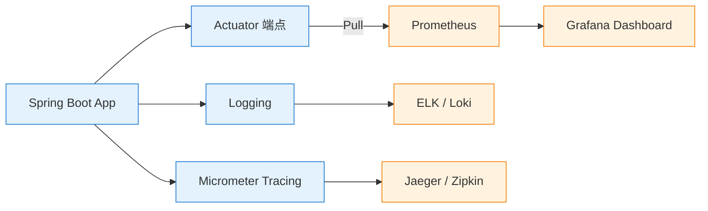

# 07 可观测性

> 最后更新: 2026-06-09
> ⬅️ [返回 Spring 顶层](../README.md)

---

## 🎯 一句话定位

**Spring 可观测性 = Actuator（端点暴露）+ Micrometer（指标抽象）+ Prometheus/Grafana（采集与可视化）**——构成云原生时代的"监控三件套"，对应可观测性的三大支柱：**指标（Metrics）/日志（Logs）/追踪（Tracing）**。

---

## 📚 章节导航

| 章节 | 文件 | 核心问题 | 建议时长 |
|:----:|:----|:---------|:--------:|
| **Actuator 端点** | [actuator.md](actuator.md) | 如何暴露健康检查/指标/日志端点？ | 25 min |
| **Micrometer 指标** | [micrometer.md](micrometer.md) | 如何自定义业务指标（Counter/Gauge/Timer）？ | 20 min |
| **Prometheus + Grafana** | [prometheus-grafana.md](prometheus-grafana.md) | 完整的指标采集与可视化方案 | 30 min |
| **日志与追踪** | 集成在 [Micrometer Tracing](../05-spring-cloud/distributed-tracing.md) 中 | Micrometer Tracing + 日志关联 | 20 min |

---

## 🧭 可观测性三大支柱

| 支柱 | 工具栈 | 答什么问题 |
|:-----|:-------|:----------|
| **指标 Metrics** | Micrometer + Prometheus + Grafana | 系统现在的状态是什么？（QPS/延迟/错误率） |
| **日志 Logs** | Logback + ELK / Loki | 系统发生了什么？（错误堆栈、业务事件） |
| **追踪 Tracing** | Micrometer Tracing + Jaeger | 请求经过了哪些服务？（调用链、瓶颈） |

---

## ⚡ 核心概念速查

| 概念 | 一句话定义 | 章节 |
|------|----------|:----:|
| **Actuator** | Spring Boot 的生产就绪模块，暴露 HTTP/JMX 端点 | [Actuator](actuator.md) |
| **/actuator/health** | 健康检查端点（K8s liveness/readiness 探针） | [Actuator](actuator.md) |
| **/actuator/metrics** | 指标端点（JVM 内存/线程池/HTTP 请求） | [Actuator](actuator.md) |
| **/actuator/prometheus** | Prometheus 格式指标端点 | [Actuator](actuator.md) |
| **Micrometer** | 指标门面库（类似 SLF4J） | P3 补充 |
| **Counter** | 单调递增计数器（请求次数） | P3 补充 |
| **Gauge** | 瞬时值（活跃连接数、队列长度） | P3 补充 |
| **Timer** | 耗时统计（自动算 P50/P95/P99） | P3 补充 |

---

## 🤔 思考

1. **为什么需要 Micrometer？** 不同监控系统（Prometheus/Datadog/InfluxDB）API 各异，Micrometer 统一门面。
2. **健康检查端点如何保护？** 通过 Spring Security 限制 /actuator/** 仅管理员访问，/actuator/health 公开。
3. **指标标签有什么坑？** 高基数标签（如 userId）会导致指标爆炸，要用 MeterFilter 过滤。
4. **日志和追踪怎么关联？** 用 TraceId + SpanId 注入 MDC，日志格式中自动包含。

---

## 相关章节

- ⬅️ [返回 Spring 顶层](../README.md)
- ⬅️ [04 Spring Boot](../04-spring-boot/README.md) — Actuator 是 Boot 的核心模块
- ➡️ [05 Spring Cloud](../05-spring-cloud/README.md) — 链路追踪是微服务必备
- [04.system-design/07-deployment/observability](../04.system-design/07-deployment/observability/README.md) — 监控体系理论

---

> 🚀 从 [Actuator 端点](actuator.md) 开始
