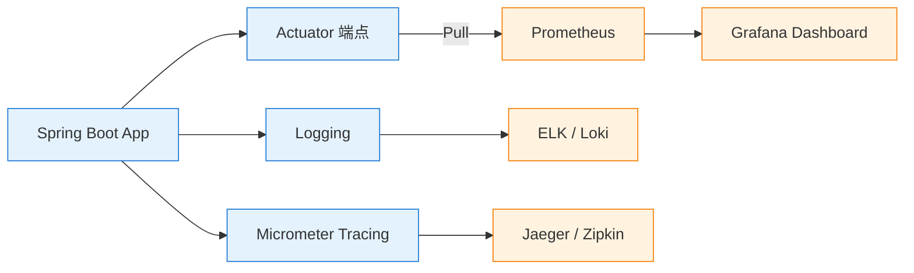

<!--
module:
  parent: spring
  slug: spring/observability
  type: index
  category: 后端框架 / Spring 全家桶
  topic: Spring 可观测性
  audience: Java 后端工程师
  summary: Spring 可观测性 = Actuator + Micrometer + Prometheus/Grafana（5 篇：Actuator 端点/Micrometer 指标/Prometheus+Grafana/健康探针/日志聚合）
-->

# 07 可观测性

> 一句话定位：**Spring 可观测性 = Actuator（端点暴露）+ Micrometer（指标抽象）+ Prometheus/Grafana（采集与可视化）**——云原生时代的"监控三件套"。

> ⬅️ [返回 Spring 顶层](../README.md)

---
## 引言：反直觉代码

07 可观测性 的关键不是语法——是**看起来对**的代码背后那些'踩坑点'。

本篇用 3 个反直觉片段切入，把面试/生产中常被问起、但一深入就漏馅的点摆出来。

---

## 🎯 一句话定位

**Spring 可观测性 = Actuator（端点暴露）+ Micrometer（指标抽象）+ Prometheus/Grafana（采集与可视化）**——构成云原生时代的"监控三件套"，对应可观测性的三大支柱：**指标（Metrics）/日志（Logs）/追踪（Tracing）**。

---

## 📚 章节导航

| 章节 | 文件 | 核心问题 | 建议时长 |
|:----:|:----|:---------|:--------:|
| **Actuator 端点** | [actuator.md](actuator.md) | 如何暴露健康检查/指标/日志端点？ | 25 min |
| **Micrometer 指标** | [micrometer.md](micrometer.md) | 如何自定义业务指标（Counter/Gauge/Timer/DistributionSummary/LongTaskTimer）？ | 20 min |
| **Prometheus + Grafana** | [prometheus-grafana.md](prometheus-grafana.md) | 完整的指标采集与可视化方案 | 30 min |
| **健康检查三探针** | [health-probes.md](health-probes.md) | K8s liveness / readiness / startup 探针配置 | 15 min |
| **日志聚合** | [log-aggregation.md](log-aggregation.md) | ELK / Loki / Fluentd 方案与 MDC 链路透传 | 20 min |
| **链路追踪** | [分布式追踪（05-spring-cloud）](../05-spring-cloud/distributed-tracing.md) | Micrometer Tracing 深度（Tracing 探针、采样率） | 20 min |

> 📌 **范围说明**：本节聚焦 **Metrics + Actuator + Prometheus + 日志聚合**；**链路追踪（Tracing）** 的深度内容（Brave/Zipkin、采样策略、跨服务 Trace 传播）见 [05-spring-cloud/distributed-tracing.md](../05-spring-cloud/distributed-tracing.md)，本节不重复展开。

---

## 🧭 可观测性三大支柱

| 支柱 | 工具栈 | 答什么问题 | 本节文档 |
|:-----|:-------|:----------|:--------|
| **指标 Metrics** | Micrometer + Prometheus + Grafana | 系统现在的状态是什么？（QPS/延迟/错误率） | [micrometer](micrometer.md) · [prometheus-grafana](prometheus-grafana.md) |
| **日志 Logs** | Logback + ELK / Loki + Fluentd | 系统发生了什么？（错误堆栈、业务事件） | [log-aggregation](log-aggregation.md) |
| **追踪 Tracing** | Micrometer Tracing + Jaeger / Zipkin | 请求经过了哪些服务？（调用链、瓶颈） | [05-spring-cloud/distributed-tracing](../05-spring-cloud/distributed-tracing.md) |
| **健康探针** | Actuator Health + K8s Probe | 应用是否存活 / 就绪 / 启动完成？ | [health-probes](health-probes.md) |

---

## ⚡ 核心概念速查

| 概念 | 一句话定义 | 章节 |
|------|----------|:----:|
| **Actuator** | Spring Boot 的生产就绪模块，暴露 HTTP/JMX 端点 | [Actuator](actuator.md) |
| **/actuator/health** | 健康检查端点（K8s liveness/readiness 探针） | [Actuator](actuator.md) |
| **/actuator/metrics** | 指标端点（JVM 内存/线程池/HTTP 请求） | [Actuator](actuator.md) |
| **/actuator/prometheus** | Prometheus 格式指标端点 | [Actuator](actuator.md) |
| **Micrometer** | 指标门面库（类似 SLF4J） | [Micrometer](micrometer.md) |
| **Counter** | 单调递增计数器（请求次数） | [Micrometer](micrometer.md) |
| **Gauge** | 瞬时值（活跃连接数、队列长度） | [Micrometer](micrometer.md) |
| **Timer** | 耗时统计（自动算 P50/P95/P99） | [Micrometer](micrometer.md) |
| **DistributionSummary** | 非时间维度的分布统计（请求大小、响应大小） | [Micrometer](micrometer.md) |
| **LongTaskTimer** | 测量**正在执行**的长任务（批处理、异步任务） | [Micrometer](micrometer.md) |
| **Liveness Probe** | K8s 存活探针（应用是否还活着） | [Health Probes](health-probes.md) |
| **Readiness Probe** | K8s 就绪探针（应用能否接收流量） | [Health Probes](health-probes.md) |
| **Startup Probe** | K8s 启动探针（慢启动应用专用） | [Health Probes](health-probes.md) |
| **Pushgateway** | 短任务/批处理指标推送中转 | [Prometheus](prometheus-grafana.md) |
| **Grafana Alerting** | 独立于 Alertmanager 的告警通道 | [Prometheus](prometheus-grafana.md) |
| **ELK** | Elasticsearch + Logstash + Kibana 日志套件 | [Log Aggregation](log-aggregation.md) |
| **Loki** | Grafana Labs 轻量日志聚合（仅索引元数据） | [Log Aggregation](log-aggregation.md) |
| **MDC** | SLF4J/Logback 的 Mapped Diagnostic Context（链路 ID 透传） | [Log Aggregation](log-aggregation.md) |

---

## 🤔 思考

1. **为什么需要 Micrometer？** 不同监控系统（Prometheus/Datadog/InfluxDB）API 各异，Micrometer 统一门面。
2. **健康检查端点如何保护？** 通过 Spring Security 限制 /actuator/** 仅管理员访问，/actuator/health 公开。
3. **指标标签有什么坑？** 高基数标签（如 userId）会导致指标爆炸，要用 MeterFilter 过滤。
4. **日志和追踪怎么关联？** 用 TraceId + SpanId 注入 MDC，日志格式中自动包含。
5. **指标 Metrics 和日志 Logs 何时选哪个？** 指标用于**聚合统计**（QPS、P95），日志用于**单次事件**（异常堆栈、业务回溯）。

---

## 相关章节

- ⬅️ [返回 Spring 顶层](../README.md)
- ⬅️ [04 Spring Boot](../04-spring-boot/README.md) — Actuator 是 Boot 的核心模块
- ➡️ [05 Spring Cloud](../05-spring-cloud/README.md) — 链路追踪是微服务必备
- [04.system-design/07-deployment/observability](../../04.system-design/07-deployment/observability/README.md) — 监控体系理论（SLO/Error Budget/USE/RED 全局视角）

> 💡 **理论/全局视角见 `04.system-design/07-deployment/observability`**（SLO、Error Budget、USE、RED 等方法论）；**本文档聚焦 Spring 实现细节**。

---

> 🚀 从 [Actuator 端点](actuator.md) 开始

---

## 📊 本节统计（leaf MD 数）

| 子目录 | 篇数 |
|:------|:----:|
| `07-observability/`（本目录直接） | 5 |
| ├─ 子目录 | 0 |
| **合计** | **5** |

> 数字基线：以 leaf MD 数（含子目录与子子目录的 .md，不含任何 README 索引页）为统计口径。统计时间 2026-07-01。

← [返回 Spring 顶层](../README.md)
