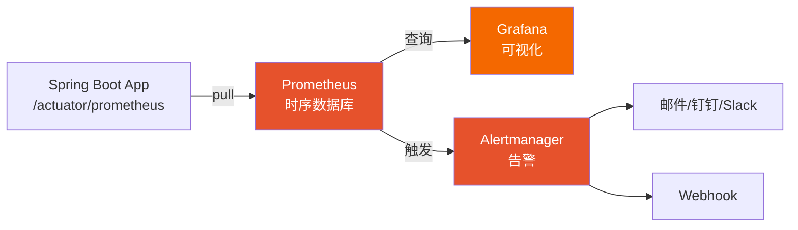
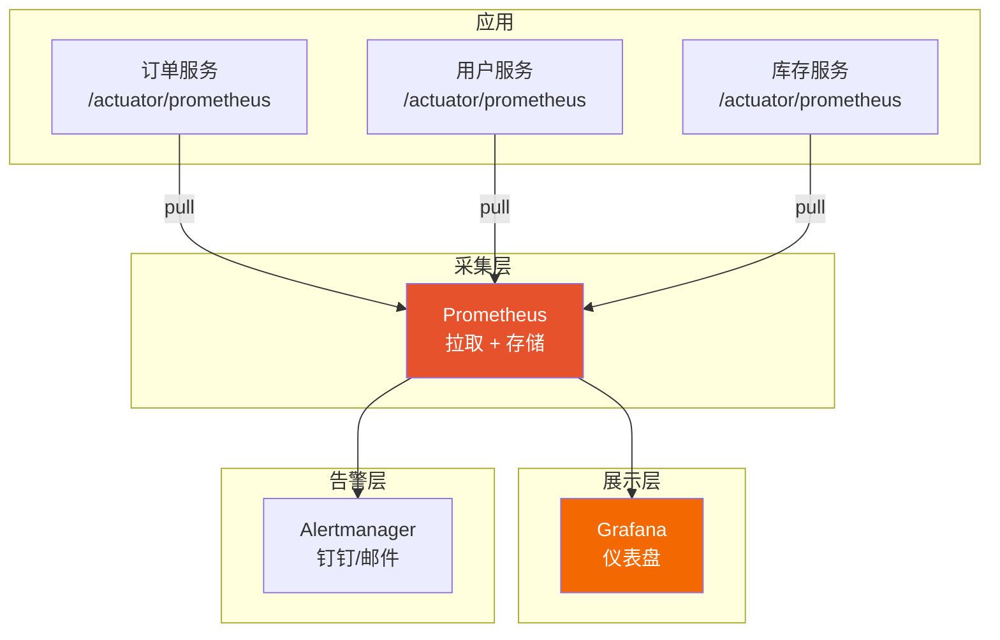

# Prometheus + Grafana 可视化监控

> 最后更新: 2026-06-09
> ⬅️ [返回 07 可观测性](README.md) | [Micrometer](micrometer.md) | [Spring Boot Actuator](actuator.md)

**Prometheus + Grafana** 是云原生时代的**事实标准监控方案**——Prometheus 负责采集和存储时序数据，Grafana 负责可视化看板和告警。

---

## 🎯 一句话定位

**Prometheus = "时序数据采集 + 存储"**，**Grafana = "可视化 + 告警"**——应用通过 `/actuator/prometheus` 暴露指标，Prometheus **定期拉取**（pull 模式），Grafana 读取 Prometheus 数据源展示图表，**Alertmanager 触发告警**。

---

## 一、3 大组件



| 组件 | 作用 |
|------|------|
| **Prometheus** | 时序数据**采集** + **存储**（pull 模式） |
| **Grafana** | **可视化**看板（图表、仪表盘） |
| **Alertmanager** | **告警**（邮件、钉钉、Slack） |

---

## 二、Pull vs Push 模式

| 模式 | 代表 | 适用 |
|------|------|------|
| **Pull**（**Prometheus**） | Prometheus 主动拉取 | 服务发现（K8s）、长连接服务 |
| **Push** | InfluxDB / Datadog | 短任务、批处理 |

> 📌 **Prometheus 默认 Pull 模式**——应用暴露 `/actuator/prometheus`，Prometheus 定期抓取。

---

## 三、快速搭建

### 1. 启动 Spring Boot 应用

```xml
<dependency>
    <groupId>org.springframework.boot</groupId>
    <artifactId>spring-boot-starter-actuator</artifactId>
</dependency>
<dependency>
    <groupId>io.micrometer</groupId>
    <artifactId>micrometer-registry-prometheus</artifactId>
</dependency>
```

```yaml
management:
  endpoints:
    web:
      exposure:
        include: health,info,prometheus
  prometheus:
    metrics:
      export:
        enabled: true
```

访问 `http://localhost:8080/actuator/prometheus` 验证指标暴露。

### 2. 启动 Prometheus（Docker）

```yaml
# docker-compose.yml
version: '3'
services:
  prometheus:
    image: prom/prometheus
    ports:
      - "9090:9090"
    volumes:
      - ./prometheus.yml:/etc/prometheus/prometheus.yml
      - prometheus-data:/prometheus

  grafana:
    image: grafana/grafana
    ports:
      - "3000:3000"
    environment:
      - GF_SECURITY_ADMIN_PASSWORD=admin
    volumes:
      - grafana-data:/var/lib/grafana

volumes:
  prometheus-data:
  grafana-data:
```

```yaml
# prometheus.yml
global:
  scrape_interval: 15s

scrape_configs:
  - job_name: 'spring-boot'
    metrics_path: '/actuator/prometheus'
    static_configs:
      - targets: ['host.docker.internal:8080']

  - job_name: 'order-service'
    metrics_path: '/actuator/prometheus'
    static_configs:
      - targets: ['order-service:8080']
        labels:
          service: 'order-service'
```

```bash
docker-compose up -d
```

### 3. 启动 Grafana

访问 `http://localhost:3000`，默认账号 `admin/admin`。

添加数据源：
- **Type**: Prometheus
- **URL**: `http://prometheus:9090`

导入 Spring Boot 仪表盘（ID: **4701**）：
- 进入 Grafana → Dashboards → Import
- 输入 4701 → Load

---

## 四、PromQL 基础（Prometheus 查询）

### 4 类查询

```promql
# 1. 即时查询（当前值）
http_server_requests_seconds_count

# 2. 范围查询（时间序列）
rate(http_server_requests_seconds_count[5m])    # 5 分钟内的 QPS

# 3. 函数
sum(rate(http_server_requests_seconds_count[5m]))    # 求和
avg(rate(http_server_requests_seconds_count[5m]))    # 平均
histogram_quantile(0.95, sum(rate(http_server_requests_seconds_bucket[5m])) by (le))   # P95

# 4. 标签筛选
http_server_requests_seconds_count{uri="/api/orders", method="GET"}
http_server_requests_seconds_count{uri!="/actuator/**"}
```

### 常用 PromQL

| 用途 | PromQL |
|------|--------|
| **QPS** | `sum(rate(http_server_requests_seconds_count[1m])) by (uri)` |
| **P95 延迟** | `histogram_quantile(0.95, sum(rate(http_server_requests_seconds_bucket[5m])) by (le, uri))` |
| **错误率** | `sum(rate(http_server_requests_seconds_count{status=~"5.."}[5m])) / sum(rate(http_server_requests_seconds_count[5m]))` |
| **JVM 内存** | `sum(jvm_memory_used_bytes{area="heap"}) by (instance)` |
| **GC 暂停** | `rate(jvm_gc_pause_seconds_sum[5m])` |
| **线程数** | `jvm_threads_live_threads` |

---

## 五、4 个核心 Grafana 仪表盘

### 1. JVM 仪表盘（Dashboard ID: 4701）

| 图表 | 数据源 |
|------|--------|
| 堆内存使用 | `jvm_memory_used_bytes{area="heap"}` |
| 非堆内存 | `jvm_memory_used_bytes{area="nonheap"}` |
| GC 暂停 | `jvm_gc_pause_seconds` |
| 线程数 | `jvm_threads_live_threads` |
| CPU 使用率 | `process_cpu_usage` |

### 2. HTTP 仪表盘

| 图表 | 数据源 |
|------|--------|
| QPS | `sum(rate(http_server_requests_seconds_count[1m])) by (uri)` |
| 延迟 P50/P95/P99 | `histogram_quantile(0.95, ...)` |
| 错误率 | `sum(rate(...{status=~"5.."}[5m]))` |
| Top 10 慢接口 | Top by latency |

### 3. 业务仪表盘（自定义）

```promql
# 订单创建 QPS
sum(rate(order_created_total[1m]))

# 订单创建 P95 延迟
histogram_quantile(0.95, sum(rate(order_create_duration_seconds_bucket[5m])) by (le))

# 订单失败率
sum(rate(order_created_total{result="fail"}[5m])) / sum(rate(order_created_total[5m]))
```

### 4. 数据库连接池

```promql
# HikariCP 活跃连接
hikaricp_connections_active{pool="HikariPool-1"}

# HikariCP 等待连接数
hikaricp_connections_pending{pool="HikariPool-1"}
```

---

## 六、Alertmanager 告警

### 1. 告警规则（prometheus.yml）

```yaml
groups:
  - name: application_alerts
    rules:
      - alert: HighErrorRate
        expr: |
          sum(rate(http_server_requests_seconds_count{status=~"5.."}[5m]))
          / sum(rate(http_server_requests_seconds_count[5m])) > 0.05
        for: 2m
        labels:
          severity: critical
        annotations:
          summary: "高错误率"
          description: "{{ $labels.instance }} 5xx 错误率超过 5%"

      - alert: HighLatency
        expr: |
          histogram_quantile(0.95, sum(rate(http_server_requests_seconds_bucket[5m])) by (le, uri)) > 1
        for: 5m
        labels:
          severity: warning
        annotations:
          summary: "P95 延迟过高"
          description: "{{ $labels.uri }} P95 延迟超过 1s"

      - alert: HighMemoryUsage
        expr: sum(jvm_memory_used_bytes{area="heap"}) by (instance) / sum(jvm_memory_max_bytes{area="heap"}) by (instance) > 0.9
        for: 3m
        labels:
          severity: warning
        annotations:
          summary: "JVM 堆内存使用率超过 90%"
```

### 2. Alertmanager 配置（钉钉告警）

```yaml
# alertmanager.yml
route:
  group_by: ['alertname']
  group_wait: 30s
  group_interval: 5m
  repeat_interval: 4h
  receiver: 'dingtalk'

receivers:
  - name: 'dingtalk'
    webhook_configs:
      - url: 'https://oapi.dingtalk.com/robot/send?access_token=xxx'
        send_resolved: true
```

---

## 七、Grafana Alerting 独立告警通道

> **Grafana Alerting**（Grafana 8.0+）可**独立于 Alertmanager** 工作——所有告警规则、通知渠道、SLO 管理都可在 Grafana UI 内完成，特别适合**多数据源**场景（如同时查 Prometheus + MySQL + Loki）。

### 1. 与 Alertmanager 的区别

| 维度 | Alertmanager | Grafana Alerting |
|:-----|:-------------|:----------------|
| **数据源** | 仅 Prometheus | **任意数据源**（Prometheus、MySQL、Loki、ES、CloudWatch） |
| **规则位置** | Prometheus `rules` 配置 | Grafana 内部 Alert Rules |
| **告警状态管理** | Alertmanager 集群 | Grafana 内置（也支持 HA 部署） |
| **通知收敛** | 分组 / 抑制 / 静默 | 分组 / 抑制 / 静默 / **silence 模板** |
| **UI** | 简单 Web | **现代 UI + 模板变量 + 链接到仪表盘** |
| **适用** | 纯 Prometheus 栈 | **多数据源 / 业务混合**监控 |

### 2. 创建 Alert Rule（在 Grafana UI 中）

```
路径：Grafana → Alerting → Alert rules → New alert rule
```

| 字段 | 示例 |
|:-----|:-----|
| **Rule name** | `OrderService_HighErrorRate` |
| **Data source** | Prometheus |
| **Query** | `sum(rate(http_server_requests_seconds_count{status=~"5.."}[5m])) / sum(rate(http_server_requests_seconds_count[5m])) > 0.05` |
| **Condition** | `WHEN last() OF query IS ABOVE 0.05 FOR 2m` |
| **Folder** | `Application` |
| **Evaluation group** | `1m`（每 1 分钟评估） |

### 3. 通知渠道（Contact Points）

支持 Slack / 钉钉 / Webhook / 邮件 / PagerDuty / OpsGenie：

```yaml
# Slack Contact Point 示例（Grafana provisioning）
apiVersion: 1
contactPoints:
  - orgId: 1
    name: slack-critical
    receivers:
      - uid: slack-receiver-1
        type: slack
        settings:
          url: https://hooks.slack.com/services/T00000000/B00000000/XXXXXXXX
          channel: '#alerts-critical'
          title: '{{ template "slack.default.title" . }}'
          text: '{{ template "slack.default.text" . }}'
```

钉钉（自定义 Webhook）：

```yaml
contactPoints:
  - name: dingtalk
    receivers:
      - type: webhook
        settings:
          url: https://oapi.dingtalk.com/robot/send?access_token=xxx
          httpMethod: POST
```

### 4. 与 Alertmanager 协同部署

生产环境**推荐两者并存**——按职责分工：

```
                  ┌──────────────────┐
                  │   Prometheus     │
                  │   (指标采集)      │
                  └────────┬─────────┘
                           │ 触发
                  ┌────────▼─────────┐        ┌──────────────┐
                  │  Alertmanager    │  ──>   │  钉钉/邮件   │  ← 基础设施层告警
                  │  (基础设施告警)   │        └──────────────┘
                  └──────────────────┘

                  ┌──────────────────┐
                  │   Grafana        │
                  │   (可视化)        │
                  └────────┬─────────┘
                           │ 直接评估
                  ┌────────▼─────────┐        ┌──────────────┐
                  │ Grafana Alerting │  ──>   │  业务方/值班  │  ← 业务层告警
                  │  (业务告警)       │        └──────────────┘
                  └──────────────────┘
```

- **Alertmanager** 处理：**节点宕机**、**磁盘满**、**Prometheus down** 等基础设施告警
- **Grafana Alerting** 处理：**订单错误率飙升**、**支付转化率下降**等业务告警

> 📌 **好处**：Grafana Alerting 告警**直接附带仪表盘链接**，oncall 工程师一点即看上下文。

---

## 八、K8s 中的 Prometheus 部署

```yaml
# ServiceMonitor 自动发现
apiVersion: monitoring.coreos.com/v1
kind: ServiceMonitor
metadata:
  name: spring-boot
  labels:
    release: prometheus
spec:
  selector:
    matchLabels:
      app: order-service
  endpoints:
    - port: http
      path: /actuator/prometheus
      interval: 15s
```

> 📌 K8s 生态用 **Prometheus Operator + ServiceMonitor** 自动发现服务。

---

## 九、4 大生产实践

### 1. 指标命名规范

```
http_server_requests_seconds  # 命名空间_对象_单位
order_created_total            # 业务指标以 _total 结尾（Counter）
order_create_duration_seconds  # 业务 Timer 以 _seconds 结尾
```

### 2. 标签基数控制

> 标签值**枚举有限**（如 status=200/500/503），**避免高基数**（如 userId、orderId）。

### 3. 采样率与精度

```yaml
# 关键接口高精度（10s 间隔）
- job_name: 'order-service-critical'
  scrape_interval: 10s

# 普通接口低精度（60s 间隔）
- job_name: 'order-service-normal'
  scrape_interval: 60s
```

### 4. 数据保留期

```yaml
# prometheus.yml
global:
  retention: 15d      # 保留 15 天
  retention_size: 50GB  # 最大 50GB
```

---

## 十、完整监控架构



---

## 十一、3 大替代方案对比

| 方案 | 维护方 | 部署 | 适用 |
|------|--------|------|------|
| **Prometheus + Grafana** | CNCF | 自建 / K8s Operator | **K8s 云原生首选** |
| **InfluxDB + Grafana** | InfluxData | 自建 | 时序数据库老牌 |
| **Datadog** | Datadog | SaaS | 商业方案（贵但省心） |
| **CloudWatch** | AWS | 集成 | AWS 生态 |

---

## 🤔 思考

1. **Prometheus 为什么用 Pull 模式？** 服务发现友好（K8s）、健康检查天然支持、运维简单。
2. **Prometheus 数据怎么持久化？** 写入本地磁盘 + 远程写入（Remote Write）到 S3/ES/InfluxDB。
3. **Grafana 有什么用？** Prometheus 只提供查询，Grafana 提供**可视化**和**告警**。
4. **指标采样率怎么设？** 关键指标 10s，普通指标 30s-60s，长期趋势 5m。

---

## 相关章节

- ⬅️ [返回 07 可观测性](README.md)
- [Micrometer](micrometer.md) — 指标采集
- [Spring Boot Actuator](actuator.md) — 指标暴露端点
- [分布式追踪](../05-spring-cloud/distributed-tracing.md) — Tracing + Metrics 统一
