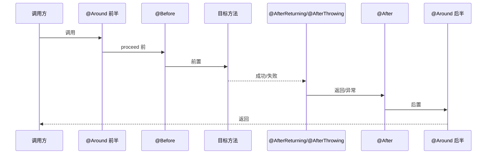

# AOP 注解

> 最后更新: 2026-06-14
> ⬅️ [返回注解速查](../README.md) | [Web 注解](web.md) | [异常注解](exception.md)

本节介绍 Spring AOP 的核心注解：声明切面、定义切点、5 种通知类型、启用代理。

---

## 🎯 一句话定位

**AOP 注解 = "这是个切面" + "切哪里" + "切了做什么"**——`@Aspect` 声明切面类，`@Pointcut` 定义切点（execution/within/bean 表达式），5 个通知注解（@Before/@After/@AfterReturning/@AfterThrowing/@Around）定义具体行为。

---

## 切面声明

### @Aspect

> 用于标识一个类作为切面类，允许在其中定义切点和通知。

```java
@Aspect
@Component
public class SecurityAspect {
    // 切点和通知定义
}
```

### @EnableAspectJAutoProxy

> 用于开启对 AspectJ 代理的支持，通常在配置类上使用。

```java
@Configuration
@EnableAspectJAutoProxy
public class AspectConfiguration {
    // 其他Spring配置
}
```

> 📌 Spring Boot 默认启用 AspectJ 自动代理（通过 AopAutoConfiguration），**一般无需手动添加 @EnableAspectJAutoProxy**。

---

## 切点定义

### @Pointcut

> 定义一个切点（可复用的连接点集合），与其他通知注解结合使用。

```java
@Pointcut("execution(* com.example.service.*.*(..))")
public void pointcutServiceMethods() {
    // 切点表达式定义
}
```

> 📌 `@Pointcut` 方法本身**不执行任何逻辑**，只是定义切点供其他注解引用。方法体通常为空。

---

## 5 种通知

### @Before（前置通知）

> 在目标方法执行**之前**执行。

```java
@Before("pointcutServiceMethods()")
public void logBeforeServiceMethod(JoinPoint joinPoint) {
    String methodName = joinPoint.getSignature().getName();
    Object[] args = joinPoint.getArgs();
    System.out.println("Entering: " + methodName + " with arguments " + Arrays.toString(args));
}
```

### @After（后置通知）

> 在目标方法执行**之后**执行（无论成功或失败）。

```java
@After("pointcutServiceMethods()")
public void logAfterServiceMethod(JoinPoint joinPoint) {
    String methodName = joinPoint.getSignature().getName();
    System.out.println("Exiting: " + methodName);
}
```

### @AfterReturning（返回通知）

> 在目标方法**成功返回**后执行。

```java
@AfterReturning(pointcut = "pointcutServiceMethods()", returning = "result")
public void logAfterReturningServiceMethod(Object result) {
    System.out.println("Service method returned: " + result);
}
```

### @AfterThrowing（异常通知）

> 在目标方法**抛出异常**时执行。

```java
@AfterThrowing(pointcut = "pointcutServiceMethods()", throwing = "exception")
public void logAfterThrowingServiceMethod(Exception exception) {
    System.err.println("Service method threw exception: " + exception.getMessage());
}
```

### @Around（环绕通知）

> 包围目标方法的执行，可在方法执行前后、异常时执行自定义逻辑。**功能最强大**。

```java
@Around("pointcutServiceMethods()")
public Object aroundServiceMethod(ProceedingJoinPoint joinPoint) throws Throwable {
    long startTime = System.currentTimeMillis();
    Object result = joinPoint.proceed();  // 继续执行目标方法
    long endTime = System.currentTimeMillis();
    System.out.println("Execution time: " + (endTime - startTime) + " ms");
    return result;
}
```

### 5 种通知的执行顺序



| 通知 | 异常时是否执行 | 能否改变返回值 | 适用场景 |
|------|--------------|--------------|---------|
| @Before | ❌（方法未执行） | ❌ | 参数校验、权限检查 |
| @After | ✅ 总是执行 | ❌ | 资源清理 |
| @AfterReturning | ❌ | ❌ | 审计日志、返回值加工 |
| @AfterThrowing | ✅ | ❌ | 异常处理、告警 |
| @Around | ✅ 总是执行 | ✅ | 性能监控、事务管理、缓存 |

> 📌 90% 场景用 `@Around` 即可，5 种通知本质上是 `@Around` 的"语法糖"。

---

## 切点表达式速查

详见 [AOP 切点表达式详解](../../01-core/aop/pointcut-expression.md)

---

## 🤔 思考

1. **为什么 AOP 默认用 JDK 动态代理？** 因为 JDK 代理比 CGLIB 更快、生成的类更小。当目标类无接口时，回退到 CGLIB。
2. **@Around 必须调用 proceed() 吗？** 是的，否则目标方法不会执行。proceed() 返回值就是目标方法的返回值。
3. **多个切面执行顺序？** 用 `@Order(数字)` 控制，数字越小越先执行（Before 阶段）。详见 [AOP 通知顺序](../../01-core/aop/advice-order-and-best-practices.md)。
4. **AOP 能拦截 private 方法吗？** 不能，Spring AOP 基于代理，只能拦截 public 方法（构造方法、私有方法、静态方法都不可拦截）。

---

## 相关章节

- ⬅️ [返回注解速查](../README.md)
- [01 核心容器/AOP 总览](../../01-core/aop/README.md) — AOP 核心概念
- [01 核心容器/AOP 通知顺序](../../01-core/aop/advice-order-and-best-practices.md) — 多切面排序
- [配置注解](configuration.md) — @Configuration
