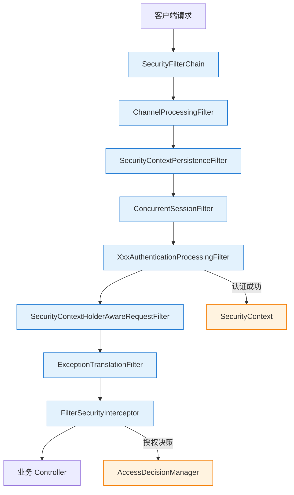

<!--
module:
  parent: spring
  slug: spring/security
  type: index
  category: 后端框架 / Spring 全家桶
  topic: Spring Security
  audience: Java 后端工程师
  summary: Spring Security = 认证（Authentication）+ 授权（Authorization）+ 防护（CORS/CSRF/Session/Header）（6 篇：FilterChain 架构/认证机制/授权机制/OAuth2 与 JWT/CORS 与 CSRF/安全防护）
-->

# 09 Spring Security

> 一句话定位：**Spring Security = SecurityFilterChain（过滤器链）+ Authentication（认证）+ Authorization（授权）+ 安全防护（CORS/CSRF/Session/Header）**——Java 生态最主流的安全框架，从登录到接口鉴权到防护策略一站式搞定。
>
> ⬅️ [返回 Spring 顶层](../README.md)

---
---

## 🎯 一句话定位

**Spring Security = 认证（你是谁）+ 授权（你能干什么）+ 防护（攻击防御）**——基于 Servlet Filter 链实现，覆盖从用户名密码登录到 OAuth2 单点登录、从方法级权限到 ACL 细粒度控制、从 CORS 跨域到 CSRF 防护的全部安全需求。

---

## 📚 章节导航

| 章节 | 文件 | 核心问题 | 建议时长 |
|:----:|:----|:---------|:--------:|
| **SecurityFilterChain 架构** | [filter-chain/README.md](filter-chain/README.md) | 15 个默认 Filter 的执行顺序？如何自定义 FilterChain？ | 30 min |
| **认证机制** | [authentication/README.md](authentication/README.md) | 用户名密码 / JWT / OAuth2 Resource Server 如何工作？ | 35 min |
| **授权机制** | [authorization/README.md](authorization/README.md) | @PreAuthorize / requestMatchers / Role vs Authority 怎么用？ | 30 min |
| **OAuth2 与 JWT** | [oauth2/README.md](oauth2/README.md) | OAuth2 四种授权模式 / Spring Authorization Server / JWT 结构 | 40 min |
| **CORS 与 CSRF** | [cors-csrf/README.md](cors-csrf/README.md) | 同源策略 / CORS 预检 / CSRF 防御 / Session 管理 / 安全 Header | 30 min |

> 📌 **范围说明**：本节聚焦 Spring Security 核心机制。Spring Cloud Gateway 的 JWT 鉴权见 [05-spring-cloud/gateway.md](../05-spring-cloud/gateway.md)；OAuth2 在微服务间的 Token 传递见 [05-spring-cloud](../05-spring-cloud/README.md)。

---

## 🧭 核心架构总览



### 核心组件关系

| 组件 | 职责 | 核心类 |
|:-----|:-----|:-------|
| **SecurityFilterChain** | 定义过滤器链，决定哪些 URL 走哪些安全过滤器 | `SecurityFilterChain` 接口 |
| **AuthenticationManager** | 认证入口，委派给具体 Provider | `ProviderManager` |
| **AuthenticationProvider** | 具体认证逻辑（密码/JWT/OAuth2） | `DaoAuthenticationProvider` 等 |
| **UserDetailsService** | 加载用户信息 | `InMemoryUserDetailsManager` / JPA 实现 |
| **AccessDecisionManager** | 授权决策 | `AffirmativeBased`（默认） |
| **SecurityContext** | 持有当前认证信息 | `SecurityContextHolder`（ThreadLocal） |

---

## 🔑 认证 vs 授权

这是安全领域最基础的概念区分，面试高频考点：

```text
┌─────────────────────────────────────────────────────────┐
│                    Spring Security 安全模型               │
├──────────────────────────┬──────────────────────────────┤
│     认证 Authentication  │     授权 Authorization       │
├──────────────────────────┼──────────────────────────────┤
│  "你是谁？"              │  "你能干什么？"               │
│  验证身份凭证             │  控制资源访问                 │
│  登录 / Token / SSO      │  角色 / 权限 / ACL            │
│  先于授权执行             │  认证通过后才执行             │
│  UsernamePassword Token  │  @PreAuthorize / @Secured     │
│  JWT / OAuth2            │  requestMatchers / ACL        │
└──────────────────────────┴──────────────────────────────┘
```

**认证流程简化**：

```text
用户提交凭证 → AuthenticationFilter → AuthenticationManager
                                         ↓
                                    AuthenticationProvider
                                         ↓
                               UserDetailsService.loadUserByUsername()
                                         ↓
                                   密码比对 (PasswordEncoder.matches)
                                         ↓
                              认证成功 → SecurityContext 存入 Authentication
```

---

## 🔧 与 Spring Boot 自动配置的关系

Spring Boot 通过 `SecurityAutoConfiguration` 提供默认安全策略：

```java
// Spring Boot 自动配置做了什么？
// 1. 引入 spring-boot-starter-security 后自动启用
// 2. 默认：所有接口需要认证，自动生成随机密码（控制台打印）
// 3. 默认启用 CSRF、CORS、Session 管理、安全 Header

// 控制台输出：
// Using generated security password: a1b2c3d4-e5f6-7890-abcd-ef1234567890
```

### 自动配置关键类

| 自动配置类 | 作用 |
|:-----------|:-----|
| `SecurityAutoConfiguration` | 导入 `SpringBootWebSecurityConfiguration` |
| `SecurityFilterAutoConfiguration` | 注册 `DelegatingFilterProxy`（桥接 Servlet Filter 与 Spring Bean） |
| `UserDetailsServiceAutoConfiguration` | 无自定义 `UserDetailsService` 时，生成默认用户（user/随机密码） |
| `SecurityProperties` | `spring.security.user.name/password/roles` 配置绑定 |

### 自定义覆盖自动配置

```java
@Configuration
@EnableWebSecurity  // 禁用默认 WebSecurityConfigurerAdapter（已废弃）
public class SecurityConfig {

    @Bean
    public SecurityFilterChain filterChain(HttpSecurity http) throws Exception {
        http
            // 覆盖默认配置
            .authorizeHttpRequests(auth -> auth
                .requestMatchers("/public/**").permitAll()
                .requestMatchers("/admin/**").hasRole("ADMIN")
                .anyRequest().authenticated()
            )
            .formLogin(form -> form
                .loginPage("/login")     // 自定义登录页
                .permitAll()
            )
            .logout(logout -> logout
                .logoutSuccessUrl("/")
                .permitAll()
            );
        return http.build();
    }
}
```

> ⚠️ **注意**：Spring Security 5.7+ 废弃了 `WebSecurityConfigurerAdapter`，改用 `SecurityFilterChain` Bean 方式配置。Spring Boot 3.x 默认使用 Security 6.x。

---

## 📋 版本演进

| 版本 | 关键变更 |
|:-----|:---------|
| **5.x** | Lambda DSL 配置风格、废弃 `WebSecurityConfigurerAdapter` |
| **6.0** | 默认启用 `authorizeHttpRequests`（替代 `authorizeRequests`）、方法安全默认关闭 |
| **6.1+** | 改进 OAuth2 Resource Server、Authorization Server 独立项目 |
| **6.2+** | 原生 GraalVM 支持增强、Observation API 集成 |

---

## 🧪 快速开始

```xml
<dependency>
    <groupId>org.springframework.boot</groupId>
    <artifactId>spring-boot-starter-security</artifactId>
</dependency>
<!-- 测试支持 -->
<dependency>
    <groupId>org.springframework.security</groupId>
    <artifactId>spring-security-test</artifactId>
    <scope>test</scope>
</dependency>
```

```java
// 最小测试：使用 @WithMockUser 模拟认证用户
@Test
@WithMockUser(username = "admin", roles = {"ADMIN", "USER"})
void adminCanAccessAdminEndpoint() throws Exception {
    mockMvc.perform(get("/admin/dashboard"))
           .andExpect(status().isOk());
}

// 测试未认证访问被拒绝
@Test
void unauthenticatedAccessDenied() throws Exception {
    mockMvc.perform(get("/admin/dashboard"))
           .andExpect(status().isUnauthorized());
}
```

---

## 🗺️ 学习路径建议

```text
第 1 步：filter-chain/     → 理解 SecurityFilterChain 架构（基础中的基础）
第 2 步：authentication/   → 掌握认证机制（密码/JWT/OAuth2）
第 3 步：authorization/    → 掌握授权机制（方法级/URL 级/ACL）
第 4 步：oauth2/           → 深入 OAuth2 与 JWT（现代认证标准）
第 5 步：cors-csrf/        → 完善安全防护（CORS/CSRF/Session/Header）
```

---

## 🔗 相关章节

- ⬆️ [返回 Spring 顶层](../README.md)
- ↔️ [05-spring-cloud/gateway.md](../05-spring-cloud/gateway.md) —— 网关 JWT 鉴权
- ↔️ [02-web/mvc/cors-and-static.md](../02-web/mvc/cors-and-static.md) —— MVC 层 CORS 配置
- ↔️ [13.split-hairs](../../13.split-hairs/) —— 面试咬文嚼字

---

## 📖 外部参考

- [Spring Security 官方文档](https://docs.spring.io/spring-security/reference/)
- [Spring Security 架构](https://docs.spring.io/spring-security/reference/servlet/architecture.html)
- [Spring Authorization Server](https://docs.spring.io/spring-authorization-server/docs/current/reference/html/)
- [OAuth 2.0 规范](https://datatracker.ietf.org/doc/html/rfc6749)

---

← [返回: Spring](../README.md)
