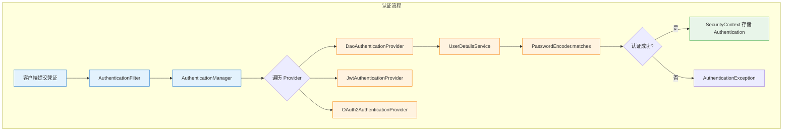

<!--
module:
  parent: spring
  slug: spring/09-security/authentication
  type: article
  category: 主模块子文章
  summary: 认证机制解决"你是谁"的问题，由 AuthenticationFilter / AuthenticationManager / AuthenticationProvider / UserDetailsService / PasswordEncoder 五大组件协作完成。
-->

# 认证机制

> ⬅️ [返回 Spring Security](../README.md)

**认证（Authentication）** 解决的是"你是谁"的问题——通过验证用户提供的凭证（密码/Token/证书）来确认用户身份。Spring Security 提供了灵活的认证架构，支持从传统的用户名密码到现代的 JWT/OAuth2 等多种认证方式。

---

## 🎯 一句话定位

**认证 = AuthenticationFilter（拦截凭证）→ AuthenticationManager（委派认证）→ AuthenticationProvider（验证逻辑）→ UserDetailsService（加载用户）→ PasswordEncoder（比对密码）**——五个组件协作完成"你是谁"的验证。

---

## 一、认证核心架构



### 核心接口

| 接口 | 职责 | 关键方法 |
|:-----|:-----|:---------|
| `Authentication` | 认证令牌，持有 Principal + Credentials + Authorities | `isAuthenticated()`, `getPrincipal()` |
| `AuthenticationManager` | 认证入口（委派模式） | `authenticate(Authentication)` |
| `AuthenticationProvider` | 具体认证逻辑实现 | `authenticate()`, `supports()` |
| `UserDetailsService` | 加载用户信息 | `loadUserByUsername(String)` |
| `PasswordEncoder` | 密码编码与比对 | `encode()`, `matches()` |

---

## 二、用户名密码认证（DaoAuthenticationProvider）

这是最经典的认证方式，也是 Spring Security 的默认实现。

### 2.1 基本配置

```java
@Configuration
@EnableWebSecurity
public class FormLoginConfig {

    @Bean
    public UserDetailsService userDetailsService() {
        // 内存用户（开发/测试用）
        UserDetails user = User.builder()
            .username("user")
            .password(passwordEncoder().encode("password123"))
            .roles("USER")
            .build();

        UserDetails admin = User.builder()
            .username("admin")
            .password(passwordEncoder().encode("admin123"))
            .roles("USER", "ADMIN")
            .build();

        return new InMemoryUserDetailsManager(user, admin);
    }

    @Bean
    public PasswordEncoder passwordEncoder() {
        return new BCryptPasswordEncoder();  // 推荐 BCrypt
    }

    @Bean
    public SecurityFilterChain filterChain(HttpSecurity http) throws Exception {
        http
            .authorizeHttpRequests(auth -> auth
                .requestMatchers("/login", "/public/**").permitAll()
                .anyRequest().authenticated()
            )
            .formLogin(form -> form
                .loginPage("/login")
                .loginProcessingUrl("/authenticate")  // 表单提交 URL
                .usernameParameter("username")         // 表单字段名
                .passwordParameter("password")
                .defaultSuccessUrl("/home", true)
                .failureUrl("/login?error=true")
            )
            .logout(logout -> logout
                .logoutSuccessUrl("/login?logout=true")
            );

        return http.build();
    }
}
```

### 2.2 JPA 用户存储

生产环境中用户数据来自数据库：

```java
@Service
public class CustomUserDetailsService implements UserDetailsService {

    private final UserRepository userRepository;

    public CustomUserDetailsService(UserRepository userRepository) {
        this.userRepository = userRepository;
    }

    @Override
    public UserDetails loadUserByUsername(String username) 
            throws UsernameNotFoundException {
        
        // 1. 从数据库查询用户
        User user = userRepository.findByUsername(username)
            .orElseThrow(() -> new UsernameNotFoundException(
                "User not found: " + username));

        // 2. 转换为 Spring Security UserDetails
        return org.springframework.security.core.userdetails.User.builder()
            .username(user.getUsername())
            .password(user.getPassword())     // 数据库中存的是 BCrypt 编码后的密码
            .authorities(user.getRoles().stream()
                .map(role -> new SimpleGrantedAuthority("ROLE_" + role.getName()))
                .toList())
            .disabled(!user.isEnabled())
            .accountExpired(user.isAccountExpired())
            .accountLocked(user.isAccountLocked())
            .credentialsExpired(user.isCredentialsExpired())
            .build();
    }
}
```

### 2.3 PasswordEncoder 选型

| 编码器 | 安全性 | 性能 | 推荐场景 |
|:-------|:-------|:-----|:---------|
| **BCryptPasswordEncoder** | ⭐⭐⭐⭐⭐ | 中等 | **生产首选**，自带盐值，可调强度 |
| **SCryptPasswordEncoder** | ⭐⭐⭐⭐⭐ | 较慢 | 高安全需求场景 |
| **Argon2PasswordEncoder** | ⭐⭐⭐⭐⭐ | 较慢 | 最新推荐，内存硬编码 |
| **Pbkdf2PasswordEncoder** | ⭐⭐⭐⭐ | 中等 | FIPS 合规场景 |
| **DelegatingPasswordEncoder** | — | — | Spring Security 5+ 默认，支持多编码共存 |
| ~~NoOpPasswordEncoder~~ | ❌ | 最快 | **仅测试用**，明文存储 |

```java
// DelegatingPasswordEncoder（默认）—— 支持密码格式迁移
@Bean
public PasswordEncoder passwordEncoder() {
    // 新密码用 BCrypt 编码，但能验证旧格式
    return PasswordEncoderFactories.createDelegatingPasswordEncoder();
    // 编码结果：{bcrypt}$2a$10$xxxxxxx
}

// 数据库迁移场景：旧密码是 SHA-256，新密码用 BCrypt
// DelegatingPasswordEncoder 能同时处理两种格式
// {sha256}a1b2c3...  →  旧密码
// {bcrypt}$2a$10$...  →  新密码
```

---

## 三、JWT 认证流程

JWT（JSON Web Token）是无状态认证的事实标准，特别适合前后端分离和微服务场景。

### 3.1 架构概览

```text
┌──────────────────────────────────────────────────────────────────┐
│                      JWT 认证流程                                  │
│                                                                    │
│  登录阶段：                                                        │
│  用户 ──POST /auth/login──→ AuthController                         │
│                              ↓                                     │
│                    AuthenticationManager.authenticate()             │
│                              ↓                                     │
│                    成功 → JwtTokenProvider.generateToken()          │
│                              ↓                                     │
│                    返回 { accessToken, refreshToken }              │
│                                                                    │
│  访问阶段：                                                        │
│  用户 ──GET /api/data (Header: Bearer <token>)──→                  │
│        JwtAuthenticationFilter (OncePerRequestFilter)              │
│                              ↓                                     │
│                    JwtTokenProvider.validateToken()                 │
│                              ↓                                     │
│                    解析 Claims → 构建 Authentication               │
│                              ↓                                     │
│                    SecurityContextHolder.setContext()               │
│                              ↓                                     │
│                    FilterChain.doFilter() → 业务 Controller        │
└──────────────────────────────────────────────────────────────────┘
```

### 3.2 JWT Token Provider

```java
@Component
public class JwtTokenProvider {

    @Value("${jwt.secret}")
    private String secret;  // 生产环境使用 RS256 密钥对

    @Value("${jwt.access-token-validity}")
    private long accessTokenValidity;  // 毫秒，如 3600000（1小时）

    @Value("${jwt.refresh-token-validity}")
    private long refreshTokenValidity; // 毫秒，如 604800000（7天）

    private SecretKey getSigningKey() {
        return Keys.hmacShaKeyFor(secret.getBytes(StandardCharsets.UTF_8));
    }

    /**
     * 生成 Access Token
     */
    public String generateAccessToken(UserDetails user) {
        return Jwts.builder()
            .setSubject(user.getUsername())
            .claim("roles", user.getAuthorities().stream()
                .map(GrantedAuthority::getAuthority)
                .toList())
            .claim("userId", getUserId(user))
            .setIssuedAt(new Date())
            .setExpiration(new Date(System.currentTimeMillis() + accessTokenValidity))
            .signWith(getSigningKey(), SignatureAlgorithm.HS256)
            .compact();
    }

    /**
     * 生成 Refresh Token（不含敏感信息，仅用于刷新）
     */
    public String generateRefreshToken(String username) {
        return Jwts.builder()
            .setSubject(username)
            .claim("type", "refresh")
            .setIssuedAt(new Date())
            .setExpiration(new Date(System.currentTimeMillis() + refreshTokenValidity))
            .signWith(getSigningKey(), SignatureAlgorithm.HS256)
            .compact();
    }

    /**
     * 验证并解析 Token
     */
    public Claims validateToken(String token) {
        try {
            return Jwts.parserBuilder()
                .setSigningKey(getSigningKey())
                .build()
                .parseClaimsJws(token)
                .getBody();
        } catch (ExpiredJwtException e) {
            throw new TokenExpiredException("Token 已过期");
        } catch (JwtException e) {
            throw new InvalidTokenException("Token 无效");
        }
    }
}
```

### 3.3 JWT 认证 Filter

```java
@Component
public class JwtAuthenticationFilter extends OncePerRequestFilter {

    private final JwtTokenProvider tokenProvider;
    private final UserDetailsService userDetailsService;

    public JwtAuthenticationFilter(JwtTokenProvider tokenProvider,
                                    UserDetailsService userDetailsService) {
        this.tokenProvider = tokenProvider;
        this.userDetailsService = userDetailsService;
    }

    @Override
    protected void doFilterInternal(HttpServletRequest request,
                                     HttpServletResponse response,
                                     FilterChain filterChain) 
            throws ServletException, IOException {
        
        // 1. 从 Header 提取 Token
        String token = extractToken(request);
        
        if (token == null) {
            filterChain.doFilter(request, response);
            return;  // 没有 Token，交给后续 Filter 处理（可能走匿名认证）
        }

        try {
            // 2. 验证 Token
            Claims claims = tokenProvider.validateToken(token);
            
            // 3. 加载用户信息
            String username = claims.getSubject();
            UserDetails userDetails = userDetailsService.loadUserByUsername(username);
            
            // 4. 构建 Authentication 对象
            UsernamePasswordAuthenticationToken authentication = 
                new UsernamePasswordAuthenticationToken(
                    userDetails,     // Principal
                    null,            // Credentials（JWT 不需要）
                    userDetails.getAuthorities()
                );
            authentication.setDetails(
                new WebAuthenticationDetailsSource().buildDetails(request));
            
            // 5. 设置 SecurityContext
            SecurityContextHolder.getContext().setAuthentication(authentication);
            
        } catch (TokenExpiredException | InvalidTokenException e) {
            // Token 无效，不设置 Authentication → 后续 Filter 会返回 401
            log.warn("JWT 认证失败: {}", e.getMessage());
        }

        filterChain.doFilter(request, response);
    }

    private String extractToken(HttpServletRequest request) {
        String bearer = request.getHeader("Authorization");
        if (bearer != null && bearer.startsWith("Bearer ")) {
            return bearer.substring(7);
        }
        return null;
    }

    @Override
    protected boolean shouldNotFilter(HttpServletRequest request) {
        // 登录接口不需要 JWT
        String path = request.getRequestURI();
        return path.equals("/auth/login") || path.equals("/auth/refresh");
    }
}
```

### 3.4 注册 JWT Filter

```java
@Bean
public SecurityFilterChain filterChain(HttpSecurity http) throws Exception {
    http
        .csrf(csrf -> csrf.disable())  // JWT 无状态，不需要 CSRF
        .sessionManagement(session -> session
            .sessionCreationPolicy(SessionCreationPolicy.STATELESS))
        .authorizeHttpRequests(auth -> auth
            .requestMatchers("/auth/**").permitAll()
            .anyRequest().authenticated()
        )
        .addFilterBefore(jwtAuthenticationFilter, 
            UsernamePasswordAuthenticationFilter.class);

    return http.build();
}
```

---

## 四、OAuth2 Resource Server

当你的应用是 OAuth2 资源服务器时，需要验证来自授权服务器的 Access Token：

### 4.1 JWT Decoder 配置

```java
@Configuration
@EnableWebSecurity
public class ResourceServerConfig {

    @Bean
    public SecurityFilterChain filterChain(HttpSecurity http) throws Exception {
        http
            .authorizeHttpRequests(auth -> auth
                .requestMatchers("/api/public/**").permitAll()
                .requestMatchers("/api/admin/**").hasAuthority("SCOPE_admin")
                .anyRequest().authenticated()
            )
            .oauth2ResourceServer(oauth2 -> oauth2
                .jwt(jwt -> jwt
                    .decoder(jwtDecoder())
                    .jwtAuthenticationConverter(jwtAuthenticationConverter())
                )
            );

        return http.build();
    }

    @Bean
    public JwtDecoder jwtDecoder() {
        // 方式 1：JWK Set URL（推荐，自动获取公钥）
        return NimbusJwtDecoder
            .withJwkSetUri("https://auth.example.com/.well-known/jwks.json")
            .build();
        
        // 方式 2：RSA 公钥
        // return NimbusJwtDecoder.withPublicKey(publicKey).build();
        
        // 方式 3：Secret Key（对称加密，仅内部服务）
        // return NimbusJwtDecoder.withSecretKey(secretKey).build();
    }

    /**
     * 将 JWT Claims 转换为 Spring Security Authorities
     */
    @Bean
    public JwtAuthenticationConverter jwtAuthenticationConverter() {
        JwtGrantedAuthoritiesConverter grantedAuthoritiesConverter = 
            new JwtGrantedAuthoritiesConverter();
        grantedAuthoritiesConverter.setAuthorityPrefix("SCOPE_");  // 默认前缀
        grantedAuthoritiesConverter.setAuthoritiesClaimName("scope"); // scope 字段

        JwtAuthenticationConverter converter = new JwtAuthenticationConverter();
        converter.setJwtGrantedAuthoritiesConverter(grantedAuthoritiesConverter);
        return converter;
    }
}
```

### 4.2 application.yml 配置

```yaml
spring:
  security:
    oauth2:
      resourceserver:
        jwt:
          # 自动发现 JWK Set URL
          issuer-uri: https://auth.example.com
          # 或直接指定
          # jwk-set-uri: https://auth.example.com/.well-known/jwks.json
```

---

## 五、自定义 AuthenticationProvider

当标准 Provider 不满足需求时（如短信验证码、指纹认证），可以自定义：

```java
/**
 * 短信验证码认证 Provider
 */
public class SmsCodeAuthenticationProvider implements AuthenticationProvider {

    private final UserDetailsService userDetailsService;
    private final SmsCodeService smsCodeService;

    @Override
    public Authentication authenticate(Authentication authentication) 
            throws AuthenticationException {
        
        SmsCodeAuthenticationToken token = (SmsCodeAuthenticationToken) authentication;
        String phone = (String) token.getPrincipal();
        String code = (String) token.getCredentials();

        // 1. 验证短信验证码
        if (!smsCodeService.verify(phone, code)) {
            throw new BadCredentialsException("验证码错误或已过期");
        }

        // 2. 加载用户
        UserDetails user = userDetailsService.loadUserByUsername(phone);

        // 3. 创建已认证的 Token
        return new SmsCodeAuthenticationToken(user, null, user.getAuthorities());
    }

    @Override
    public boolean supports(Class<?> authentication) {
        return SmsCodeAuthenticationToken.class.isAssignableFrom(authentication);
    }
}

/**
 * 短信验证码 Token
 */
public class SmsCodeAuthenticationToken extends AbstractAuthenticationToken {

    private final Object principal;
    private final Object credentials;

    // 未认证构造
    public SmsCodeAuthenticationToken(String phone, String code) {
        super(null);
        this.principal = phone;
        this.credentials = code;
        setAuthenticated(false);
    }

    // 已认证构造
    public SmsCodeAuthenticationToken(Object principal, 
                                       Object credentials,
                                       Collection<? extends GrantedAuthority> authorities) {
        super(authorities);
        this.principal = principal;
        this.credentials = credentials;
        setAuthenticated(true);
    }

    @Override public Object getCredentials() { return credentials; }
    @Override public Object getPrincipal() { return principal; }
}

/**
 * 注册自定义 Provider
 */
@Bean
public SecurityFilterChain filterChain(HttpSecurity http) throws Exception {
    http
        .authenticationProvider(new SmsCodeAuthenticationProvider(
            userDetailsService(), smsCodeService()))
        // ... 其他配置
        ;
    return http.build();
}
```

---

## 六、UserDetailsService 与密码编码器

### 6.1 UserDetailsService 实现对比

| 实现 | 存储方式 | 适用场景 |
|:-----|:---------|:---------|
| `InMemoryUserDetailsManager` | 内存 Map | 开发/测试/演示 |
| `JdbcUserDetailsManager` | JDBC 直连 | 简单 JDBC 项目 |
| **自定义实现**（推荐） | JPA/MyBatis | **生产环境**，灵活映射 |
| `LdapUserDetailsManager` | LDAP 目录 | 企业 AD/LDAP 集成 |

### 6.2 自定义 UserDetails 扩展

```java
/**
 * 扩展 UserDetails，携带业务字段
 */
public class CustomUserDetails implements UserDetails {

    private final User user;  // 业务实体
    private final Collection<GrantedAuthority> authorities;

    public CustomUserDetails(User user, List<Role> roles) {
        this.user = user;
        this.authorities = roles.stream()
            .flatMap(role -> Stream.concat(
                Stream.of(new SimpleGrantedAuthority("ROLE_" + role.getName())),
                role.getPermissions().stream()
                    .map(perm -> new SimpleGrantedAuthority(perm.getCode()))
            ))
            .collect(Collectors.toList());
    }

    // 业务扩展字段
    public Long getUserId() { return user.getId(); }
    public String getTenantId() { return user.getTenantId(); }
    public boolean isVip() { return user.getVipLevel() > 0; }

    // UserDetails 接口实现
    @Override public String getUsername() { return user.getUsername(); }
    @Override public String getPassword() { return user.getPassword(); }
    @Override public Collection<? extends GrantedAuthority> getAuthorities() { 
        return authorities; 
    }
    @Override public boolean isAccountNonExpired() { return !user.isExpired(); }
    @Override public boolean isAccountNonLocked() { return !user.isLocked(); }
    @Override public boolean isCredentialsNonExpired() { return true; }
    @Override public boolean isEnabled() { return user.isEnabled(); }
}
```

### 6.3 密码策略最佳实践

```text
┌─────────────────────────────────────────────────────────┐
│                  密码安全最佳实践                          │
├─────────────────────────────────────────────────────────┤
│ 1. 使用 BCrypt/Argon2 编码，绝不存明文                    │
│ 2. BCrypt strength ≥ 10（默认值，约 100ms/次）           │
│ 3. 配合 DelegatingPasswordEncoder 支持格式迁移            │
│ 4. 密码强度校验：≥ 8 位 + 大小写 + 数字 + 特殊字符        │
│ 5. 登录失败锁定：5 次失败后锁定 15 分钟                   │
│ 6. 不在异常消息中暴露"用户不存在"vs"密码错误"             │
│ 7. 定期轮换策略（配合 credentialsExpired）                │
└─────────────────────────────────────────────────────────┘
```

---

## 七、面试要点

| 问题 | 核心答案 |
|:-----|:---------|
| AuthenticationManager 和 AuthenticationProvider 的关系？ | Manager 是入口（委派模式），遍历所有 Provider 找到 `supports()` 返回 true 的执行认证 |
| UserDetailsService 的 `loadUserByUsername` 应该返回什么？ | `UserDetails` 对象，包含用户名、编码后的密码、权限列表、账户状态标志 |
| JWT 认证为什么不需要 CSRF？ | JWT 在 Header 中传递，不在 Cookie 中，不受浏览器自动发送 Cookie 的影响 |
| PasswordEncoder 为什么要用 Delegating？ | 支持密码格式迁移——旧密码 `{sha256}xxx` 和新密码 `{bcrypt}xxx` 共存 |
| JWT Filter 放在哪个位置？ | `UsernamePasswordAuthenticationFilter` 之前，用 `addFilterBefore` |

---

← [返回: Spring Security](../README.md)
