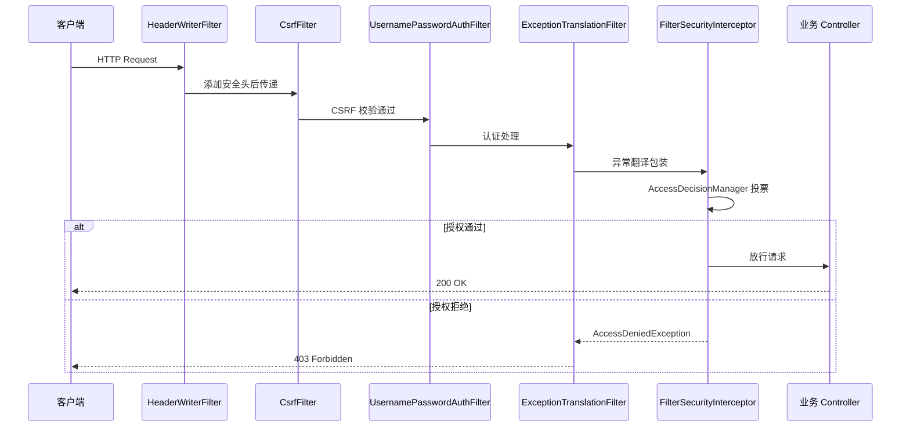

<!--
module:
  parent: spring
  slug: spring/09-security/filter-chain
  type: article
  category: 主模块子文章
  summary: SecurityFilterChain 是 Spring Security 的核心骨架，由 15 个默认 Filter 按顺序组成责任链，决定请求如何被认证、授权、防护。
-->

# SecurityFilterChain 架构

> ⬅️ [返回 Spring Security](../README.md)

**SecurityFilterChain** 是 Spring Security 的核心骨架——它决定了请求经过哪些安全过滤器、以什么顺序执行。理解 FilterChain 架构是掌握 Spring Security 的第一步。

---

## 🎯 一句话定位

**SecurityFilterChain = 一组按顺序排列的安全 Filter**——每个 Filter 负责一项安全职责（认证/授权/CSRF/Session 等），请求依次经过形成"责任链"，任何一个 Filter 都可以中断请求（返回 401/403）或将请求传递给下一个 Filter。

---

## 一、15 个默认 Filter 的执行顺序

Spring Security 在 `FilterChainProxy` 中注册了一组默认的 Filter，按以下顺序执行：

```text
┌─────────────────────────────────────────────────────────────────────────┐
│                SecurityFilterChain 默认 Filter 执行顺序                  │
├────┬──────────────────────────────────────────────┬─────────────────────┤
│ #  │ Filter 名称                                   │ 职责                │
├────┼──────────────────────────────────────────────┼─────────────────────┤
│ 1  │ ChannelProcessingFilter                      │ HTTP→HTTPS 重定向   │
│ 2  │ SecurityContextHolderFilter (6.x)            │ 创建 SecurityContext │
│    │ SecurityContextPersistenceFilter (5.x)        │ 从 Session 恢复     │
│ 3  │ ConcurrentSessionFilter                      │ 并发会话控制         │
│ 4  │ HeaderWriterFilter                           │ 添加安全响应头       │
│ 5  │ CsrfFilter                                   │ CSRF Token 校验     │
│ 6  │ LogoutFilter                                 │ 处理登出请求         │
│ 7  │ UsernamePasswordAuthenticationFilter         │ 表单登录认证         │
│ 8  │ DefaultLoginPageGeneratingFilter             │ 生成默认登录页       │
│ 9  │ DefaultLogoutPageGeneratingFilter            │ 生成默认登出页       │
│ 10 │ BasicAuthenticationFilter                    │ HTTP Basic 认证     │
│ 11 │ RequestCacheAwareFilter                      │ 恢复缓存的请求       │
│ 12 │ SecurityContextHolderAwareRequestFilter      │ 包装 Request 对象    │
│ 13 │ AnonymousAuthenticationFilter                │ 匿名认证             │
│ 14 │ SessionManagementFilter                      │ 会话管理             │
│ 15 │ ExceptionTranslationFilter                   │ 异常转换             │
│ 16 │ FilterSecurityInterceptor                    │ **授权决策（核心）**  │
└────┴──────────────────────────────────────────────┴─────────────────────┘
```

> 📌 **面试高频**：`FilterSecurityInterceptor` 是链中最后一个 Filter，也是授权决策的核心。它不直接做认证，而是根据 `AccessDecisionManager` 的投票结果决定是否放行。

### 执行流程示意



### 各 Filter 详细说明

| Filter | 触发条件 | 核心逻辑 | 可定制项 |
|:-------|:---------|:---------|:---------|
| **ChannelProcessingFilter** | 配置了 `requiresSecure()` | 检查 `X-Forwarded-Proto`，非 HTTPS 则 302 重定向 | `requiresInsecure()` 强制 HTTP |
| **SecurityContextHolderFilter** | 始终执行（6.x） | 从 `SecurityContextRepository` 加载上下文到 `ThreadLocal` | 自定义 Repository |
| **CsrfFilter** | 未禁用 CSRF | 检查 `X-CSRF-TOKEN` 或 `_csrf` 参数 | 自定义 `CsrfTokenRepository` |
| **LogoutFilter** | URL 匹配 logout URL | 清除 Session、SecurityContext、Cookie | 自定义 `LogoutHandler` 链 |
| **UsernamePasswordAuthenticationFilter** | POST 到 login URL | 提取 username/password，调用 `AuthenticationManager` | 自定义 `AuthenticationSuccessHandler` |
| **BasicAuthenticationFilter** | `Authorization: Basic xxx` | Base64 解码后认证 | 配合 `RealmName` |
| **AnonymousAuthenticationFilter** | 前面所有认证 Filter 都未认证成功 | 创建 `AnonymousAuthenticationToken` | 自定义 Principal |
| **ExceptionTranslationFilter** | 始终执行 | 捕获 `AuthenticationException`/`AccessDeniedException` | 自定义 `AuthenticationEntryPoint` |
| **FilterSecurityInterceptor** | 始终执行 | 调用 `AccessDecisionManager` 投票 | 自定义 `AccessDecisionVoter` |

---

## 二、自定义 FilterChain 配置

### 2.1 基本配置（Lambda DSL）

```java
@Configuration
@EnableWebSecurity
public class SecurityConfig {

    @Bean
    public SecurityFilterChain filterChain(HttpSecurity http) throws Exception {
        http
            // 1. 授权规则
            .authorizeHttpRequests(auth -> auth
                .requestMatchers("/public/**", "/css/**", "/js/**").permitAll()
                .requestMatchers("/admin/**").hasRole("ADMIN")
                .requestMatchers("/api/**").hasRole("USER")
                .anyRequest().authenticated()
            )
            // 2. 认证方式
            .formLogin(form -> form
                .loginPage("/login")
                .loginProcessingUrl("/authenticate")
                .defaultSuccessUrl("/dashboard", true)
                .failureUrl("/login?error=true")
                .permitAll()
            )
            // 3. HTTP Basic（API 场景）
            .httpBasic(Customizer.withDefaults())
            // 4. 登出配置
            .logout(logout -> logout
                .logoutUrl("/logout")
                .logoutSuccessUrl("/login?logout=true")
                .invalidateHttpSession(true)
                .deleteCookies("JSESSIONID")
            )
            // 5. CSRF（REST API 通常禁用）
            .csrf(csrf -> csrf
                .ignoringRequestMatchers("/api/**")
            )
            // 6. Session 管理
            .sessionManagement(session -> session
                .sessionCreationPolicy(SessionCreationPolicy.IF_REQUIRED)
                .maximumSessions(1)
                .expiredUrl("/login?expired=true")
            );

        return http.build();
    }
}
```

### 2.2 多 SecurityFilterChain（按 URL 分组）

实际项目中经常需要为不同 URL 模式配置不同的安全策略：

```java
@Configuration
@EnableWebSecurity
public class MultiSecurityConfig {

    /**
     * API 端点：无状态 + JWT 认证
     * 优先级高于通用配置（通过 @Order 控制）
     */
    @Bean
    @Order(1)
    public SecurityFilterChain apiFilterChain(HttpSecurity http) throws Exception {
        http
            .securityMatcher("/api/**")   // 只匹配 /api/** 路径
            .authorizeHttpRequests(auth -> auth
                .anyRequest().hasRole("API_USER")
            )
            .csrf(csrf -> csrf.disable())  // REST API 禁用 CSRF
            .sessionManagement(session -> session
                .sessionCreationPolicy(SessionCreationPolicy.STATELESS) // 无状态
            )
            .addFilterBefore(jwtAuthenticationFilter(), 
                UsernamePasswordAuthenticationFilter.class);

        return http.build();
    }

    /**
     * Web 端点：有状态 + 表单登录
     */
    @Bean
    @Order(2)
    public SecurityFilterChain webFilterChain(HttpSecurity http) throws Exception {
        http
            .authorizeHttpRequests(auth -> auth
                .requestMatchers("/admin/**").hasRole("ADMIN")
                .anyRequest().authenticated()
            )
            .formLogin(form -> form
                .loginPage("/login")
                .permitAll()
            );

        return http.build();
    }
}
```

### 2.3 添加自定义 Filter

```java
// 自定义审计 Filter
public class AuditLogFilter extends OncePerRequestFilter {

    @Override
    protected void doFilterInternal(HttpServletRequest request,
                                     HttpServletResponse response,
                                     FilterChain filterChain) 
            throws ServletException, IOException {
        
        long start = System.currentTimeMillis();
        
        try {
            filterChain.doFilter(request, response);
        } finally {
            long duration = System.currentTimeMillis() - start;
            String user = SecurityContextHolder.getContext()
                .getAuthentication().getName();
            log.info("AUDIT: {} {} {} {}ms", 
                user, request.getMethod(), request.getRequestURI(), duration);
        }
    }
}

// 注册到 FilterChain
@Bean
public SecurityFilterChain filterChain(HttpSecurity http) throws Exception {
    http.addFilterBefore(new AuditLogFilter(), 
            UsernamePasswordAuthenticationFilter.class)
        // ... 其他配置
        ;
    return http.build();
}
```

### 2.4 自定义 Filter 插入位置

| 插入方式 | 说明 | 典型场景 |
|:---------|:-----|:---------|
| `addFilterBefore(filter, targetClass)` | 在目标 Filter 之前插入 | JWT 认证 Filter 放在 `UsernamePasswordAuthenticationFilter` 前 |
| `addFilterAfter(filter, targetClass)` | 在目标 Filter 之后插入 | 审计 Filter 放在认证 Filter 之后 |
| `addFilterAt(filter, targetClass)` | 替换目标 Filter（同优先级） | 完全替换某个默认 Filter |
| `addFilter(filter)` | 追加到链尾 | 自定义 Filter 不需要特定位置 |

---

## 三、SecurityFilterChain vs WebSecurityCustomizer

Spring Security 提供两种安全配置入口，适用于不同场景：

```text
┌─────────────────────────────────────────────────────────┐
│                  安全配置两种入口                          │
├──────────────────────────┬──────────────────────────────┤
│  SecurityFilterChain     │  WebSecurityCustomizer       │
│  (HttpSecurity)          │  (WebSecurity)               │
├──────────────────────────┼──────────────────────────────┤
│  配置需要安全保护的请求    │  配置完全忽略安全的请求        │
│  走 FilterChainProxy     │  绕过 FilterChainProxy        │
│  认证/授权/CSRF 等生效    │  不经过任何安全 Filter         │
│  适合业务 API            │  适合静态资源/健康检查          │
│  可以有多个（@Order）     │  全局只有一个                  │
└──────────────────────────┴──────────────────────────────┘
```

### WebSecurityCustomizer 示例

```java
@Bean
public WebSecurityCustomizer webSecurityCustomizer() {
    return (web) -> web.ignoring()
        .requestMatchers(
            "/health",           // 健康检查（K8s 探针）
            "/actuator/health",  // Actuator 健康端点
            "/css/**",           // 静态 CSS
            "/js/**",            // 静态 JS
            "/images/**",        // 静态图片
            "/favicon.ico"       // 图标
        );
}
```

### 选择决策树

```text
请求是否需要安全检查？
├── 不需要（静态资源/健康检查/公开 API）
│   └── WebSecurityCustomizer.ignoring()
│       ⚠️ 注意：ignoring 的请求不经过任何安全 Filter，
│          即使后续 SecurityFilterChain 配了 permitAll 也不会生效
└── 需要（业务 API）
    └── SecurityFilterChain
        ├── permitAll()  → 不需要认证，但仍经过安全 Filter 链
        ├── authenticated() → 需要认证
        └── hasRole()    → 需要认证 + 角色
```

> ⚠️ **常见误区**：`WebSecurityCustomizer.ignoring()` 和 `permitAll()` 的区别——前者完全绕过安全过滤器链（不走任何 Filter），后者仍然走 Filter 链但不要求认证。如果需要 CSRF Token 或安全头，应该用 `permitAll()` 而不是 `ignoring()`。

---

## 四、FilterChainProxy 工作原理

`FilterChainProxy` 是 Spring Security 与 Servlet 容器之间的桥梁：

```text
┌────────────────────────────────────────────────────────────────────┐
│                       Servlet Container                            │
│                                                                    │
│   ┌──────────────────────────────────────────────────┐             │
│   │          DelegatingFilterProxy                    │             │
│   │          (web.xml / Spring Boot 自动注册)          │             │
│   └──────────────────┬───────────────────────────────┘             │
│                      ↓                                             │
│   ┌──────────────────────────────────────────────────┐             │
│   │              FilterChainProxy                     │             │
│   │                                                   │             │
│   │   SecurityFilterChain[0] (@Order(1))             │             │
│   │   ├── matches("/api/**") ?                       │             │
│   │   │   ├── YES → 执行此链的所有 Filter             │             │
│   │   │   └── NO  → 检查下一条链                     │             │
│   │   │                                               │             │
│   │   SecurityFilterChain[1] (@Order(2))             │             │
│   │   ├── matches("/**") ?                           │             │
│   │   │   ├── YES → 执行此链的所有 Filter             │             │
│   │   │   └── NO  → 不经过安全过滤                    │             │
│   └──────────────────────────────────────────────────┘             │
└────────────────────────────────────────────────────────────────────┘
```

### 关键源码逻辑

```java
// FilterChainProxy.doFilter() 简化逻辑
private void doFilterInternal(ServletRequest request, 
                               ServletResponse response, 
                               FilterChain chain) {
    
    HttpServletRequest httpRequest = (HttpServletRequest) request;
    
    // 1. 遍历所有 SecurityFilterChain，找到第一个匹配的
    List<SecurityFilterChain> chains = getFilterChains(httpRequest);
    
    if (chains.isEmpty()) {
        // 没有匹配的链 → 不经过安全过滤，直接放行
        chain.doFilter(request, response);
        return;
    }
    
    // 2. 找到匹配的链后，执行该链中所有 Filter
    // VirtualFilterChain 包装了原始 FilterChain + 当前链的 Filter 列表
    VirtualFilterChain virtualChain = new VirtualFilterChain(chains.get(0));
    virtualChain.doFilter(request, response);
}
```

---

## 五、调试与排障

### 5.1 开启 DEBUG 日志

```yaml
logging:
  level:
    org.springframework.security: DEBUG
    # 更详细的过滤器链信息
    org.springframework.security.web.FilterChainProxy: TRACE
```

日志输出示例：
```text
DEBUG FilterChainProxy - Securing GET /api/users
DEBUG FilterChainProxy - Secured GET /api/users
TRACE FilterChainProxy - Invoking HeaderWriterFilter (1/16)
TRACE FilterChainProxy - Invoking CsrfFilter (2/16)
TRACE FilterChainProxy - Invoking JwtAuthenticationFilter (3/16)
...
```

### 5.2 常见问题排查

| 问题 | 可能原因 | 排查方法 |
|:-----|:---------|:---------|
| 所有请求返回 403 | CSRF 未禁用 + 未携带 Token | 检查 `CsrfFilter` 日志 |
| 登录后仍返回 401 | SecurityContext 未持久化 | 检查 `SecurityContextHolderFilter` |
| 自定义 Filter 未生效 | 注册顺序错误 / 未添加为 Bean | 开启 TRACE 日志查看 Filter 链 |
| 静态资源被拦截 | 未配置 `permitAll` 或 `ignoring` | 检查 `WebSecurityCustomizer` |
| @PreAuthorize 不生效 | 缺少 `@EnableMethodSecurity` | 检查配置类注解 |

### 5.3 Spring Security 调试端点

```java
// 开发环境：暴露安全调试信息
@Bean
public SecurityFilterChain debugFilterChain(HttpSecurity http) throws Exception {
    http
        // ... 其他配置
        .debug(true);  // 开启 DebugFilter，输出详细安全上下文信息
    return http.build();
}
```

---

## 六、性能考量

| 优化点 | 建议 |
|:-------|:-----|
| **静态资源** | 使用 `WebSecurityCustomizer.ignoring()` 绕过安全链 |
| **Filter 数量** | 只启用需要的功能（如不需要 OAuth2 就不引入） |
| **CSRF** | 无状态 REST API 可禁用（`csrf.disable()`） |
| **Session** | 无状态模式 `STATELESS` 省去 Session 序列化开销 |
| **SecurityMatcher** | 精确匹配优于 Ant 通配符（减少匹配计算） |

---

## 七、面试要点

| 问题 | 核心答案 |
|:-----|:---------|
| SecurityFilterChain 中有多少个默认 Filter？ | 约 15-16 个，核心是 `FilterSecurityInterceptor`（授权）和各 `AuthenticationFilter`（认证） |
| `permitAll()` vs `WebSecurityCustomizer.ignoring()`？ | `permitAll()` 仍走安全链但不要求认证；`ignoring()` 完全绕过安全链 |
| 多个 SecurityFilterChain 如何匹配？ | 按 `@Order` 排序，第一个 `securityMatcher` 匹配的链生效 |
| `FilterSecurityInterceptor` 的作用？ | 链中最后一个 Filter，调用 `AccessDecisionManager` 做授权决策 |

---

← [返回: Spring Security](../README.md)
