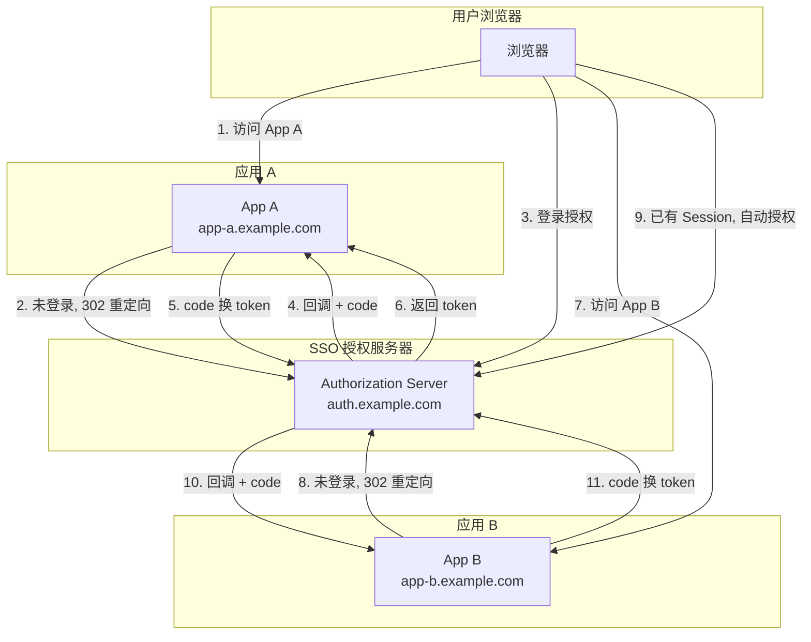

<!--
module:
  parent: spring
  slug: spring/09-security/oauth2
  type: article
  category: 主模块子文章
  summary: OAuth2 四种授权模式 + JWT Token 格式 + Spring Authorization Server，构筑现代应用认证授权基础设施。
-->

# OAuth2 与 JWT

> ⬅️ [返回 Spring Security](../README.md)

**OAuth2** 是当今最主流的授权框架，**JWT** 是 OAuth2 生态中事实标准的 Token 格式。两者结合构成了现代应用认证授权的基础设施——从第三方登录到微服务间鉴权，从 SSO 单点登录到开放平台 API 授权。

---

## 🎯 一句话定位

**OAuth2 = 授权协议（4 种授权模式）+ JWT = Token 格式（Header.Payload.Signature）**——Spring Authorization Server 提供授权服务器实现，Spring Security OAuth2 Resource Server 提供资源服务器验证。

---

## 一、OAuth2 四种授权模式

```
┌────────────────────────────────────────────────────────────────────────┐
│                    OAuth2 四种授权模式（Grant Types）                    │
├────────────────┬──────────────────┬──────────────────┬─────────────────┤
│  授权码模式     │  隐式模式         │  密码模式         │  客户端凭证模式   │
│ Authorization  │  Implicit        │  Password        │  Client         │
│ Code           │  (已废弃)         │  (已废弃)         │  Credentials    │
├────────────────┼──────────────────┼──────────────────┼─────────────────┤
│ 最安全         │ 不安全            │ 不安全            │ 服务间调用       │
│ Web 应用       │ 单页应用(旧)      │ 第一方 App(旧)    │ 微服务/后端      │
│ 有后端服务器    │ Token 在 URL 中   │ 明文传密码        │ 无用户参与       │
│ 两步：code→    │ 暴露             │ 暴露             │ 一步：直接换     │
│ token          │                  │                  │ Token           │
└────────────────┴──────────────────┴──────────────────┴─────────────────┘
```

### 1.1 授权码模式（Authorization Code）—— 最常用

```
┌──────┐          ┌──────────────┐          ┌──────────────┐
│Client│          │Authorization │          │   Resource   │
│(Web) │          │   Server     │          │   Server     │
└──┬───┘          └──────┬───────┘          └──────┬───────┘
   │                     │                         │
   │ 1. 重定向到授权页     │                         │
   │ GET /authorize?      │                         │
   │   response_type=code │                         │
   │   &client_id=xxx     │                         │
   │   &redirect_uri=xxx  │                         │
   │   &scope=read write  │                         │
   │   &state=random      │                         │
   │ ────────────────────→│                         │
   │                     │                         │
   │ 2. 用户登录并同意     │                         │
   │                     │                         │
   │ 3. 重定向回客户端     │                         │
   │ 302 redirect_uri?    │                         │
   │   code=AUTH_CODE     │                         │
   │   &state=random      │                         │
   │ ←────────────────────│                         │
   │                     │                         │
   │ 4. 后端用 code 换 token                        │
   │ POST /token          │                         │
   │   grant_type=        │                         │
   │   authorization_code │                         │
   │   &code=AUTH_CODE    │                         │
   │   &client_secret=xxx │                         │
   │ ────────────────────→│                         │
   │                     │                         │
   │ 5. 返回 token        │                         │
   │ { access_token,      │                         │
   │   refresh_token,     │                         │
   │   expires_in }       │                         │
   │ ←────────────────────│                         │
   │                     │                         │
   │ 6. 用 token 访问资源                          │
   │ GET /api/resource    │                         │
   │ Authorization: Bearer xxx                      │
   │ ───────────────────────────────────────────────→│
   │                     │                         │
   │ 7. 返回资源          │                         │
   │ ←───────────────────────────────────────────────│
```

### 1.2 PKCE 扩展（公开客户端推荐）

PKCE（Proof Key for Code Exchange）为移动 App / SPA 等无法安全存储 `client_secret` 的客户端设计：

```
1. 客户端生成 code_verifier（随机字符串，43-128 字符）
2. 计算 code_challenge = BASE64URL(SHA256(code_verifier))
3. 授权请求时发送 code_challenge（不发送 verifier）
4. 换 token 时发送 code_verifier
5. 授权服务器验证：SHA256(code_verifier) == code_challenge ?
```

```java
// Spring Authorization Server PKCE 配置
RegisteredClient registeredClient = RegisteredClient.withId(UUID.randomUUID().toString())
    .clientId("mobile-app")
    .clientAuthenticationMethod(ClientAuthenticationMethod.NONE)  // 公开客户端
    .authorizationGrantType(AuthorizationGrantType.AUTHORIZATION_CODE)
    .redirectUri("myapp://callback")
    .clientSettings(ClientSettings.builder()
        .requireProofKey(true)   // 强制 PKCE
        .build())
    .build();
```

### 1.3 客户端凭证模式（Client Credentials）

微服务间调用的标准模式——无用户参与，服务自身作为客户端：

```
┌──────────┐          ┌──────────────┐          ┌──────────┐
│ Service A│          │Authorization │          │ Service B│
│ (Client) │          │   Server     │          │(Resource)│
└────┬─────┘          └──────┬───────┘          └────┬─────┘
     │                       │                       │
     │ 1. 用自身凭证换 token   │                       │
     │ POST /token           │                       │
     │   grant_type=         │                       │
     │   client_credentials  │                       │
     │   &client_id=serviceA │                       │
     │   &client_secret=xxx  │                       │
     │   &scope=serviceB:read│                       │
     │ ────────────────────→ │                       │
     │                       │                       │
     │ 2. 返回 token         │                       │
     │ ←────────────────────│                       │
     │                       │                       │
     │ 3. 用 token 调用 Service B                    │
     │ GET /api/data         │                       │
     │ Authorization: Bearer xxx                      │
     │ ───────────────────────────────────────────────→│
     │                       │                       │
     │ 4. 返回数据           │                       │
     │ ←──────────────────────────────────────────────│
```

```java
// WebClient 自动获取并使用 Client Credentials Token
@Bean
public WebClient serviceBWebClient(
        ClientRegistrationRepository registrations) {
    
    var clientRegistration = registrations
        .findByRegistrationId("service-b");
    
    var client = new AuthorizedClientServiceOAuth2AuthorizedClientManager(
        new ClientRegistrationRepository() { /* ... */ },
        new OAuth2AuthorizedClientService() { /* ... */ }
    );
    
    return WebClient.builder()
        .filter(new ServerOAuth2AuthorizedClientExchangeFilterFunction(client))
        .baseUrl("https://service-b.example.com")
        .build();
}
```

---

## 二、Spring Authorization Server

Spring Authorization Server 是 Spring 官方提供的 OAuth2 授权服务器实现（替代旧的 Spring Security OAuth2 项目）。

### 2.1 依赖与配置

```xml
<dependency>
    <groupId>org.springframework.security</groupId>
    <artifactId>spring-security-oauth2-authorization-server</artifactId>
</dependency>
```

### 2.2 核心配置

```java
@Configuration
@EnableWebSecurity
public class AuthorizationServerConfig {

    @Bean
    @Order(1)
    public SecurityFilterChain authorizationServerFilterChain(
            HttpSecurity http) throws Exception {
        
        OAuth2AuthorizationServerConfiguration.applyDefaultSecurity(http);
        
        http.getConfigurer(OAuth2AuthorizationServerConfigurer.class)
            .oidc(Customizer.withDefaults());  // 启用 OpenID Connect
        
        // 未认证时重定向到登录页
        http.exceptionHandling(exceptions -> exceptions
            .defaultAuthenticationEntryPointFor(
                new LoginUrlAuthenticationEntryPoint("/login"),
                new MediaTypeRequestMatcher(MediaType.TEXT_HTML)
            )
        );
        
        return http.build();
    }

    @Bean
    @Order(2)
    public SecurityFilterChain defaultFilterChain(HttpSecurity http) 
            throws Exception {
        http
            .authorizeHttpRequests(auth -> auth
                .requestMatchers("/login").permitAll()
                .anyRequest().authenticated()
            )
            .formLogin(form -> form.loginPage("/login"));
        return http.build();
    }

    /**
     * 注册 OAuth2 客户端
     */
    @Bean
    public RegisteredClientRepository registeredClientRepository() {
        // Web 应用客户端
        RegisteredClient webClient = RegisteredClient.withId(UUID.randomUUID().toString())
            .clientId("web-app")
            .clientSecret(passwordEncoder().encode("secret"))
            .clientAuthenticationMethod(ClientAuthenticationMethod.CLIENT_SECRET_BASIC)
            .authorizationGrantType(AuthorizationGrantType.AUTHORIZATION_CODE)
            .authorizationGrantType(AuthorizationGrantType.REFRESH_TOKEN)
            .redirectUri("https://webapp.example.com/login/oauth2/code/auth-server")
            .scope(OidcScopes.OPENID)
            .scope(OidcScopes.PROFILE)
            .scope("custom:read")
            .clientSettings(ClientSettings.builder()
                .requireAuthorizationConsent(true)  // 需要用户同意
                .build())
            .tokenSettings(TokenSettings.builder()
                .accessTokenTimeToLive(Duration.ofHours(1))
                .refreshTokenTimeToLive(Duration.ofDays(7))
                .reuseRefreshTokens(false)
                .accessTokenFormat(OAuth2TokenFormat.SELF_CONTAINED) // JWT 格式
                .build())
            .build();

        return new InMemoryRegisteredClientRepository(webClient);
    }

    /**
     * JWK 密钥对（用于签名 JWT）
     */
    @Bean
    public JWKSource<SecurityContext> jwkSource() {
        RSAKey rsaKey = generateRsaKey();
        JWKSet jwkSet = new JWKSet(rsaKey);
        return new ImmutableJWKSet<>(jwkSet);
    }

    private static RSAKey generateRsaKey() {
        KeyPair keyPair = KeyPairUtils.generateKeyPair(2048);
        RSAPublicKey publicKey = (RSAPublicKey) keyPair.getPublic();
        RSAPrivateKey privateKey = (RSAPrivateKey) keyPair.getPrivate();
        return new RSAKey.Builder(publicKey)
            .privateKey(privateKey)
            .keyID(UUID.randomUUID().toString())
            .build();
    }

    @Bean
    public JwtDecoder jwtDecoder(JWKSource<SecurityContext> jwkSource) {
        return OAuth2AuthorizationServerConfiguration.jwtDecoder(jwkSource);
    }

    @Bean
    public AuthorizationServerSettings authorizationServerSettings() {
        return AuthorizationServerSettings.builder()
            .issuer("https://auth.example.com")
            .authorizationEndpoint("/oauth2/authorize")
            .tokenEndpoint("/oauth2/token")
            .jwkSetEndpoint("/oauth2/jwks")
            .tokenRevocationEndpoint("/oauth2/revoke")
            .tokenIntrospectionEndpoint("/oauth2/introspect")
            .oidcUserInfoEndpoint("/userinfo")
            .build();
    }
}
```

---

## 三、JWT 结构

JWT（JSON Web Token）由三部分组成，用 `.` 分隔：

```
┌─────────────────────────────────────────────────────────────────────┐
│                    JWT = Header.Payload.Signature                    │
│                                                                       │
│  ┌──────────────┐  ┌──────────────────────┐  ┌─────────────────┐  │
│  │   Header     │  │     Payload          │  │   Signature     │  │
│  │              │  │                      │  │                 │  │
│  │ {"alg":      │  │ {"sub": "user123",   │  │ HMAC-SHA256(    │  │
│  │  "HS256",    │  │  "roles": ["ADMIN"], │  │   base64(header)│  │
│  │  "typ":      │  │  "iat": 1699000000,  │  │   + "." +       │  │
│  │  "JWT"}      │  │  "exp": 1699003600,  │  │   base64(payload│  │
│  │              │  │  "iss": "auth.com"}  │  │   , secret)     │  │
│  └──────┬───────┘  └──────────┬───────────┘  └────────┬────────┘  │
│         │                      │                       │            │
│    base64url              base64url               base64url         │
│         │                      │                       │            │
│         └──────────┬───────────┘                       │            │
│                    │                                   │            │
│                    └───────────┬───────────────────────┘            │
│                                │                                     │
│     eyJhbGciOiJIUzI1NiJ9.eyJzdWIiOiJ1c2VyMTIzIn0.xxxxx            │
└─────────────────────────────────────────────────────────────────────┘
```

### 3.1 标准 Claims

| Claim | 全称 | 说明 | 示例 |
|:------|:-----|:-----|:-----|
| `sub` | Subject | 主体（通常是用户 ID） | `"user123"` |
| `iss` | Issuer | 签发者 | `"https://auth.example.com"` |
| `aud` | Audience | 受众（哪些服务可以使用） | `"web-app"` |
| `exp` | Expiration | 过期时间（Unix 时间戳） | `1699003600` |
| `iat` | Issued At | 签发时间 | `1699000000` |
| `nbf` | Not Before | 生效时间 | `1699000000` |
| `jti` | JWT ID | 唯一标识（防重放） | `"550e8400-..."` |
| `scope` | Scope | 授权范围 | `"read write"` |

### 3.2 签名算法选择

| 算法 | 类型 | 密钥 | 适用场景 |
|:-----|:-----|:-----|:---------|
| **HS256** | 对称 | Secret Key | 内部服务（密钥共享） |
| **RS256** | 非对称 | RSA 公私钥对 | **推荐**，公钥分发验证 |
| **ES256** | 非对称 | EC 公私钥对 | 性能敏感场景（签名更短） |
| **PS256** | 非对称 | RSA-PSS | 高安全性场景 |

### 3.3 JWS vs JWE

```
JWS（JSON Web Signature）—— 签名，内容可读
├── 用途：身份认证、授权（最常见）
├── 特点：Payload 是 base64 编码（不是加密！）
└── 不要放敏感信息（密码、个人信息）

JWE（JSON Web Encryption）—— 加密，内容不可读
├── 用途：传递敏感数据
├── 特点：Payload 被加密
└── 适合：Token 中携带用户敏感信息
```

---

## 四、Token 刷新与黑名单

### 4.1 Token 刷新策略

```
┌─────────────────────────────────────────────────────────┐
│                  Token 刷新策略                           │
│                                                           │
│  Access Token: 短有效期（15min ~ 1h）                     │
│  Refresh Token: 长有效期（7d ~ 30d）                      │
│                                                           │
│  刷新流程：                                               │
│  1. 客户端用 Access Token 请求资源                        │
│  2. 服务端返回 401（Token 过期）                          │
│  3. 客户端用 Refresh Token 请求新 Access Token            │
│     POST /oauth2/token                                    │
│     grant_type=refresh_token                              │
│     &refresh_token=xxx                                    │
│  4. 服务端返回新的 Access Token（+ 新的 Refresh Token）   │
│                                                           │
│  最佳实践：                                               │
│  - Access Token 过期前主动刷新（客户端定时器）             │
│  - Refresh Token 一次性使用（rotation）                   │
│  - Refresh Token 配合黑名单（撤销机制）                   │
└─────────────────────────────────────────────────────────┘
```

### 4.2 Token 黑名单实现

```java
@Component
public class TokenBlacklistService {

    private final RedisTemplate<String, Object> redisTemplate;

    /**
     * 将 Token 加入黑名单（登出/强制下线时调用）
     */
    public void blacklist(String token, long ttlSeconds) {
        String jti = extractJti(token);
        redisTemplate.opsForValue().set(
            "token:blacklist:" + jti, 
            "revoked",
            Duration.ofSeconds(ttlSeconds)  // TTL = Token 剩余有效期
        );
    }

    /**
     * 检查 Token 是否在黑名单中
     */
    public boolean isBlacklisted(String token) {
        String jti = extractJti(token);
        return Boolean.TRUE.equals(
            redisTemplate.hasKey("token:blacklist:" + jti));
    }

    /**
     * 登出时加入黑名单
     */
    public void logout(String accessToken, String refreshToken) {
        blacklist(accessToken, getRemainingTtl(accessToken));
        blacklist(refreshToken, getRemainingTtl(refreshToken));
    }
}

// 在 JWT Filter 中检查黑名单
@Override
protected void doFilterInternal(HttpServletRequest request,
                                 HttpServletResponse response,
                                 FilterChain filterChain) {
    String token = extractToken(request);
    if (token != null && tokenBlacklistService.isBlacklisted(token)) {
        response.setStatus(HttpStatus.UNAUTHORIZED.value());
        return;
    }
    // ... 正常认证流程
}
```

### 4.3 Token 轮转（Rotation）

```java
/**
 * Refresh Token 轮转——每次刷新都生成新的 Refresh Token
 * 旧的 Refresh Token 立即失效
 * 如果检测到已失效的 Refresh Token 被重复使用，说明 Token 泄露，撤销所有 Token
 */
@PostMapping("/auth/refresh")
public TokenResponse refreshToken(@RequestBody RefreshTokenRequest request) {
    String oldRefreshToken = request.getRefreshToken();
    
    // 1. 验证 Refresh Token
    Claims claims = jwtTokenProvider.validateToken(oldRefreshToken);
    
    // 2. 检查是否已被使用（Token 轮转检测）
    if (tokenBlacklistService.isBlacklisted(oldRefreshToken)) {
        // Token 被重放！可能泄露了，撤销该用户所有 Token
        securityService.revokeAllUserTokens(claims.getSubject());
        throw new SecurityException("Refresh Token reuse detected");
    }
    
    // 3. 将旧 Token 加入黑名单
    tokenBlacklistService.blacklist(oldRefreshToken, getRemainingTtl(oldRefreshToken));
    
    // 4. 生成新的 Token 对
    String newAccessToken = jwtTokenProvider.generateAccessToken(userDetails);
    String newRefreshToken = jwtTokenProvider.generateRefreshToken(username);
    
    return new TokenResponse(newAccessToken, newRefreshToken);
}
```

---

## 五、SSO 单点登录

### 5.1 SSO 架构



### 5.2 Spring Boot SSO 配置（OIDC）

```yaml
# application.yml — 应用 A
spring:
  security:
    oauth2:
      client:
        registration:
          auth-server:
            client-id: app-a
            client-secret: secret-a
            scope: openid,profile,email
            authorization-grant-type: authorization_code
            redirect-uri: "{baseUrl}/login/oauth2/code/{registrationId}"
        provider:
          auth-server:
            issuer-uri: https://auth.example.com
            # 自动发现 authorization_endpoint, token_endpoint, jwks_uri
```

```java
// 应用 A 的安全配置
@Configuration
@EnableWebSecurity
public class SsoConfig {

    @Bean
    public SecurityFilterChain filterChain(HttpSecurity http) throws Exception {
        http
            .authorizeHttpRequests(auth -> auth
                .requestMatchers("/", "/public/**").permitAll()
                .anyRequest().authenticated()
            )
            .oauth2Login(oauth2 -> oauth2
                .loginPage("/oauth2/authorization/auth-server")
                .userInfoEndpoint(userInfo -> userInfo
                    .oidcUserService(customOidcUserService())
                )
                .successHandler((request, response, authentication) -> {
                    // 登录成功后同步用户信息到本地数据库
                    OidcUser oidcUser = (OidcUser) authentication.getPrincipal();
                    userService.syncFromOidc(oidcUser);
                    response.sendRedirect("/dashboard");
                })
            )
            .logout(logout -> logout
                .logoutSuccessHandler(oidcLogoutSuccessHandler()));

        return http.build();
    }
}
```

---

## 六、面试要点

| 问题 | 核心答案 |
|:-----|:---------|
| OAuth2 和 OpenID Connect 的区别？ | OAuth2 是授权协议，OIDC = OAuth2 + 身份认证层（增加 `id_token` 和 `/userinfo`） |
| 为什么授权码模式最安全？ | code 通过前端 URL 传递（短有效期），token 通过后端 HTTP 交换（不暴露给浏览器） |
| JWT 的 Payload 是加密的吗？ | 不是，是 base64 编码（任何人可解码读取），不要放敏感信息 |
| 如何处理 JWT 撤销？ | 黑名单（Redis 存 JTI + TTL）；Token 轮转（Refresh Token 一次性使用） |
| PKCE 解决什么问题？ | 防止授权码拦截攻击——公开客户端无法安全存储 `client_secret`，用 `code_verifier` 替代 |

---

← [返回: Spring Security](../README.md)
