# Spring 全家桶

> 最后更新: 2026-06-14
> Spring 是一个分层的、模块化的 Java 企业应用开发框架，包含 Spring Framework、Spring Boot、Spring Cloud 等多个子项目。本笔记按"层次 + 主题"双维度组织，覆盖从核心容器到云原生微服务的完整技术栈。

---

## 🎯 一句话定位

**Spring 全家桶 = 核心容器（IoC/AOP） + Web 层（MVC/WebFlux） + 数据层（事务/缓存） + Spring Boot（约定优于配置） + Spring Cloud（微服务治理）**——本文档按这 5 层组织，让你既看清"骨架"，也掌握"血肉"。

---

## 🗺️ 知识地图

```mermaid
graph TB
    Root["🌱 Spring 全家桶"]
    
    Root --> Core["01 核心容器<br/>IoC · AOP · 工具"]
    Root --> Web["02 Web 层<br/>MVC · WebFlux"]
    Root --> Data["03 数据层<br/>事务 · 缓存 · 分布式"]
    Root --> Boot["04 Spring Boot<br/>自动配置 · Starter"]
    Root --> Cloud["05 Spring Cloud<br/>微服务治理"]
    Root --> Integ["06 集成组件<br/>校验 · 重试 · 状态机 · 批处理"]
    Root --> Obs["07 可观测性<br/>Actuator · Micrometer · Prometheus"]
    Root --> Anno["08 注解速查<br/>按场景分类"]
    
    Core --> C1["模块依赖与版本"]
    Core --> C2["IoC 容器与 DI"]
    Core --> C3["Bean 生命周期"]
    Core --> C4["AOP 切面编程"]
    Core --> C5["配置/事件/异常"]
    Core --> C6["手写 mini Spring"]
    
    Web --> W1["Spring MVC 流程"]
    Web --> W2["Filter/Interceptor/AOP 顺序"]
    Web --> W3["MVC 进阶（ViewResolver/异常/上传/CORS/i18n/异步）"]
    Web --> W4["WebFlux 响应式"]
    Web --> W5["SSE 实时推送"]
    
    Data --> D1["声明式事务"]
    Data --> D2["事务传播/隔离/失效"]
    Data --> D3["分布式事务（Seata）"]
    Data --> D4["Cache 注解与选型"]
    
    Boot --> B1["自动配置原理"]
    Boot --> B2["Starter 机制"]
    Boot --> B3["启动流程"]
    Boot --> B4["外部化配置"]
    
    Cloud --> S1["服务注册/发现"]
    Cloud --> S2["配置中心"]
    Cloud --> S3["负载均衡/RPC"]
    Cloud --> S4["熔断/网关"]
    Cloud --> S5["链路追踪"]
    
    Integ --> I1["Validation 校验"]
    Integ --> I2["Retry 重试"]
    Integ --> I3["StateMachine 状态机"]
    Integ --> I4["Batch 批处理"]
    
    Obs --> O1["Actuator 端点"]
    Obs --> O2["Micrometer 指标"]
    Obs --> O3["Prometheus + Grafana"]

    classDef root fill:#fff3e0,stroke:#e65100,stroke-width:3px
    classDef layer fill:#e3f2fd,stroke:#1976d2,stroke-width:2px
    classDef leaf fill:#f3e5f5,stroke:#7b1fa2
    
    class Root root
    class Core,Web,Data,Boot,Cloud,Integ,Obs,Anno layer
    class C1,C2,C3,C4,C5,C6,W1,W2,W3,W4,W5,D1,D2,D3,D4,B1,B2,B3,B4,S1,S2,S3,S4,S5,I1,I2,I3,I4,O1,O2,O3 leaf
```



---

## 📚 章节导航

| 章节 | 入口 | 核心问题 | 建议时长 |
|:----:|:----|:---------|:--------:|
| **01 核心容器** | [01-core/README.md](01-core/README.md) | IoC 容器、Bean 生命周期、AOP 切面编程的原理 | 90 min |
| **02 Web 层** | [02-web/README.md](02-web/README.md) | Spring MVC 请求处理、Filter/AOP 顺序、WebFlux 响应式 | 60 min |
| **03 数据层** | [03-data/README.md](03-data/README.md) | 事务管理、缓存抽象、分布式事务（Seata） | 75 min |
| **04 Spring Boot** | [04-spring-boot/README.md](04-spring-boot/README.md) | 自动配置原理、Starter 机制、启动流程 | 60 min |
| **05 Spring Cloud** | [05-spring-cloud/README.md](05-spring-cloud/README.md) | 服务发现/网关/熔断/链路追踪等微服务治理 | 60 min |
| **06 集成组件** | [06-integration/README.md](06-integration/README.md) | Validation/Retry/StateMachine/Batch 业务级组件 | 60 min |
| **07 可观测性** | [07-observability/README.md](07-observability/README.md) | Actuator 端点、Micrometer 指标、Prometheus 监控 | 45 min |
| **08 注解速查** | [08-annotations/README.md](08-annotations/README.md) | 按场景分类的注解索引（Web/Bean/配置/AOP/异常/测试） | 速查 |

### 推荐学习路径

```
入门路线（1-2 天）
  ├── 01-core/ioc/（IoC 基础）
  ├── 01-core/aop/（AOP 基础）
  ├── 02-web/mvc/（Web 请求处理）
  ├── 03-data/transaction/（事务）
  └── 04-spring-boot/（Boot 入门）

进阶路线（3-5 天）
  ├── 01-core/ioc/bean-lifecycle.md（生命周期）
  ├── 02-web/mvc/components-order.md（Filter/AOP 顺序）
  ├── 03-data/cache/（缓存）
  ├── 04-spring-boot/auto-configuration.md（自动配置）
  ├── 06-integration/validation/（校验）
  └── 07-observability/actuator.md（监控）

高级路线（1 周+）
  ├── 01-core/event.md（事件机制）
  ├── 02-web/webflux/（响应式）
  ├── 03-data/transaction/distributed/（分布式事务）
  ├── 05-spring-cloud/（微服务治理）
  ├── 06-integration/batch.md（批处理）
  ├── 07-observability/prometheus-grafana.md（监控体系）
  └── 08-annotations/（注解速查）
```

---

## 🧭 在系统设计中的位置

```
战略层：TOGAF（企业架构）      → 决定"做什么系统、由谁做、怎么治理"
   ↓
战术层：系统设计（DDD/OOD）    → 决定"系统边界在哪、模块怎么分"
   ↓
编码层：Spring 全家桶（本文档）→ 决定"Java 实现层的最佳实践与框架选择"
   ↓
基础设施：部署/可观测性         → 决定"如何上线、监控、运维"
```

> Spring 生态是 Java 后端的事实标准：单体应用 Spring Boot、分布式系统 Spring Cloud、响应式 WebFlux、批处理 Spring Batch。

---

## 🔗 与其他章节的关联

| 关联章节 | 关联点 |
|:---------|:-------|
| [04.system-design/01-foundation](../04.system-design/01-foundation/README.md) | 微服务设计 → Spring Cloud 选型；DDD 限界上下文 → Spring 微服务边界 |
| [04.system-design/02-distributed](../04.system-design/02-distributed/README.md) | 分布式事务 → Seata；服务发现 → Nacos/Consul |
| [04.system-design/03-high-availability](../04.system-design/03-high-availability/README.md) | 熔断限流 → Resilience4j；可观测性 → Prometheus + Grafana |
| [04.system-design/04-high-performance](../04.system-design/04-high-performance/README.md) | 缓存 → Redis；消息队列 → Kafka/RocketMQ |
| [03.database/12-cloud-database](../03.database/12-cloud-database/README.md) | 事务隔离级别 → 数据库实现 |

---

## 🎯 高频面试题（咬文嚼字）

针对面试中反复深挖的细节问题，见 [13.split-hairs/06.spring](../13.split-hairs/06.spring/)：

| 主题 | 难度 | 核心问题 |
|------|------|---------|
| [@Transactional 失效 8 种场景](../13.split-hairs/06.spring/transactional-pitfalls/) | ⭐⭐⭐⭐⭐ | 同类调用 / 异常类型 / 多线程 / 传播行为 |
| [Bean 生命周期详解](../13.split-hairs/06.spring/bean-lifecycle/) | ⭐⭐⭐⭐ | 实例化 → 注入 → 初始化 → 销毁 12 步 |
| [为什么不推荐 @Autowired](../13.split-hairs/06.spring/not-use-@autowired/) | ⭐⭐⭐ | 字段注入 vs 构造器注入 |

---

## 📖 外部参考

- [Spring 官方文档](https://spring.io/docs)
- [Spring Boot 参考指南](https://docs.spring.io/spring-boot/docs/current/reference/htmlsingle/)
- [Spring Cloud 参考指南](https://spring.io/projects/spring-cloud)
- [Spring 全家桶中文文档](https://springdoc.cn/)

---

> 🚀 从 [01 核心容器](01-core/README.md) 开始
