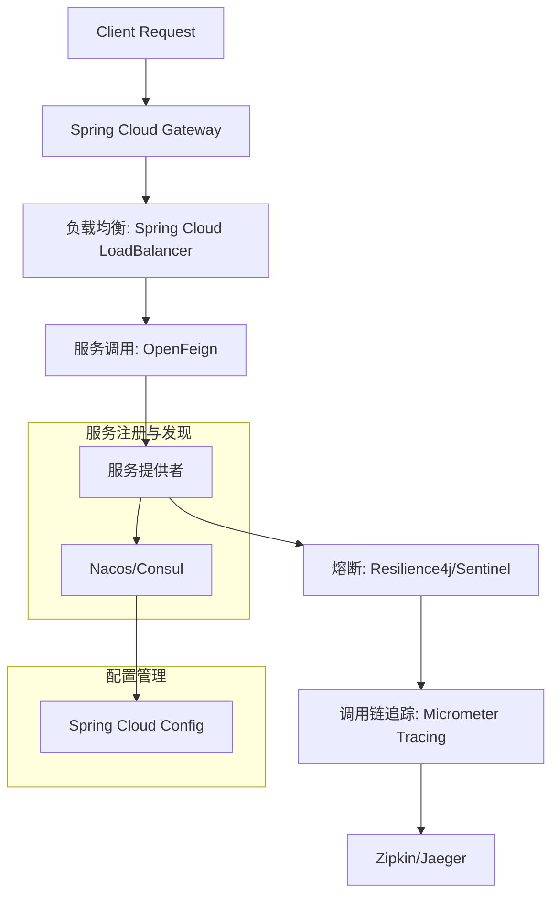

# Spring Cloud

Spring Cloud 是基于 Spring Boot 实现的微服务架构开发工具集，提供服务发现、配置管理、断路器、智能路由等核心功能。

## 一、调用链核心组件及作用
1. **服务注册与发现**
    - **替代方案：Nacos / Consul**
        - **作用**：动态管理服务实例的注册与发现，解决服务间通信的地址映射问题。
        - **淘汰组件**：Eureka（已停止维护，缺乏解耦和配置中心功能）。
        - **推荐组件**：
            - **Nacos**：阿里开源，支持服务发现和配置管理，提供控制台界面。
            - **Consul**：HashiCorp 开源，支持多数据中心，提供健康检查和键值存储。

2. **负载均衡**
    - **替代方案：Spring Cloud LoadBalancer**
        - **作用**：在客户端实现请求分发，避免单点故障，提升系统可用性。
        - **淘汰组件**：Ribbon（已进入维护模式，不支持响应式编程）。
        - **推荐组件**：
            - **Spring Cloud LoadBalancer**：Spring 官方出品，与 WebFlux 集成，支持响应式负载均衡。

3. **服务调用**
    - **替代方案：OpenFeign**
        - **作用**：声明式 REST 客户端，简化服务间调用代码，支持负载均衡和熔断。
        - **淘汰组件**：Feign（Netflix 版本，已停止更新）。
        - **推荐组件**：
            - **OpenFeign**：Spring Cloud 官方维护，支持 Spring MVC 注解和拦截器扩展。

4. **熔断与容错**
    - **替代方案：Resilience4j / Sentinel**
        - **作用**：防止服务雪崩，通过熔断、限流、降级等机制保障系统稳定性。
        - **淘汰组件**：Hystrix（已停止维护，功能复杂且配置繁琐）。
        - **推荐组件**：
            - **Resilience4j**：轻量级，支持函数式编程，与 Spring Boot 深度集成。
            - **Sentinel**：阿里开源，流量控制能力强，提供实时监控和动态规则配置。

5. **API 网关**
    - **替代方案：Spring Cloud Gateway**
        - **作用**：统一入口，负责路由转发、权限校验、流量控制等。
        - **淘汰组件**：Zuul（基于 Servlet，性能瓶颈明显）。
        - **推荐组件**：
            - **Spring Cloud Gateway**：基于 WebFlux，支持非阻塞 IO，性能优于 Zuul。

6. **调用链追踪**
    - **替代方案：Sleuth + Zipkin / Micrometer Tracing**
        - **作用**：记录请求在微服务间的流转路径和耗时，辅助问题排查和性能优化。
        - **淘汰组件**：Sleuth+Zipkin（旧版，功能逐渐被 Micrometer Tracing 替代）。
        - **推荐组件**：
            - **Micrometer Tracing**：Spring 官方推荐，支持 OpenTelemetry 标准，兼容 Zipkin、Jaeger 等后端。

7. **分布式配置管理**
    - **替代方案：Spring Cloud Config + Nacos/Consul**
        - **作用**：集中管理微服务的配置信息，支持动态刷新和版本控制。
        - **淘汰组件**：Archaius（Netflix 配置工具，功能单一）。
        - **推荐组件**：
            - **Spring Cloud Config**：支持 Git、Vault 等后端，结合 Nacos/Consul 实现配置发现。

## 二、调用链核心组件示意图

## 三、关键组件淘汰原因分析
1. **Eureka**
    - **问题**：停止维护，缺乏解耦设计（需作为微服务部署），功能单一（仅服务发现）。
    - **替代优势**：Nacos/Consul 支持配置中心，Consul 支持多数据中心。

2. **Ribbon**
    - **问题**：不支持响应式编程，与 WebFlux 集成困难。
    - **替代优势**：Spring Cloud LoadBalancer 由 Spring 官方维护，与现代技术栈兼容。

3. **Hystrix**
    - **问题**：配置复杂，线程池隔离资源消耗大。
    - **替代优势**：Resilience4j 基于函数式编程，Sentinel 提供实时监控和动态规则。

4. **Zuul**
    - **问题**：基于 Servlet，性能低于 WebFlux。
    - **替代优势**：Spring Cloud Gateway 支持非阻塞 IO，路由规则更灵活。

5. **Sleuth+Zipkin（旧版）**
    - **问题**：Sleuth 逐渐被 Micrometer Tracing 替代，后者支持 OpenTelemetry 标准。
    - **替代优势**：Micrometer Tracing 兼容性更强，支持更多后端系统。

## 四、推荐实践
- **配置中心**：使用 **Nacos** 替代 Spring Cloud Config，支持动态刷新和权限控制。
- **消息总线**：采用 **Spring Cloud Bus + Kafka** 替代 RabbitMQ，提升吞吐量。
- **监控告警**：集成 **Prometheus + Grafana** 替代 Hystrix Dashboard，实现多维指标监控。
