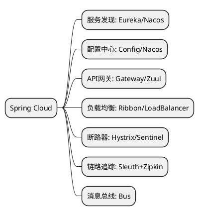
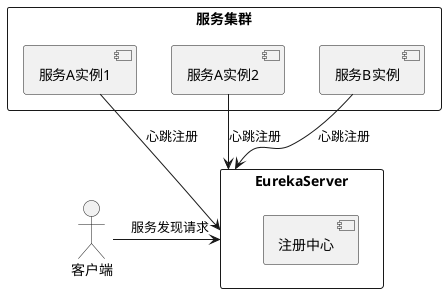
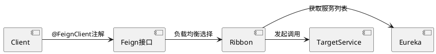
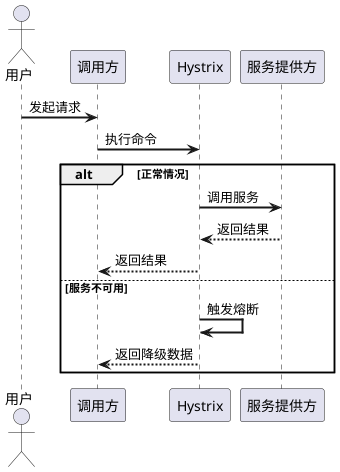
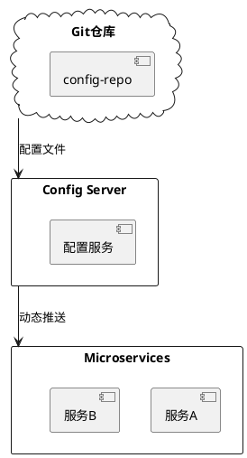
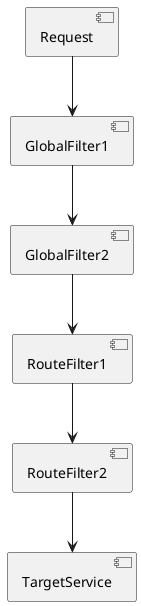

# Spring Cloud 微服务架构笔记

## 一、Spring Cloud 概述
Spring Cloud 是基于 Spring Boot 实现的微服务架构开发工具集，提供服务发现、配置管理、断路器、智能路由等核心功能。

### 核心组件


## 二、服务注册与发现（Eureka示例）

### 1. 架构示意图


### 2. 核心配置
```yaml
# application.yml 示例
eureka:
  client:
    service-url:
      defaultZone: http://localhost:8761/eureka/
  instance:
    prefer-ip-address: true
    lease-renewal-interval-in-seconds: 10
```

## 三、服务调用（Feign+Ribbon）

### 1. 调用流程


### 2. 代码示例
```java
@FeignClient(name = "user-service")
public interface UserClient {
    @GetMapping("/users/{id}")
    User getUser(@PathVariable("id") Long id);
}

// 配置类（Ribbon负载均衡策略）
@Configuration
public class RibbonConfig {
    @Bean
    public IRule ribbonRule() {
        return new RandomRule(); // 随机策略
    }
}
```

## 四、熔断降级（Hystrix）

### 1. 工作原理


### 2. 注解使用
```java
@HystrixCommand(fallbackMethod = "getDefaultUser")
public User getUser(Long id) {
    // 远程调用逻辑
}

public User getDefaultUser(Long id) {
    return new User(0L, "默认用户");
}
```

## 五、配置中心（Spring Cloud Config）

### 1. 架构组成


### 2. 配置刷新
```bash
# 手动刷新端点（需配合@RefreshScope）
POST http://service-a/actuator/refresh
```

## 六、API网关（Spring Cloud Gateway）

### 1. 路由规则示例
```yaml
spring:
  cloud:
    gateway:
      routes:
        - id: user-service
          uri: lb://user-service
          predicates:
            - Path=/api/users/**
          filters:
            - RewritePath=/api/users/(?<segment>.*), /$\{segment}
```

### 2. 过滤器流程


## 七、最佳实践建议

1. **服务拆分原则**：
    - 单一职责原则
    - 服务粒度适中（建议不超过10个方法）
    - 避免双向依赖

2. **配置管理**：
    - 开发环境：本地配置优先
    - 生产环境：集中配置覆盖
    - 敏感信息使用Vault管理

3. **监控体系**：
   ```plantuml
   @startuml
   [Microservices] --> [Prometheus]: 指标采集
   [Prometheus] --> [Grafana]: 可视化
   [Microservices] --> [ELK]: 日志收集
   [Microservices] --> [Zipkin]: 链路追踪
   @enduml
   ```

## 八、版本演进建议

| 组件       | 2020.x 版本 | 2021.x 版本 | 替代方案       |
|------------|-------------|-------------|----------------|
| 服务发现   | Eureka      | Nacos       | Consul/Zookeeper|
| 熔断       | Hystrix     | Resilience4j | Sentinel        |
| 配置中心   | Config      | Nacos       | Apollo          |

> 提示：Spring Cloud 2022.x开始采用年号版本命名（如2022.0.0），建议新项目直接使用最新稳定版。
