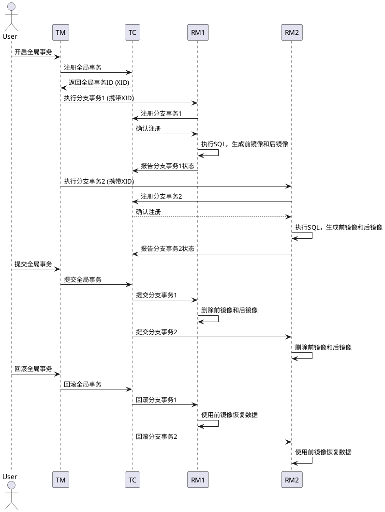
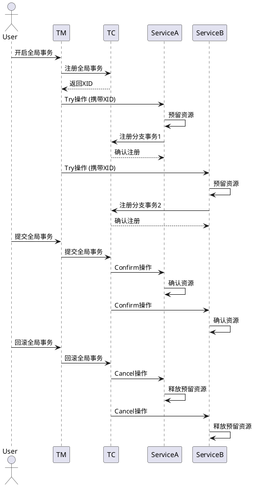
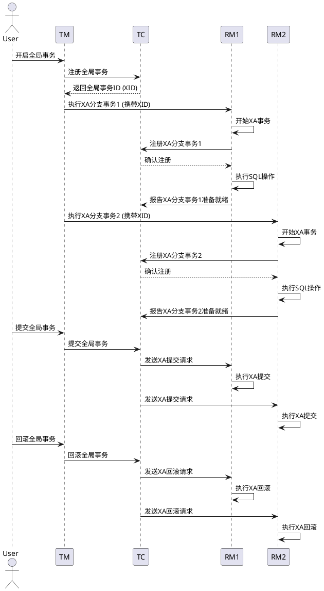
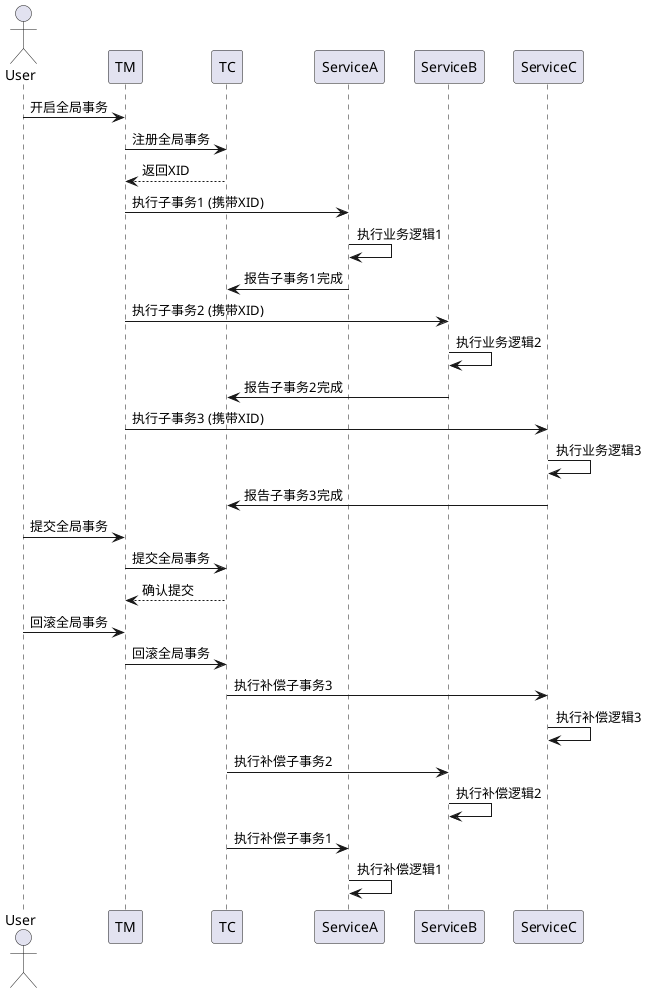

# Seata 分布式事务框架

## 一、Seata 简介
Seata 是一款开源的分布式事务解决方案，致力于提供高性能和简单易用的分布式事务服务。其核心思想是通过将分布式事务拆解为多个本地事务，利用事务协调器（TC）来协调这些本地事务的提交或回滚，从而实现分布式环境下的数据一致性。

### 1.1 核心组件
- **Transaction Coordinator (TC)**：事务协调器，负责维护全局事务的运行状态，接收来自事务参与者（TM 和 RM）的指令并协调全局事务的提交或回滚。
- **Transaction Manager (TM)**：事务管理器，定义全局事务的范围，开启、提交或回滚全局事务。
- **Resource Manager (RM)**：资源管理器，管理分支事务处理的资源，与 TC 交互以注册分支事务和报告分支事务的状态。

### 1.2 四大核心模块
- **AT 模式（Automatic Transaction）**：基于 SQL 解析和拦截实现的无侵入自动回滚，适用于高并发场景。
- **TCC 模式（Try-Confirm-Cancel）**：需要业务方实现 Try、Confirm、Cancel 三个操作，适用于强一致性要求的场景。
- **SAGA 模式**：基于状态机驱动的长事务解决方案，适用于业务流程长且需要多个子事务协作的场景。
- **XA 模式**：基于 XA 协议实现的分布式事务模式，支持多种数据库，适用于需要强一致性且对性能要求不极高的场景。

---

## 二、AT 模式详解
AT 模式是 Seata 最常用的模式，其核心思想是通过拦截 SQL 执行，生成“前镜像”和“后镜像”，在事务回滚时利用这些镜像数据恢复数据到事务开始前的状态。

### 2.1 工作流程


### 2.2 数据一致性保障
- **全局锁机制**：在修改数据前，RM 会向 TC 申请该数据的全局锁，防止其他事务并发修改同一数据。
- **快照机制**：通过生成前镜像和后镜像，确保回滚时有完整的数据恢复依据。

### 2.3 适用场景
- 适用于大多数基于关系型数据库的分布式事务场景。
- 要求数据库支持本地事务（如 MySQL、Oracle 等）。

---

## 三、TCC 模式详解
TCC 模式是一种补偿型事务模式，需要业务方显式实现 Try、Confirm、Cancel 三个操作。

### 3.1 工作流程


### 3.2 关键点
- **Try 阶段**：尝试预留资源，检查业务可行性。
- **Confirm 阶段**：确认执行业务操作，无条件成功。
- **Cancel 阶段**：取消预留资源，释放已占用的资源。

### 3.3 适用场景
- 对一致性要求高，且业务逻辑可以拆分为 Try、Confirm、Cancel 三个阶段的场景。
- 适用于支付、订单等核心业务场景。

---

## 四、XA 模式详解
XA 模式是基于 XA 协议实现的分布式事务模式，XA 协议由 X/Open 组织提出，是一种分布式事务处理的标准协议。

### 4.1 XA 协议核心概念
- **RM（Resource Manager）**：资源管理器，管理共享资源（如数据库），支持 XA 协议。
- **TM（Transaction Manager）**：事务管理器，协调多个 RM 的事务操作。
- **两阶段提交（2PC）**：
   - **准备阶段（Prepare Phase）**：TM 向所有 RM 发送准备请求，RM 执行事务操作并记录日志，但暂不提交，返回准备结果。
   - **提交阶段（Commit Phase）**：如果所有 RM 都准备成功，TM 发送提交请求，RM 正式提交事务；如果有 RM 准备失败，TM 发送回滚请求，RM 回滚事务。

### 4.2 Seata XA 模式工作流程


### 4.3 特点
- **强一致性**：基于两阶段提交，保证事务的原子性，要么全部成功，要么全部失败。
- **支持多种数据库**：只要数据库支持 XA 协议（如 MySQL、Oracle、PostgreSQL 等），就可以使用 Seata XA 模式。
- **性能较低**：两阶段提交需要多次网络通信和磁盘 I/O，性能相对 AT 和 TCC 模式较低。

### 4.4 适用场景
- 对数据一致性要求极高，且可以接受较低性能的场景。
- 使用的数据库支持 XA 协议，且无法或不愿意进行业务改造以使用 AT 或 TCC 模式的场景。

---

## 五、SAGA 模式详解
SAGA 模式是基于状态机驱动的长事务解决方案，适用于业务流程长且需要多个子事务协作的场景。

### 5.1 工作流程


### 5.2 关键点
- **正向操作**：按照业务顺序依次执行各个子事务。
- **补偿操作**：如果某个子事务失败，按照相反的顺序依次执行补偿操作，回滚已执行的子事务。
- **状态机定义**：通过状态机定义业务流程和补偿逻辑，使业务逻辑可视化。

### 5.3 适用场景
- 业务流程长，涉及多个子事务的场景。
- 对一致性要求较高，但可以接受最终一致性的场景。

---

## 五、四种模式对比

以下是整理后的表格：

|  | XA | AT | TCC | SAGA |
| :--: | :--: | :--: | :--: | :--: |
| 一致性 | 强一致 | 弱一致 | 弱一致 | 最终一致 |
| 隔离性 | 完全隔离 | 基于全局锁隔离 | 基于资源预留隔离 | 无隔离 |
| 代码侵入 | 无 | 无 | 有，要编写三个接口 | 有，要编写状态机和补偿业务 |
| 性能 | 差 | 好 | 非常好 | 非常好 |
| 场景 | 对一致性、隔离性有高要求的业务 | 基于关系型数据库的大多数分布式事务场景都可以 | 1. 对性能要求较高的事务。2. 有非关系型数据库要参与的事务。 | 1.业务流程长、业务流程多。2. 参与者包含其它公司或遗留系统服务，无法提供TCC模式要求的三个接口 |

---

## 六、Seata 配置与使用
### 6.1 快速启动
1. **下载 Seata Server**：从 [Seata 官网](https://seata.io/) 下载最新版本。
2. **配置数据库**：修改 `conf/file.conf` 文件，配置 Seata 的存储模式（如使用数据库存储事务日志）。
3. **启动 Seata Server**：
   ```bash
   sh bin/seata-server.sh
   ```

### 6.2 客户端集成（以 Spring Boot 为例）
#### 6.2.1 添加依赖
```xml
<dependency>
    <groupId>io.seata</groupId>
    <artifactId>seata-spring-boot-starter</artifactId>
    <version>最新版本</version>
</dependency>
```

#### 6.2.2 配置 Seata
```yaml
seata:
  tx-service-group: my_test_tx_group
  service:
    vgroup-mapping:
      my_test_tx_group: default
    grouplist:
      default: 127.0.0.1:8091
  registry:
    type: nacos
    nacos:
      server-addr: 127.0.0.1:8848
```

#### 6.2.3 使用注解
- **全局事务注解**：
  ```java
  @GlobalTransactional
  public void orderService() {
      // 调用多个微服务
  }
  ```
- **TCC 模式注解**：
  ```java
  @TwoPhaseBusinessAction(name = "tccAction", commitMethod = "confirm", rollbackMethod = "cancel")
  public interface TccService {
      boolean tryMethod(BusinessActionContext context);
      boolean confirm(BusinessActionContext context);
      boolean cancel(BusinessActionContext context);
  }
  ```
- **XA 模式配置**：
   - 在数据源配置中指定使用 XA 数据源，例如：
     ```java
     @Bean
     public DataSource dataSource() throws SQLException {
         // 创建 XA 数据源
         MysqlXADataSource mysqlXaDataSource = new MysqlXADataSource();
         mysqlXaDataSource.setUrl("jdbc:mysql://localhost:3306/test");
         mysqlXaDataSource.setUser("root");
         mysqlXaDataSource.setPassword("password");
         
         // 创建 Seata XA 数据源
         return new DataSourceProxy(new AtomikosDataSourceBean() {
             {
                 setXaDataSource(mysqlXaDataSource);
                 setUniqueResourceName("test_ds");
             }
         });
     }
     ```

---

## 七、常见问题与解决方案
### 7.1 全局锁超时
- **原因**：事务持有全局锁时间过长，导致其他事务等待超时。
- **解决方案**：优化事务逻辑，减少事务持有锁的时间。

### 7.2 事务回滚失败
- **原因**：前镜像或后镜像数据丢失，或业务逻辑异常。
- **解决方案**：检查数据库日志，确保数据完整性；在 TCC 模式中完善 Cancel 逻辑；在 XA 模式中检查数据库是否支持 XA 协议且配置正确。

### 7.3 性能优化
- **建议**：
   - 合理设置事务超时时间。
   - 避免在事务中执行耗时操作。
   - 使用批量操作减少网络开销。
   - 对于 XA 模式，考虑使用性能更好的数据库或优化数据库配置。

---

## 八、总结
Seata 提供了 AT、TCC、SAGA 和 XA 四种分布式事务模式，可以满足不同场景下的数据一致性需求。AT 模式以其无侵入性和高性能成为首选，TCC 模式适用于对一致性要求极高的场景，SAGA 模式适用于业务流程长且需要多个子事务协作的场景，XA 模式则适用于需要强一致性且支持 XA 协议的数据库场景。通过合理配置和优化，Seata 可以有效解决分布式系统中的事务问题。

**参考资料**：
- [Seata 官方文档](https://seata.io/zh-cn/docs/overview/what-is-seata.html)