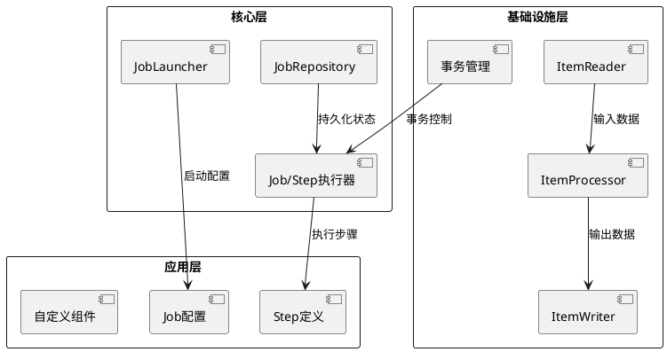
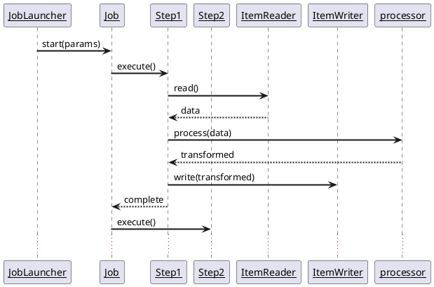
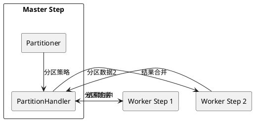
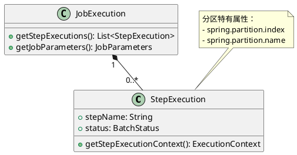

# Spring Batch 学习笔记

## 一、Spring Batch 概述
Spring Batch 是 Spring 生态系统中专门为批处理设计的轻量级框架，适用于数据迁移、ETL（Extract-Transform-Load）、定时报表生成等场景。其核心设计理念是通过分层架构实现高内聚低耦合，支持从单线程到分布式的大规模数据处理。

### 核心架构分层

**图解说明**：
1. **应用层**：开发者自定义批处理逻辑
2. **核心层**：框架控制流（JobLauncher启动任务，JobRepository持久化元数据）
3. **基础设施层**：数据读写组件和事务管理

## 二、核心组件详解

### 1. Job 生命周期管理
```java
@Bean
public Job importUserJob() {
    return jobBuilderFactory.get("importUserJob")
            .incrementer(new RunIdIncrementer())
            .start(step1())
            .next(step2())
            .build();
}
```
**关键特性**：
- 支持参数化执行（JobParameters）
- 可通过JobExplorer查询历史执行记录
- 失败自动重试（需配置RetryPolicy）

### 2. Step 执行模型

**执行模式**：
- **Chunk-oriented**：默认模式，每处理N条记录提交一次事务
- **Tasklet**：自定义任务单元（如文件移动）

### 3. 数据流组件
| 组件类型 | 典型实现 | 适用场景 |
|---------|---------|---------|
| ItemReader | JdbcCursorItemReader | 数据库游标读取 |
|           | FlatFileItemReader | CSV/TXT文件解析 |
|           | StaxEventItemReader | XML流式处理 |
| ItemProcessor | 自定义转换类 | 数据清洗/转换 |
| ItemWriter | JdbcBatchItemWriter | 批量数据库写入 |
|            | JmsItemWriter | JMS队列写入 |

## 三、高级特性实现

### 1. 并行处理架构（新增自定义分区内容）

#### 核心分区模型


#### 关键组件说明
1. **Partitioner（自定义分区器）**  
   实现`org.springframework.batch.core.partition.support.Partitioner`接口，核心方法：
   ```java
   public Map<String, ExecutionContext> partition(int gridSize) {
       // 返回分区ID到执行上下文的映射
       Map<String, ExecutionContext> partitions = new HashMap<>();
       for (int i = 0; i < gridSize; i++) {
           ExecutionContext context = new ExecutionContext();
           context.put("partition.id", i);
           context.put("min.value", i * 1000);
           context.put("max.value", (i + 1) * 1000 - 1);
           partitions.put("partition" + i, context);
       }
       return partitions;
   }
   ```

2. **PartitionHandler（分区处理器）**  
   默认使用`TaskExecutorPartitionHandler`，配置示例：
   ```java
   @Bean
   public Step masterStep() {
       return stepBuilderFactory.get("masterStep")
               .partitioner("workerStep", new RangePartitioner()) // 注入自定义Partitioner
               .step(workerStep())
               .gridSize(4) // 并行度
               .taskExecutor(taskExecutor()) // 线程池
               .build();
   }
   ```

### 2. 自定义分区实现案例

#### 数据库范围分区
```java
public class DatabaseRangePartitioner implements Partitioner {
    @Override
    public Map<String, ExecutionContext> partition(int gridSize) {
        Map<String, ExecutionContext> partitions = new HashMap<>();
        
        // 1. 查询数据总量
        JdbcTemplate jdbcTemplate = new JdbcTemplate(dataSource);
        int total = jdbcTemplate.queryForObject("SELECT COUNT(*) FROM orders", Integer.class);
        
        // 2. 计算每个分区范围
        int partitionSize = (int) Math.ceil(total / (double)gridSize);
        
        // 3. 生成分区上下文
        for (int i = 0; i < gridSize; i++) {
            int min = i * partitionSize;
            int max = Math.min((i + 1) * partitionSize, total - 1);
            
            ExecutionContext context = new ExecutionContext();
            context.put("min.id", min);
            context.put("max.id", max);
            partitions.put("partition" + i, context);
        }
        return partitions;
    }
}
```

#### 文件多线程处理
```java
public class FileSplitterPartitioner implements Partitioner {
    @Override
    public Map<String, ExecutionContext> partition(int gridSize) {
        Map<String, ExecutionContext> partitions = new HashMap<>();
        
        // 1. 列出所有文件
        File dir = new File("/data/input");
        File[] files = dir.listFiles((d, name) -> name.endsWith(".csv"));
        
        // 2. 分配文件给分区
        for (int i = 0; i < Math.min(gridSize, files.length); i++) {
            ExecutionContext context = new ExecutionContext();
            context.put("file.name", files[i].getAbsolutePath());
            partitions.put("partition" + i, context);
        }
        return partitions;
    }
}
```

### 3. 分区结果合并策略

#### 自定义结果收集器
```java
public class AggregateItemWriter implements ItemWriter<List<Order>> {
    private final ItemWriter<Order> delegate;
    
    public AggregateItemWriter(ItemWriter<Order> delegate) {
        this.delegate = delegate;
    }

    @Override
    public void write(List<? extends List<Order>> items) throws Exception {
        // 扁平化所有分区结果
        List<Order> aggregated = items.stream()
                .flatMap(List::stream)
                .collect(Collectors.toList());
        
        // 一次性写入
        delegate.write(aggregated);
    }
}
```

#### 配置示例
```java
@Bean
public Step workerStep() {
    return stepBuilderFactory.get("workerStep")
            .<Order, Order>chunk(100)
            .reader(jdbcReader()) // 使用分区上下文参数
            .processor(orderProcessor())
            .writer(orderWriter())
            .build();
}

@Bean
public Step masterStep() {
    return stepBuilderFactory.get("masterStep")
            .partitioner("workerStep", new DatabaseRangePartitioner())
            .step(workerStep())
            .aggregator(new AggregateItemWriter(finalWriter())) // 注入合并器
            .gridSize(4)
            .build();
}
```

## 四、监控体系（新增分区监控）

#### 分区执行状态跟踪


#### 自定义监控逻辑
```java
public class PartitionMonitorListener implements StepExecutionListener {
    @Override
    public void beforeStep(StepExecution stepExecution) {
        if (stepExecution.getExecutionContext().containsKey("spring.partition.index")) {
            log.info("Starting partition {} of {}",
                    stepExecution.getExecutionContext().getInt("spring.partition.index"),
                    stepExecution.getJobExecution().getExecutionContext().getInt("total.partitions"));
        }
    }
}
```

## 五、典型应用场景

### 大数据量并行导入
```java
@Bean
public Job parallelImportJob() {
    return jobBuilderFactory.get("parallelImportJob")
            .start(masterStep())
            .build();
}

@Bean
public Step masterStep() {
    return stepBuilderFactory.get("masterStep")
            .partitioner("workerStep", new DatabaseRangePartitioner())
            .step(workerStep())
            .gridSize(8) // 使用8个线程
            .taskExecutor(new SimpleAsyncTaskExecutor() {{
                setConcurrencyLimit(8);
            }})
            .build();
}
```

## 六、性能优化实践

### 1. 分区参数调优表
| 参数        | 推荐值            | 说明              |
|-----------|----------------|-----------------|
| gridSize  | CPU核心数*2       | 通常设置为线程池大小的1-2倍 |
| chunkSize | 500-2000       | 根据分区数据量调整       |
| 事务隔离级别    | READ_COMMITTED | 防止分区间数据竞争       |

### 2. 线程池配置最佳实践
```java
@Bean
public TaskExecutor taskExecutor() {
    ThreadPoolTaskExecutor executor = new ThreadPoolTaskExecutor();
    executor.setCorePoolSize(4);
    executor.setMaxPoolSize(8);
    executor.setQueueCapacity(100);
    executor.setThreadNamePrefix("BatchWorker-");
    executor.setRejectedExecutionHandler(new ThreadPoolExecutor.CallerRunsPolicy());
    return executor;
}
```

## 七、常见问题解决方案

### 1. 分区数据不均衡
**解决方案**：
```java
// 改进版分区器（动态调整范围）
public class BalancedRangePartitioner implements Partitioner {
    @Override
    public Map<String, ExecutionContext> partition(int gridSize) {
        // 实现基于数据分布的动态分区算法
        // 例如先采样统计，再分配范围
    }
}
```

### 2. 分区间重复处理
**解决方案**：
```java
// 在Worker Step中添加边界检查
public class SafeRangeItemReader implements ItemReader<Order> {
    private final JdbcCursorItemReader<Order> delegate;
    private final int minId;
    private final int maxId;

    @Override
    public Order read() {
        Order order = delegate.read();
        if (order != null && (order.getId() < minId || order.getId() > maxId)) {
            return null; // 跳过越界数据
        }
        return order;
    }
}
```

### 3. 分区结果合并顺序问题
**解决方案**：
```java
// 使用有序合并策略
public class OrderedAggregateWriter implements ItemWriter<List<Order>> {
    @Override
    public void write(List<? extends List<Order>> items) {
        // 按分区ID排序后合并
        items.stream()
            .sorted(Comparator.comparingInt(
                list -> Integer.parseInt(
                    list.get(0).getExecutionContext().get("spring.partition.index").toString()
                )))
            .flatMap(List::stream)
            .forEach(finalWriter::write);
    }
}
```

## 八、学习资源推荐（新增分区专题）

1. **官方文档**：[Partitioning a Step](https://docs.spring.io/spring-batch/docs/current/reference/html/scalability.html#partitioning)
2. **实战教程**：[Spring Batch Parallel Processing](https://spring.io/guides/gs/batch-processing/)
3. **性能测试**：[Partitioning Benchmark](https://github.com/spring-projects/spring-batch/tree/main/spring-batch-samples/src/main/java/org/springframework/batch/sample/partitioning)