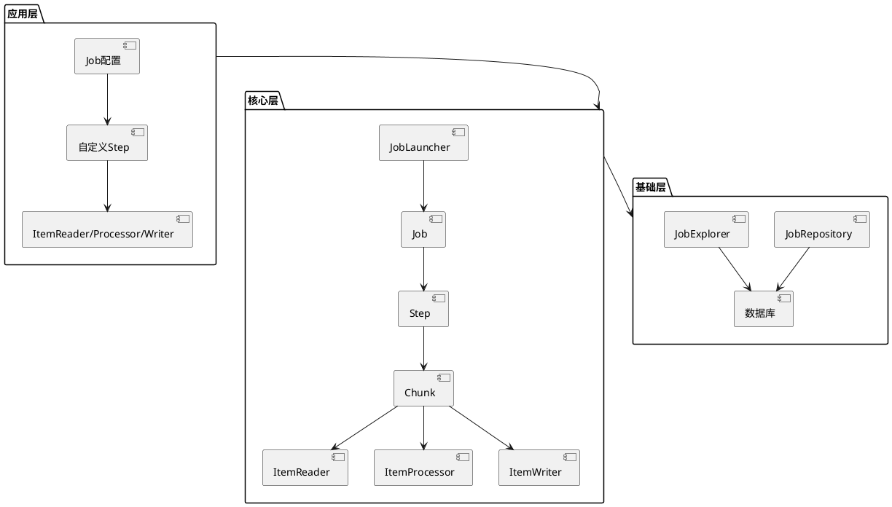
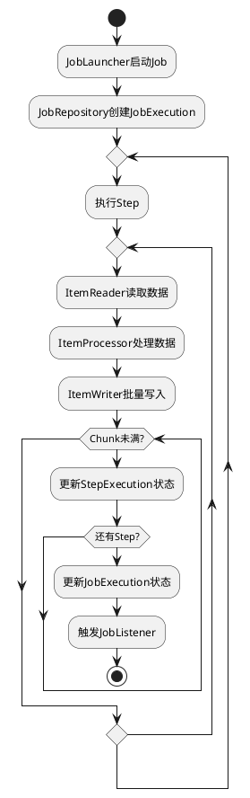
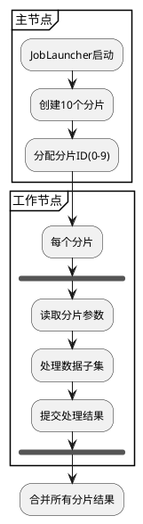
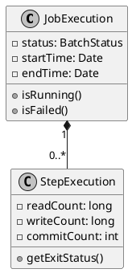
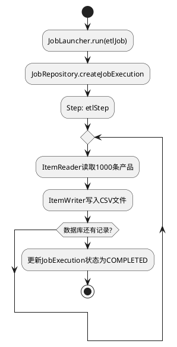

# Spring Batch 

## 一、Spring Batch 概述
Spring Batch 是 Spring 生态中专注于批处理的轻量级框架，适用于处理百万级到亿级数据量的任务。其核心设计目标包括：
- **事务管理**：支持基于块（Chunk）的原子性提交
- **流程控制**：支持任务重启、跳过、重试等容错机制
- **扩展性**：通过分片（Sharding）和并行处理提升性能
- **监控能力**：内置作业执行状态追踪和历史记录

典型应用场景：
- 银行对账系统
- 电商订单数据汇总
- 日志分析处理
- 跨系统数据同步

## 二、核心组件架构

### 1. 三层架构模型


### 2. 关键组件详解
- **JobLauncher**：作业启动入口，支持异步执行
- **Job**：由多个Step组成的完整流程，示例配置：
```java
@Bean
public Job dataMigrationJob() {
    return jobBuilderFactory.get("migrationJob")
        .start(step1())
        .next(step2())
        .listener(new JobCompletionListener())
        .build();
}
```

- **Step**：数据处理单元，支持两种模式：
    - **Tasklet**：单次执行的任务
    - **Chunk**：分块处理（推荐模式）
```java
@Bean
public Step chunkProcessingStep() {
    return stepBuilderFactory.get("chunkStep")
        .<Input, Output>chunk(1000) // 每1000条提交事务
        .reader(jdbcReader())
        .processor(dataTransformer())
        .writer(jdbcWriter())
        .faultTolerant()
        .skipLimit(10)
        .skip(DataIntegrityViolationException.class)
        .build();
}
```

## 三、数据处理流程

### 1. 标准处理流程


### 2. 关键接口实现
- **ItemReader** 示例（数据库读取）：
```java
@Bean
public JdbcCursorItemReader<Customer> databaseReader() {
    return new JdbcCursorItemReaderBuilder<Customer>()
        .dataSource(dataSource)
        .name("customerReader")
        .sql("SELECT * FROM customers WHERE status = ?")
        .preparedStatementSetter((ps, i) -> ps.setString(1, "ACTIVE"))
        .rowMapper(new BeanPropertyRowMapper<>(Customer.class))
        .build();
}
```

- **ItemWriter** 示例（CSV文件写入）：
```java
@Bean
public FlatFileItemWriter<Order> csvWriter() {
    return new FlatFileItemWriterBuilder<Order>()
        .name("orderWriter")
        .resource(new FileSystemResource("output/orders.csv"))
        .delimited()
        .names("orderId", "amount", "date")
        .build();
}
```

## 四、高级特性实现

### 1. 分片并行处理


配置示例：
```java
@Bean
public PartitionHandler partitionHandler() {
    TaskExecutorPartitionHandler handler = new TaskExecutorPartitionHandler();
    handler.setGridSize(10); // 分片数量
    handler.setTaskExecutor(new SimpleAsyncTaskExecutor());
    handler.setStep(slaveStep());
    return handler;
}
```

### 2. 事务与容错机制
```java
@Bean
public Step faultTolerantStep() {
    return stepBuilderFactory.get("ftStep")
        .<Input, Output>chunk(500)
        .reader(reader())
        .processor(processor())
        .writer(writer())
        .faultTolerant()
        .skipLimit(100) // 最大跳过记录数
        .skip(SQLException.class) // 跳过异常类型
        .retryLimit(3) // 重试次数
        .retry(DeadlockLoserDataAccessException.class) // 重试异常
        .noRollback(IllegalArgumentException.class) // 不回滚的异常
        .build();
}
```

## 五、监控与调度集成

### 1. 作业状态监控


通过JobExplorer查询历史记录：
```java
@Autowired
private JobExplorer jobExplorer;

public void printJobHistory() {
    List<JobInstance> instances = jobExplorer.getJobInstances("migrationJob", 0, 10);
    instances.forEach(instance -> {
        List<JobExecution> executions = jobExplorer.getJobExecutions(instance);
        executions.forEach(exec -> 
            System.out.printf("Job %s executed at %s with status %s%n",
                instance.getJobName(),
                exec.getStartTime(),
                exec.getStatus()));
    });
}
```

### 2. Quartz调度集成
```java
@Configuration
public class QuartzConfig {
    
    @Autowired
    private JobLauncher jobLauncher;
    
    @Autowired
    private Job dataJob;
    
    @Bean
    public JobDetailFactoryBean jobDetail() {
        return new JobDetailFactoryBean()
            .setJobClass(BatchJobInvoker.class)
            .setDurability(true)
            .setRequestsRecovery(true);
    }
    
    @Bean
    public SimpleTriggerFactoryBean trigger() {
        return new SimpleTriggerFactoryBean()
            .setJobDetail(jobDetail().getObject())
            .setStartDelay(0)
            .setRepeatInterval(86400000) // 每天执行
            .setJobDataMap(new JobDataMap() {{
                put("jobName", "dataJob");
                put("jobLauncher", jobLauncher);
                put("jobParameters", new JobParametersBuilder()
                    .addDate("runDate", new Date())
                    .toJobParameters());
            }});
    }
}
```

## 六、最佳实践建议

1. **批处理参数设计**：
    - 使用`JobParametersBuilder`传递运行时参数
    - 避免在参数中存储大量数据

2. **性能优化策略**：
    - 合理设置Chunk大小（通常100-1000条）
    - 对大表读取使用游标（Cursor）而非分页
    - 启用JDBC批处理：
      ```properties
      spring.jdbc.batch-size=100
      ```

3. **异常处理原则**：
    - 区分可重试异常（如死锁）和不可重试异常
    - 记录跳过记录的详细信息供后续分析
    - 设置合理的跳过/重试阈值

4. **资源管理**：
    - 使用连接池配置数据源
    - 对内存密集型操作增加JVM堆大小
    - 监控作业执行时的内存使用情况

## 七、完整案例演示

### 1. 数据库到CSV的ETL作业
```java
@Configuration
@EnableBatchProcessing
public class EtlJobConfig {

    @Autowired
    private JobBuilderFactory jobBuilderFactory;

    @Autowired
    private StepBuilderFactory stepBuilderFactory;

    @Bean
    public JdbcCursorItemReader<Product> productReader() {
        return new JdbcCursorItemReaderBuilder<Product>()
            .dataSource(dataSource)
            .name("productReader")
            .sql("SELECT id, name, price FROM products")
            .rowMapper(new BeanPropertyRowMapper<>(Product.class))
            .build();
    }

    @Bean
    public FlatFileItemWriter<Product> productWriter() {
        return new FlatFileItemWriterBuilder<Product>()
            .name("productWriter")
            .resource(new FileSystemResource("output/products.csv"))
            .delimited()
            .names("id", "name", "price")
            .build();
    }

    @Bean
    public Step etlStep() {
        return stepBuilderFactory.get("etlStep")
            .<Product, Product>chunk(1000)
            .reader(productReader())
            .writer(productWriter())
            .build();
    }

    @Bean
    public Job etlJob() {
        return jobBuilderFactory.get("etlJob")
            .incrementer(new RunIdIncrementer())
            .start(etlStep())
            .build();
    }
}
```

### 2. 作业执行流程图


通过本笔记的系统学习，开发者可以掌握Spring Batch的核心架构、数据处理流程和高级特性，能够独立完成从简单到复杂的批处理应用开发。建议结合官方文档和实际项目进行深入实践，特别注意事务管理、异常处理和性能优化等关键环节。