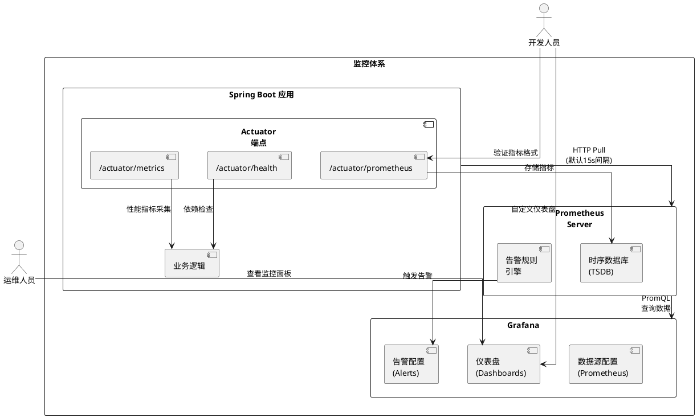

# Spring Boot Actuator 监控，Actuator + Prometheus + Grafana 监控体系整合方案

## 一、Actuator 概述
Spring Boot Actuator 是 Spring Boot 生态系统中的核心监控组件，通过暴露 HTTP 端点和 JMX MBean 提供应用程序运行时状态的实时监控能力。其核心价值在于无需修改业务代码即可实现健康检查、性能指标采集、配置审计等功能，尤其适用于生产环境下的微服务监控场景。典型应用场景包括：
- **Kubernetes 健康探测**：通过 `/actuator/health` 端点实现容器存活检查
- **动态日志调整**：通过 `/actuator/loggers` 实时修改日志级别
- **JVM 诊断**：通过 `/actuator/heapdump` 生成堆转储文件分析内存泄漏

## 二、核心功能实现

### 1. 依赖配置
```xml
<!-- Maven 依赖 -->
<dependency>
    <groupId>org.springframework.boot</groupId>
    <artifactId>spring-boot-starter-actuator</artifactId>
</dependency>
<!-- 可选：集成 Prometheus 指标格式 -->
<dependency>
    <groupId>io.micrometer</groupId>
    <artifactId>micrometer-registry-prometheus</artifactId>
</dependency>
```

### 2. 端点管理
通过 `application.yml` 配置端点暴露策略：
```yaml
management:
  endpoints:
    web:
      exposure:
        include: health,info,metrics,prometheus  # 显式暴露核心端点
        base-path: /manage  # 自定义访问路径
  endpoint:
    health:
      show-details: always  # 显示详细健康指标
      probes:
        enabled: true  # 支持 Kubernetes liveness/readiness 探针
```

### 3. 关键端点详解
| 端点      | 路径                  | 功能描述                                          |
|---------|---------------------|-----------------------------------------------|
| Health  | `/actuator/health`  | 聚合数据库、消息队列等依赖组件的健康状态，支持自定义健康检查器               |
| Metrics | `/actuator/metrics` | 提供 JVM 内存、线程池、HTTP 请求等分层指标，支持 Prometheus 格式导出 |
| Loggers | `/actuator/loggers` | 动态修改日志级别（如将 `com.example` 包级别调整为 DEBUG）       |
| Env     | `/actuator/env`     | 查看当前生效的环境变量和配置属性，辅助排查配置加载问题                   |
| Beans   | `/actuator/beans`   | 展示 Spring 容器中所有 Bean 的依赖关系图，用于分析组件耦合度         |

### 4. 自定义端点开发
过代码暴露的HTTP或JMX接口，用于返回结构化数据或执行管理操作。
```java
@Component
@Endpoint(id = "customEndpoint")  // 定义端点ID
public class CustomEndpoint {
    
    @ReadOperation  // 定义GET请求处理器
    public Map<String, String> customInfo() {
        return Map.of(
            "version", "1.0.0",
            "author", "DevTeam"
        );
    }
    
    @WriteOperation  // 定义POST请求处理器
    public String updateConfig(@Selector String key, String value) {
        // 实现配置更新逻辑
        return "Configuration updated";
    }
}
```
访问路径：`/actuator/customEndpoint`

可将自定义指标通过端点返回，供外部系统（如自定义监控面板）直接调用。

## 三、安全加固方案

### 1. 基于 Spring Security 的保护
```java
@Configuration
public class ActuatorSecurityConfig extends WebSecurityConfigurerAdapter {
    @Override
    protected void configure(HttpSecurity http) throws Exception {
        http.authorizeRequests()
            .antMatchers("/actuator/health").permitAll()  // 开放健康检查
            .antMatchers("/actuator/**").hasRole("ADMIN")  // 其他端点需管理员权限
            .and().httpBasic();  // 启用基础认证
    }
}
```

### 2. 敏感端点脱敏
在 `application.yml` 中配置：
```yaml
management:
  endpoint:
    env:
      enabled: true
      show-values: WHEN_AUTHORIZED  # 仅认证用户可见敏感值
```

## 四、使用Micrometer创建自定义指标

通过Micrometer库记录的时序数据，用于监控应用性能或业务活动。

### **1.核心概念**
Micrometer提供多种指标类型：
- **Counter**：单调递增的计数器（如请求次数）。
- **Gauge**：瞬时值（如缓存大小）。
- **Timer**：耗时统计（如方法执行时间）。
- **DistributionSummary**：分布统计（如请求大小）。

### **2.自定义指标实现**
#### 1. 注入`MeterRegistry`
通过构造函数或`@Autowired`注入`MeterRegistry`：
```java
import io.micrometer.core.instrument.MeterRegistry;
import org.springframework.stereotype.Component;

@Component
public class CustomMetrics {
    private final MeterRegistry meterRegistry;

    public CustomMetrics(MeterRegistry meterRegistry) {
        this.meterRegistry = meterRegistry;
    }
}
```

#### 2. 创建Counter（计数器）
统计订单创建次数：
```java
public void recordOrderCreated() {
    meterRegistry.counter("orders.created.total", "region", "us-east-1").increment();
}
```
- **参数说明**：
    - `orders.created.total`：指标名称（建议使用`.`分层命名）。
    - `"region", "us-east-1"`：标签（Tag），用于多维分析。

---

#### 3. 创建Gauge（仪表盘）
监控当前活跃用户数（需动态更新）：
```java
import java.util.concurrent.atomic.AtomicInteger;

private final AtomicInteger activeUsers = new AtomicInteger(0);

@PostConstruct
public void init() {
    meterRegistry.gauge("users.active.count", activeUsers);
}

public void userLoggedIn() {
    activeUsers.incrementAndGet();
}

public void userLoggedOut() {
    activeUsers.decrementAndGet();
}
```
- **注意**：Gauge的值需通过引用对象（如`AtomicInteger`）动态更新。

---

#### 4. 创建Timer（计时器）
统计方法执行耗时：
```java
import io.micrometer.core.instrument.Timer;
import java.util.concurrent.TimeUnit;

public void processTask() {
    Timer.Sample sample = Timer.start(meterRegistry);
    try {
        // 业务逻辑
        Thread.sleep(100);
    } catch (InterruptedException e) {
        Thread.currentThread().interrupt();
    } finally {
        sample.stop(meterRegistry.timer("tasks.processing.time", "taskType", "batch"));
    }
}
```
或使用函数式API：
```java
meterRegistry.timer("tasks.processing.time", "taskType", "batch")
    .record(() -> {
        // 业务逻辑
    });
```

#### 5. 创建DistributionSummary（分布统计）
统计请求大小：
```java
import io.micrometer.core.instrument.DistributionSummary;

public void recordRequestSize(long size) {
    DistributionSummary summary = meterRegistry.summary("http.requests.size", "uri", "/api/data");
    summary.record(size);
}
```

### **3.通过Actuator端点查看指标**
#### 1. 通过Actuator端点
访问`/actuator/metrics/<指标名>`：
```bash
curl http://localhost:8080/actuator/metrics/orders.created.total
```
**响应示例**：
```json
{
  "name": "orders.created.total",
  "measurements": [
    {
      "statistic": "COUNT",
      "value": 42.0
    }
  ],
  "availableTags": [
    {
      "tag": "region",
      "values": ["us-east-1", "eu-west-1"]
    }
  ]
}
```

## **4.完整示例**
```java
import io.micrometer.core.instrument.Counter;
import io.micrometer.core.instrument.DistributionSummary;
import io.micrometer.core.instrument.MeterRegistry;
import io.micrometer.core.instrument.Timer;
import org.springframework.stereotype.Service;

import java.util.Random;
import java.util.concurrent.TimeUnit;

@Service
public class OrderService {
    private final Counter orderCounter;
    private final DistributionSummary orderSizeSummary;
    private final Random random = new Random();

    public OrderService(MeterRegistry meterRegistry) {
        this.orderCounter = meterRegistry.counter("orders.created.total", "region", "global");
        this.orderSizeSummary = meterRegistry.summary("orders.size.bytes");
    }

    public void createOrder(int itemCount) {
        // 1. 更新计数器
        orderCounter.increment();

        // 2. 记录订单大小
        orderSizeSummary.record(itemCount * 100); // 假设每个商品占100字节

        // 3. 模拟处理耗时
        Timer.Sample sample = Timer.start(meterRegistry);
        try {
            Thread.sleep(random.nextInt(500));
        } catch (InterruptedException e) {
            Thread.currentThread().interrupt();
        } finally {
            sample.stop(meterRegistry.timer("orders.processing.time"));
        }
    }
}
```

## 五、Actuator + Prometheus + Grafana 监控体系整合方案

### 1. 架构设计


**架构图说明**
1. **数据流向**
    - **Spring Boot 应用**通过 Actuator 暴露 `/actuator/prometheus` 端点（Prometheus 格式指标）。
    - **Prometheus Server** 定期拉取（Pull）指标数据，存储到时序数据库（TSDB），并通过 Alertmanager 触发告警。
    - **Grafana** 配置 Prometheus 为数据源，通过 PromQL 查询数据并展示仪表盘。

2. **关键组件交互**
    - **健康检查**：`/actuator/health` 端点供 Kubernetes 或运维工具调用，检查应用存活状态。
    - **动态指标**：`/actuator/metrics` 提供 JVM、HTTP 请求等分层指标，支持按标签过滤（如 `http.server.requests` 按 URI 分组）。
    - **告警联动**：Prometheus 告警规则触发后，可通过 Webhook 通知 Grafana 或 Alertmanager 分发到 Slack/邮件。

**设计要点**：
- **非侵入式监控**：Actuator 通过字节码增强自动采集指标，无需修改业务代码。
- **Pull vs Push 模式**：Prometheus 采用主动拉取（Pull）模式，避免对应用性能的影响。
- **高可用扩展**：
    - Prometheus 支持联邦集群部署，解决单点问题。
    - Grafana 支持多数据源聚合，可同时监控多个微服务。


### 2. 实施步骤

#### 2.1 配置 Prometheus 数据采集
1. **添加依赖**：确保项目中包含 `micrometer-registry-prometheus`
   ```xml
   <dependency>
       <groupId>io.micrometer</groupId>
       <artifactId>micrometer-registry-prometheus</artifactId>
   </dependency>
   ```
2. **暴露端点**：  
此配置让 Spring Boot 应用暴露一个专用的端点（默认路径为 /actuator/prometheus），供 Prometheus 通过 scrape 配置拉取数据。
```yaml
   management:
     endpoints:
       web:
         exposure:
           include: prometheus
     metrics:
       export:
         prometheus:
           enabled: true
           step: 15s  # 指标采集间隔,避免高频采集（建议 ≥15s）
       tags:
         application: order-service  # 添加应用标识标签
```
配置Timer或DistributionSummary的百分位数：
```yaml
management:
  metrics:
    distribution:
      percentiles:
        http.server.requests: 0.5, 0.95, 0.99 # 计算P50、P95、P99
```
排除不必要的指标：
```yaml
management:
  metrics:
    enable:
      jvm: false # 禁用JVM指标
```
3. **验证指标输出**：
   访问 `/actuator/prometheus` ，确认输出包含 `jvm_memory_used_bytes` 等标准指标：
```
# HELP jvm_memory_used_bytes The amount of used memory
# TYPE jvm_memory_used_bytes gauge
jvm_memory_used_bytes{area="heap",id="PS_Eden_Space",} 1.073741824E8
```

#### 2.2 部署 Prometheus Server
1. **配置文件示例** (`prometheus.yml`)：
```yaml
scrape_configs:
  - job_name: 'spring-boot-app'
    metrics_path: '/actuator/prometheus'
    static_configs:
      - targets: ['order-service:8080', 'inventory-service:8080']
    relabel_configs:
      - source_labels: [__address__]
        target_label: instance  # 添加实例标签
```
2. **容器化部署**：
```bash
docker run -d --name prometheus \
  -p 9090:9090 \
  -v /path/to/prometheus.yml:/etc/prometheus/prometheus.yml \
  prom/prometheus
```

#### 2.3 构建 Grafana 仪表盘
1. **添加数据源**：
    - 类型：Prometheus
    - URL：`http://prometheus-server:9090`
2. **推荐仪表盘模板**：
    - **JVM Micrometer** (ID: 4701)：监控内存、线程、GC 等
    - **Spring Boot 2.x Stats** (ID: 11378)：展示请求速率、错误率
    - **Kubernetes Cluster Monitoring** (ID: 315)：集群级资源监控
3. **自定义告警规则**：
```yaml
groups:
  - name: spring-boot-alerts
    rules:
      - alert: HighMemoryUsage
        expr: jvm_memory_used_bytes{area="heap"} / jvm_memory_max_bytes{area="heap"} > 0.8
        for: 5m
        labels:
          severity: warning
        annotations:
          summary: "High memory usage on {{ $labels.instance }}"
```

### 3. 高级优化技巧
1. **端点分级暴露**：
    - 开发环境：`management.endpoints.web.exposure.include=*`
    - 生产环境：仅暴露 `health,info,metrics,prometheus`
2**指标降采样**：
   在 Prometheus 配置中添加 `recording rules` 预计算常用指标：
```yaml
rule_files:
  - 'alert.rules.yml'
  - 'recording.rules.yml'  # 包含预计算规则
```
3. **标签白名单**：
    - 通过 `MeterFilter` 限制高基数标签（如 `user_id`）：
      ```java
      @Bean
      public MeterFilter dropHighCardinalityTags() {
          return MeterFilter.deny(id -> id.getTags().keySet().contains("user_id"));
      }
      ```
4. **分布式追踪集成**：
   通过 Micrometer 的 `TracingMeterFilter` 将 OpenTelemetry 追踪ID 注入指标标签：
```java
@Bean
public TracingMeterFilter tracingMeterFilter() {
    return new TracingMeterFilter();
}
```
5. **动态标签管理**：
   使用 `MeterFilter` 动态添加业务标签：
```java
@Bean
public MeterFilter addCustomTags() {
    return MeterFilter.commonTags(
        Arrays.asList(
            Tag.of("region", "us-east"),
            Tag.of("team", "order-team")
        )
    );
}
```
6. **告警收敛**：
    - 使用 Grafana 的 `Alertmanager` 设置告警分组、抑制和静默规则，避免告警风暴。
    - 设置合理的 `for` 持续时间避免闪断告警

## 六、总结
- **Actuator** 提供标准化的监控接口，降低微服务监控复杂度。
- **Prometheus** 适合时序数据存储和告警，但需解决长期存储（如搭配 Thanos 或 Cortex）。
- **Grafana** 的灵活可视化能力是整个监控体系的“最后一公里”，建议结合业务场景定制仪表盘。

**扩展建议**：
- 集成 **ELK** 或 **Loki** 实现日志与指标的关联分析。
- 对关键业务指标（如订单量）配置 **异常检测**（如使用 Prometheus 的 `predict_linear` 函数）。
