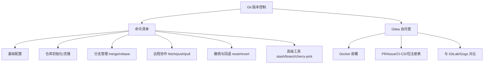

<!--
module:
  parent: tools
  slug: note/tools/git
  type: index
  category: 主模块子文章
  summary: Git — 版本控制与自托管代码托管
  depth: ⭐⭐
-->

# Git

> 版本控制与代码托管——从日常命令到自建 Gitea 服务。

---

## 模块导航
| 序号 | 主题 | 核心内容 | 子 README |
|------|------|---------|-----------|
| 01 | [命令清单](command/) | 配置/分支/提交/远程/撤销/子模块 | [README](command/README.md) |
| 02 | [Gitea](gitea/) | 轻量级自托管 Git 服务，Docker 一键部署 | [README](gitea/README.md) |
| 03 | [分支命名规范](branch-naming/) | Conventional Branches + 3 大流派 + CI 联动 | [README](branch-naming/README.md) |

### 1.1 学习路径

- **入门**：命令清单 → 掌握日常开发高频操作
- **进阶**：分支命名规范（[branch-naming/](branch-naming/)）→ Conventional Branches + 3 大流派 + CI 规则联动
- **高级**：Gitea 自建 → 团队私有代码托管平台

---

## 知识脉络

---

## 速查表 / Cheat Sheet
| 概念 | 解释 | 典型命令示例 | 典型场景 |
|------|------|------------|---------|
| **git switch** | 切换/创建分支（Git 2.23+ 替代 checkout） | `git switch -c feature/login` | 分支操作 |
| **git restore** | 恢复文件（替代 checkout -- / reset HEAD） | `git restore --staged file.txt` | 撤销工作区/暂存区修改 |
| **git rebase** | 变基，将提交线性化 | `git rebase -i HEAD~5` | 保持提交历史整洁 |
| **force-with-lease** | 安全强制推送（2025 标准，优于 --force） | `git push --force-with-lease origin main` | 重写历史后推送 |
| **git bisect** | 二分查找定位问题提交 | `git bisect start <bad> <good>` → `git bisect good/bad` | 调试回归问题 |
| **git submodule** | 子模块，在仓库中嵌套其他仓库 | `git submodule add <url> <path>` | 共享公共代码库 |
| **Gitea** | 轻量级自托管 Git 服务（Go 编写，512MB 内存可运行） | `docker run -d -p 3000:3000 gitea/gitea` | 中小企业私有代码托管 |
| **Gitea Actions** | 类 GitHub Actions 的 CI/CD 流水线 | `.gitea/workflows/*.yml` | 自动化构建/部署 |

---

## 核心内容
### 1 命令清单

按功能分为八大类：基础配置、仓库操作、文件管理、提交与历史、分支管理、远程协作、撤销回退、高级工具（stash/bisect/cherry-pick/reflog）。采用现代 Git 语法（switch/restore 替代 checkout）。

### 2 Gitea 自托管服务

基于 Go 语言的轻量级 Git 服务，最低 512MB 内存即可运行。功能覆盖代码仓库、PR/Issue、Wiki、Gitea Actions（CI/CD）、包注册表（Container/Maven/npm）。支持 Docker 一键部署，兼容 GitHub API，Apache 2.0 开源协议。与 GitLab 相比资源占用极低，与 Gogs 相比功能更全面且社区更活跃。

---

## 最佳实践
- **分支策略**：主分支保护，功能分支开发，PR 合并，rebase 保持历史线性
- **提交规范**：使用 Conventional Commits（feat/fix/docs/refactor）
- **安全推送**：使用 `--force-with-lease` 替代 `--force`，防止覆盖他人提交
- **自建服务**：小团队优先选 Gitea（资源友好），企业级选 GitLab（功能全面）

---

## 常见面试题
- git merge 和 git rebase 的区别？各自适用场景？
- git reset --soft / --mixed / --hard 的区别？
- force-with-lease 为什么比 force 更安全？
- Gitea 与 GitLab 各自的优势场景？
- 子模块（submodule）与子目录（subtree）的取舍？

---

## 📊 本节统计

| 子目录 | leaf README 数 | 备注 |
|:-------|:-----------:|:-----|
| `01-git/`（本文） | 1 | 顶层 |
| ├─ `command/` | 1 | Git 命令清单速查 |
| └─ `gitea/` | 1 | Gitea 自托管服务 |
| └─ `branch-naming/` | 1 | Conventional Branches + 3 大流派 + CI 联动 |
| **分类 leaf 合计** | **3 depth-2 + 1 顶层 = 4** | 100% frontmatter |
| **学习路径主题数** | 3 条（入门：命令清单 → 进阶：分支命名 → 高级：Gitea 自建） | 见上方学习路径 |

> 数字基线：本节以 leaf README 数 + 学习路径主题数双口径统计

---

## 相关章节
- 上游：[`工具链`](../README.md)
- 关联：[`05-monorepo`](../05-monorepo/README.md) — Monorepo 仓库管理依赖 Git 子模块/worktree

---

← [返回工具链总览](../README.md)
