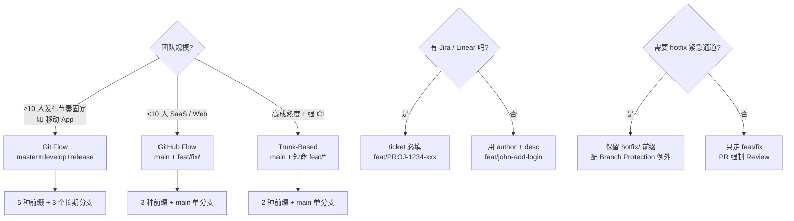

<!--
module:
  parent: tools
  slug: note/tools/git/branch-naming
  type: article
  category: 主模块子文章
  summary: Git 分支命名规范：Conventional Branches + 3 大流派 + CI 联动
  depth: ⭐⭐⭐⭐
-->

# Git 分支命名规范速查

> 一句话定位：**`<type>/<ticket>-<slug>` + 选对 `<type>`（feat/fix/hotfix/release/chore）+ CI 规则联动 —— 让代码、流水线、Jira 三方自动握手**

本文与 [`../command/README.md`](../command/README.md)（Git 命令清单）、[`../README.md`](../) 的"最佳实践"互补：命令只讲 `git switch/restore`，本文专攻**命名约定**。

---

## TL;DR：一张速查表

```text
<type>/<ticket-id>-<short-kebab-desc>

type 取值（Conventional Branches）：
  feat       新功能       →  → 自动部署 Preview
  fix        bug 修复     →  → 自动部署 Preview
  hotfix     紧急修复     →  → 跳过 PR 强制 + 飞流水线直发 prod
  release    发布准备     →  → 锁定（禁 force-push）
  chore      杂项         →  → 不触发部署
  docs       文档         →  → 不触发部署
  refactor   重构         →  → 不触发部署
  perf       性能优化     →  → 不触发部署
  test       测试         →  → 不触发部署

  feature/*  → 旧 Git Flow 兼容（仍然常见）
  develop    → 长期 dev 集成分支
  main       → 主干（GitHub Flow 默认）
  master     → 主干（GitLab 默认）
```

**示例**（推荐）：

```text
feat/PROJ-1234-add-wechat-login
fix/issue-567-video-buffer-stuck
hotfix/v2.3.1-crash-on-startup
release/v2.4.0
chore/upgrade-spring-boot-3.5
docs/PROJ-999-add-deployment-guide
```

---

## §1 三大流派分支命名前缀对比

每种 **分支策略** 都对应一套**命名前缀约定**：

### 1.1 Git Flow（重型，2010 Vincent Driessen）

```text
master              ────●─────●────●─────  (生产 tag)
                   ╱ hotfix ╲    ╱
release/2.4.0      ──●────●─────
                  ╱       ╲
develop           ──────────●────●────●── (长期 dev 集成)
                  ╱          ╲
feature/PROJ-123  ─────●──────
                  ╲
                  feat/PROJ-123 ...
```

**命名前缀**：
| 类型 | 前缀 | 用途 |
|------|------|------|
| 长期集成分支 | `develop` | 日常集成 |
| 主干 | `master` | 永远对应生产 |
| 预发布 | `release/*` | release/2.4.0 |
| 功能 | `feature/PROJ-123-xxx` | feature/PROJ-123-add-wechat-login |
| 紧急修复 | `hotfix/*` | hotfix/v2.3.1-crash-fix |

**适用**：版本化产品（移动 App / SDK / 嵌入式）需要多版本并行维护。
**缺点**：分支繁杂，CI 配置复杂，**不适合 CD**。

### 1.2 GitHub Flow（轻量，2011 Scott Chacon）

```text
main               ──────────────────●─────●──── (主干 + 生产)
                  ╱         ╱     ╲ ╱
feat/PROJ-123     ───●────●───────●   ← 通过 PR → main

部署：
  PR 打开       → 自动 Preview 环境
  PR merge main → 自动部署 production
  revert commit → 一键回滚
```

**命名前缀**：仅 `feat/JIRA-xxx-desc` / `fix/JIRA-xxx-desc` / `chore/*` + 受保护 `main`。
**适用**：SaaS / Web 应用，需要持续部署。

### 1.3 Trunk-Based Development（极简，2019 Book）

```text
main               ──●──●──●──●──●──●──●── (主干 + 短 feature 分支)
                       │  │  │
                       feat/PROJ-1 (短命 < 24h)
                       feat/PROJ-2 (短命 < 24h)
```

**命名前缀**：`feat/*` / `fix/*`，**分支寿命 < 1 天**（甚至 < 1 小时）。
**适用**：成熟团队 + 强 CI/CD 能力（必须 feature flag + 完善测试）。

### 1.4 派流对比速查

| 维度 | Git Flow | GitHub Flow | Trunk-Based |
|------|---------|-------------|-------------|
| **长期分支数** | 3（master / develop / release） | 1（main） | 1（main） |
| **分支寿命** | 长（数天~数月） | 中（1-3 天） | 短（< 24h） |
| **命名前缀类型** | 5 种 | 2-3 种 | 2 种 |
| **发布频率** | 周/月级 | 日级 | 随时 |
| **适合团队规模** | 大团队 | 中小 | 任意（高成熟度）|
| **CI 复杂度** | 高 | 中 | 低（依赖自动化） |

---

## §2 Conventional Branches 官方约定（gitbranches.org）

现代主流采用 **Conventional Branches** 规范（部分公司也叫 `prefix-based naming`），是 GitHub Flow 与 Trunk-Based 融合后的工业标准。

### 2.1 完整前缀列表

| 前缀 | 含义 | 典型场景 | 配对 commit 前缀（Conventional Commits）|
|------|------|---------|--------------------------------------|
| `feat` | 新功能 | 新模块、新接口 | `feat:` |
| `fix` | bug 修复 | 用户反馈 bug | `fix:` |
| `hotfix` | 紧急修复 | 生产事故、需立即发布 | `fix:` + [hotfix] |
| `release` | 发布准备 | 版本号锁定 / 回归测试 | `chore(release):` |
| `chore` | 杂项（不修改业务）| 依赖升级 / 重构工具 | `chore:` |
| `docs` | 仅文档 | README / 注释 / Wiki | `docs:` |
| `refactor` | 重构 | 性能调优 / 命名重构 | `refactor:` |
| `perf` | 性能优化 | 数据库索引 / 缓存 | `perf:` |
| `test` | 测试 | 增加测试用例 | `test:` |
| `build` | 构建系统 | CI 配置 / 构建脚本 | `build:` |
| `ci` | CI 配置 | `.github/workflows/` | `ci:` |
| `revert` | 回滚 | 之前提交的 revert | `revert:` |

### 2.2 命名格式细则

```text
<type>/<ticket>-<short-desc>

✅ 推荐：
  feat/PROJ-1234-add-wechat-login
  fix/issue-567-video-buffer-stuck
  hotfix/v2.3.1-crash-on-startup
  release/v2.4.0
  chore/upgrade-spring-boot-3.5

❌ 反例：
  new-feature               ← 无前缀
  fixBug                    ← 没有 type
  feat/abc                  ← desc 太短
  feature/add-login         ← 无 ticket 关联
  hotfix/2.3.1              ← desc 缺失
  Feat/PROJ-1              ← 大写 type（约定统一小写）
  feat/PROJ_1-abc           ← ticket 用 _ 而非 -（多语言团队建议统一）
```

**规则要点**：
1. **type 必须小写**（与 Conventional Commits 一致）
2. **ticket 是可选的**（小项目可省，但推荐加）
3. **short-desc 用 kebab-case**（中划线分隔，禁止空格 / 下划线 / 大写）
4. **删除已合并的分支**（合并后 `git branch -d` + `git push origin --delete`）

---

## §3 命名约定与 CI/CD 的联动（核心价值）

**命名前缀不是装饰，是自动触发 CI 规则的开关**。

### 3.1 GitHub Actions 联动示例

```yaml
# .github/workflows/preview.yml
on:
  pull_request:
    branches: [main]
    # 仅 feat/ fix/ perf/ refactor 前缀的 PR 部署 Preview
    # 但 release/ hotfix/ chore/docs 不部署（用 paths 反而更稳）
```

```yaml
# .github/workflows/deploy.yml
on:
  push:
    branches:
      - main                    # 主干 push → 自动部署 production
      - 'release/**'            # release 合并 → 部署 staging

# 紧急热修：跳过 PR（hotfix 直接 push 到 main）
on:
  push:
    branches:
      - 'hotfix/**'             # 允许紧急 merge 时跳过 PR Review 流程
```

### 3.2 GitLab CI 联动示例

```yaml
# .gitlab-ci.yml
deploy-prod:
  stage: deploy
  script: kubectl apply -f k8s/prod/
  rules:
    - if: $CI_COMMIT_TAG =~ /^v\d+\.\d+\.\d+$/   # tag 触发
    - if: $CI_COMMIT_BRANCH == "main"             # main 也可

deploy-staging:
  stage: deploy
  rules:
    - if: $CI_COMMIT_BRANCH =~ /^release\/.*/    # release/* 部署 staging

deploy-preview:
  stage: deploy
  rules:
    - if: $CI_MERGE_REQUEST_SOURCE_BRANCH_NAME =~ /^(feat|fix)\/.+/  # PR 前缀匹配
```

### 3.3 受保护分支命名规则

| 分支 | 保护级别 | 允许的操作 |
|------|---------|-----------|
| `main` / `master` | **严禁 force-push** | 只能通过 PR 合并 |
| `release/**` | **严禁 force-push** + 锁分支 | merge + 标签 |
| `feat/**` / `fix/**` | **允许 force-with-lease** | 自由提交（含 rebase） |
| `hotfix/**` | **允许 force** | 紧急情况下绕过 PR |

GitHub Branch Protection 实操：
1. **Settings → Branches → Add rule**
2. Branch name pattern: `main` / `release/*`
3. ✅ Require pull request reviews before merging
4. ✅ Require status checks to pass
5. ✅ Include administrators（管理员也受限）
6. ❌ Allow force pushes（取消勾选）

---

## §4 命名与 JIRA / GitHub Issue 的强关联

**最佳实践**：分支名必须能让 **git blame → Jira ticket → 产品需求** 三个上下文**一键跳转**。

```text
branch: feat/PROJ-1234-add-wechat-login
   ↓ git blame
   ↓ Jira automation: 在 PR / commit 评论里嵌入 ticket 链接
   ↓ Confluence: 需求文档 wiki/PROJ-1234
```

**自动化钩子**（可选）：

```yaml
# .github/workflows/jira-link.yml
on: pull_request_target
jobs:
  jira-comment:
    runs-on: ubuntu-latest
    steps:
      - name: Extract ticket
        run: echo "Ticket: ${GITHUB_HEAD_REF}" | grep -oP 'PROJ-\d+'
      - name: Comment on Jira
        run: |
          curl -X POST \
            -H "Authorization: Bearer $JIRA_TOKEN" \
            "https://your.atlassian.net/rest/api/3/issue/$TICKET/comment" \
            -d "{\"body\":\"PR: ${{ github.event.pull_request.html_url }}\"}"
```

---

## §5 5 大反模式

| ❌ 反模式 | 后果 | ✅ 修正 |
|---------|------|--------|
| 无前缀（`my-branch`）| CI 规则 / Jira 自动化失效 | `feat/*` / `fix/*` |
| 太长（`feat/refactor-login-UI-add-wechat-2fa-with-redis-cache-v2`）| 难读 / 难打 | 砍到 5-7 个单词 |
| 中文 / emoji | 不同 OS / IDE 兼容性问题 | 全 ASCII + kebab-case |
| 数字随机（`temp1` / `tmp-2`）| 永远不删，污染列表 | 强制合并后删除 |
| 大小写不一致（`Feat/abc`） | CI regex 不命中 | 全小写 |

---

## §6 选型决策树



---

## §7 实战示例（完整工作流）

```bash
# 1. 开始新功能：从 main 拉新分支（命名严格遵循 Conventional Branches）
git switch main
git pull
git switch -c feat/PROJ-1234-add-wechat-login

# 2. 开发 + 提交（commit message 也用 Conventional Commits 配套）
git commit -m "feat(auth): 微信扫码登录 (PROJ-1234)"

# 3. 推送 + 开 PR（自动触发 Preview 部署，因为是 feat/ 前缀）
git push -u origin feat/PROJ-1234-add-wechat-login
# 在 GitHub 点 "Open PR"

# 4. CI 自动跑：lint + 单测 + 集成测试 + 镜像构建 + Preview 部署
# 5. Review + merge → main → 自动部署 production

# 6. 清理（必须！避免分支污染）
git switch main
git pull
git branch -d feat/PROJ-1234-add-wechat-login
git push origin --delete feat/PROJ-1234-add-wechat-login
```

---

## 📚 参考来源

| # | 来源 | 类型 | 用途 |
|---|------|------|------|
| 1 | [Conventional Branches（gitbranches.org 官方）](https://gitbranches.org/) | 官方规范 | 命名约定主依据 |
| 2 | [Conventional Commits 规范](https://www.conventionalcommits.org/zh-hans/) | 官方规范 | commit message 配套（feat/fix/...） |
| 3 | [Vincent Driessen 原始 Git Flow 文章（2010）](https://nvie.com/posts/a-successful-git-branching-model/) | 经典 | Git Flow 命名前缀 |
| 4 | [GitHub Flow 官方文档](https://docs.github.com/zh/get-started/quickstart/github-flow) | 官方 | GitHub Flow 实战 |
| 5 | [Trunk Based Development 官方](https://trunkbaseddevelopment.com/) | 官方 | Trunk-Based 命名 + 短命分支约定 |
| 6 | [GitHub Branch Protection 规则文档](https://docs.github.com/zh/repositories/configuring-branches-and-merges-in-your-repository/managing-protected-branches/about-protected-branches) | 官方 | 受保护分支配置 |
| 7 | [`../command/README.md`](../command/README.md) | 兄弟章节 | Git 命令补充（`--force-with-lease` / `cherry-pick` 等） |
| 8 | [`../README.md`](../) | 父 README | Git 工具速查概览 |

---

## 交叉引用

- [`../` Git 工具总览](../README.md) — 命令清单 + Gitea 自托管 + 本文命名规范三大件
- [`../command/` Git 命令清单](../command/README.md) — `git switch / restore / branch` 等命令细节
- [`../../04-nginx/pingora/README.md`](../../04-nginx/pingora/README.md) — 兄弟目录交叉引用示例
- [`../../devops/04-pipeline-patterns/README.md`](../../devops/04-pipeline-patterns/README.md) — 三大分支策略（Git Flow / GitHub Flow / Trunk-Based）的完整对比

---

← [返回 Git 工具](../README.md)
