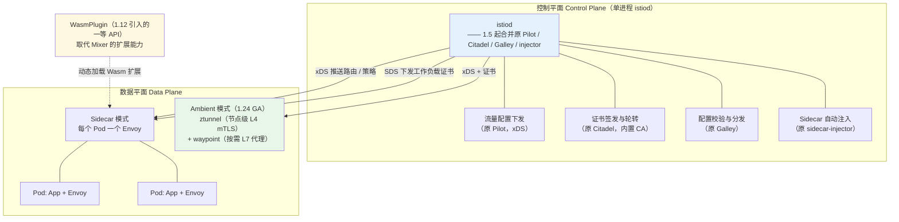

<!--
module:
  parent: tools
  slug: tools/k8s-network-mesh
  type: article
  category: 主模块子文章
  summary: K8s 网络与 Service Mesh
  depth: ⭐⭐⭐⭐⭐
-->

# K8s 网络与 Service Mesh：CNI / Calico / Istio 实战

> 一份按层次梳理的 K8s 网络速查手册：从 Pod 网络到 Service Mesh 的完整图谱。

---
---

## 一、K8s 网络模型（3 大原则）

1. **每个 Pod 拥有独立 IP**：无需做端口映射
2. **Pod 之间可直接通信**：无需 NAT
3. **Pod 看到的 IP 与外部一致**：Service / Ingress 也是

---

## 二、CNI（Container Network Interface）

CNI 是 K8s 与网络插件之间的标准接口，负责 Pod 网络配置。

### 2.1 CNI 工作流程

```text
Pod 启动 → kubelet → CRI 创建容器 → CNI 插件配置网络
                              ↓
                    Pod 获得 IP（加入 Pod 网络）
```

### 2.2 主流 CNI 插件对比

| CNI | 性能 | 功能 | 复杂度 | 适用 |
|-----|------|------|--------|------|
| **Flannel** | ⭐⭐⭐ | ⭐⭐ | 低 | 简单场景 |
| **Calico** | ⭐⭐⭐⭐ | ⭐⭐⭐⭐ | 中 | 生产标准 |
| **Cilium** | ⭐⭐⭐⭐⭐ | ⭐⭐⭐⭐⭐ | 高 | 云原生首选 |
| **Calico VXLAN** | ⭐⭐⭐⭐ | ⭐⭐⭐ | 中 | 跨子网 |
| **Weave** | ⭐⭐⭐ | ⭐⭐⭐ | 低 | 老项目 |

### 2.3 Cilium 配置示例

```yaml
# Cilium 使用 eBPF（Linux 内核技术），性能比 iptables 高 10x
```

---

## 三、CNI 网络模式对比

| 模式 | 原理 | 性能 | 隔离性 |
|------|------|------|--------|
| **bridge** | Linux 网桥 | 中 | 中 |
| **overlay（VXLAN）** | 跨主机隧道 | 中 | 中 |
| **routing（BGP）** | 三层路由 | 高 | 高 |
| **macvlan** | 共享主机网卡 | 高 | 低 |

### 推荐选型

| 场景 | 推荐 |
|------|------|
| 跨主机集群（多 Node）| VXLAN / Calico BGP |
| 高性能（金融/低延迟）| Cilium / Macvlan |
| 网络策略复杂 | Calico / Cilium |
| 简单开发测试 | Flannel |

---

## 四、K8s 网络策略（NetworkPolicy）

NetworkPolicy 类似防火墙规则，控制 Pod 之间流量。

```yaml
apiVersion: networking.k8s.io/v1
kind: NetworkPolicy
metadata:
  name: backend-netpol
spec:
  podSelector:
    matchLabels:
      app: backend
  policyTypes:
  - Ingress                       # 入站规则
  - Egress                        # 出站规则
  ingress:
  - from:
    - podSelector:
        matchLabels:
          app: frontend           # 只允许 frontend 访问
    ports:
    - protocol: TCP
      port: 8080
  egress:
  - to:
    - podSelector:
        matchLabels:
          app: database           # 只能访问 database
    ports:
    - protocol: TCP
      port: 3306
```

**效果**：
- ✅ frontend → backend（8080）允许
- ❌ 其他 Pod → backend 拒绝
- ✅ backend → database（3306）允许
- ❌ backend → 外部网络 拒绝（无 egress 规则）

---

## 五、K8s 服务发现（DNS）

### 5.1 CoreDNS

K8s 默认 DNS 插件，为 Service 提供 DNS 解析。

**DNS 命名规则**：

```text
<svc-name>.<namespace>.svc.cluster.local

示例：
nginx-service.default.svc.cluster.local
```

### 5.2 DNS 解析示例

```bash
# Pod 内访问同 namespace 服务
curl nginx-service

# 跨 namespace 访问
curl nginx-service.other-namespace.svc.cluster.local

# StatefulSet Pod 访问（headless service）
curl mysql-0.mysql-headless.default.svc.cluster.local
```

---

## 六、Ingress 高级特性（已在 03 章详述）

- 域名路由（VirtualHost）
- HTTPS 证书（cert-manager + Let's Encrypt）
- 路径分流
- 灰度发布（Canary）
- 限流（Lua 脚本）

---

## 七、Service Mesh：Istio / Linkerd

### 7.1 为什么需要 Service Mesh？

微服务多了之后，跨服务通信变得复杂：
- 限流 / 熔断 / 降级（每个服务都要写）
- 链路追踪（每个服务都要集成 SDK）
- 安全（mTLS 加密、零信任）
- 灰度发布（金丝雀路由）

**Service Mesh 把这些"横切关注点"从应用中剥离，由 Sidecar Proxy（Envoy）统一处理**。

### 7.2 Istio 架构（1.5+ istiod 时代）

> ⚠️ **常见过时认知**：很多老资料仍画 Pilot / Citadel / Galley / **Mixer** 四个独立组件。
> 实际上 **Istio 1.5（2020-03-05）已把 Pilot + Citadel + Galley + sidecar-injector 合并为单一二进制 `istiod`**，
> 而 **Mixer 在 1.5 被 Telemetry v2 取代（默认关闭），并在 1.8（2020-11-19）彻底移除**。
> 面试时若还画 Mixer，基本等于自曝知识停留在 2019 年。



**关键演进时间线**：

| 版本 | 时间 | 变化 |
|------|------|------|
| **1.5** | 2020-03 | Pilot/Citadel/Galley/injector 合并为 **istiod**；引入 WebAssembly 扩展模型；Telemetry v2 默认启用（Mixer 退出默认链路，CPU 降约 50%） |
| **1.8** | 2020-11 | **Mixer 彻底移除**（含 `istioctl` 安装 addon 的能力一并移除） |
| **1.12** | 2021-11 | 新增一等公民 **`WasmPlugin` API**，替代 Mixer 承担策略 / 遥测扩展 |
| **1.24** | 2024-11 | **Ambient 模式 GA**：ztunnel + waypoint + API 全部 Stable，可无 Sidecar 运行 |

**Sidecar vs Ambient 数据面对比**：

| 维度 | Sidecar 模式 | Ambient 模式（1.24 GA） |
|------|-------------|------------------------|
| 部署粒度 | 每 Pod 一个 Envoy | 每 Node 一个 **ztunnel**（L4），L7 才按需起 **waypoint** |
| 资源开销 | 高（Pod 数 × Envoy） | 低（只做 L4 时无 Envoy per-Pod） |
| 接入成本 | 需重启 Pod 注入 Sidecar | 打 namespace label 即可，无需重启 |
| 能力 | 全量 L4 + L7 | L4 mTLS 默认；L7（路由 / 授权 / 遥测）需部署 waypoint |


### 7.3 Istio 核心能力

| 能力 | 说明 |
|------|------|
| **流量管理** | 灰度 / A/B 测试 / 故障注入 |
| **安全** | mTLS / 零信任 / 鉴权 |
| **可观测** | 链路追踪 / 指标 / 日志 |
| **策略** | 限流 / 重试 / 超时 |

### 7.4 Istio VirtualService 示例（金丝雀发布）

```yaml
apiVersion: networking.istio.io/v1beta1
kind: VirtualService
metadata:
  name: nginx-vs
spec:
  hosts:
  - nginx-service
  http:
  - match:
    - headers:
        x-canary:
          exact: "true"
    route:
    - destination:
        host: nginx-service
        subset: v2              # 10% 流量到 v2
      weight: 100
  - route:
    - destination:
        host: nginx-service
        subset: v1              # 90% 流量到 v1
      weight: 90
    - destination:
        host: nginx-service
        subset: v2              # 10% 流量到 v2
      weight: 10
```

---

## 八、Istio vs Linkerd 对比

| 维度 | Istio | Linkerd |
|------|-------|---------|
| 性能 | ⭐⭐⭐ | ⭐⭐⭐⭐⭐（Rust 内核） |
| 功能 | ⭐⭐⭐⭐⭐ | ⭐⭐⭐ |
| 复杂度 | 高 | 低 |
| 社区 | 最大 | 中 |
| 数据面 | Envoy（功能强但重） | linkerd2-proxy（轻） |
| 适用 | 复杂场景 / 大型集群 | 简单场景 / 中小集群 |

---

## 九、Service Mesh 选型建议

| 场景 | 推荐 |
|------|------|
| 大型微服务集群（100+ 服务）| Istio |
| 中型集群 / 性能敏感 | Linkerd |
| 不需要 Mesh / 简单 K8s | Calico CNI + 不上 Mesh |
| 国内云厂商 | 各厂商托管 Mesh（阿里 ASM / 腾讯 TCM）|

---

## 十、最佳实践

1. **生产必须配 CNI**：不要用默认 bridge 模式
2. **NetworkPolicy 是必须的**：零信任网络的基础
3. **Service Mesh 不强求**：中小集群可暂不上 Mesh
4. **Istio 复杂度高**：先在测试环境试运行 3 个月
5. **Sidecar 注入性能**：Linkerd 比 Istio 轻量

---

← [返回 K8s 总览](../README.md) · 📅 2026-06-28