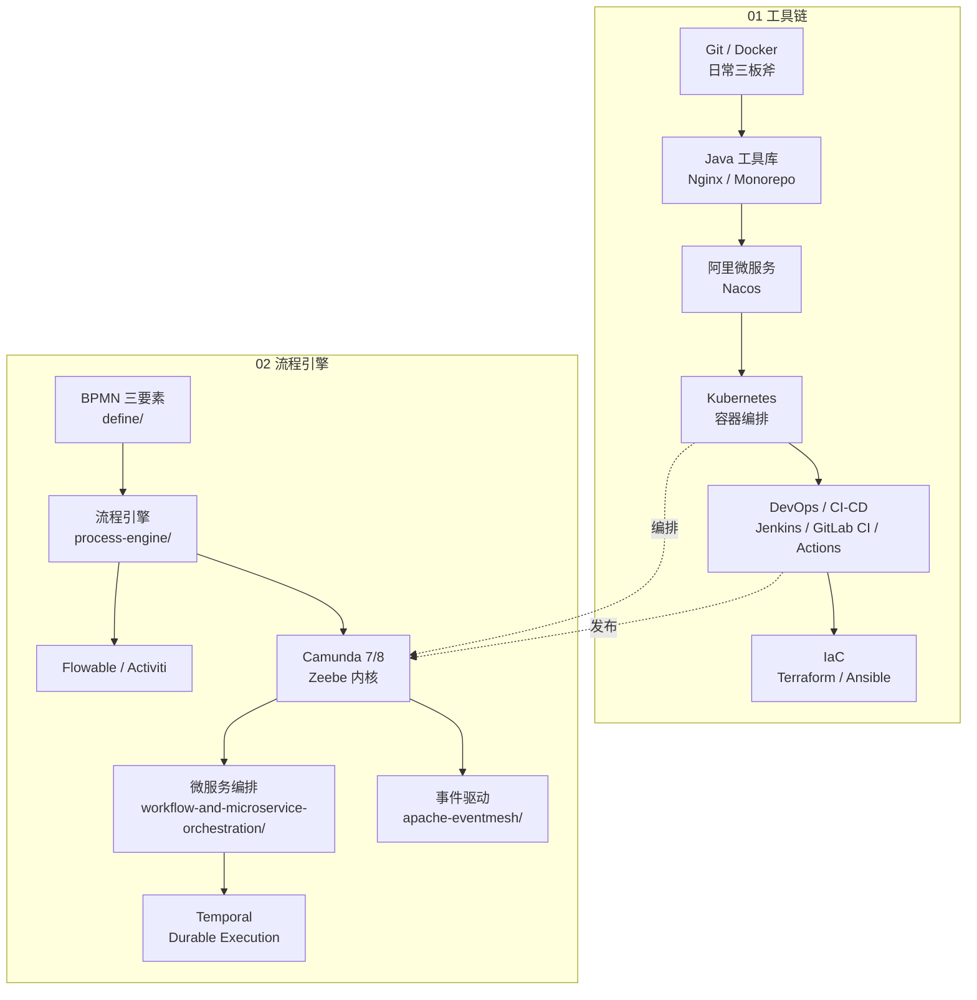

<!--
module:
  parent: null
  number: 07
  slug: devops-and-tools
  topic: DevOps + 工具链 + 流程引擎
  audience: 后端 / SRE / 运维 / 架构师
  category: 主模块
  type: index
  summary: DevOps 工具链 + CI/CD + 容器编排 + 流程引擎 一站式速查——从 Git / 容器化 / K8s / IaC 到工作流（BPMN + 事件驱动），完整覆盖日常开发、运维、流程编排所需。
-->

# 07. DevOps + Tools + Workflow

> DevOps 工具链 + CI/CD + 容器编排 + 流程引擎一站式速查：从日常工具（Git/Docker/Nginx/Monorepo）到基础设施（K8s/IaC/CI-CD），再到业务流（BPMN/事件驱动/微服务编排）。
> **继承规范**：[SPEC.md](./SPEC.md)

---

## 📚 目录导航

| 序号 | 分类 | 核心内容 | 子 README |
|:----:|------|---------|-----------|
| 01 | [工具链](./01-tools/README.md) | Git / Docker / Java 工具库 / Nginx / Monorepo / 阿里微服务 / Kubernetes / DevOps / IaC | [子入口](./01-tools/README.md) |
| 02 | [流程引擎](./02-workflow/README.md) | BPMN 工作流（Camunda 7/8/Zeebe）+ 事件驱动编排（Apache EventMesh / Serverless Workflow）+ 微服务编排（编舞 vs 编排）+ Temporal Durable Execution | [子入口](./02-workflow/README.md) |

---

## 🎯 适用人群

- **后端工程师**：日常 Git/Docker/Java 工具库/Nginx 速查，CI/CD 流水线调试
- **SRE / 运维**：Kubernetes 容器编排、IaC 基础设施即代码、CI/CD + GitOps 落地
- **架构师**：选型决策（Camunda 7 vs 8 / Zeebe / Temporal / EventMesh）、流程引擎集成、业务流设计
- **DevOps 工程师**：Jenkins / GitLab CI / GitHub Actions 实战、Pipeline Patterns、部署策略（蓝绿/灰度/滚动）

---

## 🧭 学习路径

- **新人入门**：`01-tools/01-git` → `01-tools/02-docker` → `01-tools/04-nginx` —— 后端日常三板斧
- **效率提升**：`01-tools/03-java`（Hutool/Guava/Lombok）+ `01-tools/05-monorepo`（多仓管理）
- **微服务方向**：`01-tools/02-docker` → `01-tools/06-ali-microservices` → `01-tools/kubernetes` —— 从容器到服务治理到容器编排
- **DevOps 全链路**：`01-tools/devops`（CI/CD 流水线）→ `01-tools/kubernetes`（部署目标）→ `01-tools/iac`（基础设施即代码）
- **架构方向**：`02-workflow/define`（BPMN 三要素）→ `02-workflow/process-engine`（流程引擎原理与选型）→ `02-workflow/apache-eventmesh`（事件驱动）/ `02-workflow/temporal`（Durable Execution）
- **面试冲刺**：`02-workflow/process-engine`（Camunda 7 vs 8 / Zeebe / Flowable / Activiti）+ 编舞 vs 编排 决策树

---

## 🗺️ 知识脉络

---

## 📊 工具 / 引擎选型速查

| 场景 | 推荐 | 备选 | 章节 |
|------|------|------|------|
| **版本控制** | Git + Gitea/GitHub | — | [01-git](./01-tools/01-git/README.md) |
| **容器运行时** | Docker | Podman (rootless) | [02-docker](./01-tools/02-docker/README.md) |
| **容器编排** | Kubernetes | — | [kubernetes](./01-tools/kubernetes/README.md) |
| **反向代理** | Nginx | Pingora (Rust) | [04-nginx](./01-tools/04-nginx/README.md) |
| **多模块管理** | Monorepo (Turborepo/Nx) | — | [05-monorepo](./01-tools/05-monorepo/README.md) |
| **CI/CD** | GitHub Actions | Jenkins / GitLab CI | [devops](./01-tools/devops/README.md) |
| **IaC** | Terraform | Ansible / Pulumi | [iac](./01-tools/iac/README.md) |
| **传统流程引擎** | Camunda 7 | Flowable / Activiti | [camunda-7](./02-workflow/process-engine/camunda/camunda-7/README.md) |
| **云原生流程引擎** | Camunda 8 / Zeebe | — | [camunda-8](./02-workflow/process-engine/camunda/camunda-8/README.md) |
| **微服务编排** | Zeebe / Conductor / Cadence | Temporal | [workflow-and-microservice-orchestration](./02-workflow/workflow-and-microservice-orchestration/README.md) |
| **Durable Execution** | Temporal.io | Camunda 8 Zeebe | [temporal](./02-workflow/temporal/README.md) |
| **事件驱动** | Apache EventMesh + Kafka | — | [apache-eventmesh](./02-workflow/apache-eventmesh/README.md) |
| **Serverless Workflow** | CNCF Serverless Workflow DSL | — | [apache-eventmesh](./02-workflow/apache-eventmesh/README.md) |

---

## 🎯 前置知识

- 命令行基础（Linux/Shell）
- 任意一门后端语言（Java/Go/Python）
- HTTP / TCP / DNS（容器编排前置）
- 业务流程概念（审批流 / 订单流 / Saga）

---

## 🔗 相关章节

- 上游：[`01.java-and-jvm`](../../note/01.java/README.md) — Java 工具库的宿主语言
- 下游：[`04.spring-backend`](../04.spring-backend/README.md) — Spring 全家桶（工具链的核心应用场景）
- 横向：[`03.data-stack`](../03.data-stack/01-database/README.md) — 数据库（部署 / 备份 / 监控）
- 横向：[`06.distributed-systems`](../06.distributed-systems/README.md) — 分布式系统（K8s/Nginx/Monorepo 架构决策）
- 横向：[`08.ai-foundations`](../../note/11.ai/README.md) — AI 工程（bpmn-ai-integration）
- 业务：[`10.business-systems`](../10.business-systems/README.md) — 业务系统（流程引擎在 ERP/MES/CRM 中的应用）

---

## 📊 本节统计

| 子目录 | 文件数 | 备注 |
|:-------|------:|:-----|
| `01-tools/` | 33 | 33 个 .md（含 9 个顶层 README + 24 个 leaf）；Git/Docker/Java/Nginx/Monorepo/Ali/K8s/DevOps/IaC 9 大分类 |
| `02-workflow/` | 11 | 11 个 .md + 4 张 BPMN PNG；BPMN 流程引擎 + 事件驱动 + 微服务编排 + Temporal |
| **合计 .md** | **44** | 100% leaf 保留（无覆盖） |
| **SPEC.md** | 1 | 占位（未触动） |

> 数字基线：本节以 .md 文件数 + 顶层分类数双口径统计；本模块无 frontmatter 改动（继承来源文件 frontmatter）

---

## 📚 开源参考

- [Hutool](https://gitee.com/dromara/hutool) — 国产 Java 工具集
- [Guava](https://github.com/google/guava) — Google Java 核心库
- [Gitea](https://gitea.io) — 轻量级自建 Git 托管
- [Pingora](https://github.com/cloudflare/pingora) — Cloudflare 新一代 Rust 代理框架
- [Camunda 7](https://github.com/camunda/camunda-bpm-platform) — Java 流程引擎（Apache 2.0）
- [Camunda 8 / Zeebe](https://github.com/camunda/zeebe) — 云原生工作流引擎
- [Flowable](https://www.flowable.com) — Camunda 分支演进的流程引擎
- [Apache EventMesh](https://github.com/apache/eventmesh) — 事件驱动中间件
- [Serverless Workflow](https://serverlessworkflow.io) — CNCF 工作流标准

---

← [返回 note 总目录](../README.md)